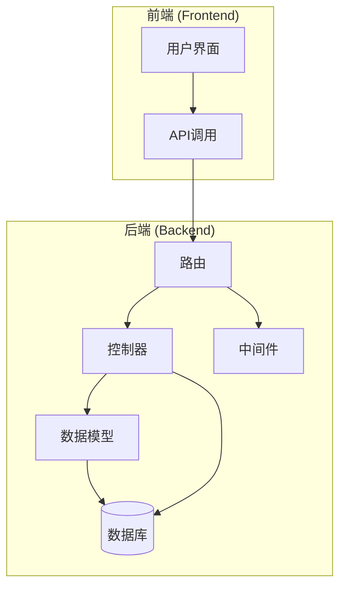
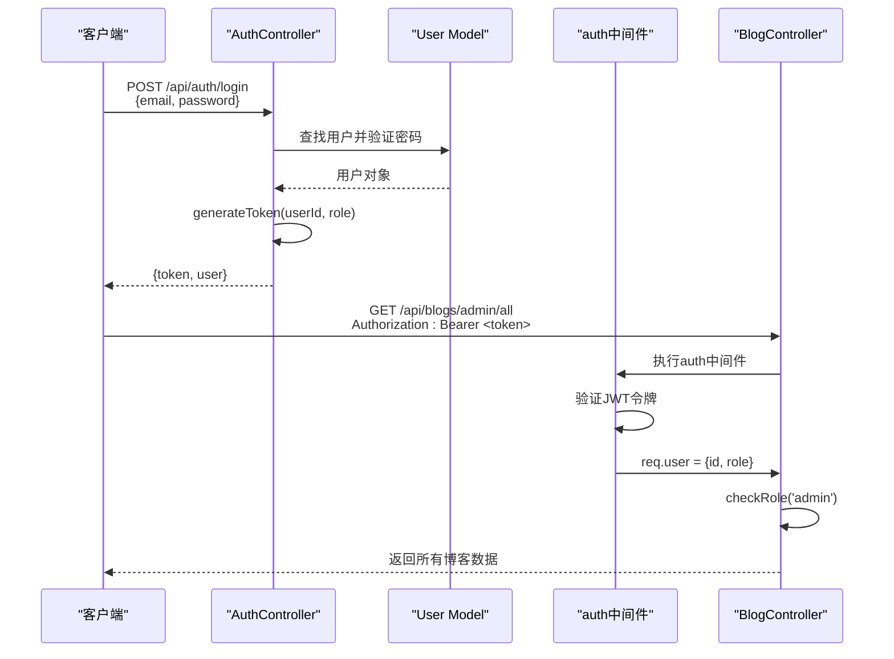
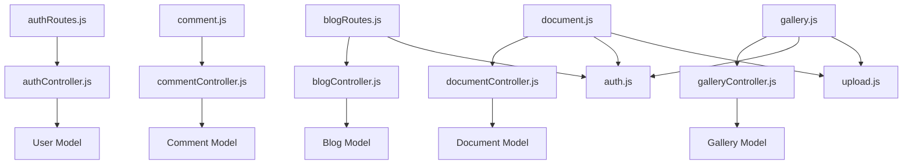

# API接口参考

<cite>
**本文档中引用的文件**  
- [authRoutes.js](file://backend/routes/authRoutes.js#L1-L25)
- [authController.js](file://backend/controllers/authController.js#L1-L141)
- [auth.js](file://backend/middleware/auth.js#L1-L66)
- [blogRoutes.js](file://backend/routes/blogRoutes.js#L1-L44)
- [blogController.js](file://backend/controllers/blogController.js)
- [comment.js](file://backend/routes/comment.js)
- [commentController.js](file://backend/controllers/commentController.js)
- [document.js](file://backend/routes/document.js)
- [documentController.js](file://backend/controllers/documentController.js)
- [gallery.js](file://backend/routes/gallery.js)
- [galleryController.js](file://backend/controllers/galleryController.js)
- [adminRoutes.js](file://backend/routes/adminRoutes.js)
- [upload.js](file://backend/middleware/upload.js)
- [userRoutes.js](file://backend/routes/userRoutes.js)
</cite>

## 目录
1. [简介](#简介)
2. [项目结构](#项目结构)
3. [核心组件](#核心组件)
4. [架构概览](#架构概览)
5. [详细组件分析](#详细组件分析)
6. [依赖分析](#依赖分析)
7. [性能考虑](#性能考虑)
8. [故障排除指南](#故障排除指南)
9. [结论](#结论)

## 简介
本文档为 my_website 项目提供完整的 RESTful API 接口参考，涵盖用户认证、博客管理、评论系统、文档库、图库、管理员专用接口等功能模块。文档详细说明了每个 API 端点的 HTTP 方法、URL 路径、请求头、请求参数、请求体结构、响应格式、状态码含义及使用示例。特别强调 JWT 认证机制在各接口中的应用方式、管理员权限控制策略，以及文件上传接口对 multipart/form-data 的处理流程。本指南旨在为前端开发者和第三方集成者提供权威、清晰、可操作的接口调用规范。

## 项目结构
my_website 项目采用前后端分离架构，后端基于 Node.js + Express 框架构建 RESTful API，前端使用 Vue.js 实现用户界面。项目主要分为 `backend` 和 `frontend` 两大目录。

- `backend` 目录包含控制器（controllers）、中间件（middleware）、数据模型（models）、路由（routes）和工具函数（utils），实现了业务逻辑、数据处理和 API 路由。
- `frontend` 目录包含 Vue 组件、API 调用封装、状态管理等，负责用户交互和数据展示。

API 路由定义在 `backend/routes/` 目录下，通过 `app.js` 入口文件挂载到 Express 应用。控制器逻辑位于 `backend/controllers/`，数据模型定义在 `backend/models/`。认证和权限控制通过 `backend/middleware/auth.js` 实现，文件上传由 `backend/middleware/upload.js` 处理。



**图源**  
- [app.js](file://backend/app.js)
- [routes/](file://backend/routes/)
- [controllers/](file://backend/controllers/)
- [models/](file://backend/models/)

**本节来源**  
- [backend/routes/authRoutes.js](file://backend/routes/authRoutes.js#L1-L25)
- [backend/controllers/authController.js](file://backend/controllers/authController.js#L1-L141)

## 核心组件
项目的核心功能由多个控制器和中间件协同实现。`authController.js` 负责用户注册、登录和身份信息获取，是整个系统安全性的基石。`blogController.js` 管理博客的增删改查、分类和点赞功能。`commentController.js` 和 `documentController.js` 分别处理评论和文档库的业务逻辑。`galleryController.js` 支持图片资源的管理。

认证和权限控制是通过 `auth.js` 中间件实现的。`auth` 中间件强制要求有效的 JWT 令牌，`optionalAuth` 提供可选认证，`checkRole` 用于检查用户角色（如管理员权限）。这些中间件被灵活地应用在不同的路由上，实现了细粒度的访问控制。

**本节来源**  
- [backend/controllers/authController.js](file://backend/controllers/authController.js#L1-L141)
- [backend/controllers/blogController.js](file://backend/controllers/blogController.js)
- [backend/middleware/auth.js](file://backend/middleware/auth.js#L1-L66)

## 架构概览
系统采用典型的 MVC（Model-View-Controller）分层架构，结合 RESTful 设计原则。前端作为 View 层，通过 HTTP 请求与后端 Controller 层交互。Controller 层接收请求，调用 Model 层进行数据操作，并返回 JSON 格式的响应。

认证流程基于 JWT（JSON Web Token）。用户登录成功后，服务器生成一个包含用户 ID 和角色的签名令牌返回给客户端。客户端在后续请求的 `Authorization` 头中携带此令牌（`Bearer <token>`），`auth` 中间件负责验证令牌的有效性，并将解码后的用户信息附加到 `req.user` 对象上，供后续控制器使用。



**图源**  
- [backend/controllers/authController.js](file://backend/controllers/authController.js#L1-L141)
- [backend/middleware/auth.js](file://backend/middleware/auth.js#L1-L66)
- [backend/routes/blogRoutes.js](file://backend/routes/blogRoutes.js#L1-L44)

## 详细组件分析

### 认证接口分析
认证接口是系统安全的第一道防线，提供用户注册、登录和获取当前用户信息的功能。

#### 认证接口端点
**用户注册**
- **HTTP方法**: `POST`
- **URL路径**: `/api/auth/register`
- **请求头**: 无特殊要求
- **请求体 (JSON)**:
  ```json
  {
    "username": "string",
    "email": "string",
    "password": "string"
  }
  ```
- **响应体 (JSON)**:
  ```json
  {
    "data": {
      "user": {
        "id": "string",
        "username": "string",
        "email": "string",
        "avatar": "string",
        "role": "string"
      },
      "token": "string"
    }
  }
  ```
- **状态码**:
  - `201 Created`: 注册成功
  - `400 Bad Request`: 用户名或邮箱已存在
- **说明**: 创建新用户，返回用户信息（不含密码）和 JWT 令牌。

**用户登录**
- **HTTP方法**: `POST`
- **URL路径**: `/api/auth/login`
- **请求头**: 无特殊要求
- **请求体 (JSON)**:
  ```json
  {
    "email": "string", // 或 "username"
    "password": "string"
  }
  ```
- **响应体 (JSON)**:
  ```json
  {
    "success": true,
    "data": {
      "user": {
        "id": "string",
        "username": "string",
        "email": "string",
        "avatar": "string",
        "role": "string"
      },
      "token": "string"
    }
  }
  ```
- **状态码**:
  - `200 OK`: 登录成功
  - `401 Unauthorized`: 用户名/邮箱或密码错误，或账户被禁用
  - `400 Bad Request`: 未提供用户名或邮箱
- **说明**: 验证用户凭据，登录成功后返回用户信息和 JWT 令牌。

**获取当前用户信息**
- **HTTP方法**: `GET`
- **URL路径**: `/api/auth/me`
- **请求头**: `Authorization: Bearer <token>`
- **响应体 (JSON)**:
  ```json
  {
    "data": {
      "user": {
        "id": "string",
        "username": "string",
        "email": "string",
        "avatar": "string",
        "role": "string"
      }
    }
  }
  ```
- **状态码**:
  - `200 OK`: 获取成功
  - `401 Unauthorized`: 未提供令牌或令牌无效/过期
  - `404 Not Found`: 用户不存在
- **说明**: 需要有效的 JWT 令牌。中间件 `auth` 验证令牌后，控制器根据 `req.user.id` 查询并返回用户信息。

**本节来源**  
- [backend/routes/authRoutes.js](file://backend/routes/authRoutes.js#L1-L25)
- [backend/controllers/authController.js](file://backend/controllers/authController.js#L1-L141)
- [backend/middleware/auth.js](file://backend/middleware/auth.js#L1-L66)

### 博客接口分析
博客接口是系统的核心功能，支持博客的创建、读取、更新、删除（CRUD）、分类管理、点赞和管理员专用操作。

#### 博客接口端点
**获取博客列表**
- **HTTP方法**: `GET`
- **URL路径**: `/api/blogs`
- **请求头**: 无
- **查询参数 (Query)**:
  - `page`: 页码 (可选)
  - `limit`: 每页数量 (可选)
  - `category`: 分类过滤 (可选)
- **响应体 (JSON)**:
  ```json
  {
    "data": [
      {
        "id": "string",
        "title": "string",
        "content": "string",
        "author": "string",
        "category": "string",
        "createdAt": "datetime",
        "likeCount": "number"
      }
    ],
    "pagination": {
      "total": "number",
      "page": "number",
      "pages": "number"
    }
  }
  ```
- **状态码**: `200 OK`
- **说明**: 公开接口，无需认证。

**获取博客详情**
- **HTTP方法**: `GET`
- **URL路径**: `/api/blogs/:id`
- **请求头**: 无
- **响应体 (JSON)**:
  ```json
  {
    "data": {
      "id": "string",
      "title": "string",
      "content": "string",
      "author": "string",
      "category": "string",
      "createdAt": "datetime",
      "likeCount": "number",
      "isLiked": "boolean" // 如果使用optionalAuth，可返回此字段
    }
  }
  ```
- **状态码**:
  - `200 OK`: 获取成功
  - `404 Not Found`: 博客不存在
- **说明**: 公开接口，无需认证。

**创建博客**
- **HTTP方法**: `POST`
- **URL路径**: `/api/blogs`
- **请求头**: `Authorization: Bearer <token>`
- **请求体 (JSON)**:
  ```json
  {
    "title": "string",
    "content": "string",
    "category": "string"
  }
  ```
- **响应体 (JSON)**:
  ```json
  {
    "data": {
      "id": "string",
      "title": "string",
      "content": "string",
      "author": "string",
      "category": "string",
      "createdAt": "datetime"
    }
  }
  ```
- **状态码**:
  - `201 Created`: 创建成功
  - `401 Unauthorized`: 未提供有效令牌
- **说明**: 需要用户登录。

**更新博客**
- **HTTP方法**: `PUT`
- **URL路径**: `/api/blogs/:id`
- **请求头**: `Authorization: Bearer <token>`
- **请求体 (JSON)**:
  ```json
  {
    "title": "string",
    "content": "string",
    "category": "string"
  }
  ```
- **响应体 (JSON)**: 同创建博客的响应。
- **状态码**:
  - `200 OK`: 更新成功
  - `401 Unauthorized`: 未提供有效令牌
  - `403 Forbidden`: 无权修改此博客（通常检查作者）
  - `404 Not Found`: 博客不存在
- **说明**: 需要用户登录，且通常只能修改自己创建的博客。

**删除博客**
- **HTTP方法**: `DELETE`
- **URL路径**: `/api/blogs/:id`
- **请求头**: `Authorization: Bearer <token>`
- **响应体 (JSON)**: 无或 `{ "success": true }`
- **状态码**:
  - `204 No Content`: 删除成功
  - `401 Unauthorized`: 未提供有效令牌
  - `403 Forbidden`: 无权删除此博客
  - `404 Not Found`: 博客不存在
- **说明**: 需要用户登录。

**点赞博客**
- **HTTP方法**: `POST`
- **URL路径**: `/api/blogs/:id/like`
- **请求头**: `Authorization: Bearer <token>`
- **响应体 (JSON)**: `{ "success": true }`
- **状态码**:
  - `200 OK`: 点赞成功
  - `401 Unauthorized`: 未提供有效令牌
- **说明**: 需要用户登录。

**取消点赞**
- **HTTP方法**: `DELETE`
- **URL路径**: `/api/blogs/:id/like`
- **请求头**: `Authorization: Bearer <token>`
- **响应体 (JSON)**: `{ "success": true }`
- **状态码**:
  - `200 OK`: 取消成功
  - `401 Unauthorized`: 未提供有效令牌
- **说明**: 需要用户登录。

**检查点赞状态**
- **HTTP方法**: `GET`
- **URL路径**: `/api/blogs/:id/like-status`
- **请求头**: `Authorization: Bearer <token>` (可选)
- **响应体 (JSON)**:
  ```json
  {
    "data": {
      "isLiked": "boolean"
    }
  }
  ```
- **状态码**: `200 OK`
- **说明**: 使用 `optionalAuth` 中间件，如果用户已登录，则返回其对该博客的点赞状态；否则，`isLiked` 为 `false`。

**管理员获取所有博客**
- **HTTP方法**: `GET`
- **URL路径**: `/api/blogs/admin/all`
- **请求头**: `Authorization: Bearer <token>`
- **响应体 (JSON)**: 同获取博客列表的响应。
- **状态码**:
  - `200 OK`: 获取成功
  - `401 Unauthorized`: 未提供有效令牌
  - `403 Forbidden`: 用户角色不是管理员
- **说明**: 需要管理员权限。`checkRole('admin')` 中间件确保只有管理员可以访问。

**本节来源**  
- [backend/routes/blogRoutes.js](file://backend/routes/blogRoutes.js#L1-L44)
- [backend/controllers/blogController.js](file://backend/controllers/blogController.js)

### 评论、文档与图库接口分析
评论、文档和图库接口遵循与博客接口相似的设计模式。

**评论接口** (`/api/comments`)
- **创建评论**: `POST /api/comments` (需要认证)
- **获取评论列表**: `GET /api/comments?blogId=:id` (公开)
- **删除评论**: `DELETE /api/comments/:id` (需要认证，通常为作者或管理员)

**文档库接口** (`/api/documents`)
- **上传文档**: `POST /api/documents` (需要认证，使用 `multipart/form-data`)
- **获取文档列表**: `GET /api/documents` (公开)
- **下载文档**: `GET /api/documents/:id/download` (公开)
- **删除文档**: `DELETE /api/documents/:id` (需要认证，通常为上传者或管理员)

**图库接口** (`/api/gallery`)
- **上传图片**: `POST /api/gallery` (需要认证，使用 `multipart/form-data`)
- **获取图片列表**: `GET /api/gallery` (公开)
- **删除图片**: `DELETE /api/gallery/:id` (需要认证，通常为上传者或管理员)

这些接口的权限控制均通过 `auth` 和 `checkRole` 中间件实现。文件上传功能依赖 `backend/middleware/upload.js` 来处理 `multipart/form-data` 请求，并将文件存储到指定位置。

**本节来源**  
- [backend/routes/comment.js](file://backend/routes/comment.js)
- [backend/controllers/commentController.js](file://backend/controllers/commentController.js)
- [backend/routes/document.js](file://backend/routes/document.js)
- [backend/controllers/documentController.js](file://backend/controllers/documentController.js)
- [backend/routes/gallery.js](file://backend/routes/gallery.js)
- [backend/controllers/galleryController.js](file://backend/controllers/galleryController.js)
- [backend/middleware/upload.js](file://backend/middleware/upload.js)

## 依赖分析
系统各组件之间存在清晰的依赖关系。API 路由 (`routes/`) 依赖于控制器 (`controllers/`) 来实现业务逻辑。控制器依赖于数据模型 (`models/`) 进行数据库操作，并可能依赖于中间件 (`middleware/`) 来处理通用任务。

认证中间件 (`auth.js`) 是一个核心依赖，被 `authRoutes.js`、`blogRoutes.js` 等多个路由文件引用。文件上传中间件 (`upload.js`) 被文档和图库相关的路由引用。控制器之间没有直接依赖，它们通过路由和中间件进行协调。



**图源**  
- [backend/routes/](file://backend/routes/)
- [backend/controllers/](file://backend/controllers/)
- [backend/models/](file://backend/models/)
- [backend/middleware/auth.js](file://backend/middleware/auth.js#L1-L66)
- [backend/middleware/upload.js](file://backend/middleware/upload.js)

**本节来源**  
- [backend/routes/authRoutes.js](file://backend/routes/authRoutes.js#L1-L25)
- [backend/routes/blogRoutes.js](file://backend/routes/blogRoutes.js#L1-L44)
- [backend/middleware/auth.js](file://backend/middleware/auth.js#L1-L66)
- [backend/middleware/upload.js](file://backend/middleware/upload.js)

## 性能考虑
- **JWT 认证**: JWT 是无状态的，服务器无需在内存或数据库中存储会话信息，减轻了服务器负担，适合分布式部署。
- **数据库查询**: 在 `getBlogs` 和 `getBlogById` 等接口中，应确保对 `id` 和 `category` 等字段建立数据库索引，以提高查询效率。
- **文件上传**: `upload.js` 中间件应配置合理的文件大小限制和文件类型白名单，防止恶意上传导致服务器资源耗尽。
- **缓存**: 对于频繁访问但不常变动的数据（如博客列表、分类列表），建议在前端或使用 Redis 等缓存中间件进行缓存，减少数据库查询压力。

## 故障排除指南
- **401 Unauthorized (未授权)**:
  - 检查请求头 `Authorization` 是否存在且格式正确（`Bearer <token>`）。
  - 确认 JWT 令牌是否已过期。登录后获取的新令牌是有效的。
  - 确认用户账户是否被禁用（`isActive: false`）。
- **403 Forbidden (禁止访问)**:
  - 检查当前用户角色是否具有执行该操作的权限（如访问管理员接口）。
  - 检查是否尝试修改或删除不属于自己的资源（如博客、评论）。
- **404 Not Found (未找到)**:
  - 检查 URL 路径是否拼写正确。
  - 检查请求的资源 ID 是否存在于数据库中。
- **文件上传失败**:
  - 检查 `Content-Type` 是否为 `multipart/form-data`。
  - 检查文件大小是否超过 `upload.js` 中间件设置的限制。
  - 检查文件类型是否在允许的白名单内。

**本节来源**  
- [backend/middleware/auth.js](file://backend/middleware/auth.js#L1-L66)
- [backend/utils/error.js](file://backend/utils/error.js)

## 结论
my_website 的 API 设计遵循 RESTful 原则，结构清晰，职责分明。通过 JWT 实现了安全、无状态的用户认证，并通过灵活的中间件机制实现了细粒度的权限控制。文件上传、点赞等常见功能均有完善的接口支持。开发者应遵循本文档的规范进行接口调用，并注意处理各种状态码以构建健壮的应用。