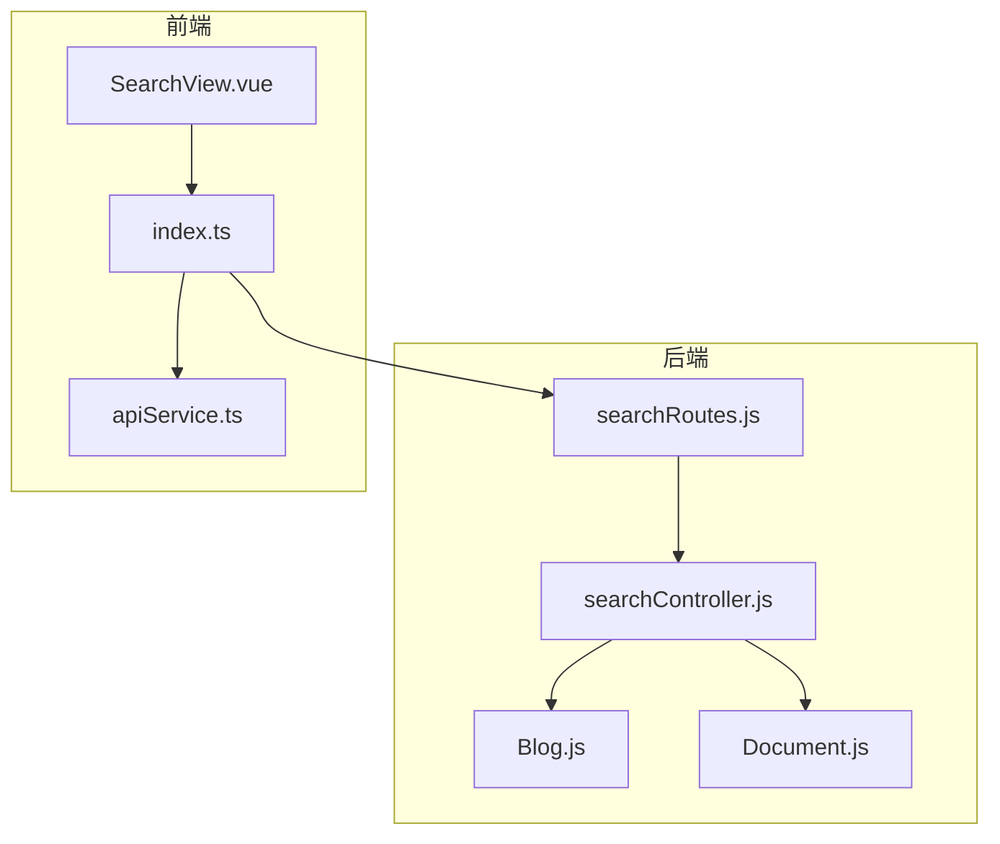
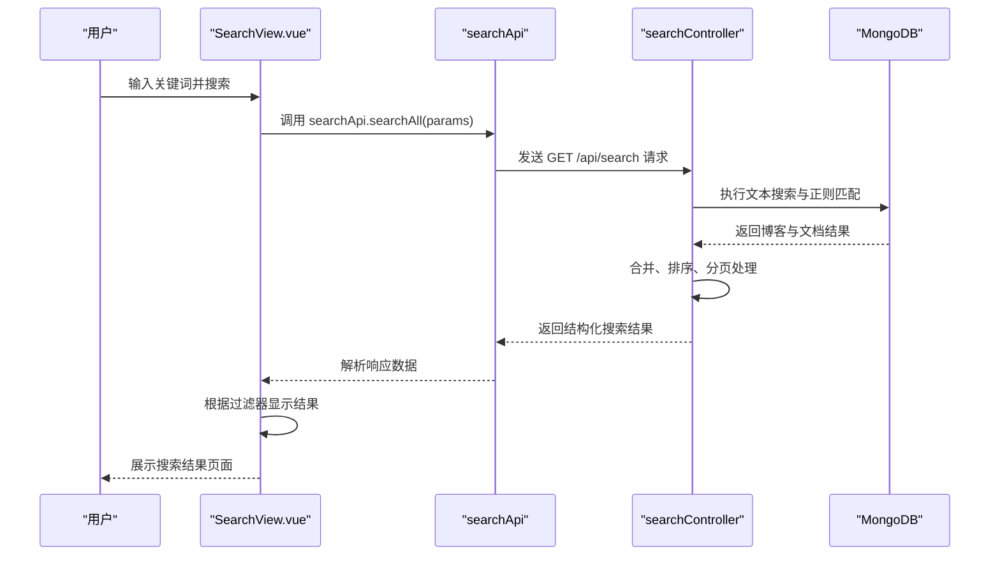
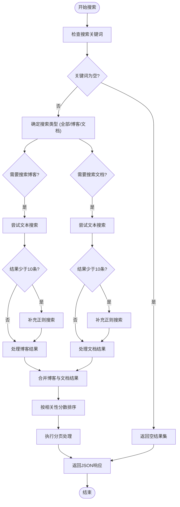
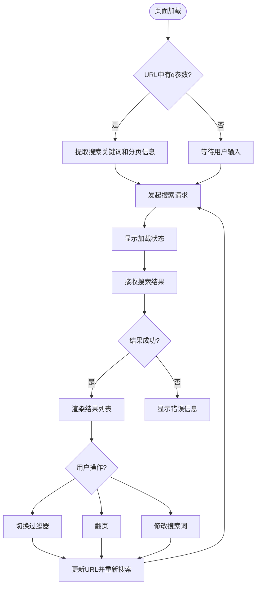
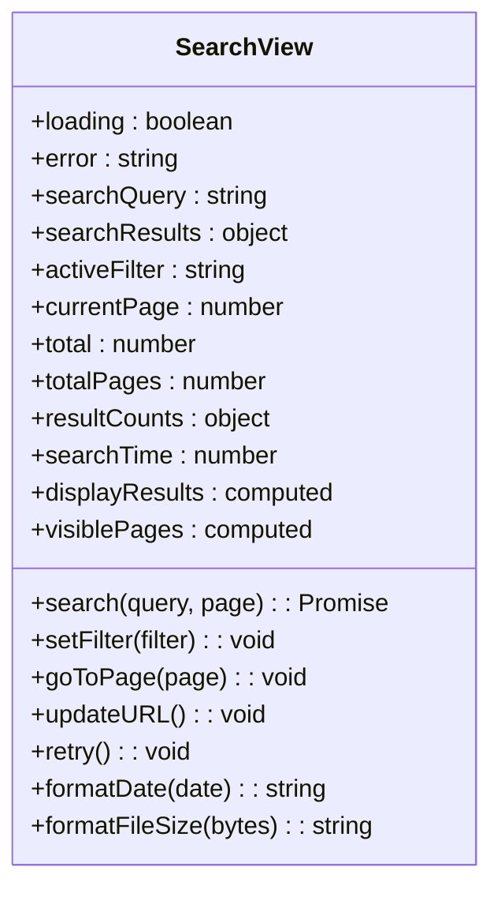
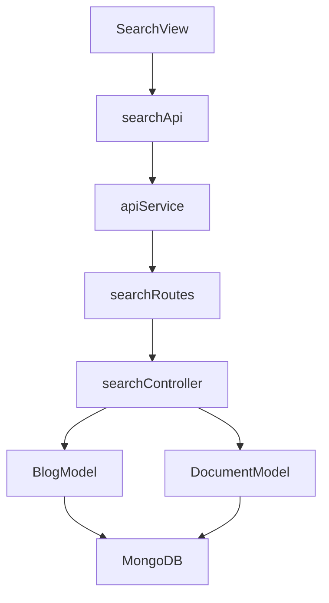

# 全局搜索接口

<cite>
**本文档引用的文件**
- [searchRoutes.js](file://backend/routes/searchRoutes.js#L1-L17)
- [searchController.js](file://backend/controllers/searchController.js#L1-L373)
- [SearchView.vue](file://frontend/src/views/SearchView.vue#L1-L631)
- [index.ts](file://frontend/src/api/index.ts#L1-L92)
</cite>

## 目录
1. [简介](#简介)
2. [项目结构](#项目结构)
3. [核心组件](#核心组件)
4. [架构概述](#架构概述)
5. [详细组件分析](#详细组件分析)
6. [依赖分析](#依赖分析)
7. [性能考虑](#性能考虑)
8. [故障排除指南](#故障排除指南)
9. [结论](#结论)

## 简介
本文档详细说明了网站中全局搜索功能的实现机制。该功能通过单一API接口 `/api/search` 实现跨内容类型的统一检索，支持对博客、文档等多种资源的关键词搜索。后端基于MongoDB的文本索引与模糊匹配双重策略，前端通过 `SearchView.vue` 提供用户友好的搜索界面。文档涵盖接口定义、查询参数、响应结构、后端实现逻辑及前后端集成方式。

## 项目结构
全局搜索功能涉及前后端多个模块，其文件组织结构如下：

**图示来源**
- [searchRoutes.js](file://backend/routes/searchRoutes.js#L1-L17)
- [searchController.js](file://backend/controllers/searchController.js#L1-L373)
- [SearchView.vue](file://frontend/src/views/SearchView.vue#L1-L631)

**本节来源**
- [searchRoutes.js](file://backend/routes/searchRoutes.js#L1-L17)
- [searchController.js](file://backend/controllers/searchController.js#L1-L373)
- [SearchView.vue](file://frontend/src/views/SearchView.vue#L1-L631)

## 核心组件
全局搜索功能的核心组件包括：
- **searchRoutes.js**：定义 `/api/search` 路由，绑定控制器
- **searchController.js**：实现搜索逻辑，整合多类型内容
- **SearchView.vue**：提供搜索界面与用户交互
- **index.ts**：封装搜索API供前端调用

这些组件协同工作，实现从用户输入到结果展示的完整流程。

**本节来源**
- [searchRoutes.js](file://backend/routes/searchRoutes.js#L1-L17)
- [searchController.js](file://backend/controllers/searchController.js#L1-L373)
- [SearchView.vue](file://frontend/src/views/SearchView.vue#L1-L631)

## 架构概述
全局搜索采用分层架构，从前端界面到后端数据访问形成清晰的数据流：

**图示来源**
- [searchController.js](file://backend/controllers/searchController.js#L1-L373)
- [SearchView.vue](file://frontend/src/views/SearchView.vue#L1-L631)

## 详细组件分析

### 后端搜索控制器分析
`searchController.js` 是搜索功能的核心，实现了跨内容类型的检索逻辑。

#### 搜索流程图

**图示来源**
- [searchController.js](file://backend/controllers/searchController.js#L1-L373)

#### 相关性评分机制
系统为每个搜索结果计算相关性分数，主要依据以下因素：
- **标题匹配**：+10分（权重最高）
- **摘要匹配**：+8分
- **内容匹配**：+5分
- **分类匹配**：+3分
- **标签匹配**：+2分

此评分机制确保最相关的结果排在前面。

**本节来源**
- [searchController.js](file://backend/controllers/searchController.js#L1-L373)

### 前端搜索视图分析
`SearchView.vue` 是用户与搜索功能交互的界面组件，实现了完整的搜索体验。

#### 用户交互流程

**图示来源**
- [SearchView.vue](file://frontend/src/views/SearchView.vue#L1-L631)

#### 响应式数据结构
组件使用Vue 3的Composition API管理状态：

**图示来源**
- [SearchView.vue](file://frontend/src/views/SearchView.vue#L1-L631)

## 依赖分析
全局搜索功能的依赖关系清晰，前后端职责分明：

**图示来源**
- [searchRoutes.js](file://backend/routes/searchRoutes.js#L1-L17)
- [searchController.js](file://backend/controllers/searchController.js#L1-L373)
- [SearchView.vue](file://frontend/src/views/SearchView.vue#L1-L631)

**本节来源**
- [searchRoutes.js](file://backend/routes/searchRoutes.js#L1-L17)
- [searchController.js](file://backend/controllers/searchController.js#L1-L373)
- [SearchView.vue](file://frontend/src/views/SearchView.vue#L1-L631)

## 性能考虑
搜索功能在性能方面采取了多项优化措施：
- **双重搜索策略**：优先使用MongoDB文本索引，失败时回退到正则匹配
- **结果限制**：每个类型最多获取50条结果，避免数据库压力
- **去重合并**：防止文本搜索与正则搜索结果重复
- **前端分页**：后端返回所有匹配结果，前端进行分页展示
- **相关性预计算**：在后端计算相关性分数，减少前端处理负担

这些措施确保了搜索功能在大数据量下的响应速度。

## 故障排除指南
### 常见问题及解决方案
- **问题**：搜索无结果返回
  - **原因**：关键词拼写错误或内容中不存在
  - **解决方案**：检查拼写，尝试更通用的关键词

- **问题**：连接服务器失败
  - **原因**：后端服务未启动或网络问题
  - **解决方案**：确认后端服务正在运行，检查网络连接

- **问题**：搜索接口404
  - **原因**：API路由配置错误
  - **解决方案**：检查 `searchRoutes.js` 是否正确挂载

- **问题**：搜索结果不准确
  - **原因**：MongoDB文本索引未创建或过期
  - **解决方案**：为Blog和Document集合创建文本索引

**本节来源**
- [searchController.js](file://backend/controllers/searchController.js#L1-L373)
- [SearchView.vue](file://frontend/src/views/SearchView.vue#L1-L631)

## 结论
全局搜索功能通过 `GET /api/search` 接口实现了跨内容类型的统一检索，后端采用文本索引与模糊匹配相结合的策略确保搜索效果，前端提供直观的用户界面和交互体验。系统设计合理，代码结构清晰，具备良好的可维护性和扩展性。未来可考虑增加更多内容类型（如图库、评论）的支持，并引入全文搜索引擎（如Elasticsearch）以提升大规模数据下的搜索性能。