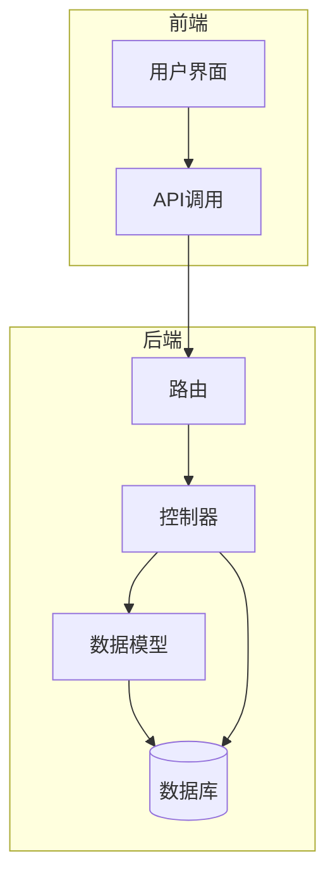
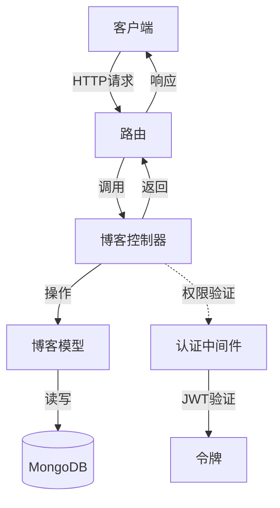
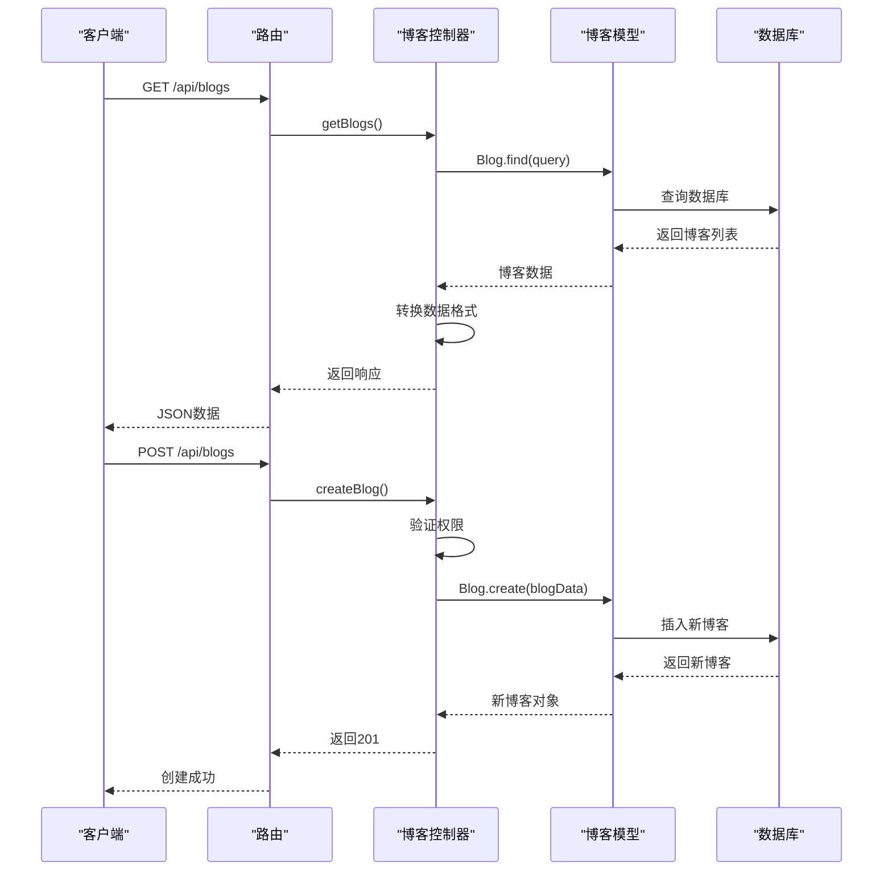
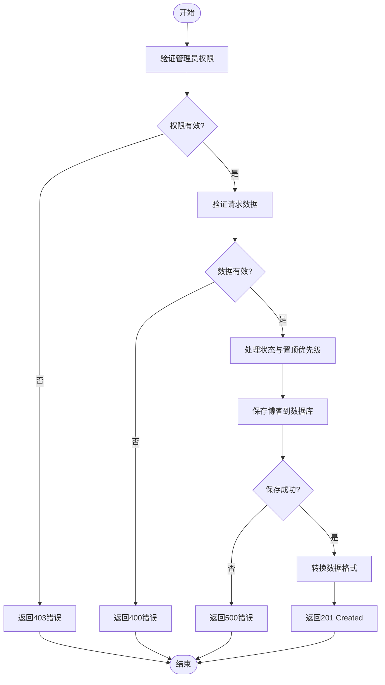
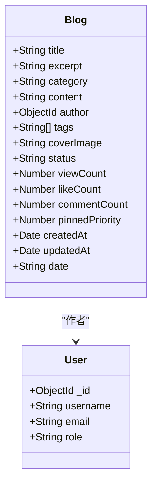
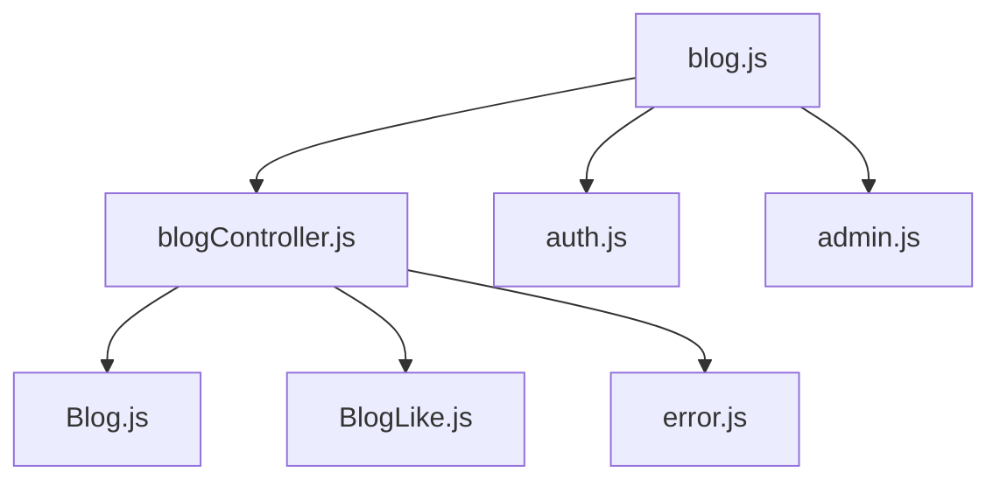

# 博客接口

<cite>
**本文档引用的文件**  
- [blog.js](file://backend/routes/blog.js#L1-L43)
- [blogController.js](file://backend/controllers/blogController.js#L1-L630)
- [Blog.js](file://backend/models/Blog.js#L1-L130)
- [auth.js](file://backend/middleware/auth.js#L1-L66)
</cite>

## 目录
1. [简介](#简介)
2. [项目结构](#项目结构)
3. [核心组件](#核心组件)
4. [架构概览](#架构概览)
5. [详细组件分析](#详细组件分析)
6. [依赖分析](#依赖分析)
7. [性能考虑](#性能考虑)
8. [故障排除指南](#故障排除指南)
9. [结论](#结论)

## 简介
本文档为博客系统提供全面的API技术文档，涵盖博客的创建、读取（分页列表与详情）、更新、删除（CRUD）操作，以及点赞、分类/标签筛选和搜索功能。文档详细说明了各接口的请求与响应规范，包括权限控制、数据格式要求和错误处理机制，旨在为开发者提供清晰、完整的接口使用指南。

## 项目结构
博客系统采用前后端分离架构，后端基于Node.js与Express框架构建，使用MongoDB作为数据存储。核心功能模块集中在`backend`目录下，主要包括控制器（controllers）、模型（models）、中间件（middleware）和路由（routes）。

**图示来源**  
- [blog.js](file://backend/routes/blog.js#L1-L43)
- [blogController.js](file://backend/controllers/blogController.js#L1-L630)
- [Blog.js](file://backend/models/Blog.js#L1-L130)

**本节来源**  
- [blog.js](file://backend/routes/blog.js#L1-L43)
- [blogController.js](file://backend/controllers/blogController.js#L1-L630)

## 核心组件
博客系统的核心组件包括博客数据模型（Blog.js）、博客控制器（blogController.js）、路由配置（blog.js）和认证中间件（auth.js）。这些组件协同工作，处理从请求接收、权限验证、业务逻辑执行到数据响应的完整流程。

**本节来源**  
- [blog.js](file://backend/routes/blog.js#L1-L43)
- [blogController.js](file://backend/controllers/blogController.js#L1-L630)
- [Blog.js](file://backend/models/Blog.js#L1-L130)
- [auth.js](file://backend/middleware/auth.js#L1-L66)

## 架构概览
系统采用典型的MVC（模型-视图-控制器）架构模式，尽管前端使用Vue，但后端逻辑清晰地分离了数据、业务逻辑和请求处理。

**图示来源**  
- [blog.js](file://backend/routes/blog.js#L1-L43)
- [blogController.js](file://backend/controllers/blogController.js#L1-L630)
- [auth.js](file://backend/middleware/auth.js#L1-L66)

## 详细组件分析

### 博客控制器分析
博客控制器（blogController.js）是处理所有博客相关业务逻辑的核心模块，包含11个主要方法。

#### API调用流程分析

**图示来源**  
- [blog.js](file://backend/routes/blog.js#L1-L43)
- [blogController.js](file://backend/controllers/blogController.js#L1-L630)

#### 博客创建与更新逻辑

**图示来源**  
- [blogController.js](file://backend/controllers/blogController.js#L1-L630)
- [auth.js](file://backend/middleware/auth.js#L1-L66)

### 博客数据模型分析
博客数据模型（Blog.js）定义了博客的结构、验证规则和数据库索引。

#### 数据模型结构

**图示来源**  
- [Blog.js](file://backend/models/Blog.js#L1-L130)

**本节来源**  
- [Blog.js](file://backend/models/Blog.js#L1-L130)

## 依赖分析
博客系统各组件之间存在明确的依赖关系，形成了清晰的调用链。

**图示来源**  
- [blog.js](file://backend/routes/blog.js#L1-L43)
- [blogController.js](file://backend/controllers/blogController.js#L1-L630)

**本节来源**  
- [blog.js](file://backend/routes/blog.js#L1-L43)
- [blogController.js](file://backend/controllers/blogController.js#L1-L630)

## 性能考虑
系统在设计时考虑了多项性能优化措施：
- **数据库索引**：为`status`、`category`、`pinnedPriority`、`createdAt`等常用查询字段创建了索引。
- **文本搜索索引**：为`title`、`content`、`excerpt`、`category`、`tags`字段创建了全文索引，支持高效搜索。
- **并行查询**：在获取博客列表时，并行执行数据查询和总数统计，减少数据库往返时间。
- **分页处理**：所有列表接口均支持分页，避免一次性返回大量数据。

## 故障排除指南
### 常见错误及解决方案
- **401 未授权**：检查请求头是否包含`Authorization: Bearer <token>`，确保令牌有效且未过期。
- **403 禁止访问**：确认用户角色为`admin`，普通用户无法执行创建、更新、删除操作。
- **404 资源不存在**：检查博客ID是否正确，确保博客存在且状态为`published`或`pinned`。
- **400 请求错误**：检查请求体格式，确保`title`、`excerpt`、`content`、`category`等必填字段已提供。
- **500 服务器错误**：查看服务器日志，可能是数据库连接问题或代码异常。

### 调试建议
- 使用Postman或curl测试API端点。
- 检查MongoDB连接状态和数据完整性。
- 查看服务器控制台日志以获取详细错误信息。

**本节来源**  
- [blogController.js](file://backend/controllers/blogController.js#L1-L630)
- [auth.js](file://backend/middleware/auth.js#L1-L66)

## 结论
博客系统API设计合理，功能完整，权限控制严格。通过清晰的路由、控制器和模型分离，实现了高内聚低耦合的架构。系统支持分页、搜索、分类筛选等实用功能，并通过数据库索引优化了查询性能。开发者可基于本文档快速理解和使用博客API。