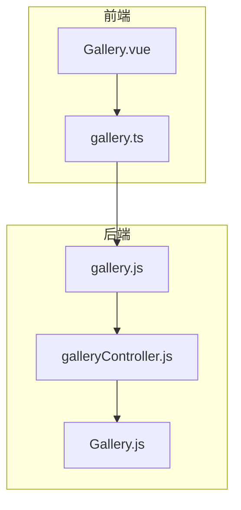
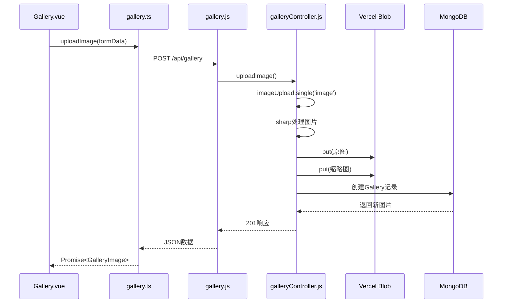
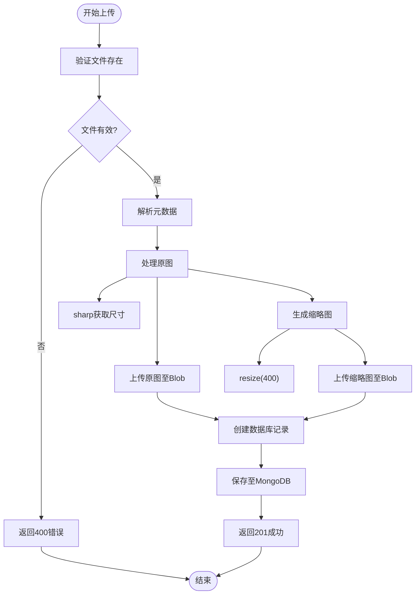
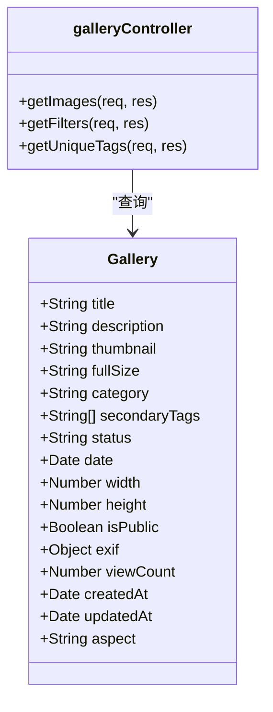
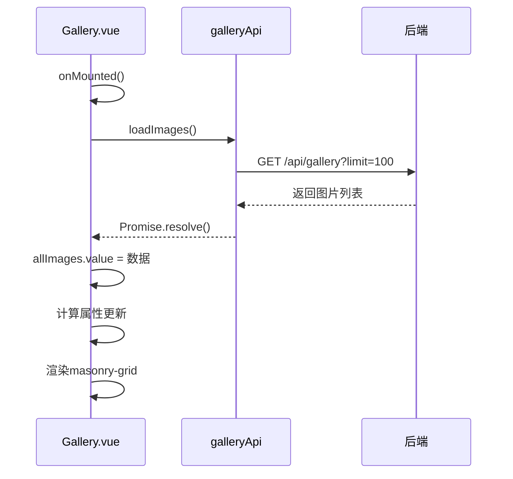

# 图库接口

<cite>
**本文档引用文件**  
- [gallery.js](file://backend/routes/gallery.js)
- [galleryController.js](file://backend/controllers/galleryController.js)
- [Gallery.js](file://backend/models/Gallery.js)
- [gallery.ts](file://frontend/src/api/gallery.ts)
- [Gallery.vue](file://frontend/src/views/Gallery.vue)
</cite>

## 目录
1. [项目结构](#项目结构)  
2. [核心组件](#核心组件)  
3. [架构概览](#架构概览)  
4. [详细组件分析](#详细组件分析)  
5. [依赖分析](#依赖分析)  
6. [性能考虑](#性能考虑)  
7. [故障排除指南](#故障排除指南)  
8. [结论](#结论)

## 项目结构

图库管理功能分布在前后端多个模块中，采用分层架构设计，清晰分离路由、控制器、模型与前端组件。



**图源**  
- [gallery.js](file://backend/routes/gallery.js#L1-L34)
- [Gallery.vue](file://frontend/src/views/Gallery.vue#L1-L821)

**章节来源**  
- [gallery.js](file://backend/routes/gallery.js#L1-L34)
- [Gallery.vue](file://frontend/src/views/Gallery.vue#L1-L821)

## 核心组件

图库系统由五大核心组件构成：前端视图组件、API服务层、路由控制、业务逻辑控制器与数据模型。各组件职责明确，协同完成图片的上传、分类、展示与管理。

**章节来源**  
- [galleryController.js](file://backend/controllers/galleryController.js#L1-L218)
- [Gallery.js](file://backend/models/Gallery.js#L1-L120)

## 架构概览

系统采用典型的前后端分离架构，前端通过RESTful API与后端交互，后端基于Express框架实现路由与控制器，使用Mongoose操作MongoDB数据库，图片文件存储于Vercel Blob。

```mermaid
graph LR
A[Gallery.vue] --> B[gallery.ts]
B --> C[/api/gallery]
C --> D[gallery.js]
D --> E[galleryController.js]
E --> F[Gallery.js]
E --> G[Vercel Blob]
F --> H[MongoDB]
```

**图源**  
- [gallery.js](file://backend/routes/gallery.js#L1-L34)
- [galleryController.js](file://backend/controllers/galleryController.js#L1-L218)
- [Gallery.js](file://backend/models/Gallery.js#L1-L120)

## 详细组件分析

### 图库上传流程分析

#### API调用流程


**图源**  
- [galleryController.js](file://backend/controllers/galleryController.js#L97-L159)
- [gallery.ts](file://frontend/src/api/gallery.ts#L58-L63)

**章节来源**  
- [galleryController.js](file://backend/controllers/galleryController.js#L97-L159)
- [gallery.ts](file://frontend/src/api/gallery.ts#L58-L63)

#### 图片上传处理逻辑


**图源**  
- [galleryController.js](file://backend/controllers/galleryController.js#L97-L159)

**章节来源**  
- [galleryController.js](file://backend/controllers/galleryController.js#L97-L159)

### 图片分类与过滤机制

#### 分类数据模型


**图源**  
- [Gallery.js](file://backend/models/Gallery.js#L1-L120)
- [galleryController.js](file://backend/controllers/galleryController.js#L1-L218)

**章节来源**  
- [Gallery.js](file://backend/models/Gallery.js#L1-L120)

### 前端瀑布流展示分析

#### Gallery.vue组件数据流


**图源**  
- [Gallery.vue](file://frontend/src/views/Gallery.vue#L1-L821)
- [gallery.ts](file://frontend/src/api/gallery.ts#L30-L35)

**章节来源**  
- [Gallery.vue](file://frontend/src/views/Gallery.vue#L1-L821)

## 依赖分析

系统各组件间依赖关系清晰，前端依赖API服务，后端控制器依赖模型与工具库，形成稳定调用链。

```mermaid
graph TD
A[Gallery.vue] --> B[gallery.ts]
B --> C[apiService]
C --> D[axios]
E[galleryController.js] --> F[Gallery.js]
E --> G[sharp]
E --> H[@vercel/blob]
E --> I[fileUpload.js]
F --> J[mongoose]
```

**图源**  
- [gallery.ts](file://frontend/src/api/gallery.ts#L1-L107)
- [galleryController.js](file://backend/controllers/galleryController.js#L1-L218)

**章节来源**  
- [galleryController.js](file://backend/controllers/galleryController.js#L1-L218)

## 性能考虑

- **图片处理**：使用`sharp`库进行高效图像处理，支持流式操作，内存占用低
- **存储优化**：原图与400px缩略图分离存储，减少前端加载压力
- **数据库查询**：在`category`、`secondaryTags`、`date`字段建立索引，提升查询效率
- **前端渲染**：采用Masonry瀑布流布局，配合`loading="lazy"`实现图片懒加载
- **缓存策略**：Vercel Blob提供CDN缓存，提升图片访问速度

## 故障排除指南

### 常见问题与解决方案

| 问题现象 | 可能原因 | 解决方案 |
|--------|--------|--------|
| 上传失败 | BLOB_READ_WRITE_TOKEN未配置 | 检查环境变量配置 |
| 缩略图不显示 | sharp处理失败 | 确认Node.js版本兼容性 |
| 分类过滤无效 | 数据库中无published状态图片 | 检查图片状态字段 |
| 接口403错误 | 未登录或非管理员 | 确认认证中间件配置 |
| 图片加载慢 | 未启用CDN | 检查Vercel Blob配置 |

**章节来源**  
- [galleryController.js](file://backend/controllers/galleryController.js#L1-L218)
- [Gallery.js](file://backend/models/Gallery.js#L1-L120)

## 结论

图库管理系统实现了完整的图片上传、分类管理、分页展示与详情查看功能。后端通过`POST /api/gallery`接口接收图片文件，使用`sharp`库提取EXIF信息并生成400px缩略图，原图与缩略图均存储于Vercel Blob。请求参数包含`title`、`description`、`category`等元数据字段，响应返回原图、缩略图URL及尺寸信息。前端`Gallery.vue`组件通过`galleryApi`调用接口，实现瀑布流展示与灯箱预览功能，支持分类与标签过滤，提供良好的用户体验。