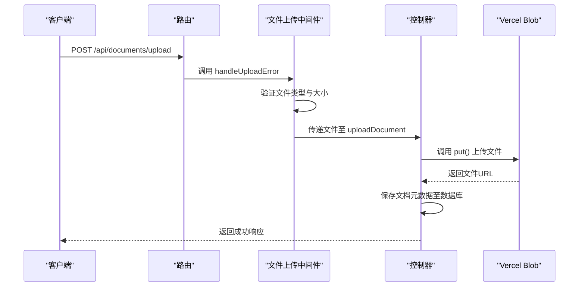
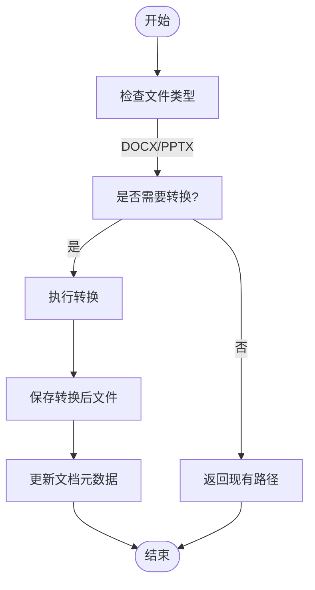
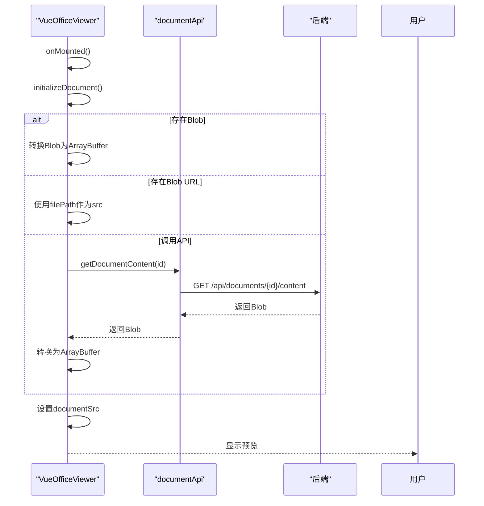
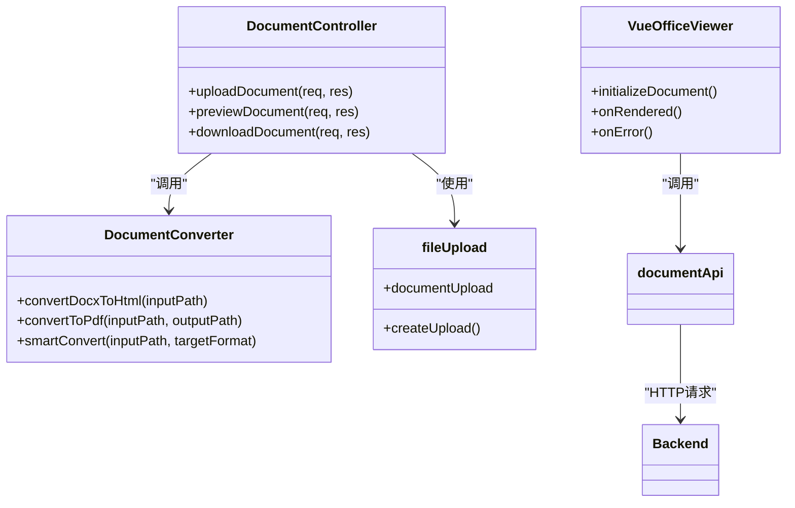

# 文档接口

<cite>
**本文档引用的文件**  
- [document.js](file://backend/routes/document.js#L1-L48)
- [documentController.js](file://backend/controllers/documentController.js#L1-L799)
- [documentConverter.js](file://backend/utils/documentConverter.js#L1-L291)
- [fileUpload.js](file://backend/utils/fileUpload.js#L1-L138)
- [VueOfficeViewer.vue](file://frontend/src/components/document-preview/VueOfficeViewer.vue#L1-L289)
- [useVueOffice.js](file://frontend/src/composables/useVueOffice.js#L1-L96)
- [document.ts](file://frontend/src/api/document.ts#L1-L75)
</cite>

## 目录
1. [文档接口](#文档接口)
2. [文件上传与处理流程](#文件上传与处理流程)
3. [文档预览与格式转换](#文档预览与格式转换)
4. [前端组件与API调用](#前端组件与api调用)
5. [Vercel Blob集成](#vercel-blob集成)
6. [错误处理与日志](#错误处理与日志)

## 文件上传与处理流程

文档上传功能通过 `POST /api/documents/upload` 接口实现，支持 `multipart/form-data` 格式的数据提交。该接口由 `documentController.js` 中的 `uploadDocument` 方法处理，结合 `fileUpload.js` 中定义的 `documentUpload` 配置完成文件接收与验证。

上传流程如下：
1. 客户端通过 `multipart/form-data` 提交文件。
2. 后端使用 `multer` 中间件解析请求，配置为内存存储（`memoryStorage`），以兼容 Vercel 环境下的无文件系统特性。
3. 文件类型和大小受到严格限制：支持 PDF、DOCX、PPTX、XLSX、TXT、MD 等格式，最大文件大小为 50MB。
4. 若配置了 `BLOB_READ_WRITE_TOKEN`，文件将上传至 Vercel Blob 存储；否则，系统将记录警告并拒绝上传。

**Diagram sources**  
- [document.js](file://backend/routes/document.js#L35-L36)
- [documentController.js](file://backend/controllers/documentController.js#L700-L799)
- [fileUpload.js](file://backend/utils/fileUpload.js#L50-L55)

**Section sources**  
- [document.js](file://backend/routes/document.js#L35-L36)
- [documentController.js](file://backend/controllers/documentController.js#L700-L799)
- [fileUpload.js](file://backend/utils/fileUpload.js#L50-L55)

## 文档预览与格式转换

系统支持多种文档格式的在线预览，包括 PDF、DOCX、PPTX 等。核心转换逻辑由 `documentConverter.js` 实现，该模块封装了 `mammoth`（用于 DOCX 转 HTML）和 `libreoffice-convert`（用于 Office 文档转 PDF）的功能。

### 支持的文件类型
- **PDF**: 直接流式传输或重定向至 Blob URL
- **DOCX**: 使用 `mammoth` 转换为 HTML 或供前端 `Vue-Office` 组件解析
- **PPTX**: 提供 Office Online 或 Google Docs 在线预览方案
- **TXT/MD**: 直接返回文本内容
- **XLSX/XLS**: 由 `Vue-Office` 组件处理

### 转换流程
1. 检查文件是否需要转换（如 `.docx`、`.pptx`）。
2. 若已存在有效转换文件（如 PDF），直接返回路径。
3. 否则调用 `convertToPdf` 或 `convertDocxToHtml` 进行转换。
4. 转换结果存储在 `converted/` 子目录中，并更新文件元数据。

**Diagram sources**  
- [documentConverter.js](file://backend/utils/documentConverter.js#L1-L291)
- [documentController.js](file://backend/controllers/documentController.js#L400-L599)

**Section sources**  
- [documentConverter.js](file://backend/utils/documentConverter.js#L1-L291)
- [documentController.js](file://backend/controllers/documentController.js#L400-L599)

## 前端组件与API调用

前端通过 `VueOfficeViewer.vue` 组件实现文档预览功能，该组件基于 `Vue-Office` 生态构建，支持多种 Office 格式的渲染。

### 组件结构
- **VueOfficeDocx**: 渲染 DOCX 文档
- **VueOfficeExcel**: 渲染 Excel 文件
- **PptxViewer**: 自定义 PPTX 预览器
- **PdfViewer**: 内置 PDF 查看器

### API调用流程
1. 组件初始化时调用 `initializeDocument` 方法。
2. 根据文档类型决定加载策略：
   - 若提供 `Blob`，则转换为 `ArrayBuffer` 供 Vue-Office 使用。
   - 若为 Vercel Blob URL，直接使用 URL。
   - 否则通过 `/api/documents/{id}/content` 接口获取内容。
3. 加载完成后触发 `rendered` 事件，通知父组件。

**Diagram sources**  
- [VueOfficeViewer.vue](file://frontend/src/components/document-preview/VueOfficeViewer.vue#L1-L289)
- [document.ts](file://frontend/src/api/document.ts#L1-L75)

**Section sources**  
- [VueOfficeViewer.vue](file://frontend/src/components/document-preview/VueOfficeViewer.vue#L1-L289)
- [document.ts](file://frontend/src/api/document.ts#L1-L75)

## Vercel Blob集成

系统通过 `@vercel/blob` 模块与 Vercel Blob 存储服务集成，实现云端文件持久化。

### 集成方式
1. 检查环境变量 `BLOB_READ_WRITE_TOKEN` 是否配置。
2. 若配置，则导入 `put` 和 `del` 函数用于上传和删除。
3. 若未配置，则使用空函数替代，避免运行时错误。

### 上传逻辑
- 文件上传时，`uploadDocument` 方法调用 `put()` 将文件流上传至 Blob。
- 成功后返回唯一 URL，存储于 `Document` 模型的 `filePath` 字段。
- 删除文档时，自动调用 `del()` 清理 Blob 文件。

**Diagram sources**  
- [documentController.js](file://backend/controllers/documentController.js#L1-L799)
- [fileUpload.js](file://backend/utils/fileUpload.js#L1-L138)
- [documentConverter.js](file://backend/utils/documentConverter.js#L1-L291)
- [VueOfficeViewer.vue](file://frontend/src/components/document-preview/VueOfficeViewer.vue#L1-L289)

**Section sources**  
- [documentController.js](file://backend/controllers/documentController.js#L1-L799)
- [fileUpload.js](file://backend/utils/fileUpload.js#L1-L138)
- [documentConverter.js](file://backend/utils/documentConverter.js#L1-L291)

## 错误处理与日志

系统在多个层级实现了完善的错误处理机制：

- **上传错误**：通过 `handleUploadError` 中间件捕获文件类型或大小不合规的情况。
- **转换错误**：`documentConverter.js` 中使用 `try-catch` 捕获转换失败，并记录详细日志。
- **预览错误**：前端组件提供“重试”和“下载”选项，提升用户体验。
- **权限错误**：非管理员用户无法访问未发布的文档，返回 403 状态码。

日志输出包含关键操作的时间戳、文件路径、转换状态等信息，便于问题排查。

**Section sources**  
- [documentController.js](file://backend/controllers/documentController.js#L1-L799)
- [documentConverter.js](file://backend/utils/documentConverter.js#L1-L291)
- [VueOfficeViewer.vue](file://frontend/src/components/document-preview/VueOfficeViewer.vue#L1-L289)