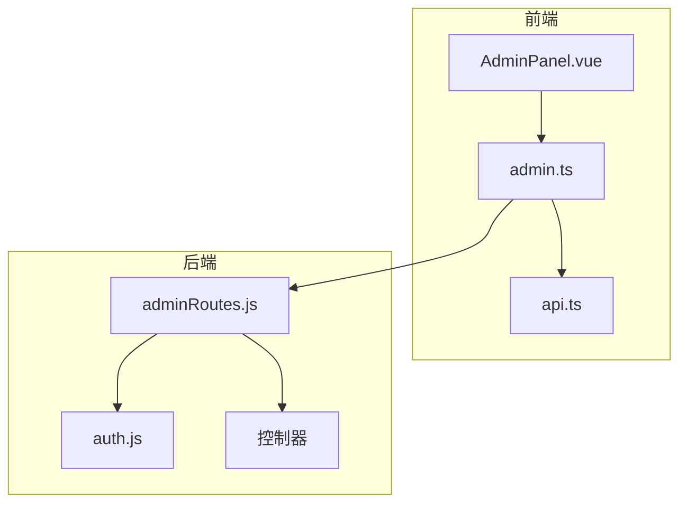
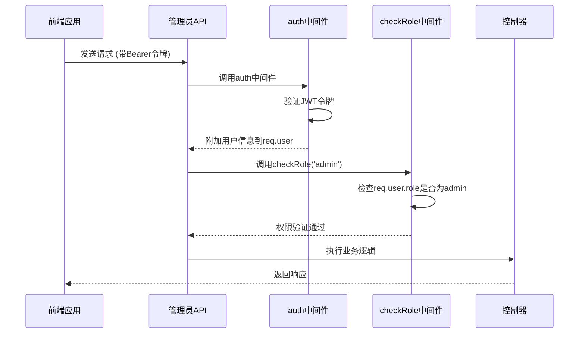
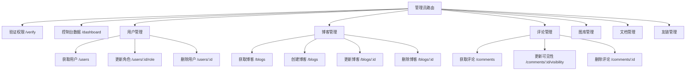
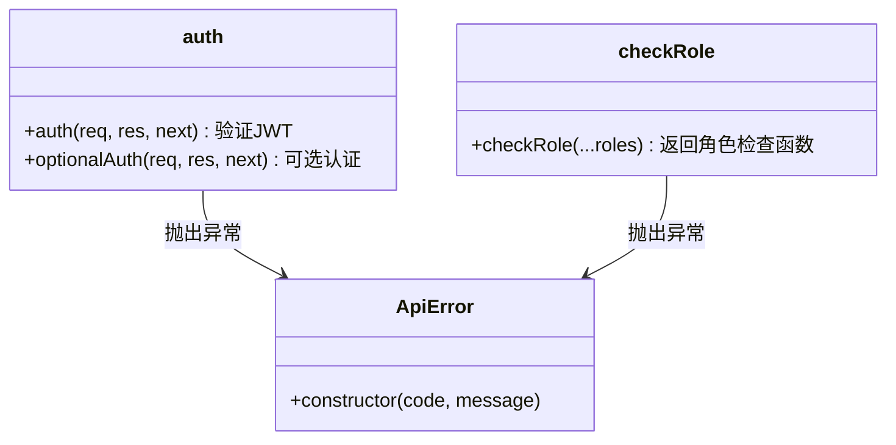
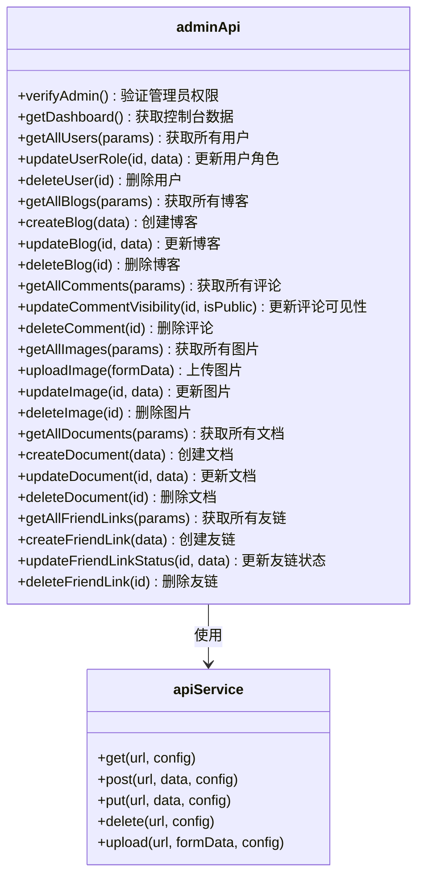
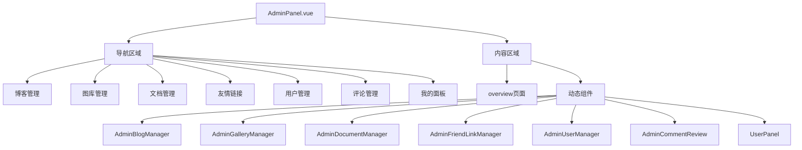
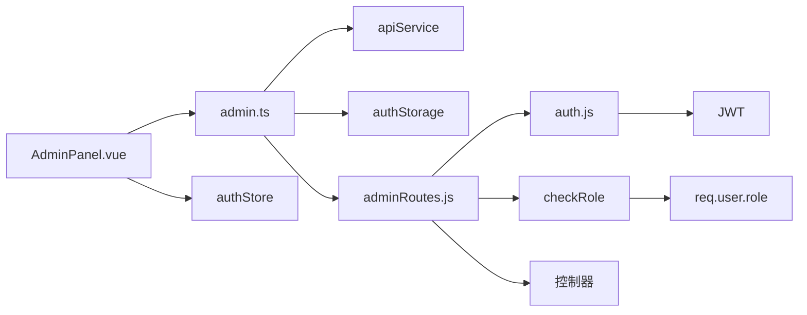

# 管理员接口

<cite>
**本文档引用的文件**  
- [adminRoutes.js](file://backend/routes/adminRoutes.js#L0-L1017)
- [auth.js](file://backend/middleware/auth.js#L0-L66)
- [AdminPanel.vue](file://frontend/src/views/Admin/AdminPanel.vue#L0-L404)
- [admin.ts](file://frontend/src/api/admin.ts#L0-L291)
- [api.ts](file://frontend/src/types/api.ts#L0-L480)
</cite>

## 目录
1. [简介](#简介)
2. [项目结构](#项目结构)
3. [核心组件](#核心组件)
4. [架构概览](#架构概览)
5. [详细组件分析](#详细组件分析)
6. [依赖分析](#依赖分析)
7. [性能考虑](#性能考虑)
8. [故障排除指南](#故障排除指南)
9. [结论](#结论)

## 简介
本文档为管理员专用API提供权威说明，涵盖内容审核、用户管理、友链管理等高权限操作。文档详细描述了后端路由、权限验证机制、前端调用方式以及错误处理策略，旨在为开发者和管理员提供全面的技术参考。

## 项目结构
项目采用前后端分离架构，后端使用Node.js + Express，前端使用Vue 3 + TypeScript。管理员相关功能集中在`backend/routes/adminRoutes.js`中，前端通过`frontend/src/api/admin.ts`封装API调用。

**图示来源**  
- [adminRoutes.js](file://backend/routes/adminRoutes.js#L0-L1017)
- [admin.ts](file://frontend/src/api/admin.ts#L0-L291)
- [AdminPanel.vue](file://frontend/src/views/Admin/AdminPanel.vue#L0-L404)

**本节来源**  
- [adminRoutes.js](file://backend/routes/adminRoutes.js#L0-L1017)
- [AdminPanel.vue](file://frontend/src/views/Admin/AdminPanel.vue#L0-L404)

## 核心组件
核心组件包括管理员路由、权限中间件、前端API封装和管理面板组件。这些组件协同工作，实现安全的后台管理功能。

**本节来源**  
- [adminRoutes.js](file://backend/routes/adminRoutes.js#L0-L1017)
- [auth.js](file://backend/middleware/auth.js#L0-L66)
- [admin.ts](file://frontend/src/api/admin.ts#L0-L291)

## 架构概览
系统采用典型的RESTful架构，所有管理员接口均以`/api/admin`为前缀。请求需携带JWT令牌，通过`auth`和`checkRole`中间件验证身份和权限。

**图示来源**  
- [auth.js](file://backend/middleware/auth.js#L0-L66)
- [adminRoutes.js](file://backend/routes/adminRoutes.js#L0-L1017)

## 详细组件分析

### 后端路由分析
`adminRoutes.js`定义了所有管理员专用接口，每个路由都应用了`auth`和`checkRole('admin')`中间件。

#### 路由列表

**图示来源**  
- [adminRoutes.js](file://backend/routes/adminRoutes.js#L0-L1017)

**本节来源**  
- [adminRoutes.js](file://backend/routes/adminRoutes.js#L0-L1017)

### 权限验证机制
权限验证通过两个中间件实现：`auth`验证JWT令牌，`checkRole`检查用户角色。

**图示来源**  
- [auth.js](file://backend/middleware/auth.js#L0-L66)

**本节来源**  
- [auth.js](file://backend/middleware/auth.js#L0-L66)

### 前端API封装
`admin.ts`文件封装了所有管理员API调用，使用`apiService`进行请求。

**图示来源**  
- [admin.ts](file://frontend/src/api/admin.ts#L0-L291)

**本节来源**  
- [admin.ts](file://frontend/src/api/admin.ts#L0-L291)

### 管理面板组件
`AdminPanel.vue`是管理员控制台的主组件，通过`currentView`变量切换不同管理功能。

**图示来源**  
- [AdminPanel.vue](file://frontend/src/views/Admin/AdminPanel.vue#L0-L404)

**本节来源**  
- [AdminPanel.vue](file://frontend/src/views/Admin/AdminPanel.vue#L0-L404)

## 依赖分析
管理员功能依赖于多个核心模块，形成清晰的依赖链。

**图示来源**  
- [adminRoutes.js](file://backend/routes/adminRoutes.js#L0-L1017)
- [admin.ts](file://frontend/src/api/admin.ts#L0-L291)
- [AdminPanel.vue](file://frontend/src/views/Admin/AdminPanel.vue#L0-L404)
- [auth.js](file://backend/middleware/auth.js#L0-L66)

**本节来源**  
- [adminRoutes.js](file://backend/routes/adminRoutes.js#L0-L1017)
- [admin.ts](file://frontend/src/api/admin.ts#L0-L291)
- [AdminPanel.vue](file://frontend/src/views/Admin/AdminPanel.vue#L0-L404)

## 性能考虑
1. **数据库查询优化**：所有列表接口都支持分页，避免一次性加载大量数据
2. **批量操作**：统计数据通过`Promise.all`并行查询，减少数据库往返次数
3. **缓存策略**：可考虑为频繁访问的数据（如友链列表）添加缓存层
4. **文件上传**：对上传文件大小（10MB限制）和类型进行严格验证，防止恶意上传

## 故障排除指南

### 常见错误响应
| 状态码 | 错误信息 | 原因 | 解决方案 |
|--------|--------|------|----------|
| 401 | 请先登录 | 未提供JWT令牌 | 确保请求头包含`Authorization: Bearer <token>` |
| 401 | 令牌已过期 | JWT令牌过期 | 重新登录获取新令牌 |
| 403 | 没有权限执行此操作 | 用户角色不是admin | 确认用户角色为admin |
| 404 | 用户不存在 | 用户ID无效 | 检查用户ID是否正确 |
| 400 | 无效的用户角色 | 角色不是'user'或'admin' | 使用有效角色值 |

### 403 Forbidden处理建议
当收到403响应时，应：
1. 检查JWT令牌中的`role`字段是否为`admin`
2. 确认用户账户状态是否为激活状态
3. 在前端调用`verifyAdmin`接口验证权限
4. 如果权限正常但仍有问题，检查后端`checkRole`中间件实现

**本节来源**  
- [auth.js](file://backend/middleware/auth.js#L0-L66)
- [admin.ts](file://frontend/src/api/admin.ts#L0-L291)

## 结论
管理员接口设计遵循RESTful原则，通过JWT令牌和角色检查实现安全的权限控制。前后端分离的架构使得功能扩展和维护更加便捷。建议在生产环境中添加更详细的日志记录和监控，以确保管理员操作的可追溯性和系统安全性。