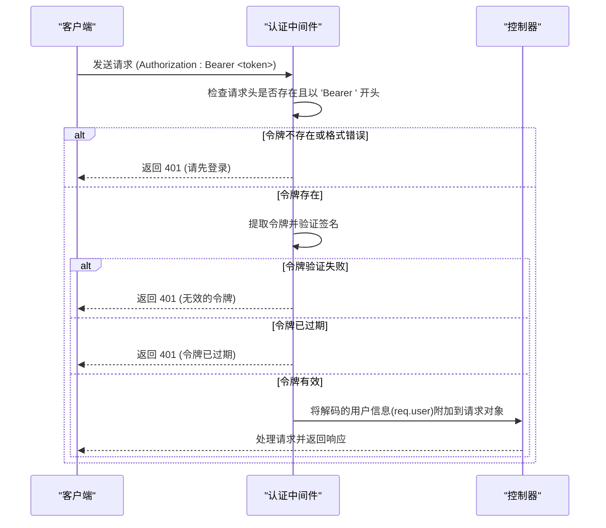

# 认证接口

<cite>
**本文档引用的文件**   
- [authRoutes.js](file://backend/routes/authRoutes.js)
- [authController.js](file://backend/controllers/authController.js)
- [auth.js](file://backend/middleware/auth.js)
- [User.js](file://backend/models/User.js)
- [auth.ts](file://frontend/src/api/auth.ts)
- [auth.js](file://frontend/src/utils/auth.js)
</cite>

## 目录
1. [认证接口](#认证接口)
2. [用户注册](#用户注册)
3. [用户登录](#用户登录)
4. [获取当前用户信息](#获取当前用户信息)
5. [JWT令牌机制](#jwt令牌机制)
6. [前端调用示例](#前端调用示例)
7. [常见错误处理](#常见错误处理)

## 用户注册

用户注册接口用于创建新用户账户。

**接口信息**
- **HTTP方法**: `POST`
- **URL路径**: `/api/auth/register`
- **请求头**: `Content-Type: application/json`

**请求体结构**
```json
{
  "username": "string",
  "email": "string",
  "password": "string"
}
```

**成功响应 (状态码 201)**
```json
{
  "data": {
    "user": {
      "id": "string",
      "username": "string",
      "email": "string",
      "avatar": "string",
      "role": "string"
    },
    "token": "string"
  }
}
```

**错误状态码**
- `400`: 用户名或邮箱已被注册

**Section sources**
- [authRoutes.js](file://backend/routes/authRoutes.js#L15)
- [authController.js](file://backend/controllers/authController.js#L25-L55)
- [User.js](file://backend/models/User.js#L15-L40)

## 用户登录

用户登录接口用于验证用户凭据并返回JWT令牌。

**接口信息**
- **HTTP方法**: `POST`
- **URL路径**: `/api/auth/login`
- **请求头**: `Content-Type: application/json`

**请求体结构**
```json
{
  "email": "string",
  "password": "string"
}
```
或
```json
{
  "username": "string",
  "password": "string"
}
```

**成功响应 (状态码 200)**
```json
{
  "success": true,
  "data": {
    "user": {
      "id": "string",
      "username": "string",
      "email": "string",
      "avatar": "string",
      "role": "string"
    },
    "token": "string"
  }
}
```

**错误状态码**
- `400`: 请提供用户名或邮箱
- `401`: 用户名/邮箱或密码错误
- `403`: 账户已被禁用

**Section sources**
- [authRoutes.js](file://backend/routes/authRoutes.js#L18)
- [authController.js](file://backend/controllers/authController.js#L57-L104)

## 获取当前用户信息

获取当前登录用户的信息，需要有效的JWT令牌。

**接口信息**
- **HTTP方法**: `GET`
- **URL路径**: `/api/auth/me`
- **请求头**: `Authorization: Bearer <token>`

**成功响应 (状态码 200)**
```json
{
  "data": {
    "user": {
      "id": "string",
      "username": "string",
      "email": "string",
      "avatar": "string",
      "role": "string"
    }
  }
}
```

**错误状态码**
- `401`: 请先登录，或令牌无效/已过期
- `404`: 用户不存在

**Section sources**
- [authRoutes.js](file://backend/routes/authRoutes.js#L21)
- [authController.js](file://backend/controllers/authController.js#L106-L125)
- [auth.js](file://backend/middleware/auth.js#L5-L35)

## JWT令牌机制

### 令牌生成与验证

系统使用JWT（JSON Web Token）进行用户身份验证。

**令牌生成**
- 使用 `jsonwebtoken` 库生成
- 签名密钥：`process.env.JWT_SECRET`
- 过期时间：`process.env.JWT_EXPIRES_IN` 或默认7天
- 载荷包含：用户ID (`id`) 和角色 (`role`)

```javascript
const generateToken = (userId, userRole) => {
  return jwt.sign({ id: userId, role: userRole }, process.env.JWT_SECRET, {
    expiresIn: process.env.JWT_EXPIRES_IN || '7d'
  })
}
```

### 认证中间件流程



**Diagram sources**
- [auth.js](file://backend/middleware/auth.js#L5-L35)

**Section sources**
- [auth.js](file://backend/middleware/auth.js#L5-L66)
- [authController.js](file://backend/controllers/authController.js#L15-L23)

## 前端调用示例

### 使用Axios调用认证API

```typescript
// 前端API调用示例
import { authApi } from '@/api/auth'

// 用户注册
try {
  const response = await authApi.register({
    username: 'newuser',
    email: 'user@example.com',
    password: 'password123'
  })
  // 保存认证信息
  authStorage.setAuth(response.data.token, response.data.user)
} catch (error) {
  console.error('注册失败:', error.response?.data?.message)
}

// 用户登录
try {
  const response = await authApi.login({
    email: 'user@example.com',
    password: 'password123'
  })
  // 保存认证信息
  authStorage.setAuth(response.data.token, response.data.user)
} catch (error) {
  console.error('登录失败:', error.response?.data?.message)
}

// 获取当前用户信息
try {
  const response = await authApi.getCurrentUser()
  console.log('当前用户:', response.data.user)
} catch (error) {
  console.error('获取用户信息失败:', error.response?.data?.message)
}
```

### 请求拦截器自动添加令牌

```javascript
// 请求拦截器：自动添加Authorization头
api.interceptors.request.use(
  (config) => {
    const token = localStorage.getItem('token')
    if (token) {
      config.headers.Authorization = `Bearer ${token}`
    }
    return config
  },
  (error) => {
    return Promise.reject(error)
  }
)
```

### 响应拦截器处理认证错误

```javascript
// 响应拦截器：自动处理401错误
api.interceptors.response.use(
  (response) => response.data,
  (error) => {
    if (error.response?.status === 401) {
      // 清除本地存储的认证信息
      localStorage.removeItem('token')
      localStorage.removeItem('user')
      // 重定向到登录页
      window.location.href = '/login'
    }
    return Promise.reject(error)
  }
)
```

**Section sources**
- [auth.ts](file://frontend/src/api/auth.ts#L10-L90)
- [auth.js](file://frontend/src/utils/auth.js#L58-L106)

## 常见错误处理

### 密码强度不足
- **错误码**: `400`
- **错误信息**: "密码至少6个字符"
- **处理方式**: 前端在提交前进行密码长度验证

### 邮箱或用户名重复
- **错误码**: `400`
- **错误信息**: "用户名或邮箱已被注册"
- **处理方式**: 提示用户使用其他邮箱或用户名

### 无效的邮箱格式
- **错误码**: `400`
- **错误信息**: "请输入有效的邮箱地址"
- **处理方式**: 前端使用正则表达式验证邮箱格式

### 登录凭据错误
- **错误码**: `401`
- **错误信息**: "用户名/邮箱或密码错误"
- **处理方式**: 提示用户检查输入的凭据

### 令牌无效或过期
- **错误码**: `401`
- **错误信息**: "无效的令牌" 或 "令牌已过期"
- **处理方式**: 清除本地认证信息并重定向到登录页

### 账户被禁用
- **错误码**: `403`
- **错误信息**: "账户已被禁用"
- **处理方式**: 提示用户联系管理员

**Section sources**
- [User.js](file://backend/models/User.js#L30-L35)
- [authController.js](file://backend/controllers/authController.js#L30-L35)
- [auth.js](file://backend/middleware/auth.js#L25-L35)