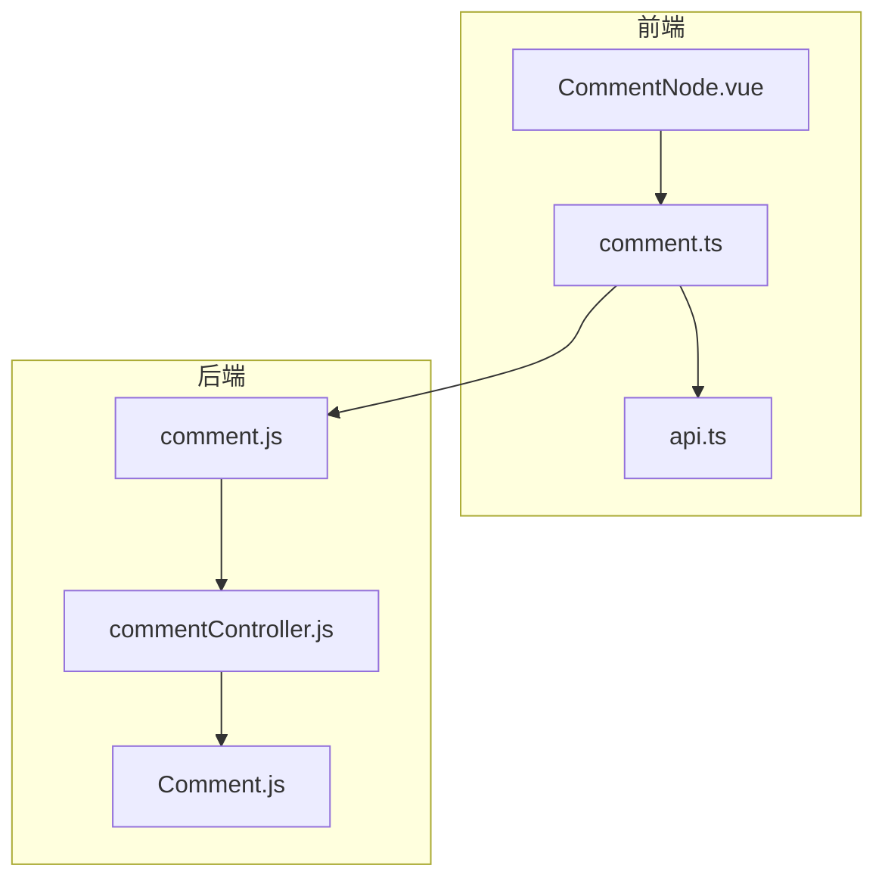
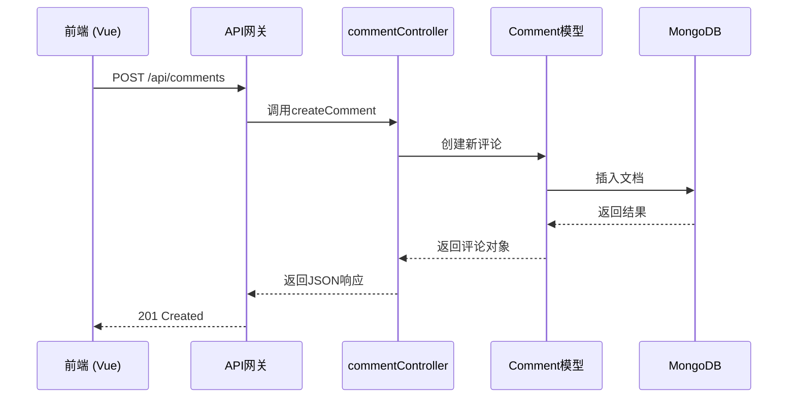
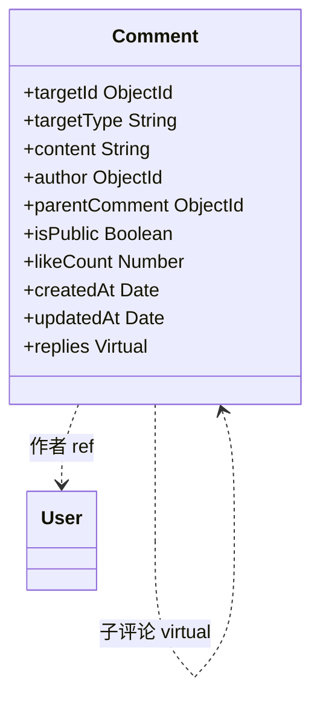
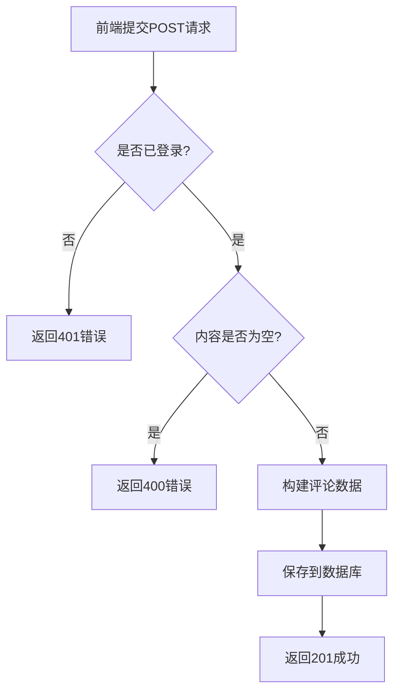
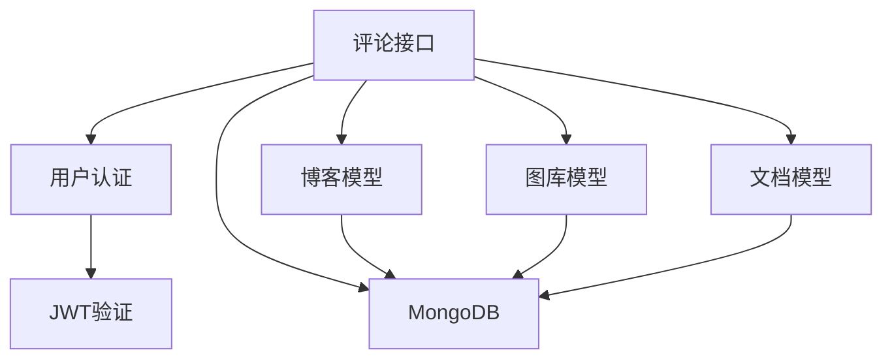

# 评论接口

<cite>
**本文档引用的文件**  
- [comment.js](file://backend/routes/comment.js#L1-L46)
- [commentController.js](file://backend/controllers/commentController.js#L1-L467)
- [Comment.js](file://backend/models/Comment.js#L1-L82)
- [comment.ts](file://frontend/src/api/comment.ts#L1-L219)
- [api.ts](file://frontend/src/types/api.ts#L1-L480)
</cite>

## 目录
1. [简介](#简介)
2. [项目结构](#项目结构)
3. [核心组件](#核心组件)
4. [架构概览](#架构概览)
5. [详细组件分析](#详细组件分析)
6. [依赖分析](#依赖分析)
7. [性能考量](#性能考量)
8. [故障排除指南](#故障排除指南)
9. [结论](#结论)

## 简介
本文档详细说明了网站中评论系统的RESTful API接口设计与实现。该系统支持对博客、图库、文档等多种内容类型的多级嵌套评论，具备完整的创建、读取、更新、删除（CRUD）功能，以及点赞、审核和权限控制机制。前端通过TypeScript调用API，后端使用Node.js + Express + MongoDB实现。

## 项目结构
评论功能在前后端均有分布：
- **后端路径**：`backend/controllers/commentController.js`（业务逻辑）、`backend/models/Comment.js`（数据模型）、`backend/routes/comment.js`（路由定义）
- **前端路径**：`frontend/src/api/comment.ts`（API封装）、`frontend/src/types/api.ts`（类型定义）、`frontend/src/components/CommentNode.vue`（UI组件）



**图示来源**  
- [comment.js](file://backend/routes/comment.js#L1-L46)
- [commentController.js](file://backend/controllers/commentController.js#L1-L467)
- [Comment.js](file://backend/models/Comment.js#L1-L82)
- [comment.ts](file://frontend/src/api/comment.ts#L1-L219)
- [api.ts](file://frontend/src/types/api.ts#L1-L480)

## 核心组件
评论系统由五个核心文件构成，分别处理数据模型、路由分发、业务逻辑、前端调用和类型定义。

**本节来源**  
- [comment.js](file://backend/routes/comment.js#L1-L46)
- [commentController.js](file://backend/controllers/commentController.js#L1-L467)
- [Comment.js](file://backend/models/Comment.js#L1-L82)
- [comment.ts](file://frontend/src/api/comment.ts#L1-L219)
- [api.ts](file://frontend/src/types/api.ts#L1-L480)

## 架构概览
系统采用典型的前后端分离架构，前端通过HTTP请求与后端交互，后端通过Mongoose操作MongoDB数据库。



**图示来源**  
- [comment.js](file://backend/routes/comment.js#L1-L46)
- [commentController.js](file://backend/controllers/commentController.js#L208-L245)
- [Comment.js](file://backend/models/Comment.js#L1-L82)

## 详细组件分析

### 评论数据模型分析
`Comment.js`定义了评论的核心数据结构，支持多类型目标关联和嵌套回复。



**图示来源**  
- [Comment.js](file://backend/models/Comment.js#L1-L82)

#### 关键字段说明
- **targetType**: 评论目标类型，枚举值包括 `Blog`、`Gallery`、`Document`、`General`
- **targetId**: 目标内容的唯一ID（如博客文章ID）
- **content**: 评论正文，最大2000字符
- **parentComment**: 父评论ID，为空时表示顶层评论
- **isPublic**: 是否公开显示，用于审核机制
- **likeCount**: 点赞数，整数计数

### 路由与控制器分析
`comment.js`定义了所有评论相关的API端点，`commentController.js`实现具体业务逻辑。

#### 路由映射表
| 方法 | 路径 | 描述 | 认证要求 |
|------|------|------|--------|
| GET | /api/comments | 获取所有评论 | 可选认证 |
| GET | /api/comments/:targetType/:targetId | 获取指定目标的评论 | 可选认证 |
| POST | /api/comments | 创建新评论 | 需登录 |
| PUT | /api/comments/:id | 更新评论 | 需登录 |
| DELETE | /api/comments/:id | 删除评论 | 需登录 |
| PATCH | /api/comments/:id/moderate | 审核评论 | 管理员 |
| POST | /api/comments/:id/like | 点赞 | 需登录 |
| DELETE | /api/comments/:id/like | 取消点赞 | 需登录 |
| GET | /api/comments/:id/like-status | 检查点赞状态 | 可选认证 |

**本节来源**  
- [comment.js](file://backend/routes/comment.js#L1-L46)
- [commentController.js](file://backend/controllers/commentController.js#L1-L467)

### 创建评论流程分析
当用户提交评论时，后端执行以下流程：



**本节来源**  
- [commentController.js](file://backend/controllers/commentController.js#L208-L245)

### 前端API封装分析
`comment.ts`使用TypeScript对评论API进行了类型安全的封装。

#### 请求体结构
```json
{
  "targetType": "Blog",
  "targetId": "60d2f9b1e4b0b82e8c8b4567",
  "content": "这是一条评论",
  "parentComment": "60d2f9b1e4b0b82e8c8b4568",
  "isPublic": true
}
```

#### 响应数据结构
```json
{
  "success": true,
  "data": {
    "id": "60d2f9b1e4b0b82e8c8b4569",
    "content": "这是一条评论",
    "author": {
      "username": "用户1",
      "avatar": "/avatar/1.png"
    },
    "replies": [],
    "likeCount": 0,
    "isPublic": true,
    "createdAt": "2023-01-01T00:00:00.000Z"
  }
}
```

**本节来源**  
- [comment.ts](file://frontend/src/api/comment.ts#L1-L219)
- [api.ts](file://frontend/src/types/api.ts#L1-L480)

## 依赖分析
评论系统依赖于用户认证、内容模型和数据库服务。



**图示来源**  
- [commentController.js](file://backend/controllers/commentController.js#L1-L467)
- [Comment.js](file://backend/models/Comment.js#L1-L82)

## 性能考量
- **分页机制**：所有列表接口均支持分页，防止数据量过大导致性能问题
- **索引优化**：数据库在 `targetId + targetType + isPublic` 和 `createdAt` 上建立了复合索引
- **递归查询优化**：获取嵌套评论时采用分步查询，避免深度递归导致的性能下降
- **最大限制**：单页最多返回100条评论，防止滥用

## 故障排除指南
### 常见问题
- **401错误**：用户未登录，请先进行身份验证
- **403错误**：权限不足，无法修改或删除他人评论
- **404错误**：评论或目标内容不存在
- **400错误**：请求体格式错误，检查 `targetType` 是否正确、`content` 是否为空

### 敏感词过滤
当前代码中未实现敏感词过滤功能，`TODO`注释提示需要验证目标资源是否存在。建议在 `createComment` 函数中添加内容过滤中间件。

### 审核机制
- 所有新评论默认 `isPublic: true`，即发布即可见
- 管理员可通过 `PATCH /api/comments/:id/moderate` 接口修改 `isPublic` 状态实现审核
- 未来可扩展为 `status: 'pending' | 'approved' | 'rejected'` 状态机

**本节来源**  
- [commentController.js](file://backend/controllers/commentController.js#L208-L245)
- [Comment.js](file://backend/models/Comment.js#L1-L82)

## 结论
该评论系统功能完整，支持多级嵌套、点赞、权限控制和审核机制。建议后续增强以下方面：
1. 添加敏感词过滤中间件
2. 实现评论发布前的待审核状态
3. 前端优化评论树的渲染性能
4. 增加评论搜索和举报功能

系统架构清晰，前后端分离良好，具备良好的可维护性和扩展性。