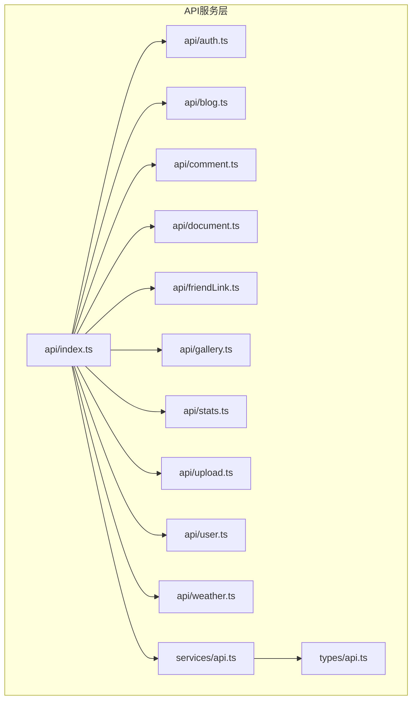
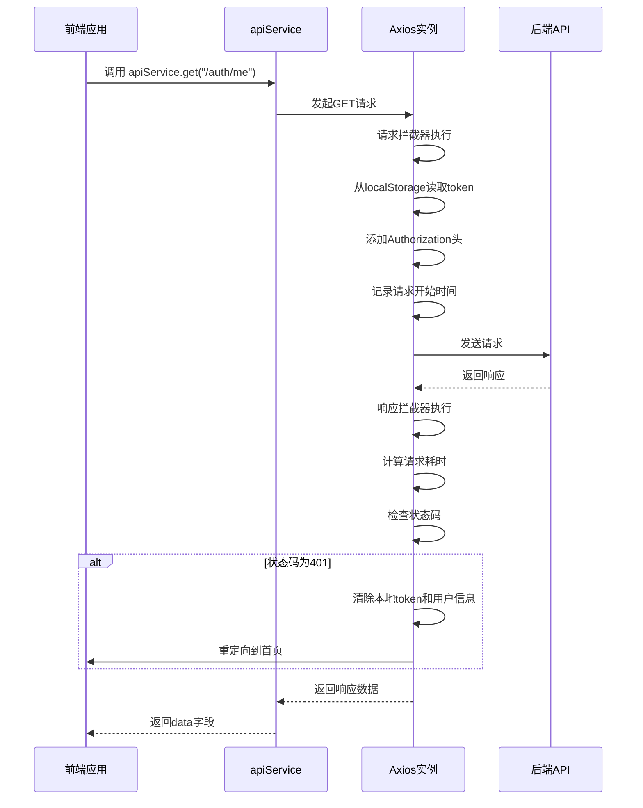
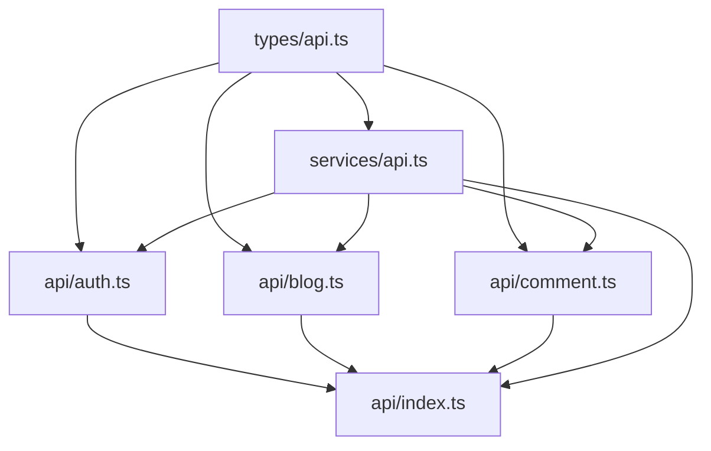

# API服务封装

<cite>
**本文档引用文件**  
- [api.ts](file://frontend/src/services/api.ts)
- [api.ts](file://frontend/src/types/api.ts)
- [index.ts](file://frontend/src/api/index.ts)
- [auth.ts](file://frontend/src/api/auth.ts)
- [blog.ts](file://frontend/src/api/blog.ts)
- [comment.ts](file://frontend/src/api/comment.ts)
- [document.ts](file://frontend/src/api/document.ts)
</cite>

## 目录
1. [API服务封装](#api服务封装)
2. [项目结构概览](#项目结构概览)
3. [核心组件分析](#核心组件分析)
4. [架构总览](#架构总览)
5. [详细组件分析](#详细组件分析)
6. [依赖关系分析](#依赖关系分析)
7. [性能与错误处理](#性能与错误处理)
8. [新增API接口实践指南](#新增api接口实践指南)

## 项目结构概览

前端API服务层位于 `frontend/src/api` 目录下，采用模块化设计，按功能领域划分接口定义。`services/api.ts` 文件封装了Axios实例及其拦截器，为所有API请求提供统一的底层支持。`types/api.ts` 定义了所有API相关的类型，确保类型安全。



**图示来源**  
- [api/index.ts](file://frontend/src/api/index.ts)
- [services/api.ts](file://frontend/src/services/api.ts)
- [types/api.ts](file://frontend/src/types/api.ts)

## 核心组件分析

API服务层的核心是 `services/api.ts` 文件，它创建了一个全局的Axios实例，并配置了请求和响应拦截器，实现了JWT自动注入、请求日志记录、错误统一处理和认证失效自动跳转等功能。

**本节来源**  
- [services/api.ts](file://frontend/src/services/api.ts#L1-L236)

## 架构总览

整个API服务层采用分层架构，上层是按业务划分的API模块（如auth、blog），中层是统一导出的 `index.ts`，底层是封装了Axios实例的 `services/api.ts`。类型定义独立于 `types/api.ts`，供所有层共享。

```mermaid
graph TD
A[业务组件] --> B[api/index.ts]
B --> C[api/auth.ts]
B --> D[api/blog.ts]
B --> E[api/comment.ts]
C --> F[services/api.ts]
D --> F
E --> F
F --> G[types/api.ts]
H[后端API] < --> F
```

**图示来源**  
- [api/index.ts](file://frontend/src/api/index.ts#L1-L92)
- [services/api.ts](file://frontend/src/services/api.ts#L1-L236)
- [types/api.ts](file://frontend/src/types/api.ts#L1-L480)

## 详细组件分析

### Axios实例与拦截器配置

`services/api.ts` 中通过 `axios.create()` 创建了一个Axios实例，配置了基础URL和超时时间。基础URL通过 `resolveBaseURL()` 函数动态解析，优先读取环境变量 `VITE_APP_API_URL`，其次根据当前域名判断，最后使用相对路径 `/api`。



**图示来源**  
- [services/api.ts](file://frontend/src/services/api.ts#L100-L200)

#### 请求拦截器

请求拦截器在每个请求发出前执行，主要功能包括：
- **JWT自动注入**：从 `localStorage` 中读取 `token`，并添加到 `Authorization` 头中。
- **请求日志**：打印请求方法和URL，便于调试。
- **性能监控**：记录请求开始时间，用于计算请求耗时。

```typescript
api.interceptors.request.use(
  (config) => {
    const token = localStorage.getItem('token')
    if (token) {
      config.headers.Authorization = `Bearer ${token}`
    }
    config.metadata = { startTime: new Date() }
    console.log(`🚀 API请求: ${config.method?.toUpperCase()} ${config.url}`)
    return config
  },
  (error) => {
    console.error('❌ API请求失败:', error)
    return Promise.reject(error)
  }
)
```

#### 响应拦截器

响应拦截器在收到响应后执行，主要功能包括：
- **响应日志**：打印响应方法、URL和耗时。
- **错误统一处理**：对401未授权错误，自动清除本地认证信息并重定向；对网络错误，给出友好提示。
- **认证失效处理**：当收到401状态码时，清除 `localStorage` 中的 `token` 和 `user`，并根据当前路径决定是否重定向。

```typescript
api.interceptors.response.use(
  (response) => {
    const duration = response.config.metadata ? new Date().getTime() - response.config.metadata.startTime.getTime() : 0
    console.log(`✅ API响应: ${response.config.method?.toUpperCase()} ${response.config.url} (${duration}ms)`)
    return response
  },
  (error) => {
    const duration = error.config?.metadata ? new Date().getTime() - error.config.metadata.startTime.getTime() : 0
    console.error(`❌ API错误: ${error.config?.method?.toUpperCase()} ${error.config?.url} (${duration}ms)`)

    if (error.response?.status === 401) {
      localStorage.removeItem('token')
      localStorage.removeItem('user')
      if (!window.location.pathname.includes('/admin')) {
        window.location.href = '/'
      }
    }

    if (!error.response) {
      console.error('🌐 网络连接错误，请检查服务器状态')
    }

    return Promise.reject(error)
  }
)
```

**本节来源**  
- [services/api.ts](file://frontend/src/services/api.ts#L100-L200)

### API模块化设计

`api` 目录下的每个文件（如 `auth.ts`、`blog.ts`）都定义了一个独立的API模块，遵循单一职责原则。每个模块导出一个包含多个API方法的对象（如 `authApi`、`blogApi`），这些方法内部调用 `apiService` 提供的便利方法。

#### 认证API模块 (auth.ts)

`auth.ts` 模块负责所有与用户认证相关的操作，包括登录、注册、获取用户信息、修改密码等。它还包含一个 `authStorage` 对象，用于管理本地存储的认证信息。

```mermaid
classDiagram
class authApi {
+login(credentials) : Promise~LoginResponse~
+register(userData) : Promise~LoginResponse~
+getCurrentUser() : Promise~AuthResponse~
+changePassword(passwordData) : Promise~{ success : boolean; message : string }~
+updateProfile(userData) : Promise~{ user : User }~
+uploadAvatar(formData) : Promise~UploadResponse~
+forgotPassword(data) : Promise~{ success : boolean; message : string }~
+resetPassword(data) : Promise~{ success : boolean; message : string }~
+logout() : Promise~{ success : boolean }~
}
class authStorage {
+setAuth(token : string, user : User) : void
+getAuth() : { token : string | null; user : User | null }
+clearAuth() : void
+isAuthenticated() : boolean
+isAdmin() : boolean
}
authApi --> apiService : "使用"
authStorage --> localStorage : "读写"
```

**图示来源**  
- [api/auth.ts](file://frontend/src/api/auth.ts#L1-L162)

#### 博客API模块 (blog.ts)

`blog.ts` 模块提供了博客相关的所有API，包括获取列表、详情、创建、更新、删除、点赞等。它使用 `BlogListParams` 和 `BlogCreateData` 等类型来约束参数，确保类型安全。

```typescript
export const blogApi = {
  getBlogs(params?: BlogListParams): Promise<BlogListResponse> {
    return apiService.get<BlogListResponse>('/blogs', { params })
  },
  createBlog(data: BlogCreateData): Promise<ApiResponse<Blog>> {
    return apiService.post<ApiResponse<Blog>>('/blogs', data)
  },
  likeBlog(id: string): Promise<ApiResponse<{ likeCount: number }>> {
    return apiService.post<ApiResponse<{ likeCount: number }>>(`/blogs/${id}/like`)
  }
}
```

**本节来源**  
- [api/blog.ts](file://frontend/src/api/blog.ts#L1-L157)

### 统一导出机制 (index.ts)

`api/index.ts` 文件是API服务层的入口，它重新导出了 `apiService` 作为默认导出，并将所有API模块（如 `auth`、`blog`）通过命名导出的方式暴露给业务组件。这使得业务组件可以方便地导入所需的API。

```typescript
// 重新导出 apiService 作为默认导出
export default apiService

// 导出所有其他 API 模块
export { authApi as auth } from './auth'
export { blogApi as blog } from './blog'
// ... 其他模块
```

业务组件可以这样使用：

```typescript
import api from '@/api'
import { auth, blog } from '@/api'

// 使用便利方法
const userData = await api.get('/auth/me')

// 使用模块化API
const loginResponse = await auth.login(credentials)
const blogList = await blog.getBlogs({ page: 1, pageSize: 10 })
```

**本节来源**  
- [api/index.ts](file://frontend/src/api/index.ts#L1-L92)

## 依赖关系分析

API服务层内部存在清晰的依赖关系。`api` 目录下的所有模块都依赖于 `services/api.ts` 提供的 `apiService`。`types/api.ts` 是所有模块的共同依赖，提供类型定义。`index.ts` 依赖于所有API模块和 `apiService`。



**图示来源**  
- [types/api.ts](file://frontend/src/types/api.ts)
- [services/api.ts](file://frontend/src/services/api.ts)
- [api/index.ts](file://frontend/src/api/index.ts)

## 性能与错误处理

### 性能特性

- **超时设置**：Axios实例设置了30秒的超时时间，防止请求无限等待。
- **请求日志**：通过拦截器记录请求和响应的耗时，便于性能监控和调试。
- **环境适配**：`resolveBaseURL()` 函数确保在不同环境下（开发、生产）都能正确访问后端API。

### 错误处理

- **统一错误处理**：响应拦截器集中处理所有HTTP错误，特别是401未授权错误，实现了自动登出和重定向。
- **网络错误提示**：当 `error.response` 不存在时，提示“网络连接错误”，帮助用户判断问题。
- **详细日志**：在控制台打印详细的错误信息，包括请求方法、URL、耗时和错误数据，便于快速定位问题。

**本节来源**  
- [services/api.ts](file://frontend/src/services/api.ts#L150-L200)

## 新增API接口实践指南

### 标准流程

1.  **定义类型**：在 `types/api.ts` 中定义请求参数和响应数据的接口类型。
2.  **创建API模块**：在 `api` 目录下创建新的 `.ts` 文件（如 `newFeature.ts`）。
3.  **实现API方法**：在新文件中导入 `apiService` 和相关类型，定义API方法并调用 `apiService`。
4.  **导出API模块**：在 `api/index.ts` 中添加 `export { newFeatureApi as newFeature } from './newFeature'`。
5.  **使用API**：在业务组件中导入并使用新API。

### 类型安全保障

通过TypeScript的泛型，`apiService` 的每个方法都要求指定返回数据的类型。例如：

```typescript
// 在 types/api.ts 中定义
export interface NewFeatureData {
  id: string
  name: string
}

// 在 newFeature.ts 中使用
export const newFeatureApi = {
  getData(): Promise<ApiResponse<NewFeatureData[]>> {
    return apiService.get<ApiResponse<NewFeatureData[]>>('/new-feature')
  }
}
```

如果后端返回的数据结构与 `NewFeatureData` 不符，TypeScript会在编译时报错，从而保障类型安全。

**本节来源**  
- [types/api.ts](file://frontend/src/types/api.ts)
- [services/api.ts](file://frontend/src/services/api.ts)
- [api/index.ts](file://frontend/src/api/index.ts)