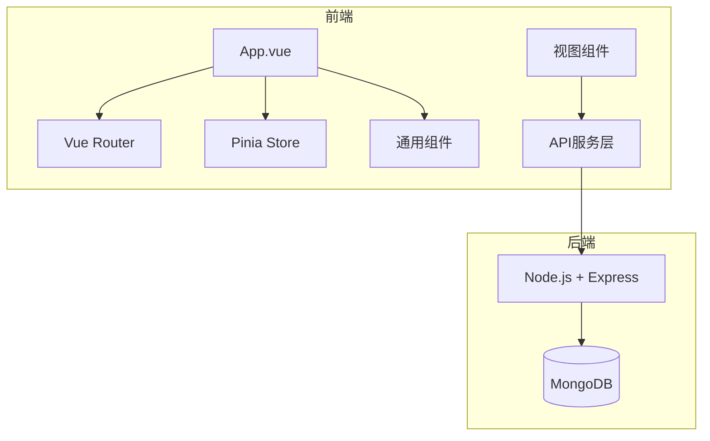
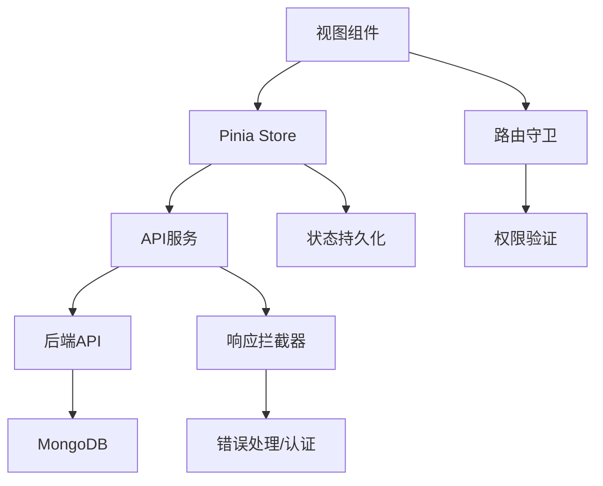
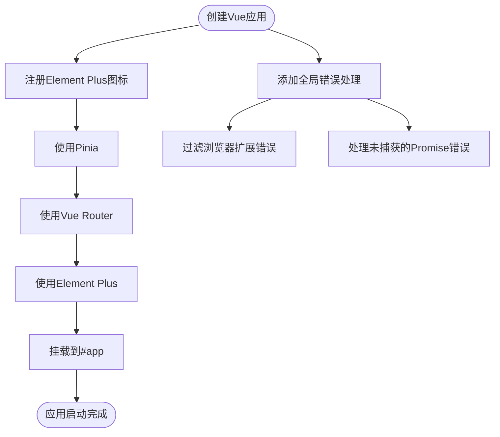
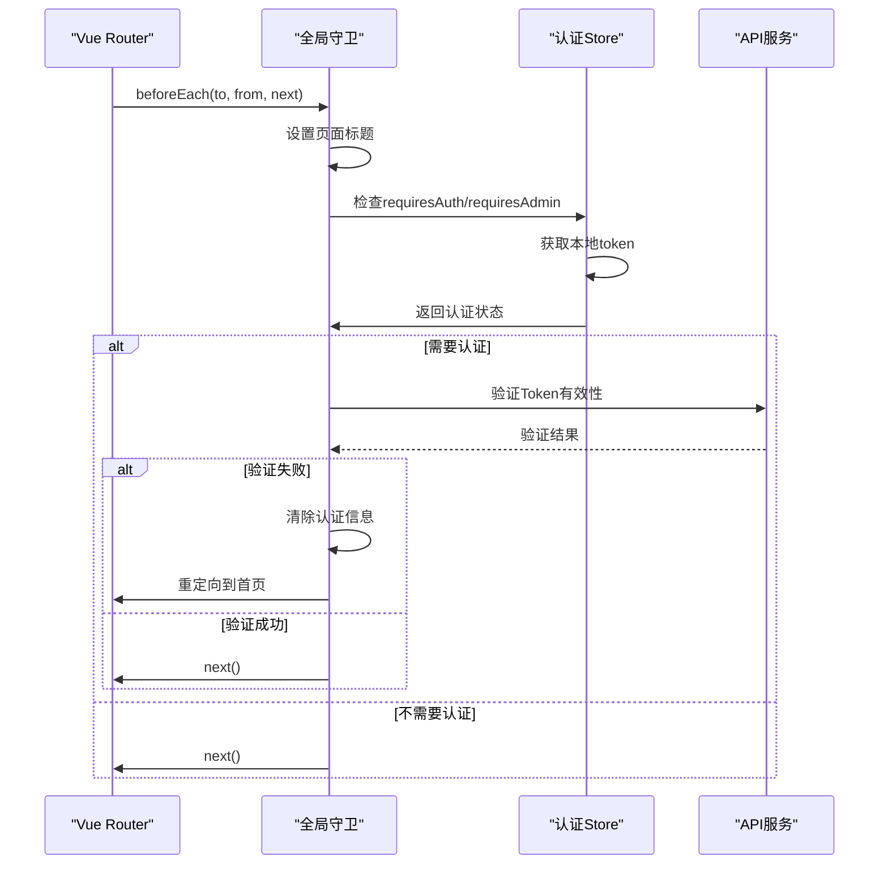
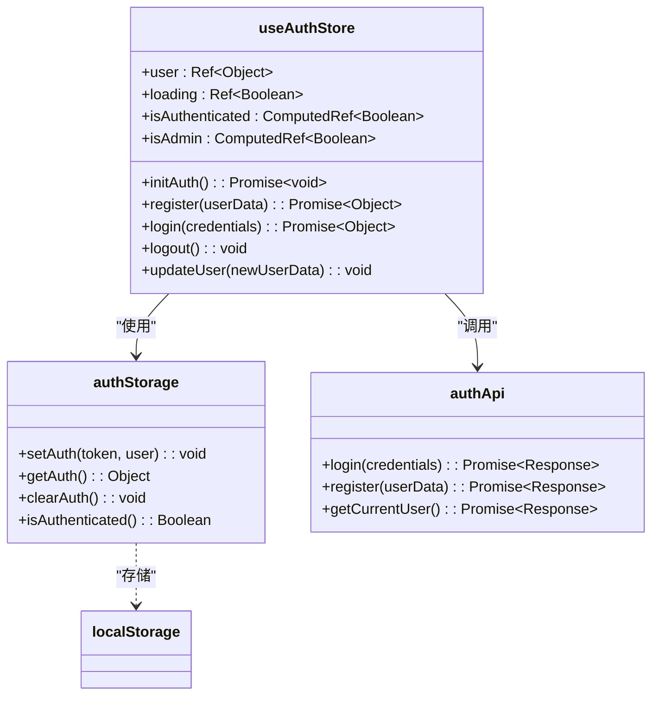
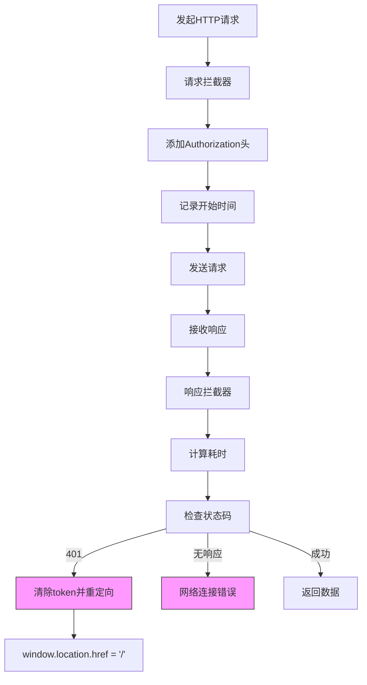
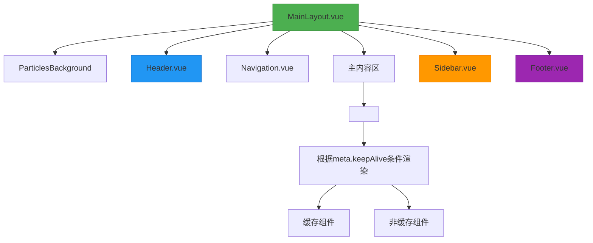
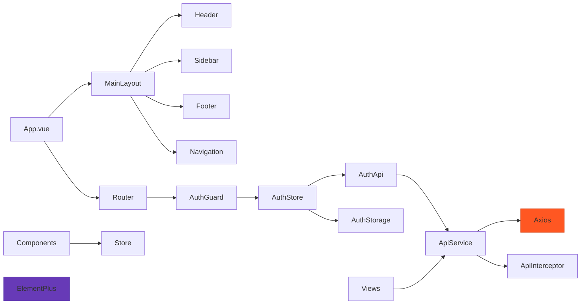

# 前端架构设计

<cite>
**本文档引用文件**  
- [main.js](file://frontend/src/main.js)
- [index.js](file://frontend/src/router/index.js)
- [api.ts](file://frontend/src/services/api.ts)
- [index.js](file://frontend/src/store/index.js)
- [auth.js](file://frontend/src/store/modules/auth.js)
- [MainLayout.vue](file://frontend/src/components/MainLayout.vue)
- [Header.vue](file://frontend/src/components/Header.vue)
- [Sidebar.vue](file://frontend/src/components/Sidebar.vue)
- [Footer.vue](file://frontend/src/components/Footer.vue)
</cite>

## 目录
1. [项目结构](#项目结构)
2. [核心组件](#核心组件)
3. [架构概览](#架构概览)
4. [详细组件分析](#详细组件分析)
5. [依赖分析](#依赖分析)
6. [性能考虑](#性能考虑)
7. [故障排除指南](#故障排除指南)
8. [结论](#结论)

## 项目结构

项目采用典型的前后端分离架构，前端位于`frontend`目录下，基于Vue 3构建。整体结构清晰，遵循功能模块化组织原则。



**图示来源**
- [main.js](file://frontend/src/main.js#L1-L47)
- [index.js](file://frontend/src/router/index.js#L1-L294)
- [api.ts](file://frontend/src/services/api.ts#L1-L236)

**本节来源**
- [main.js](file://frontend/src/main.js#L1-L47)

## 核心组件

前端系统围绕Vue 3的组合式API构建，采用Pinia进行状态管理，Vue Router实现路由控制，并通过Axios封装统一的HTTP服务调用。主要核心包括：

- **MainLayout.vue**：主布局组件，集成Header、Sidebar、Footer等通用UI
- **UserLayout.vue**：用户专属布局
- **Pinia Store**：全局状态管理，包含auth、blog等模块
- **API服务层**：统一的HTTP请求处理与拦截器管理
- **路由系统**：基于Vue Router的哈希模式路由控制

**本节来源**
- [MainLayout.vue](file://frontend/src/components/MainLayout.vue#L1-L221)
- [index.js](file://frontend/src/store/index.js#L1-L9)

## 架构概览

系统采用分层架构设计，从视图层到状态层再到服务层形成清晰的数据流。



**图示来源**
- [main.js](file://frontend/src/main.js#L1-L47)
- [index.js](file://frontend/src/router/index.js#L1-L294)
- [api.ts](file://frontend/src/services/api.ts#L1-L236)
- [auth.js](file://frontend/src/store/modules/auth.js#L1-L93)

**本节来源**
- [main.js](file://frontend/src/main.js#L1-L47)

## 详细组件分析

### 主应用入口分析

`main.js`是应用的入口文件，负责初始化Vue实例、注册Pinia状态管理、路由系统和Element Plus UI组件库。



**图示来源**
- [main.js](file://frontend/src/main.js#L1-L47)

**本节来源**
- [main.js](file://frontend/src/main.js#L1-L47)

### 路由系统分析

路由系统采用Vue Router的哈希模式，通过懒加载优化性能，并实现完整的权限控制机制。



**图示来源**
- [index.js](file://frontend/src/router/index.js#L1-L294)

**本节来源**
- [index.js](file://frontend/src/router/index.js#L1-L294)

### 状态管理分析

使用Pinia实现状态管理，`auth.js`模块负责用户认证状态的管理与持久化。



**图示来源**
- [auth.js](file://frontend/src/store/modules/auth.js#L1-L93)
- [auth.ts](file://frontend/src/api/auth.ts)

**本节来源**
- [auth.js](file://frontend/src/store/modules/auth.js#L1-L93)

### API服务层分析

`api.ts`文件封装了Axios实例，提供统一的HTTP请求处理、拦截器和错误处理机制。



**图示来源**
- [api.ts](file://frontend/src/services/api.ts#L1-L236)

**本节来源**
- [api.ts](file://frontend/src/services/api.ts#L1-L236)

### 布局组件分析

`MainLayout.vue`作为主布局组件，整合了Header、Sidebar、Footer等通用UI组件，实现响应式网格布局。



**图示来源**
- [MainLayout.vue](file://frontend/src/components/MainLayout.vue#L1-L221)

**本节来源**
- [MainLayout.vue](file://frontend/src/components/MainLayout.vue#L1-L221)

## 依赖分析

系统依赖关系清晰，各模块职责分明。



**图示来源**
- [main.js](file://frontend/src/main.js#L1-L47)
- [MainLayout.vue](file://frontend/src/components/MainLayout.vue#L1-L221)
- [index.js](file://frontend/src/router/index.js#L1-L294)
- [api.ts](file://frontend/src/services/api.ts#L1-L236)

**本节来源**
- [main.js](file://frontend/src/main.js#L1-L47)

## 性能考虑

系统在多个层面进行了性能优化：

1. **路由懒加载**：所有视图组件均采用异步导入，实现代码分割
2. **组件缓存**：使用`<keep-alive>`缓存频繁访问的页面（如首页、博客列表）
3. **错误边界**：为懒加载组件添加错误处理，防止加载失败导致白屏
4. **请求超时**：设置30秒请求超时，避免长时间等待
5. **资源预加载**：关键资源通过CDN引入，减少打包体积

```javascript
// 路由懒加载示例
const Home = () => import('../views/Home.vue').catch(err => {
  console.error('Home组件加载失败:', err)
  return import('../views/Home.vue')
})
```

**本节来源**
- [index.js](file://frontend/src/router/index.js#L1-L294)
- [api.ts](file://frontend/src/services/api.ts#L1-L236)

## 故障排除指南

### 常见问题及解决方案

**本节来源**
- [main.js](file://frontend/src/main.js#L1-L47)
- [api.ts](file://frontend/src/services/api.ts#L1-L236)
- [index.js](file://frontend/src/router/index.js#L1-L294)

#### 认证失效问题
- **现象**：用户频繁被登出
- **原因**：后端Token有效期较短或401响应处理不当
- **解决方案**：检查`api.ts`中的401拦截器逻辑，确保localStorage清理正确

#### 路由无法访问
- **现象**：页面404或白屏
- **原因**：哈希路由配置错误或懒加载失败
- **解决方案**：检查`router/index.js`的`createWebHashHistory`配置，确认组件路径正确

#### API请求失败
- **现象**：网络请求报错
- **原因**：baseURL解析错误或跨域问题
- **解决方案**：检查`api.ts`的`resolveBaseURL`函数，确认环境变量`VITE_APP_API_URL`设置正确

#### 样式不生效
- **现象**：页面样式错乱
- **原因**：CSS作用域冲突或全局样式未正确加载
- **解决方案**：检查`MainLayout.vue`中的`<style>`标签，确保全局样式正确注入

## 结论

该前端系统采用现代化的Vue 3技术栈，架构设计合理，模块划分清晰。通过Pinia实现高效的状态管理，Vue Router提供灵活的路由控制，Axios封装确保API调用的一致性和可靠性。布局组件采用响应式网格设计，支持移动端适配。整体代码结构遵循最佳实践，具备良好的可维护性和扩展性，为开发者提供了清晰的开发范式指导。