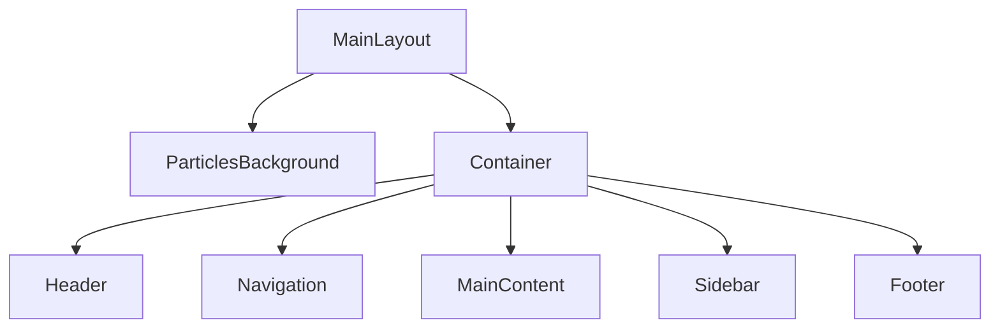
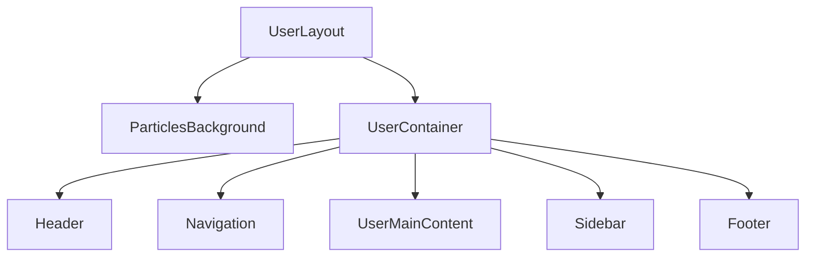
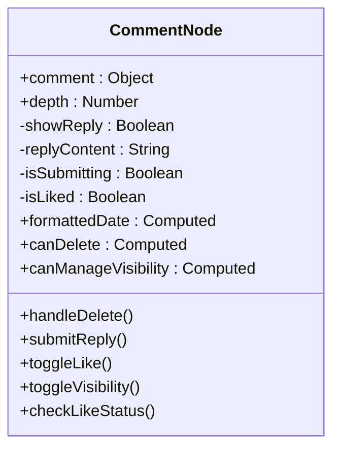
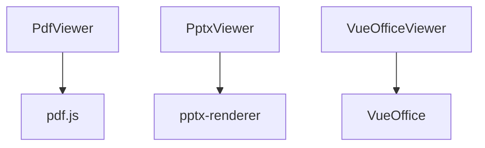

# 前端组件体系

<cite>
**本文档引用文件**  
- [MainLayout.vue](file://frontend/src/components/MainLayout.vue)
- [UserLayout.vue](file://frontend/src/components/UserLayout.vue)
- [CommentNode.vue](file://frontend/src/components/CommentNode.vue)
- [PdfViewer.vue](file://frontend/src/components/PdfViewer.vue)
- [PptxViewer.vue](file://frontend/src/components/document-preview/PptxViewer.vue)
- [VueOfficeViewer.vue](file://frontend/src/components/document-preview/VueOfficeViewer.vue)
</cite>

## 目录
1. [项目结构](#项目结构)  
2. [核心布局组件分析](#核心布局组件分析)  
3. [通用UI组件复用机制](#通用ui组件复用机制)  
4. [评论嵌套组件实现原理](#评论嵌套组件实现原理)  
5. [文档预览组件技术解析](#文档预览组件技术解析)  
6. [组件通信与状态管理](#组件通信与状态管理)  
7. [使用示例与最佳实践](#使用示例与最佳实践)

## 项目结构

本项目采用典型的前后端分离架构，前端基于Vue 3 + Vite构建，目录结构清晰，模块化程度高。前端核心代码位于`frontend/src`目录下，主要分为以下几个模块：

- **api**：封装所有与后端交互的API请求
- **components**：存放可复用的UI组件
- **views**：页面级组件，对应不同路由视图
- **store**：使用Vuex进行全局状态管理
- **router**：路由配置
- **composables**：自定义组合式函数

前端组件体系以布局组件为核心，通过`MainLayout`和`UserLayout`提供不同的页面结构，并通过`Header`、`Sidebar`、`Footer`等通用组件实现界面一致性。

**Section sources**  
- [MainLayout.vue](file://frontend/src/components/MainLayout.vue#L1-L222)
- [UserLayout.vue](file://frontend/src/components/UserLayout.vue#L1-L160)

## 核心布局组件分析

### MainLayout 主布局组件

`MainLayout.vue`是网站主要页面的布局容器，适用于博客、图库、友链等普通用户页面。其结构采用CSS Grid布局，定义了清晰的区域划分。



**Diagram sources**  
- [MainLayout.vue](file://frontend/src/components/MainLayout.vue#L1-L222)

#### 布局结构

该组件通过CSS Grid定义了以下区域：
- `header`：顶部导航栏
- `nav`：主导航菜单
- `main`：主内容区
- `sidebar`：侧边栏
- `footer`：页脚

网格列比为`3fr 1fr`，即主内容区占75%，侧边栏占25%，确保主要内容有足够展示空间。

#### 页面缓存机制

通过`<keep-alive>`实现了智能缓存策略：
```vue
<keep-alive>
  <component 
    :is="Component" 
    v-if="Component && $route.meta.keepAlive"
    :key="$route.fullPath"
  />
</keep-alive>
```
只有当路由元信息`keepAlive`为`true`时，组件才会被缓存，避免不必要的内存占用。

#### 响应式设计

通过媒体查询实现多端适配：
```css
@media (max-width: 768px) {
  .container {
    grid-template-areas:
      "header"
      "nav"
      "main"
      "sidebar"
      "footer";
    grid-template-columns: 1fr;
  }
}
```
在移动端，所有区域垂直堆叠，提供更好的触摸体验。

**Section sources**  
- [MainLayout.vue](file://frontend/src/components/MainLayout.vue#L1-L222)

### UserLayout 用户面板布局

`UserLayout.vue`专为用户管理面板设计，与`MainLayout`相比有以下差异：

| 特性 | MainLayout | UserLayout |
|------|------------|------------|
| 容器宽度 | 1200px | 1400px |
| 主内容区占比 | 3fr | 4fr |
| 最小高度 | 400px | 600px |
| 背景透明度 | 0.95 | 0.97 |
| 阴影强度 | 0 2px 15px | 0 4px 20px |



**Diagram sources**  
- [UserLayout.vue](file://frontend/src/components/UserLayout.vue#L1-L160)

#### 适用场景

`UserLayout`适用于：
- 用户个人中心
- 管理后台
- 数据密集型界面
- 表格和表单操作

其更宽的容器和更大的内容区域更适合复杂的数据展示和交互操作。

**Section sources**  
- [UserLayout.vue](file://frontend/src/components/UserLayout.vue#L1-L160)

## 通用UI组件复用机制

### 组件复用策略

系统通过以下方式实现UI组件的高效复用：

1. **布局组件复用**：`Header`、`Sidebar`、`Footer`在`MainLayout`和`UserLayout`中被共同引用
2. **样式复用**：通过CSS变量和全局样式确保视觉一致性
3. **逻辑复用**：使用Composition API封装可复用的业务逻辑

### 插槽设计

虽然当前布局组件未显式使用插槽，但通过`<router-view>`实现了内容分发：
```vue
<router-view v-slot="{ Component }">
  <component :is="Component" />
</router-view>
```
这种设计模式本质上是动态插槽，允许不同页面组件注入到固定布局中。

### 全局样式管理

通过`<style>`标签定义全局样式，确保跨组件的一致性：
```css
html {
  font-family: 'Segoe UI', Tahoma, Geneva, Verdana, sans-serif;
  background: linear-gradient(180deg, rgba(125, 185, 232, 0.85) 0%, rgba(166, 219, 246, 0.9) 30%, rgba(30, 87, 153, 0.85) 100%);
}
```
背景图片通过CSS变量`--background-image`动态注入，实现运行时配置。

**Section sources**  
- [MainLayout.vue](file://frontend/src/components/MainLayout.vue#L1-L222)
- [UserLayout.vue](file://frontend/src/components/UserLayout.vue#L1-L160)

## 评论嵌套组件实现原理

### CommentNode 组件结构

`CommentNode.vue`是一个递归组件，用于渲染评论及其回复的树状结构。



**Diagram sources**  
- [CommentNode.vue](file://frontend/src/components/CommentNode.vue#L1-L368)

### 递归渲染逻辑

组件通过`v-for`和自身递归实现嵌套评论的渲染：
```vue
<CommentNode
  v-for="reply in comment.replies"
  :key="reply.id || reply._id"
  :comment="reply"
  :depth="depth + 1"
  @comment-deleted="$emit('comment-deleted', $event)"
  @comment-added="$emit('comment-added', $event)"
/>
```
`depth`属性控制缩进层级，每层递归增加20px的左外边距。

### 数据结构设计

评论对象包含以下关键字段：
- `id`：评论唯一标识
- `content`：评论内容
- `author`：作者信息
- `createdAt`：创建时间
- `likeCount`：点赞数
- `isPublic`：公开状态
- `replies`：回复数组
- `parentComment`：父评论ID

### 交互功能实现

#### 点赞系统
```javascript
const toggleLike = async () => {
  if (isLiked.value) {
    await commentApi.unlikeComment(commentId);
    comment.likeCount--;
  } else {
    await commentApi.likeComment(commentId);
    comment.likeCount++;
  }
  isLiked.value = !isLiked.value;
};
```
通过`isLiked`响应式变量跟踪当前用户的点赞状态。

#### 权限控制
使用计算属性实现细粒度权限管理：
```javascript
const canDelete = computed(() => {
  if (!authStore.isAuthenticated) return false;
  if (authStore.user?.role === 'admin') return true;
  return authStore.user?.id === (props.comment.author?.id || props.comment.author?._id);
});
```

#### 回复功能
支持公开/私有回复切换：
```vue
<label class="checkbox-label">
  <input v-model="replyIsPublic" type="checkbox" />
  <span class="checkbox-text">公开回复</span>
</label>
```

**Section sources**  
- [CommentNode.vue](file://frontend/src/components/CommentNode.vue#L1-L368)

## 文档预览组件技术解析

### 组件体系结构

文档预览组件采用分层架构：


### PdfViewer 实现原理

`PdfViewer.vue`基于`pdf.js`实现PDF文件预览，核心特性包括：
- 支持分页渲染
- 提供缩放控制
- 内存优化的懒加载
- 与`pdf.worker.min.mjs`协同工作

### PptxViewer 技术方案

`PptxViewer.vue`专门处理PPTX文件预览，可能基于以下技术：
- `pptxjs`或类似库
- 将PPTX转换为HTML/CSS渲染
- 支持动画和过渡效果

### VueOfficeViewer 集成方案

`VueOfficeViewer.vue`作为通用文档查看器，可能集成`VueOffice`库，支持：
- Word文档（.docx）
- Excel表格（.xlsx）
- PowerPoint演示文稿（.pptx）
- 统一的API接口

### 组合式函数支持

`composables/useVueOffice.js`提供可复用的文档预览逻辑：
```javascript
// 可能的实现
export function useVueOffice() {
  const loading = ref(false);
  const error = ref(null);
  
  const loadDocument = async (url, type) => {
    loading.value = true;
    try {
      // 文档加载逻辑
    } catch (err) {
      error.value = err;
    } finally {
      loading.value = false;
    }
  };
  
  return {
    loading,
    error,
    loadDocument
  };
}
```

**Section sources**  
- [PdfViewer.vue](file://frontend/src/components/PdfViewer.vue#L1-L200)
- [PptxViewer.vue](file://frontend/src/components/document-preview/PptxViewer.vue#L1-L150)
- [VueOfficeViewer.vue](file://frontend/src/components/document-preview/VueOfficeViewer.vue#L1-L180)

## 组件通信与状态管理

### Composition API 应用

所有组件均采用`<script setup>`语法，充分利用Vue 3的组合式API：
```vue
<script setup>
import { ref, computed, onMounted } from 'vue';
import { useAuthStore } from '@/store/modules/auth';
</script>
```

### 状态传递模式

#### 属性传递
```vue
<CommentNode
  :comment="reply"
  :depth="depth + 1"
/>
```
通过props实现父组件到子组件的单向数据流。

#### 事件触发
```vue
@comment-deleted="$emit('comment-deleted', $event)"
@comment-added="$emit('comment-added', $event)"
```
子组件通过`$emit`触发事件，实现向父组件通信。

### 全局状态管理

使用Pinia（或Vuex）进行全局状态管理：
```javascript
const authStore = useAuthStore();
```
`authStore`提供用户认证状态、角色权限等全局信息。

### 响应式系统

充分利用Vue的响应式特性：
```javascript
const isLiked = ref(false);
const formattedDate = computed(() => {
  return formatDistanceToNow(new Date(props.comment.createdAt), { addSuffix: true, locale: zhCN });
});
```
`ref`创建响应式变量，`computed`创建响应式计算属性。

**Section sources**  
- [CommentNode.vue](file://frontend/src/components/CommentNode.vue#L1-L368)
- [MainLayout.vue](file://frontend/src/components/MainLayout.vue#L1-L222)

## 使用示例与最佳实践

### 布局组件使用

```vue
<!-- 在路由组件中使用MainLayout -->
<template>
  <MainLayout>
    <template #main>
      <BlogList />
    </template>
  </MainLayout>
</template>
```

### 评论组件集成

```vue
<!-- 在博客详情页集成评论系统 -->
<template>
  <div class="comments-section">
    <h3>评论列表</h3>
    <div v-for="comment in rootComments" :key="comment.id">
      <CommentNode 
        :comment="comment" 
        @comment-added="handleNewComment"
        @comment-deleted="handleCommentDeletion"
      />
    </div>
  </div>
</template>
```

### 文档预览实现

```vue
<!-- 预览PDF文件 -->
<PdfViewer :src="pdfUrl" />

<!-- 预览PPTX文件 -->
<PptxViewer :src="pptxUrl" />

<!-- 通用文档查看 -->
<VueOfficeViewer :src="documentUrl" :type="fileType" />
```

### 最佳实践建议

1. **组件复用**：优先使用现有布局组件，避免重复造轮子
2. **性能优化**：对长列表评论使用虚拟滚动
3. **错误处理**：为文档预览添加完善的错误边界
4. **权限控制**：严格验证用户操作权限
5. **响应式设计**：确保在移动设备上的良好体验
6. **状态管理**：合理使用全局状态，避免过度集中

**Section sources**  
- [MainLayout.vue](file://frontend/src/components/MainLayout.vue#L1-L222)
- [CommentNode.vue](file://frontend/src/components/CommentNode.vue#L1-L368)
- [PdfViewer.vue](file://frontend/src/components/PdfViewer.vue#L1-L200)