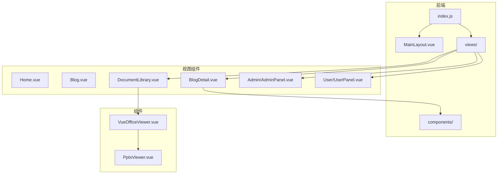
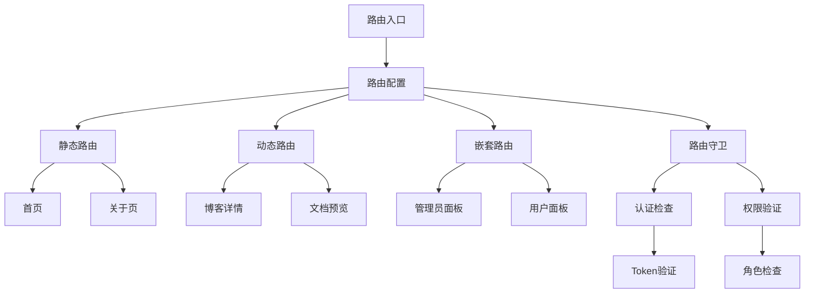
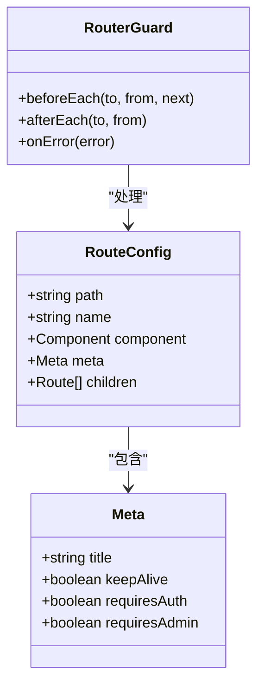
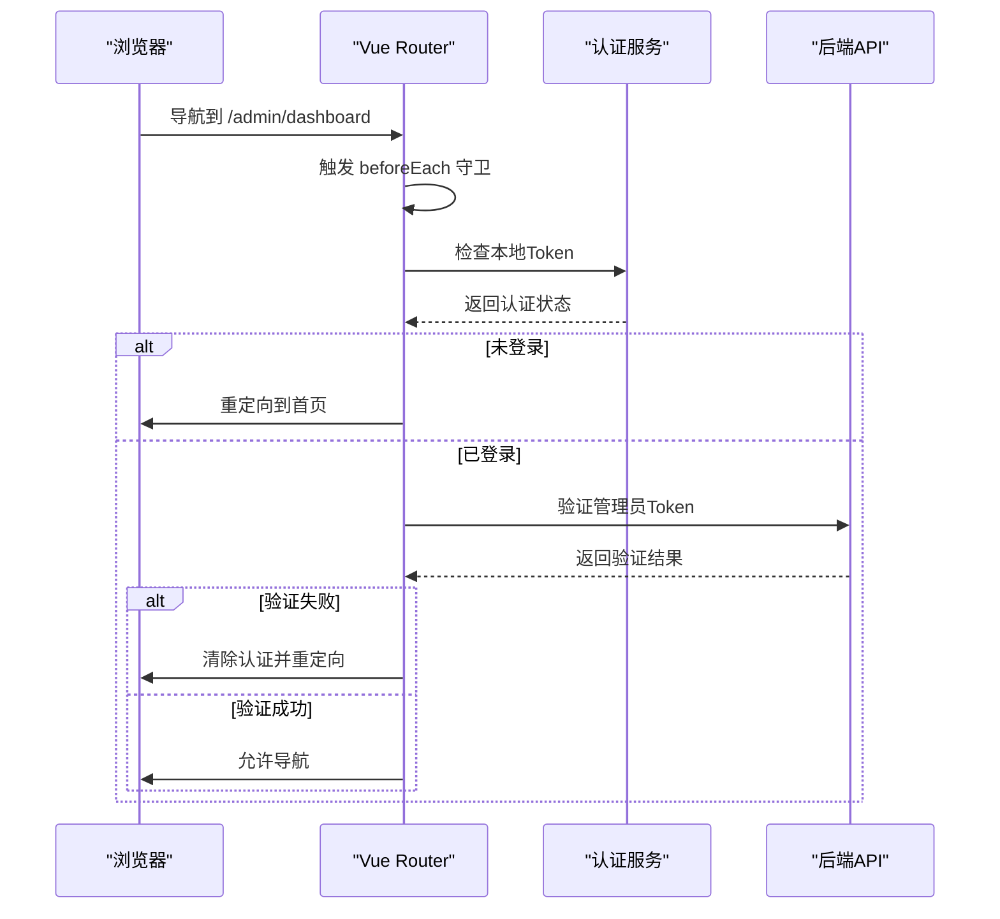
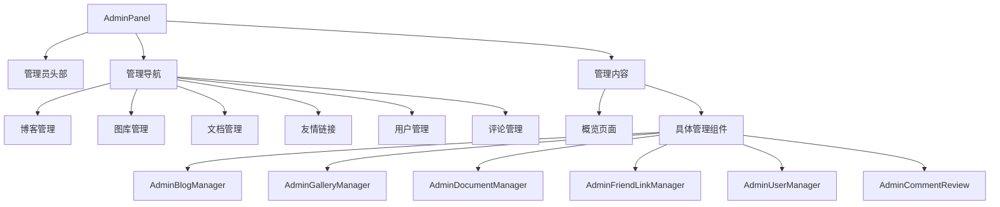
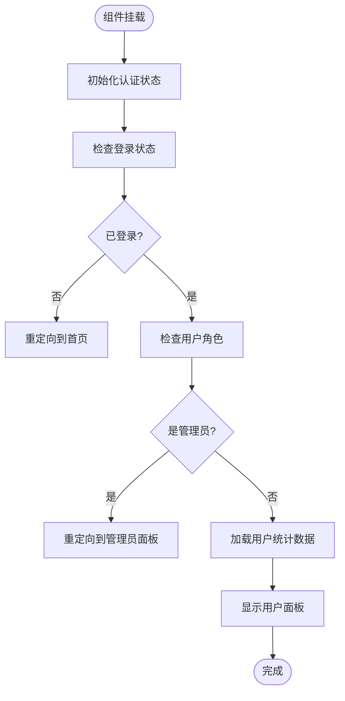
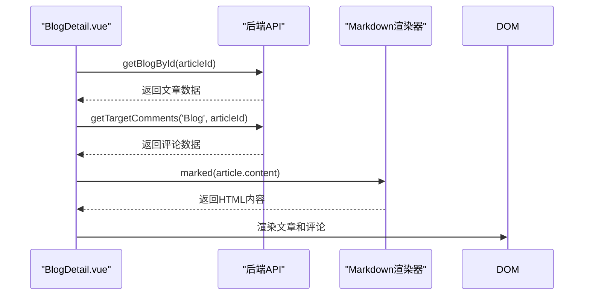
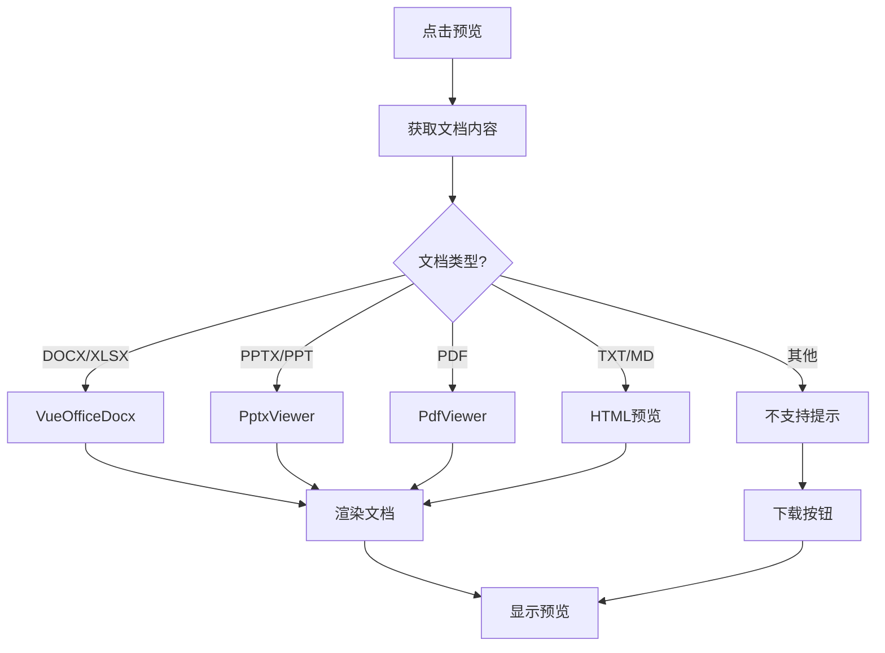
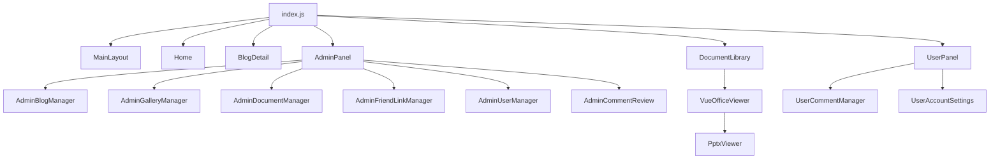

# 前端路由配置

<cite>
**本文档引用的文件**   
- [index.js](file://frontend/src/router/index.js)
- [AdminPanel.vue](file://frontend/src/views/Admin/AdminPanel.vue)
- [UserPanel.vue](file://frontend/src/views/User/UserPanel.vue)
- [BlogDetail.vue](file://frontend/src/views/BlogDetail.vue)
- [DocumentLibrary.vue](file://frontend/src/views/DocumentLibrary.vue)
- [VueOfficeViewer.vue](file://frontend/src/components/document-preview/VueOfficeViewer.vue)
- [PptxViewer.vue](file://frontend/src/components/document-preview/PptxViewer.vue)
</cite>

## 目录
1. [项目结构](#项目结构)
2. [核心组件](#核心组件)
3. [架构概述](#架构概述)
4. [详细组件分析](#详细组件分析)
5. [依赖分析](#依赖分析)
6. [性能考虑](#性能考虑)
7. [故障排除指南](#故障排除指南)
8. [结论](#结论)

## 项目结构
本项目采用典型的Vue.js前端架构，分为`assets`、`backend`和`frontend`三大目录。前端部分位于`frontend`目录下，遵循Vue 3 + Vite的现代前端工程化结构。`src`目录包含核心源码，其中`router`子目录存放路由配置，`views`目录存放视图组件，`components`目录存放可复用组件。

**图示来源**
- [index.js](file://frontend/src/router/index.js)
- [AdminPanel.vue](file://frontend/src/views/Admin/AdminPanel.vue)
- [UserPanel.vue](file://frontend/src/views/User/UserPanel.vue)

**本节来源**
- [index.js](file://frontend/src/router/index.js)

## 核心组件
前端路由系统是整个应用的导航中枢，负责管理页面间的跳转与状态。核心组件包括路由配置文件`index.js`、主布局组件`MainLayout.vue`以及各个功能视图组件。路由系统采用Vue Router 4，通过`createWebHashHistory`创建基于hash的路由模式，确保在无服务器环境下的兼容性。

路由配置中定义了静态路由与动态路由两种模式。静态路由如首页、关于页等，直接映射到具体组件；动态路由如博客详情页`/blog/:id`，通过路径参数实现内容动态加载。此外，系统还配置了通配符路由`/:pathMatch(.*)*`用于处理404页面。

**本节来源**
- [index.js](file://frontend/src/router/index.js)

## 架构概述
整个前端路由系统采用模块化设计，通过懒加载机制优化性能。路由配置文件`index.js`集中管理所有路由规则，每个路由项包含路径、组件、名称和元数据等属性。元数据中定义了页面标题、是否需要认证、是否需要管理员权限等信息，为路由守卫提供决策依据。

**图示来源**
- [index.js](file://frontend/src/router/index.js)

## 详细组件分析

### 路由配置分析
路由配置文件`index.js`采用函数式组件导入方式实现懒加载，将不同功能模块的代码分割成独立的chunk，有效减少首屏加载时间。每个组件导入都包裹在`catch`块中，提供错误处理机制，当组件加载失败时尝试重新加载。

#### 路由配置结构

**图示来源**
- [index.js](file://frontend/src/router/index.js#L1-L295)

#### 路由守卫流程

**图示来源**
- [index.js](file://frontend/src/router/index.js#L200-L280)

**本节来源**
- [index.js](file://frontend/src/router/index.js#L1-L295)

### 管理员面板分析
管理员面板`AdminPanel.vue`是系统的核心管理界面，通过路由`/admin/dashboard`访问。该组件采用选项卡式导航，集成博客管理、图库管理、文档管理、友情链接、用户管理和评论管理等多个功能模块。

#### 管理员面板架构

**图示来源**
- [AdminPanel.vue](file://frontend/src/views/Admin/AdminPanel.vue)

**本节来源**
- [AdminPanel.vue](file://frontend/src/views/Admin/AdminPanel.vue)

### 用户面板分析
用户面板`UserPanel.vue`为普通用户提供个人管理功能，通过路由`/user/panel`访问。该组件包含"我的评论"和"账户设置"两个主要功能模块，界面设计简洁，专注于用户个人内容管理。

#### 用户面板流程

**图示来源**
- [UserPanel.vue](file://frontend/src/views/User/UserPanel.vue)

**本节来源**
- [UserPanel.vue](file://frontend/src/views/User/UserPanel.vue)

### 博客详情页分析
博客详情页`BlogDetail.vue`负责展示单篇博客文章的完整内容，支持Markdown格式渲染、评论系统和点赞功能。该组件通过动态路由`/blog/:id`接收文章ID参数，从后端API获取文章数据。

#### 博客详情页数据流

**图示来源**
- [BlogDetail.vue](file://frontend/src/views/BlogDetail.vue)

**本节来源**
- [BlogDetail.vue](file://frontend/src/views/BlogDetail.vue)

### 文档库分析
文档库`DocumentLibrary.vue`提供文档的分类浏览、搜索和在线预览功能。支持多种文档格式的预览，包括PDF、DOCX、PPTX等，通过`VueOfficeViewer`组件实现跨格式预览。

#### 文档预览流程

**图示来源**
- [DocumentLibrary.vue](file://frontend/src/views/DocumentLibrary.vue)
- [VueOfficeViewer.vue](file://frontend/src/components/document-preview/VueOfficeViewer.vue)
- [PptxViewer.vue](file://frontend/src/components/document-preview/PptxViewer.vue)

**本节来源**
- [DocumentLibrary.vue](file://frontend/src/views/DocumentLibrary.vue#L1-L1639)

## 依赖分析
前端路由系统与其他组件存在紧密的依赖关系。`index.js`依赖于所有视图组件，通过动态导入实现代码分割。`AdminPanel.vue`和`UserPanel.vue`依赖于认证服务和API客户端，用于权限验证和数据获取。`DocumentLibrary.vue`依赖于`VueOfficeViewer.vue`和`PptxViewer.vue`等预览组件，形成组件层级依赖。

**图示来源**
- [index.js](file://frontend/src/router/index.js)
- [AdminPanel.vue](file://frontend/src/views/Admin/AdminPanel.vue)
- [DocumentLibrary.vue](file://frontend/src/views/DocumentLibrary.vue)

**本节来源**
- [index.js](file://frontend/src/router/index.js)
- [AdminPanel.vue](file://frontend/src/views/Admin/AdminPanel.vue)

## 性能考虑
路由系统通过多种机制优化性能。首先，采用组件懒加载，将不同功能模块的代码分割成独立的chunk，减少初始加载体积。其次，配置`keepAlive`元数据，对首页、博客列表等高频访问页面进行缓存，避免重复渲染。再者，路由守卫中添加超时处理，防止API请求长时间阻塞导航。

路由错误处理机制也提升了用户体验，当组件加载失败时尝试重新加载，并在控制台输出错误信息。滚动行为配置确保页面切换时滚动到顶部，符合用户预期。这些优化措施共同提升了应用的响应速度和用户体验。

## 故障排除指南
常见路由相关问题及解决方案：

1. **组件加载失败**：检查网络连接，确认组件路径正确，查看控制台错误信息。
2. **权限验证失败**：检查Token是否过期，确认用户角色是否正确，验证API服务是否正常。
3. **动态路由参数丢失**：确保路由路径与参数匹配，检查`route.params`的使用方式。
4. **页面标题未更新**：确认路由元数据中`title`字段正确配置，检查`document.title`设置逻辑。
5. **预览功能异常**：检查文档格式支持情况，确认Blob数据正确加载，验证预览组件依赖。

**本节来源**
- [index.js](file://frontend/src/router/index.js#L285-L290)
- [DocumentLibrary.vue](file://frontend/src/views/DocumentLibrary.vue#L100-L150)

## 结论
本前端路由系统设计合理，功能完整，通过静态路由与动态路由的结合满足了不同页面的导航需求。路由懒加载机制有效优化了性能，路由守卫实现了细粒度的权限控制。管理员面板和用户面板的权限分离设计保障了系统的安全性。文档库的多格式预览功能提升了用户体验。整体架构清晰，组件职责明确，为系统的可维护性和可扩展性奠定了良好基础。