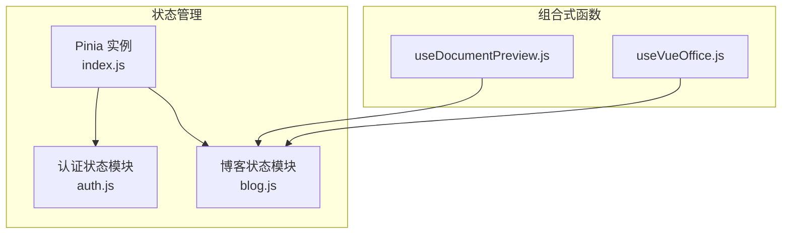
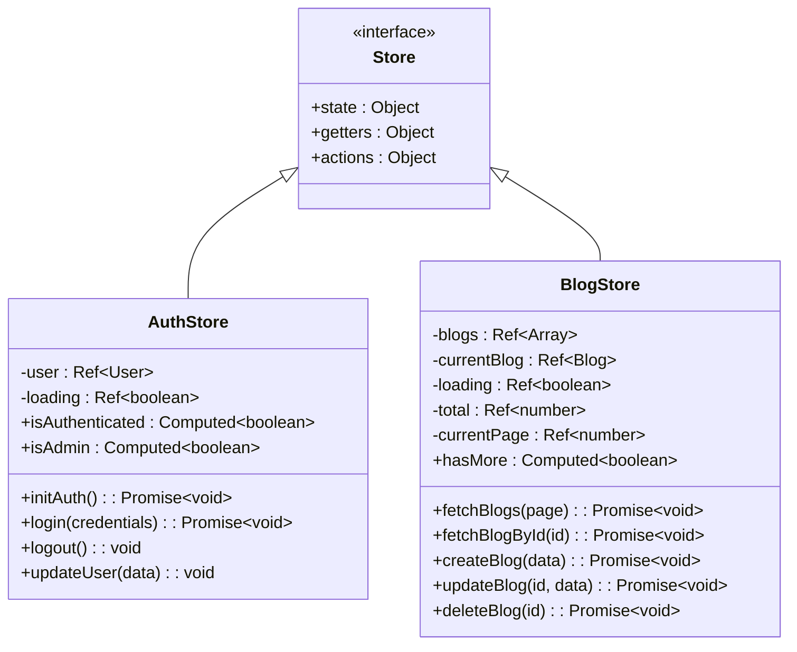
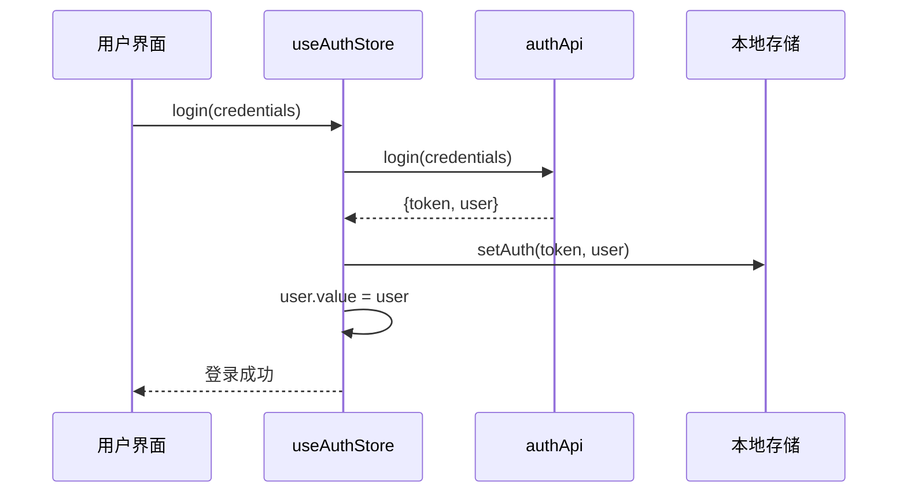
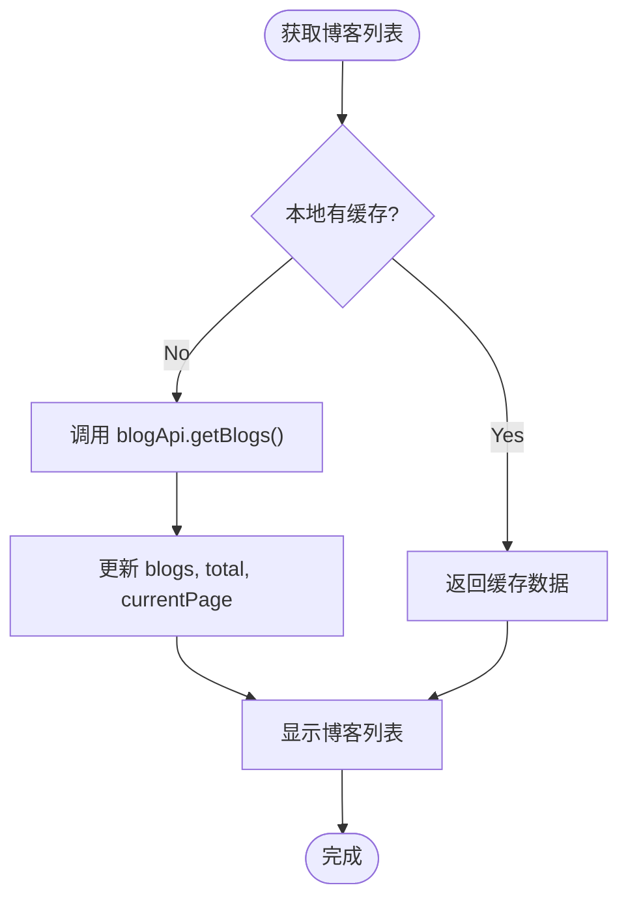

# 状态管理机制

<cite>
**本文档引用的文件**  
- [index.js](file://frontend/src/store/index.js)
- [auth.js](file://frontend/src/store/modules/auth.js)
- [blog.js](file://frontend/src/store/modules/blog.js)
- [useDocumentPreview.js](file://frontend/src/composables/useDocumentPreview.js)
- [useVueOffice.js](file://frontend/src/composables/useVueOffice.js)
</cite>

## 目录
1. [项目结构](#项目结构)  
2. [核心组件分析](#核心组件分析)  
3. [状态管理架构概述](#状态管理架构概述)  
4. [详细组件分析](#详细组件分析)  
5. [自定义组合式函数与状态协同](#自定义组合式函数与状态协同)  
6. [状态使用实践范例](#状态使用实践范例)  
7. [最佳实践：持久化、错误处理与调试](#最佳实践持久化错误处理与调试)

## 项目结构

项目采用典型的前后端分离架构，前端位于 `frontend` 目录下，使用 Vue 3 + Pinia 构建。状态管理相关代码集中于 `frontend/src/store` 目录，采用模块化设计：

- `store/index.js`：Pinia 实例的创建与导出，为全局状态管理提供入口。
- `store/modules/auth.js`：用户认证状态模块，管理用户登录态、角色权限等。
- `store/modules/blog.js`：博客数据状态模块，负责博客列表、详情、分页等数据的缓存与同步。
- `composables/`：存放可复用的组合式函数，如文档预览逻辑。

该结构清晰分离关注点，便于维护和扩展。



**图示来源**  
- [index.js](file://frontend/src/store/index.js)
- [auth.js](file://frontend/src/store/modules/auth.js)
- [blog.js](file://frontend/src/store/modules/blog.js)
- [useDocumentPreview.js](file://frontend/src/composables/useDocumentPreview.js)
- [useVueOffice.js](file://frontend/src/composables/useVueOffice.js)

## 核心组件分析

本节深入分析 `store/index.js` 中 Pinia 全局实例的初始化过程，以及 `auth.js` 和 `blog.js` 两个核心模块的设计思路。

### Pinia 全局实例初始化

`store/index.js` 是整个应用状态管理的起点。它通过 `createPinia()` 创建一个全局唯一的 Pinia 实例，并将其导出供 `main.js` 挂载到 Vue 应用实例上。

```javascript
import { createPinia } from 'pinia'

const pinia = createPinia()

export default pinia
```

此实例作为所有 store 模块的容器，确保状态在组件间共享且响应式更新。其初始化简单而关键，为后续模块化 store 提供了基础。

**本节来源**  
- [index.js](file://frontend/src/store/index.js#L1-L9)

## 状态管理架构概述

系统采用 Pinia 作为状态管理库，遵循模块化设计原则。每个 store 模块（如 `auth` 和 `blog`）都是一个独立的单元，封装了自身的状态（state）、计算属性（getters）、动作（actions）和方法（mutations 的替代）。

- **状态（State）**：使用 `ref` 定义响应式数据，如用户信息、博客列表。
- **计算属性（Computed）**：基于状态派生出的值，如 `isAuthenticated`（是否已认证）、`hasMore`（是否有更多博客）。
- **动作（Actions）**：包含业务逻辑的方法，通常用于处理异步操作（如 API 调用），并更新状态。

这种架构使得状态逻辑集中、可预测，且易于测试和调试。



**图示来源**  
- [auth.js](file://frontend/src/store/modules/auth.js#L10-L93)
- [blog.js](file://frontend/src/store/modules/blog.js#L10-L158)

## 详细组件分析

### 认证状态模块 (auth.js)

`useAuthStore` 模块负责管理用户认证相关的所有状态和逻辑。

#### 状态与计算属性
- `user`: 存储当前登录用户的信息（如用户名、角色）。
- `loading`: 表示认证初始化过程中的加载状态。
- `isAuthenticated`: 计算属性，通过检查 `user` 是否存在来判断用户是否已登录。
- `isAdmin`: 计算属性，通过检查 `user.role` 是否为 `'admin'` 来判断用户是否为管理员。

#### 核心方法
- `initAuth()`: 应用启动时调用，检查本地存储中是否存在有效 token，若有则自动恢复用户登录状态。
- `login(credentials)`: 处理用户登录，调用 API 验证凭据，成功后将 token 和用户信息存入本地存储并更新 `user` 状态。
- `logout()`: 清除本地存储中的认证信息，并将 `user` 状态重置为 `null`。
- `register(userData)`: 处理用户注册流程。
- `updateUser(newUserData)`: 更新用户信息，并同步到本地存储。

该模块实现了完整的认证生命周期管理，并通过本地存储实现了状态持久化。



**图示来源**  
- [auth.js](file://frontend/src/store/modules/auth.js#L50-L75)

**本节来源**  
- [auth.js](file://frontend/src/store/modules/auth.js#L1-L93)

### 博客状态模块 (blog.js)

`useBlogStore` 模块专注于博客数据的获取、缓存和管理。

#### 状态与计算属性
- `blogs`: 存储当前页的博客列表，作为缓存。
- `currentBlog`: 存储当前查看的博客详情。
- `loading`: 表示数据请求过程中的加载状态。
- `total`: 记录博客总数，用于分页。
- `currentPage` 和 `pageSize`: 管理分页参数。
- `hasMore`: 计算属性，判断当前列表长度是否小于总数，用于“加载更多”功能。

#### 核心方法
- `fetchBlogs(page)`: 根据页码从 API 获取博客列表，更新 `blogs`、`total` 和 `currentPage`。
- `fetchBlogById(id)`: 根据 ID 获取单篇博客详情，更新 `currentBlog`。
- `createBlog(blogData)`: 创建新博客，成功后将其添加到 `blogs` 列表开头，并增加 `total`。
- `updateBlog(id, blogData)`: 更新博客，同时更新 `blogs` 列表中对应项和 `currentBlog`（如果匹配）。
- `deleteBlog(id)`: 删除博客，从 `blogs` 列表中移除，并减少 `total`，若删除的是当前博客则清空 `currentBlog`。
- `clearCurrentBlog()`: 清除当前博客详情。

该模块有效地减少了对后端 API 的重复请求，提升了用户体验。



**图示来源**  
- [blog.js](file://frontend/src/store/modules/blog.js#L30-L50)

**本节来源**  
- [blog.js](file://frontend/src/store/modules/blog.js#L1-L158)

## 自定义组合式函数与状态协同

`composables/` 目录下的函数封装了特定业务逻辑，并与 Pinia 状态协同工作。

### useDocumentPreview.js

该函数可能用于处理文档预览相关的逻辑，例如：
- 监听 `currentBlog` 的变化，当用户选择一篇包含文档的博客时，自动加载并预览文档。
- 调用 `useVueOffice` 等工具进行渲染。
- 管理预览状态（如加载中、错误）。

它通过 `useBlogStore()` 获取 `currentBlog` 状态，实现了对状态变化的响应式监听。

### useVueOffice.js

该函数封装了 `VueOffice` 库的使用，用于预览 Office 文档（如 .docx, .pptx）和 PDF。
- 接收文档 URL 或文件流作为输入。
- 处理加载、渲染、错误等状态。
- 可能与 `useBlogStore` 结合，从博客数据中提取文档链接。

这些组合式函数将复杂的业务逻辑从组件中抽离，提高了代码的复用性和可维护性。

**本节来源**  
- [useDocumentPreview.js](file://frontend/src/composables/useDocumentPreview.js)
- [useVueOffice.js](file://frontend/src/composables/useVueOffice.js)

## 状态使用实践范例

以下是在组件中使用 Pinia 状态的典型范例：

### 访问状态和计算属性
```javascript
import { useAuthStore } from '@/store/modules/auth'

export default {
  setup() {
    const authStore = useAuthStore()
    
    // 直接访问状态
    console.log(authStore.user)
    
    // 访问计算属性
    if (authStore.isAuthenticated) {
      console.log('用户已登录')
    }
    
    if (authStore.isAdmin) {
      console.log('用户是管理员')
    }
    
    return { authStore }
  }
}
```

### 调用 Actions
```javascript
import { useAuthStore } from '@/store/modules/auth'

export default {
  methods: {
    async handleLogin(credentials) {
      const authStore = useAuthStore()
      try {
        await authStore.login(credentials)
        // 登录成功后的逻辑
      } catch (error) {
        // 处理登录失败
      }
    },
    
    handleLogout() {
      const authStore = useAuthStore()
      authStore.logout() // 同步操作，无需 await
    }
  }
}
```

### 在模板中使用
```vue
<template>
  <div>
    <!-- 根据登录状态显示不同内容 -->
    <div v-if="authStore.isAuthenticated">
      <p>欢迎, {{ authStore.user.name }}!</p>
      <button @click="handleLogout">登出</button>
    </div>
    <div v-else>
      <button @click="showLoginModal">登录</button>
    </div>

    <!-- 管理员专属功能 -->
    <div v-if="authStore.isAdmin">
      <admin-panel />
    </div>
  </div>
</template>
```

## 最佳实践持久化错误处理与调试

### 状态持久化
`auth.js` 模块通过 `authStorage` 对象（可能基于 `localStorage` 或 `sessionStorage`）实现了用户登录状态的持久化。`setAuth()` 和 `clearAuth()` 方法确保了 token 和用户信息在页面刷新后依然有效。

### 错误处理
所有异步 action（如 `login`, `fetchBlogs`）都使用了 `try-catch` 块捕获 API 调用错误，并通过 `console.error` 输出日志。`finally` 块确保无论成功或失败，`loading` 状态都能被正确重置，防止界面卡在加载状态。

### 调试工具集成
Pinia 天然支持 Vue Devtools。开发者可以在浏览器的 Devtools 中查看所有 store 的状态、提交（actions 调用）历史，甚至可以时间旅行调试，极大地提升了开发和调试效率。只需确保在开发环境下正确安装和配置即可。