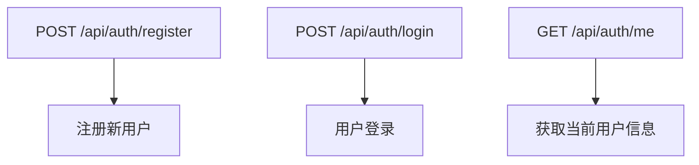
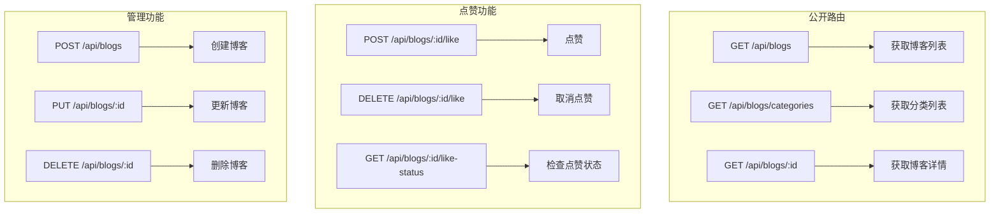
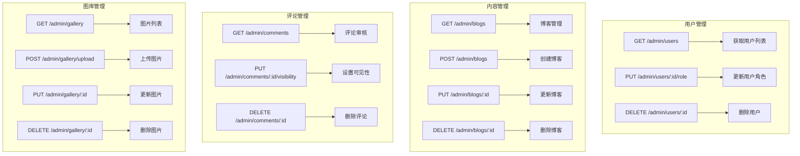
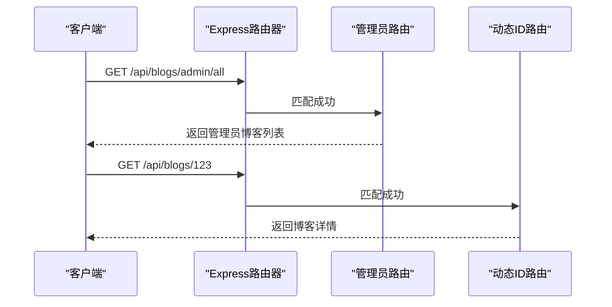

# API路由设计

<cite>
**本文档引用的文件**  
- [app.js](file://backend/app.js#L1-L237)
- [authRoutes.js](file://backend/routes/authRoutes.js#L1-L26)
- [blogRoutes.js](file://backend/routes/blogRoutes.js#L1-L45)
- [adminRoutes.js](file://backend/routes/adminRoutes.js#L1-L1017)
</cite>

## 目录
1. [项目结构概览](#项目结构概览)
2. [核心路由模块分析](#核心路由模块分析)
3. [路由注册机制](#路由注册机制)
4. [RESTful端点设计规范](#restful端点设计规范)
5. [中间件应用策略](#中间件应用策略)
6. [路由分层优势](#路由分层优势)
7. [新增API路由流程](#新增api路由流程)

## 项目结构概览

本项目采用前后端分离架构，后端基于Express框架构建RESTful API服务。项目主要分为`frontend`（前端）和`backend`（后端）两个目录。

后端核心结构如下：
- `controllers`：控制器层，处理业务逻辑
- `middleware`：中间件模块，如认证、上传、验证等
- `models`：数据模型定义，基于Mongoose
- `routes`：路由定义文件，按功能域划分
- `utils`：工具函数集合
- `app.js`：应用入口文件，负责路由挂载与中间件配置

路由文件集中存放于`routes`目录下，每个功能模块拥有独立的路由文件，如`authRoutes.js`、`blogRoutes.js`等，体现了清晰的功能划分原则。

**Section sources**
- [app.js](file://backend/app.js#L1-L237)

## 核心路由模块分析

### 认证路由 (authRoutes.js)

认证路由负责用户注册、登录及身份验证相关功能，定义了三个核心端点：



- **注册**：通过`/register`端点接收用户信息并创建账户
- **登录**：通过`/login`端点验证凭据并返回JWT令牌
- **获取用户信息**：通过`/me`端点在认证后返回当前用户数据

该路由使用`authController`中的方法进行处理，并对`/me`端点应用了`auth`中间件以确保请求合法性。

**Diagram sources**
- [authRoutes.js](file://backend/routes/authRoutes.js#L1-L26)

**Section sources**
- [authRoutes.js](file://backend/routes/authRoutes.js#L1-L26)

### 博客路由 (blogRoutes.js)

博客路由实现了完整的博客管理功能，涵盖公开访问与认证操作：



路由设计遵循RESTful原则，使用标准HTTP方法对应CRUD操作。特别地，点赞相关路由通过`auth`中间件保护，确保只有登录用户才能操作。

**Diagram sources**
- [blogRoutes.js](file://backend/routes/blogRoutes.js#L1-L45)

**Section sources**
- [blogRoutes.js](file://backend/routes/blogRoutes.js#L1-L45)

### 管理员路由 (adminRoutes.js)

管理员路由提供后台管理功能，所有端点均需管理员权限访问：



该路由使用`auth`和`checkRole('admin')`双重中间件保护，确保只有管理员可访问。同时集成了文件上传（multer）和Markdown导入等功能。

**Diagram sources**
- [adminRoutes.js](file://backend/routes/adminRoutes.js#L1-L1017)

**Section sources**
- [adminRoutes.js](file://backend/routes/adminRoutes.js#L1-L1017)

## 路由注册机制

### 集中式挂载

所有路由通过`app.js`文件进行集中注册，采用模块化方式引入：

```javascript
app.use('/api/auth', require('./routes/authRoutes'))
app.use('/api/user', require('./routes/userRoutes'))
app.use('/api/blogs', require('./routes/blogRoutes'))
// ... 其他路由
```

这种设计实现了路由的解耦，每个功能模块独立维护其路由配置，主应用仅负责统一挂载。

### 路径前缀规范

所有API端点统一以`/api`为前缀，增强接口识别度。各模块在此基础上添加二级路径，如：
- `/api/auth`：认证相关
- `/api/blogs`：博客相关
- `/api/admin`：管理员专用

### 挂载顺序重要性

路由注册顺序影响匹配优先级。例如在`blogRoutes.js`中，管理员专用路由`/admin/all`必须在动态路由`/:id`之前注册，否则会被后者拦截。



**Diagram sources**
- [app.js](file://backend/app.js#L1-L237)
- [blogRoutes.js](file://backend/routes/blogRoutes.js#L1-L45)

**Section sources**
- [app.js](file://backend/app.js#L1-L237)

## RESTful端点设计规范

### URL命名约定

- 使用小写字母和连字符（-）分隔单词
- 使用复数形式表示资源集合（如`/blogs`）
- 使用冒号（:）表示路径参数（如`:id`）
- 分类使用连字符连接（如`/friend-links`）

### HTTP方法语义化

| 方法 | 用途 | 示例 |
|------|------|------|
| GET | 获取资源 | `GET /api/blogs` |
| POST | 创建资源 | `POST /api/blogs` |
| PUT | 更新资源 | `PUT /api/blogs/:id` |
| DELETE | 删除资源 | `DELETE /api/blogs/:id` |
| PATCH | 部分更新 | 未使用 |

### 版本控制策略

当前系统未显式实现API版本控制，所有端点位于根`/api`路径下。建议未来通过以下方式改进：
- URL路径版本化：`/api/v1/blogs`
- 请求头版本控制：`Accept: application/vnd.myapi.v1+json`

### 响应格式标准化

所有API响应遵循统一JSON格式：
```json
{
  "success": true,
  "message": "操作成功",
  "data": { /* 返回数据 */ },
  "pagination": { /* 分页信息 */ }
}
```

错误响应包含详细信息：
```json
{
  "success": false,
  "message": "错误描述",
  "error": "错误详情"
}
```

**Section sources**
- [app.js](file://backend/app.js#L1-L237)
- [authRoutes.js](file://backend/routes/authRoutes.js#L1-L26)
- [blogRoutes.js](file://backend/routes/blogRoutes.js#L1-L45)

## 中间件应用策略

### 认证中间件

系统定义了三种认证策略：
- `auth`：强制认证，未登录返回401
- `optionalAuth`：可选认证，未登录仍可访问
- `checkRole('admin')`：角色检查，确保管理员权限

```javascript
// 需要认证的路由
router.get('/me', auth, authController.getCurrentUser)

// 管理员专用路由
router.get('/admin/all', auth, checkRole('admin'), blogController.getAllBlogsForAdmin)
```

### 文件上传中间件

管理员路由使用`multer`处理文件上传，配置了：
- 存储路径：按文件类型分类存储
- 文件大小限制：10MB
- 文件类型过滤：图片和文档格式白名单

### 错误处理中间件

全局错误处理中间件捕获未处理异常：
```javascript
app.use((err, req, res, next) => {
  console.error('❌ 服务器错误:', err)
  errorHandler(err, req, res, next)
})
```

在Vercel生产环境中返回更详细的错误信息以便调试。

**Section sources**
- [app.js](file://backend/app.js#L1-L237)
- [adminRoutes.js](file://backend/routes/adminRoutes.js#L1-L1017)

## 路由分层优势

### 可维护性提升

- **职责分离**：每个路由文件专注单一功能域
- **易于定位**：问题排查时可快速定位到具体模块
- **独立测试**：各路由模块可单独进行单元测试

### 扩展性增强

- **新增模块**：只需创建新的路由文件并在`app.js`中挂载
- **功能迭代**：不影响其他模块的正常运行
- **团队协作**：不同开发者可并行开发不同路由模块

### 安全性保障

- **权限集中管理**：通过中间件统一控制访问权限
- **攻击面隔离**：公共接口与管理接口物理分离
- **审计追踪**：所有管理操作均有日志记录

### 性能优化

- **按需加载**：路由模块延迟加载，减少内存占用
- **缓存友好**：静态资源与API接口分离，便于CDN缓存
- **错误隔离**：单个路由错误不会影响整体服务

## 新增API路由流程

### 标准操作步骤

1. **创建控制器**：在`controllers`目录下创建新的控制器文件
2. **定义数据模型**：如有需要，在`models`目录下定义Mongoose模型
3. **创建路由文件**：在`routes`目录下创建对应的路由文件
4. **实现业务逻辑**：在控制器中编写具体处理函数
5. **注册路由**：在`app.js`中使用`app.use()`挂载新路由

### 最佳实践建议

- **命名规范**：路由文件名使用`功能名Routes.js`格式
- **文档注释**：在路由文件头部添加JSDoc注释说明所有端点
- **输入验证**：使用`validation.js`中间件进行参数校验
- **错误处理**：统一使用`ApiError`类抛出业务异常
- **日志记录**：关键操作添加调试日志

### 示例：新增"标签"管理功能

```javascript
// routes/tagRoutes.js
const express = require('express')
const router = express.Router()
const tagController = require('../controllers/tagController')
const { auth, checkRole } = require('../middleware/auth')

// 获取标签列表
router.get('/', tagController.getTags)

// 创建标签（仅管理员）
router.post('/', auth, checkRole('admin'), tagController.createTag)

// 删除标签（仅管理员）
router.delete('/:id', auth, checkRole('admin'), tagController.deleteTag)

module.exports = router
```

然后在`app.js`中添加：
```javascript
app.use('/api/tags', require('./routes/tagRoutes'))
```

**Section sources**
- [app.js](file://backend/app.js#L1-L237)
- [authRoutes.js](file://backend/routes/authRoutes.js#L1-L26)