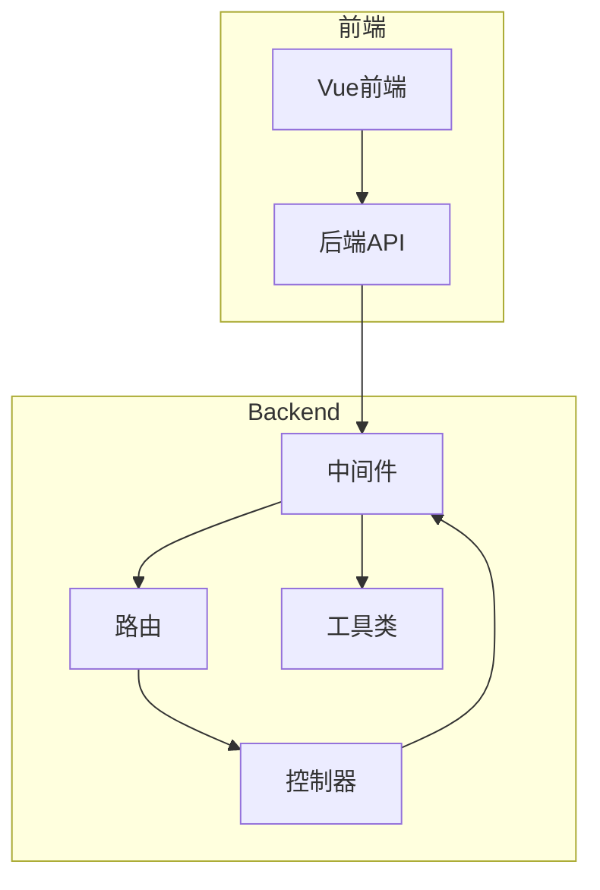
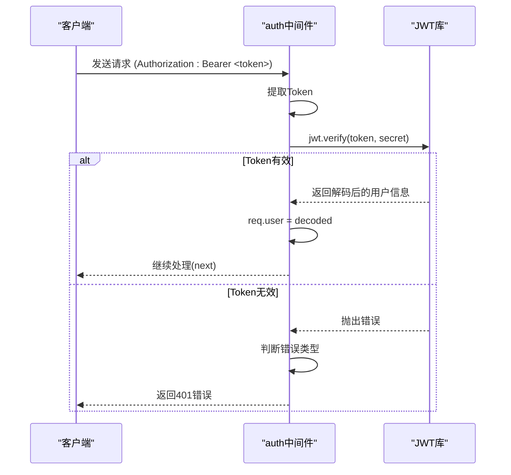
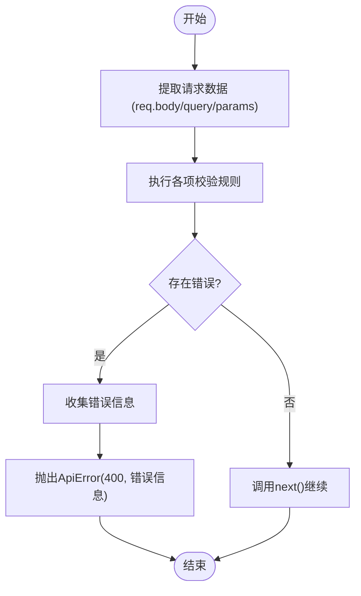
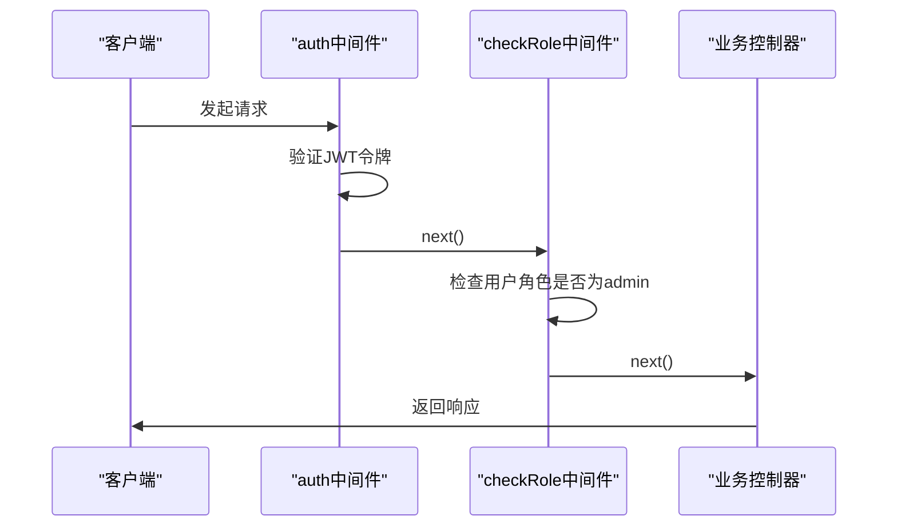

# 中间件机制

<cite>
**本文档引用文件**  
- [auth.js](file://backend/middleware/auth.js)
- [upload.js](file://backend/middleware/upload.js)
- [validation.js](file://backend/middleware/validation.js)
- [authRoutes.js](file://backend/routes/authRoutes.js)
- [adminRoutes.js](file://backend/routes/adminRoutes.js)
</cite>

## 目录
1. [简介](#简介)
2. [项目结构](#项目结构)
3. [核心中间件分析](#核心中间件分析)
4. [中间件执行流程与链式调用](#中间件执行流程与链式调用)
5. [中间件复用与路由集成](#中间件复用与路由集成)
6. [自定义中间件开发指南](#自定义中间件开发指南)
7. [常见陷阱与调试技巧](#常见陷阱与调试技巧)
8. [总结](#总结)

## 简介
本文档系统性地解析了项目中中间件的设计与应用，重点分析 `auth.js`、`upload.js` 和 `validation.js` 三个核心中间件模块。通过代码级分析，展示 JWT 身份验证、文件上传处理、请求数据校验的实现机制，并说明这些中间件如何在路由中被复用，实现横切关注点的解耦。同时结合管理员权限校验等实际场景，说明中间件链的构建方式。

## 项目结构
项目采用典型的分层架构，后端代码位于 `backend/` 目录下，主要分为控制器（controllers）、模型（models）、路由（routes）和中间件（middleware）四大模块。中间件作为独立模块，集中处理认证、校验、上传等通用逻辑，被多个路由复用。



**图示来源**  
- [auth.js](file://backend/middleware/auth.js)
- [adminRoutes.js](file://backend/routes/adminRoutes.js)

## 核心中间件分析

### 认证中间件（auth.js）
`auth.js` 实现了基于 JWT 的用户身份验证与角色权限控制，包含三个核心函数：

- **auth**: 强制认证中间件，验证请求头中的 Bearer Token。
- **optionalAuth**: 可选认证中间件，若提供有效 Token 则附加用户信息。
- **checkRole**: 角色校验中间件，确保用户具备指定角色权限。

#### JWT 验证流程


**图示来源**  
- [auth.js](file://backend/middleware/auth.js#L15-L66)

**本节来源**  
- [auth.js](file://backend/middleware/auth.js#L1-L66)

#### 角色权限校验机制
`checkRole` 是一个高阶函数，接收角色列表并返回实际中间件函数，实现灵活的角色控制。

```javascript
exports.checkRole = (...roles) => {
  return (req, res, next) => {
    if (!req.user || !roles.includes(req.user.role)) {
      return next(new ApiError(403, '没有权限执行此操作'))
    }
    next()
  }
}
```

该设计支持如下调用：
```javascript
router.get('/admin', auth, checkRole('admin'), handler)
```

### 文件上传中间件（upload.js）
`upload.js` 并未直接集成 Multer 实例，而是导出一个错误处理中间件 `handleUploadError`，用于捕获 Multer 上传过程中的常见错误并转换为统一的 `ApiError`。

#### 错误处理映射
| Multer 错误码 | 用户友好提示 |
|---------------|-------------|
| LIMIT_FILE_SIZE | 文件大小超出限制 |
| LIMIT_FILE_COUNT | 文件数量超出限制 |
| LIMIT_UNEXPECTED_FILE | 意外的文件字段 |

```mermaid
flowchart TD
A[上传请求] --> B{Multer处理}
B --> C[MulterError?]
C --> |是| D[根据code判断类型]
D --> E[转换为ApiError]
E --> F[调用next(error)]
C --> |否| G[继续后续处理]
```

**图示来源**  
- [upload.js](file://backend/middleware/upload.js#L1-L29)

**本节来源**  
- [upload.js](file://backend/middleware/upload.js#L1-L29)

### 请求校验中间件（validation.js）
`validation.js` 提供了全面的请求数据校验功能，涵盖用户注册、登录、博客、评论、文档等多种场景。

#### 校验函数一览
- **validateRegister**: 用户注册校验
- **validateLogin**: 用户登录校验
- **validateBlog**: 博客内容校验
- **validateComment**: 评论内容校验
- **validateDocument**: 文档内容校验
- **validatePagination**: 分页参数校验
- **validateObjectId**: MongoDB ID 格式校验

#### 通用校验工具
```javascript
const isValidEmail = (email) => /^[^\s@]+@[^\s@]+\.[^\s@]+$/.test(email)
const isValidPassword = (password) => /^(?=.*[A-Za-z])(?=.*\d)[A-Za-z\d@$!%*#?&]{8,}$/.test(password)
const isValidUrl = (url) => { try { new URL(url); return true } catch { return false } }
```

#### 校验流程


**图示来源**  
- [validation.js](file://backend/middleware/validation.js#L1-L299)

**本节来源**  
- [validation.js](file://backend/middleware/validation.js#L1-L299)

## 中间件执行流程与链式调用
Express 中间件按注册顺序依次执行，通过 `next()` 控制流程。若调用 `next(error)`，则跳过后续中间件，进入错误处理流程。

### 管理员路由中间件链
以管理员验证路由为例，展示多层中间件链的构建：

```javascript
router.get('/verify', auth, checkRole('admin'), async (req, res, next) => {
  // 只有通过 auth 和 checkRole 校验后才会执行
})
```

#### 执行顺序图解


**图示来源**  
- [adminRoutes.js](file://backend/routes/adminRoutes.js#L15-L25)

**本节来源**  
- [adminRoutes.js](file://backend/routes/adminRoutes.js#L15-L25)

## 中间件复用与路由集成

### 认证路由中的应用
在 `authRoutes.js` 中，`auth` 中间件用于保护 `/me` 接口，确保只有登录用户才能获取自身信息。

```javascript
// 获取当前用户信息（需要认证）
router.get('/me', auth, authController.getCurrentUser)
```

**本节来源**  
- [authRoutes.js](file://backend/routes/authRoutes.js#L23-L25)

### 管理员路由中的综合应用
`adminRoutes.js` 广泛使用中间件组合，实现安全的后台管理功能。

#### 典型路由模式
```javascript
router.get('/dashboard', auth, checkRole('admin'), async (req, res, next) => {
  // 需要登录且为管理员角色
})
```

#### 文件上传与错误处理
```javascript
// 图片直传
router.post('/uploads/images', auth, checkRole('admin'), blogImportController.uploadImage)
// 错误处理由全局错误中间件捕获
```

**本节来源**  
- [adminRoutes.js](file://backend/routes/adminRoutes.js#L15-L1017)

## 自定义中间件开发指南

### 基本结构
```javascript
exports.myMiddleware = (req, res, next) => {
  try {
    // 业务逻辑处理
    if (/* 条件不满足 */) {
      return next(new ApiError(400, '错误信息'))
    }
    // 附加数据到req对象
    req.customData = data
    next() // 继续执行
  } catch (error) {
    next(error) // 传递错误
  }
}
```

### 最佳实践
1. **单一职责**：每个中间件只做一件事。
2. **错误统一**：使用 `ApiError` 类封装错误。
3. **避免阻塞**：异步操作使用 `async/await` 或 Promise。
4. **参数校验**：对输入数据进行严格校验。
5. **日志记录**：关键操作添加日志输出。

## 常见陷阱与调试技巧

### 常见陷阱
- **忘记调用 next()**：导致请求挂起。
- **错误处理不当**：未捕获异常导致进程崩溃。
- **中间件顺序错误**：如校验在认证前执行。
- **全局状态污染**：在 req 对象上附加数据时未清理。

### 调试技巧
1. **日志输出**：在中间件开头添加 `console.log` 查看执行情况。
   ```javascript
   console.log('执行 auth 中间件，路径:', req.path)
   ```
2. **使用调试器**：在 VS Code 中设置断点调试。
3. **Postman 测试**：模拟不同请求头和参数测试中间件行为。
4. **错误堆栈**：查看完整错误堆栈定位问题源头。

## 总结
本项目通过 `auth.js`、`upload.js` 和 `validation.js` 三个中间件模块，实现了认证、上传、校验等横切关注点的解耦。这些中间件通过 Express 的中间件机制被多个路由复用，提高了代码的可维护性和安全性。通过高阶函数（如 `checkRole`）和组合模式，实现了灵活的权限控制和功能扩展。合理使用中间件链，可以构建出结构清晰、安全可靠的后端 API。