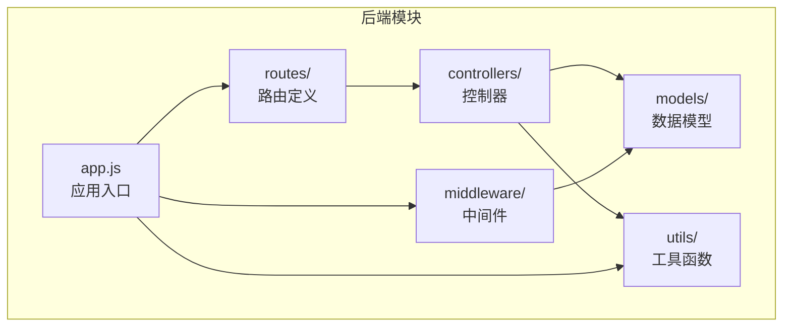
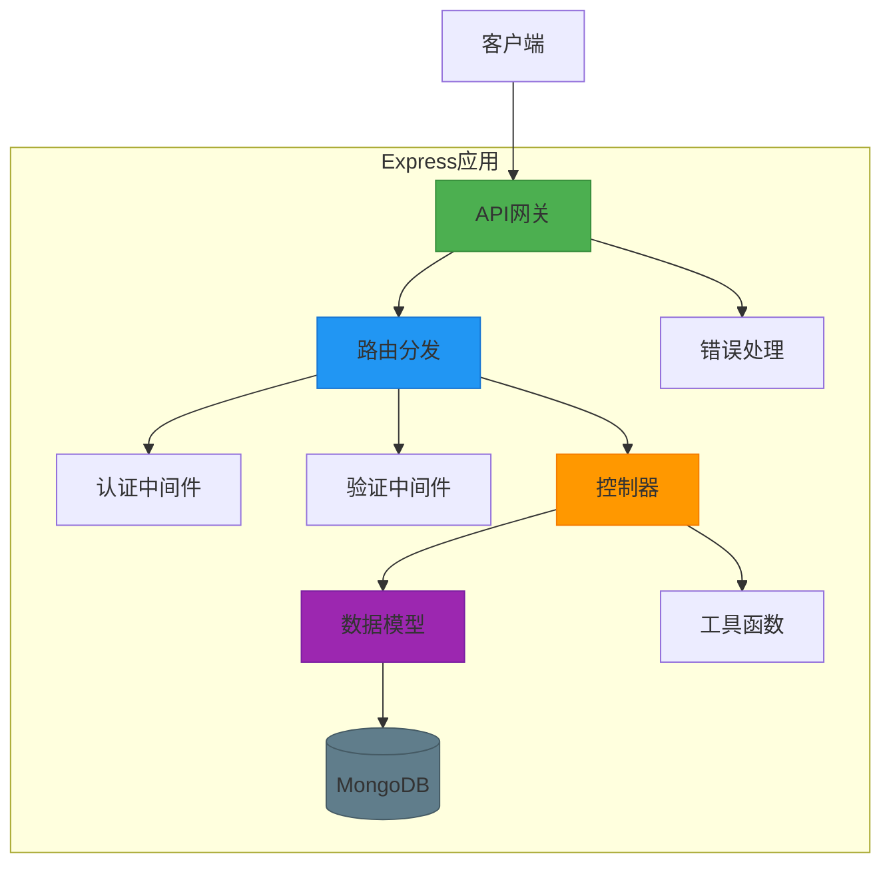
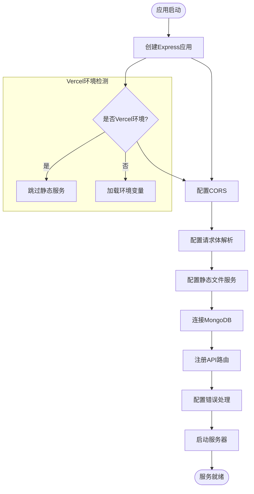
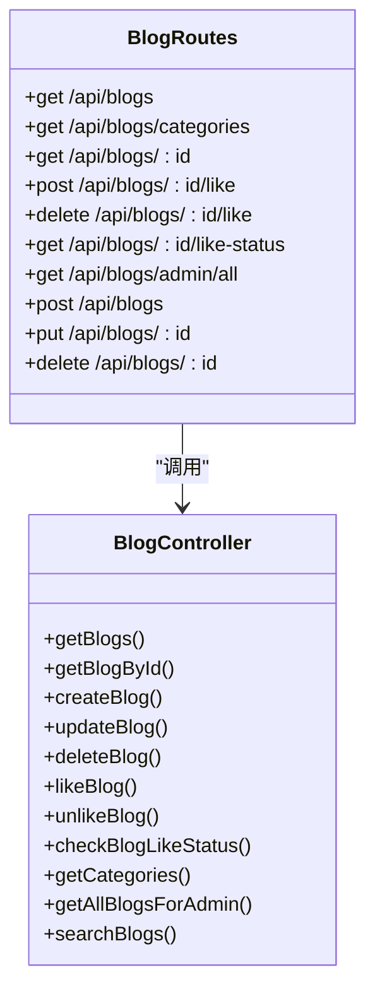
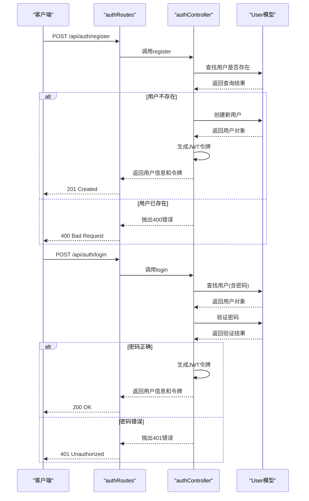
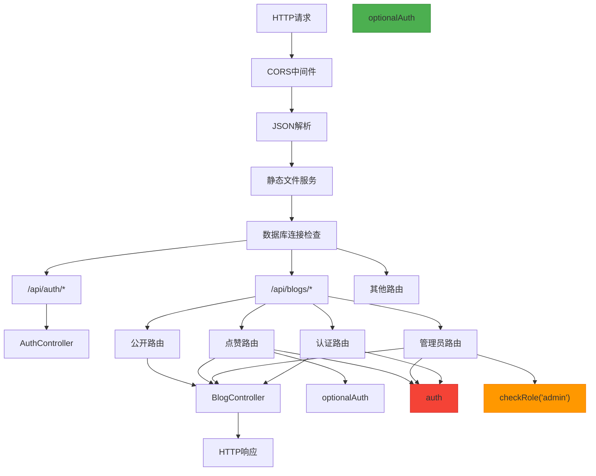
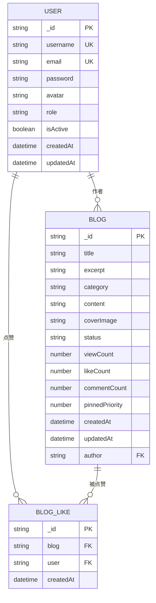
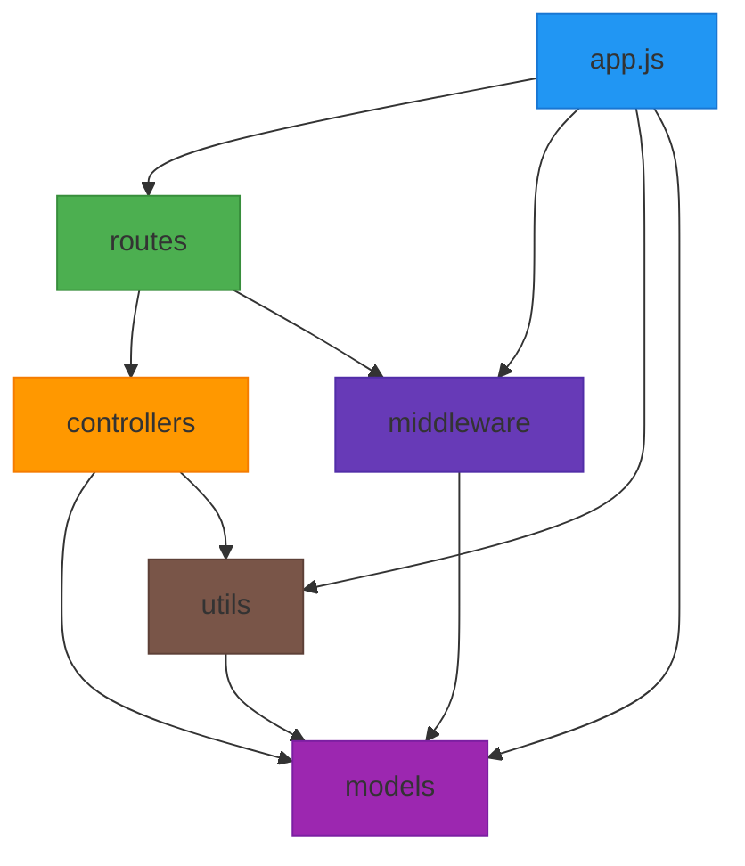

# 后端架构设计

<cite>
**本文档引用文件**  
- [app.js](file://backend/app.js)
- [blogRoutes.js](file://backend/routes/blogRoutes.js)
- [blogController.js](file://backend/controllers/blogController.js)
- [authRoutes.js](file://backend/routes/authRoutes.js)
- [authController.js](file://backend/controllers/authController.js)
- [auth.js](file://backend/middleware/auth.js)
- [User.js](file://backend/models/User.js)
- [Blog.js](file://backend/models/Blog.js)
- [error.js](file://backend/utils/error.js)
</cite>

## 目录
1. [项目结构](#项目结构)
2. [核心组件](#核心组件)
3. [架构概览](#架构概览)
4. [详细组件分析](#详细组件分析)
5. [依赖分析](#依赖分析)
6. [性能考虑](#性能考虑)
7. [故障排除指南](#故障排除指南)
8. [结论](#结论)

## 项目结构

项目采用分层架构设计，后端位于 `backend` 目录下，遵循典型的 MVC（模型-视图-控制器）模式。主要目录结构如下：

- **controllers**：处理 HTTP 请求，调用模型逻辑并返回响应
- **middleware**：实现认证、上传、验证等横切关注点
- **models**：定义 MongoDB 数据模型和业务实体
- **routes**：定义 API 路由映射
- **utils**：提供工具函数和辅助功能
- **app.js**：Express 应用入口文件

**图示来源**
- [app.js](file://backend/app.js#L1-L237)
- [blogRoutes.js](file://backend/routes/blogRoutes.js#L1-L45)

**本节来源**
- [app.js](file://backend/app.js#L1-L237)
- [blogRoutes.js](file://backend/routes/blogRoutes.js#L1-L45)

## 核心组件

系统核心组件包括 Express 应用初始化、RESTful API 路由、控制器逻辑、数据模型和中间件管道。`app.js` 作为服务入口，整合了路由、中间件和错误处理机制，形成稳定的 API 服务。

主要功能特性：
- 支持 CORS 跨域配置
- JSON 和 URL 编码解析
- 静态文件服务（非 Vercel 环境）
- 数据库连接管理
- 全局错误处理
- 健康检查端点

**本节来源**
- [app.js](file://backend/app.js#L1-L237)
- [error.js](file://backend/utils/error.js#L1-L58)

## 架构概览

系统采用基于 Express 的分层架构，实现了清晰的关注点分离。整体架构如下图所示：

**图示来源**
- [app.js](file://backend/app.js#L1-L237)
- [blogRoutes.js](file://backend/routes/blogRoutes.js#L1-L45)
- [blogController.js](file://backend/controllers/blogController.js#L1-L631)

## 详细组件分析

### 应用初始化分析

`app.js` 文件负责初始化 Express 应用实例，配置中间件，建立数据库连接，并注册路由。

**图示来源**
- [app.js](file://backend/app.js#L1-L237)

**本节来源**
- [app.js](file://backend/app.js#L1-L237)

### 路由与控制器分析

系统采用 RESTful API 设计风格，路由与控制器之间通过模块化方式组织。以博客功能为例，展示路由与控制器的映射关系。

**图示来源**
- [blogRoutes.js](file://backend/routes/blogRoutes.js#L1-L45)
- [blogController.js](file://backend/controllers/blogController.js#L1-L631)

**本节来源**
- [blogRoutes.js](file://backend/routes/blogRoutes.js#L1-L45)
- [blogController.js](file://backend/controllers/blogController.js#L1-L631)

### 认证流程分析

用户认证系统实现了完整的注册、登录和身份验证流程，采用 JWT 进行状态管理。

**图示来源**
- [authRoutes.js](file://backend/routes/authRoutes.js#L1-L26)
- [authController.js](file://backend/controllers/authController.js#L1-L142)
- [User.js](file://backend/models/User.js#L1-L90)

**本节来源**
- [authRoutes.js](file://backend/routes/authRoutes.js#L1-L26)
- [authController.js](file://backend/controllers/authController.js#L1-L142)

### 中间件管道分析

中间件系统实现了认证、权限检查和可选认证等功能，形成灵活的请求处理管道。

**图示来源**
- [app.js](file://backend/app.js#L1-L237)
- [auth.js](file://backend/middleware/auth.js#L1-L67)
- [blogRoutes.js](file://backend/routes/blogRoutes.js#L1-L45)

**本节来源**
- [app.js](file://backend/app.js#L1-L237)
- [auth.js](file://backend/middleware/auth.js#L1-L67)

### 数据模型分析

数据模型采用 Mongoose 定义，实现了数据验证、索引优化和虚拟字段等功能。

**图示来源**
- [User.js](file://backend/models/User.js#L1-L90)
- [Blog.js](file://backend/models/Blog.js#L1-L131)

**本节来源**
- [User.js](file://backend/models/User.js#L1-L90)
- [Blog.js](file://backend/models/Blog.js#L1-L131)

## 依赖分析

系统依赖关系清晰，各组件之间耦合度低，便于维护和扩展。

**图示来源**
- [app.js](file://backend/app.js#L1-L237)
- [blogRoutes.js](file://backend/routes/blogRoutes.js#L1-L45)
- [blogController.js](file://backend/controllers/blogController.js#L1-L631)

**本节来源**
- [app.js](file://backend/app.js#L1-L237)
- [blogRoutes.js](file://backend/routes/blogRoutes.js#L1-L45)

## 性能考虑

系统在性能方面进行了多项优化：

1. **数据库连接池**：配置了 `maxPoolSize: 10`，提高并发处理能力
2. **超时设置**：设置了 `serverSelectionTimeoutMS: 5000` 和 `socketTimeoutMS: 45000`
3. **索引优化**：在 Blog 模型上创建了多个索引，包括文本索引、分类索引、状态索引等
4. **并行查询**：在 `getBlogs` 方法中使用 `Promise.all` 并行执行查询和计数操作
5. **缓存机制**：虽然当前未实现，但架构支持添加 Redis 等缓存层

**本节来源**
- [app.js](file://backend/app.js#L1-L237)
- [blogController.js](file://backend/controllers/blogController.js#L1-L631)
- [Blog.js](file://backend/models/Blog.js#L1-L131)

## 故障排除指南

### 常见问题及解决方案

1. **数据库连接失败**
   - 检查 `MONGODB_URI` 环境变量是否正确
   - 确认 MongoDB Atlas IP 白名单设置
   - 检查网络连接状况

2. **认证失败**
   - 确认 JWT_SECRET 环境变量已设置
   - 检查请求头中的 Authorization 字段格式是否为 "Bearer <token>"
   - 验证令牌是否过期

3. **跨域问题**
   - 确认 CORS 配置中包含正确的 origin
   - 检查是否需要 credentials 支持

4. **静态文件无法访问**
   - 在非 Vercel 环境中确认上传目录存在
   - 检查文件路径是否正确

**本节来源**
- [app.js](file://backend/app.js#L1-L237)
- [auth.js](file://backend/middleware/auth.js#L1-L67)
- [error.js](file://backend/utils/error.js#L1-L58)

## 结论

本系统采用 Express + MongoDB 技术栈，实现了清晰的 MVC 架构。通过模块化的路由、控制器和中间件设计，达到了良好的代码解耦和可维护性。系统支持 Vercel 部署，具备生产环境所需的稳定性和扩展性。

主要优势：
- 架构清晰，层次分明
- 错误处理完善
- 安全性考虑周全（密码加密、JWT 认证）
- 性能优化到位
- 易于扩展和维护

建议的改进方向：
1. 添加 Redis 缓存层以提高性能
2. 实现更细粒度的日志记录
3. 增加单元测试和集成测试
4. 实现 API 文档自动化生成