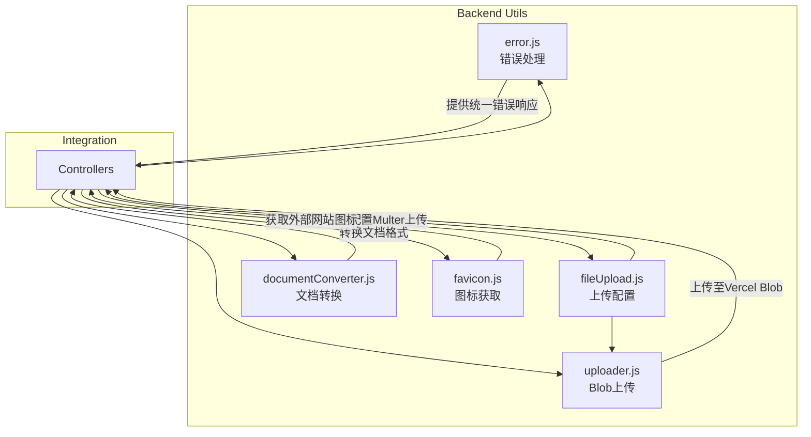
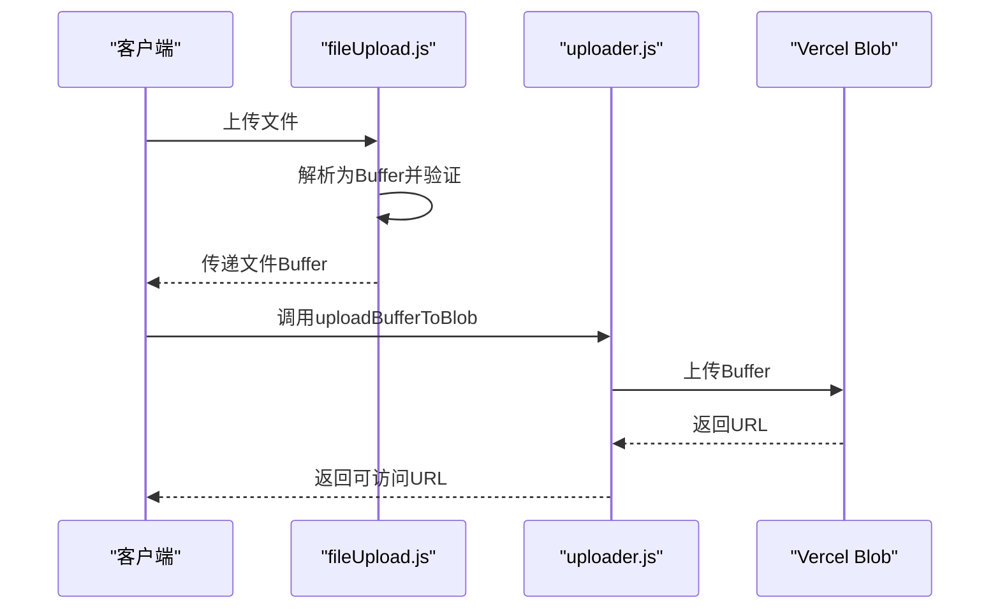
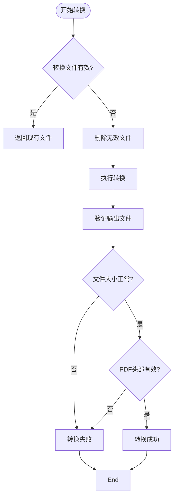

# 工具函数集成

<cite>
**本文档引用文件**  
- [error.js](file://backend/utils/error.js)
- [fileUpload.js](file://backend/utils/fileUpload.js)
- [uploader.js](file://backend/utils/uploader.js)
- [documentConverter.js](file://backend/utils/documentConverter.js)
- [favicon.js](file://backend/utils/favicon.js)
</cite>

## 目录
1. [简介](#简介)
2. [项目结构](#项目结构)
3. [核心工具模块分析](#核心工具模块分析)
4. [错误处理机制详解](#错误处理机制详解)
5. [文件上传与存储协同逻辑](#文件上传与存储协同逻辑)
6. [文档格式转换功能实现](#文档格式转换功能实现)
7. [网站图标生成策略](#网站图标生成策略)
8. [工具类集成最佳实践](#工具类集成最佳实践)
9. [异常处理与健壮性设计](#异常处理与健壮性设计)
10. [总结](#总结)

## 简介
本文件全面文档化 `backend/utils` 目录下各类工具函数的用途、集成方式及最佳实践。重点阐述 `error.js` 如何统一错误响应格式，`fileUpload.js` 与 `uploader.js` 如何协同处理文件上传与持久化存储，`documentConverter.js` 如何支持多种文档格式转换，以及 `favicon.js` 如何智能获取网站图标。通过详细说明各工具函数的调用示例、参数说明与异常处理策略，帮助开发者在新功能开发中合理使用这些工具类，提升代码复用性与系统健壮性。

## 项目结构
后端工具模块位于 `backend/utils` 目录下，包含五个核心工具文件，分别负责错误处理、文件上传、云存储上传、文档转换和网站图标获取。这些工具类通过模块化设计，实现了高内聚、低耦合的架构，便于在控制器和中间件中灵活调用。



**图示来源**  
- [error.js](file://backend/utils/error.js)
- [fileUpload.js](file://backend/utils/fileUpload.js)
- [uploader.js](file://backend/utils/uploader.js)
- [documentConverter.js](file://backend/utils/documentConverter.js)
- [favicon.js](file://backend/utils/favicon.js)

## 核心工具模块分析
`backend/utils` 目录下的工具模块各司其职，共同支撑系统的稳定运行。`error.js` 提供统一的错误处理机制；`fileUpload.js` 负责配置文件上传规则；`uploader.js` 实现与 Vercel Blob 的集成；`documentConverter.js` 支持文档格式转换；`favicon.js` 提供网站图标获取能力。这些工具通过模块导出，可在控制器中直接引入使用。

**本节来源**  
- [error.js](file://backend/utils/error.js)
- [fileUpload.js](file://backend/utils/fileUpload.js)
- [uploader.js](file://backend/utils/uploader.js)
- [documentConverter.js](file://backend/utils/documentConverter.js)
- [favicon.js](file://backend/utils/favicon.js)

## 错误处理机制详解
`error.js` 文件定义了统一的错误处理机制，确保所有 API 响应遵循一致的错误格式。

### 自定义错误类
`ApiError` 类继承自原生 `Error`，并添加了 `statusCode`、`status` 和 `isOperational` 属性，用于区分客户端错误（4xx）与服务端错误（5xx）。

```javascript
class ApiError extends Error {
  constructor(statusCode, message) {
    super(message)
    this.statusCode = statusCode
    this.status = `${statusCode}`.startsWith('4') ? 'fail' : 'error'
    this.isOperational = true
    Error.captureStackTrace(this, this.constructor)
  }
}
```

### 错误处理中间件
`errorHandler` 中间件捕获所有未处理的异常，并根据错误类型返回标准化响应：

- **CastError**：MongoDB 类型转换失败，返回 404
- **11000 错误码**：MongoDB 重复键错误，返回 400
- **ValidationError**：字段验证失败，返回 400

响应格式如下：
```json
{
  "success": false,
  "message": "错误信息",
  "stack": "开发环境下的调用栈"
}
```

### 异步错误捕获
`catchAsync` 函数包装异步控制器，自动将 Promise 拒绝传递给错误处理中间件，避免重复编写 `try-catch`。

```javascript
const catchAsync = (fn) => {
  return (req, res, next) => {
    Promise.resolve(fn(req, res, next)).catch(next)
  }
}
```

**本节来源**  
- [error.js](file://backend/utils/error.js#L1-L57)

## 文件上传与存储协同逻辑
`fileUpload.js` 与 `uploader.js` 协同工作，实现文件上传与持久化存储。

### 上传配置（fileUpload.js）
`fileUpload.js` 使用 Multer 配置上传规则，支持图片、文档和头像三种类型：

- **imageUpload**：支持 jpeg/jpg/png/gif/webp，最大 10MB
- **documentUpload**：支持 pdf/docx/pptx/xlsx/txt/md，最大 50MB
- **avatarUpload**：支持 jpeg/jpg/png，最大 2MB

所有上传均使用内存存储（`memoryStorage`），文件以 Buffer 形式暂存，避免 Vercel 无状态环境的文件系统限制。

```javascript
const createUpload = (uploadPath, allowedTypes, maxSize) => {
  return multer({
    storage: multer.memoryStorage(),
    limits: { fileSize: maxSize },
    fileFilter: (req, file, cb) => {
      const extname = allowedTypes.test(path.extname(file.originalname).toLowerCase())
      extname ? cb(null, true) : cb(new Error('文件类型不支持'))
    }
  })
}
```

### 云存储上传（uploader.js）
`uploader.js` 使用 `@vercel/blob` 将内存中的文件 Buffer 上传至 Vercel Blob 存储，实现持久化。

```javascript
async function uploadBufferToBlob(key, buffer, contentType, allowOverwrite = false) {
  const result = await put(key, buffer, {
    access: 'public',
    contentType,
    addRandomSuffix: !allowOverwrite
  })
  return result.url // 返回可公网访问的URL
}
```

### 协同流程
1. 客户端上传文件 → 2. Multer 解析为 Buffer → 3. 控制器调用 `uploadBufferToBlob` → 4. 返回 Blob URL



**图示来源**  
- [fileUpload.js](file://backend/utils/fileUpload.js#L1-L138)
- [uploader.js](file://backend/utils/uploader.js#L1-L14)

**本节来源**  
- [fileUpload.js](file://backend/utils/fileUpload.js#L1-L138)
- [uploader.js](file://backend/utils/uploader.js#L1-L14)

## 文档格式转换功能实现
`documentConverter.js` 提供强大的文档转换能力，支持 DOCX/PPTX 等格式转为 PDF 或 HTML。

### 核心功能
- `convertDocxToHtml`：使用 `mammoth` 将 DOCX 转为 HTML
- `convertToPdf`：优先使用 LibreOffice 命令行转换，失败时回退到 `libreoffice-convert` 库
- `smartConvert`：智能转换，若已有有效转换文件则直接返回，避免重复转换

### 转换流程


### 智能转换示例
```javascript
const converter = require('./documentConverter')
const pdfPath = await converter.smartConvert('/uploads/doc.docx', 'pdf')
```

**本节来源**  
- [documentConverter.js](file://backend/utils/documentConverter.js#L1-L291)

## 网站图标生成策略
`favicon.js` 提供多级备选方案获取网站图标。

### 获取策略
1. **Google Favicon API**：最可靠，返回标准化图标
2. **常见路径探测**：尝试 `/favicon.ico`、`/apple-touch-icon.png` 等
3. **降级处理**：即使 API 检查失败，仍使用 Google 图标作为备选
4. **默认图标**：完全失败时返回本地默认图标

### 主要函数
- `getFavicon(websiteUrl)`：获取单个网站图标
- `getBatchFavicons(urls)`：批量获取多个网站图标

返回结果包含：
```json
{
  "success": true,
  "faviconUrl": "https://...",
  "method": "google-api",
  "domain": "example.com"
}
```

**本节来源**  
- [favicon.js](file://backend/utils/favicon.js#L1-L150)

## 工具类集成最佳实践
在新功能开发中应遵循以下最佳实践：

1. **统一错误处理**：使用 `ApiError` 抛出自定义错误，由中间件统一响应
2. **文件上传**：根据类型选择 `imageUpload`、`documentUpload` 等预设配置
3. **云存储**：上传成功后立即调用 `uploadBufferToBlob` 持久化
4. **文档转换**：优先使用 `smartConvert` 避免重复转换
5. **图标获取**：使用 `getFavicon` 获取外部链接图标

## 异常处理与健壮性设计
各工具模块均具备完善的异常处理机制：
- `error.js` 捕获所有未处理异常
- `fileUpload.js` 在 Vercel 环境下跳过文件系统操作
- `documentConverter.js` 多重验证 PDF 有效性
- `favicon.js` 多级备选方案确保图标获取成功率

## 总结
`backend/utils` 目录下的工具函数通过模块化设计，显著提升了代码复用性与系统健壮性。`error.js` 统一了错误响应格式，`fileUpload.js` 与 `uploader.js` 协同解决了无状态环境的文件存储问题，`documentConverter.js` 提供了可靠的文档转换能力，`favicon.js` 实现了智能图标获取。合理使用这些工具类，可大幅提高开发效率与系统稳定性。