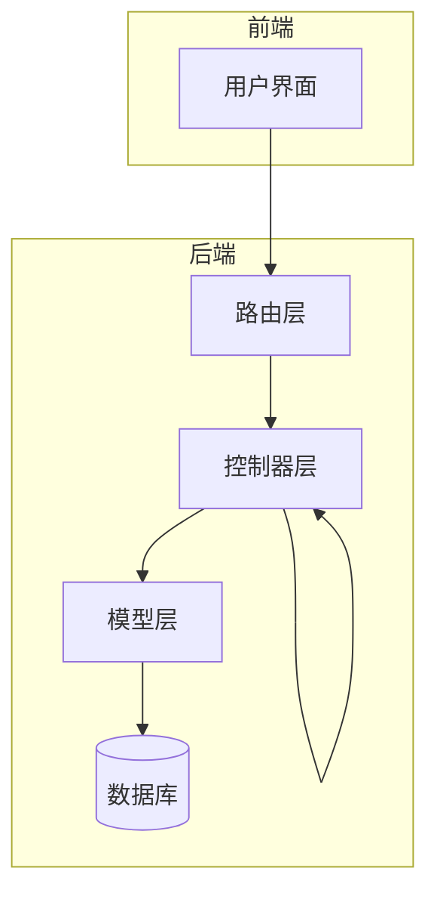
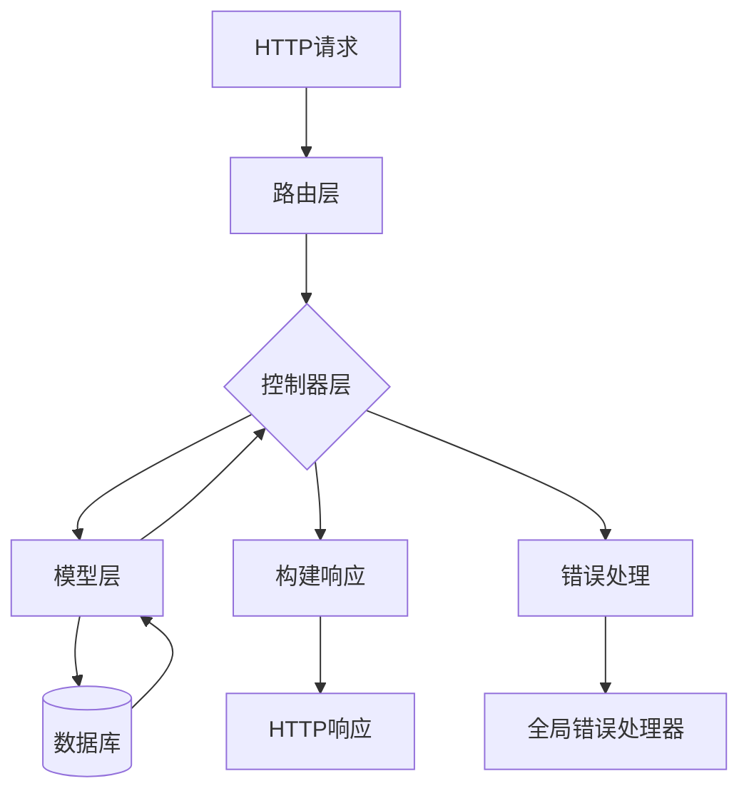
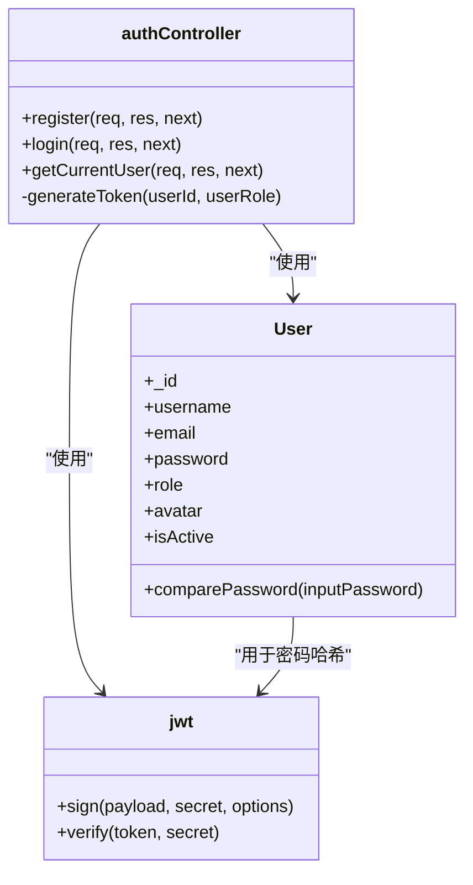
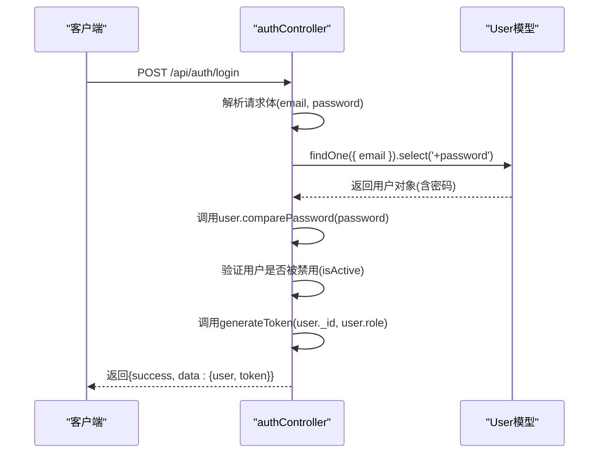
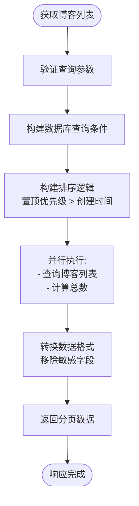
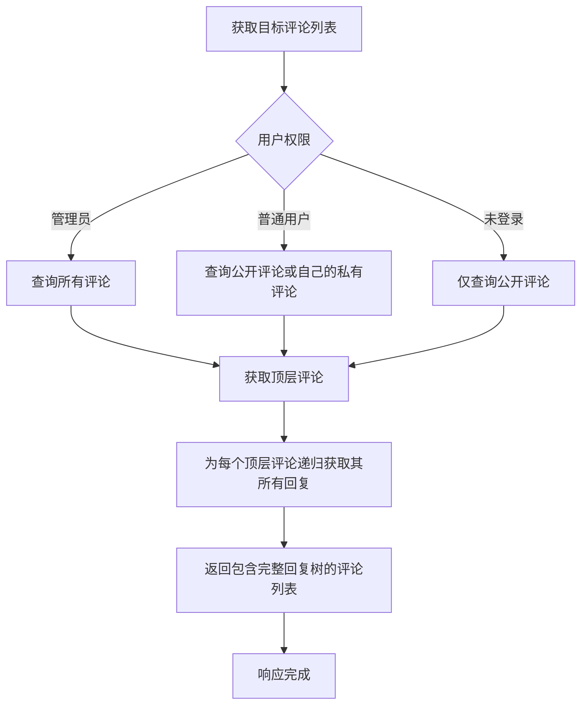
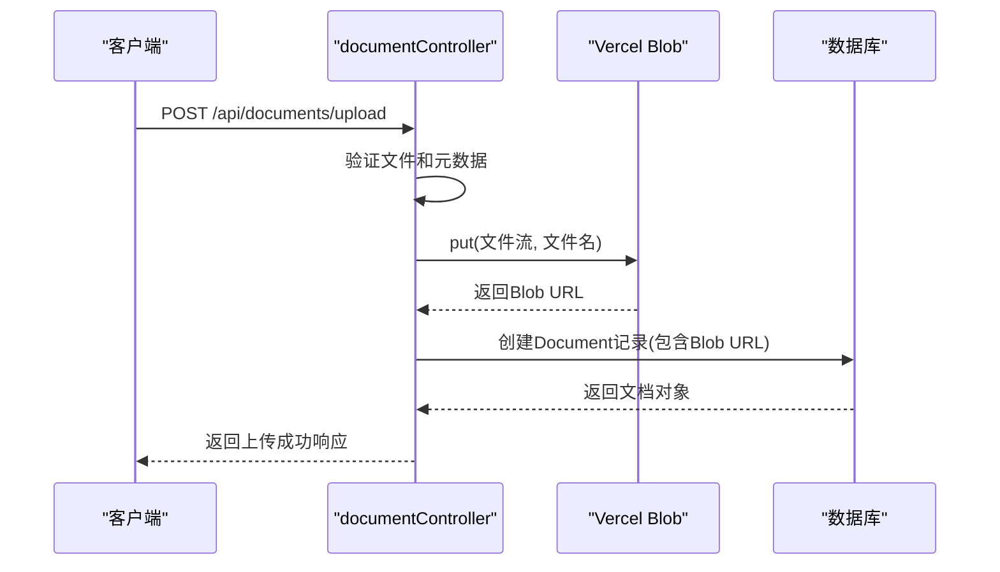
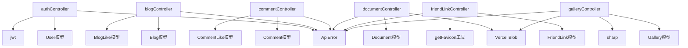

# 控制器逻辑

<cite>
**本文档中引用的文件**   
- [authController.js](file://backend\controllers\authController.js)
- [blogController.js](file://backend\controllers\blogController.js)
- [commentController.js](file://backend\controllers\commentController.js)
- [documentController.js](file://backend\controllers\documentController.js)
- [friendLinkController.js](file://backend\controllers\friendLinkController.js)
- [galleryController.js](file://backend\controllers\galleryController.js)
- [searchController.js](file://backend\controllers\searchController.js)
</cite>

## 目录
1. [简介](#简介)
2. [项目结构](#项目结构)
3. [核心组件](#核心组件)
4. [架构概览](#架构概览)
5. [详细组件分析](#详细组件分析)
6. [依赖分析](#依赖分析)
7. [性能考虑](#性能考虑)
8. [故障排除指南](#故障排除指南)
9. [结论](#结论)

## 简介
本文档深入探讨了后端控制器层的实现逻辑与职责划分。通过分析 `authController`、`blogController`、`commentController` 等具体控制器，详细说明了它们如何处理来自路由的请求，调用模型进行数据操作，并返回标准化响应。文档重点阐述了控制器内部的业务逻辑封装模式，包括输入验证、错误捕获、异步处理等关键机制。结合实际代码片段，展示了用户登录、博客创建等典型请求处理流程。同时，强调了单一职责原则在控制器设计中的应用，以避免控制器过度臃肿。最后，提供了扩展新控制器的方法论与代码模板，为后续开发提供指导。

## 项目结构
后端控制器层位于 `backend/controllers` 目录下，是连接路由（routes）与数据模型（models）的核心枢纽。该层遵循清晰的分层架构，每个控制器文件负责处理特定业务模块的请求，如用户认证、博客管理、评论处理等。这种模块化设计使得代码结构清晰，职责分明，便于维护和扩展。

**图示来源**
- [authController.js](file://backend\controllers\authController.js)
- [blogController.js](file://backend\controllers\blogController.js)

## 核心组件
控制器层的核心组件是各个功能模块的控制器文件。它们作为业务逻辑的入口点，接收来自路由的请求，执行相应的业务操作，并返回响应。每个控制器都遵循一致的设计模式：使用 `exports` 导出异步函数，函数接收 `req`（请求）、`res`（响应）和 `next`（错误处理）参数。核心职责包括：
1.  **请求解析**：从 `req` 对象中提取参数、查询条件和请求体数据。
2.  **业务逻辑执行**：调用模型（Model）进行数据库操作，如创建、查询、更新、删除。
3.  **输入验证**：对用户输入进行校验，确保数据的完整性和安全性。
4.  **错误处理**：通过 `try-catch` 捕获异步操作中的错误，并使用 `next(error)` 将错误传递给全局错误处理中间件。
5.  **响应构建**：将处理结果封装成标准化的 JSON 格式，通过 `res.json()` 或 `res.status().json()` 返回给客户端。

**组件来源**
- [authController.js](file://backend\controllers\authController.js#L1-L141)
- [blogController.js](file://backend\controllers\blogController.js#L1-L630)

## 架构概览
整个控制器层的架构体现了典型的 MVC（Model-View-Controller）模式思想，尽管在纯后端 API 中“View”被“Response”所取代。其核心架构如下图所示：

**图示来源**
- [app.js](file://backend\app.js)
- [routes](file://backend\routes)
- [controllers](file://backend\controllers)

## 详细组件分析
本节将对几个关键的控制器进行深入分析，揭示其内部实现细节和设计模式。

### 认证控制器分析
`authController.js` 负责处理用户认证相关的所有请求，包括注册、登录和获取当前用户信息。

#### 类图

**图示来源**
- [authController.js](file://backend\controllers\authController.js#L1-L141)
- [models/User.js](file://backend\models\User.js)

#### 请求流程分析
以用户登录流程为例，其执行序列如下：

**图示来源**
- [authController.js](file://backend\controllers\authController.js#L60-L120)

**组件来源**
- [authController.js](file://backend\controllers\authController.js#L1-L141)

### 博客控制器分析
`blogController.js` 是系统中最复杂的控制器之一，它管理着博客文章的全生命周期，包括创建、读取、更新、删除（CRUD）、点赞、搜索等功能。

#### 功能流程图

**图示来源**
- [blogController.js](file://backend\controllers\blogController.js#L20-L100)

#### 单一职责原则应用
尽管功能众多，`blogController.js` 通过将每个功能拆分为独立的导出函数（如 `getBlogs`, `createBlog`, `likeBlog`），严格遵守了单一职责原则。例如，`createBlog` 函数的职责非常明确：
1.  接收请求体数据。
2.  构建博客数据对象（包括根据状态设置 `pinnedPriority`）。
3.  调用 `Blog.create()` 创建新博客。
4.  转换并返回创建成功的博客数据。

这种设计使得每个函数都短小精悍，易于测试和维护。

**组件来源**
- [blogController.js](file://backend\controllers\blogController.js#L1-L630)

### 评论控制器分析
`commentController.js` 处理评论的创建、回复、点赞和审核，其特点是支持嵌套评论（树形结构）。

#### 嵌套评论处理流程

**图示来源**
- [commentController.js](file://backend\controllers\commentController.js#L100-L200)

**组件来源**
- [commentController.js](file://backend\controllers\commentController.js#L1-L467)

### 文档控制器分析
`documentController.js` 负责管理文档的上传、预览、下载和分类。它集成了 Vercel Blob 存储服务，实现了文件的云存储。

#### 文件上传与存储流程

**图示来源**
- [documentController.js](file://backend\controllers\documentController.js#L800-L987)
- [utils/fileUpload.js](file://backend\utils\fileUpload.js)

**组件来源**
- [documentController.js](file://backend\controllers\documentController.js#L1-L987)

## 依赖分析
控制器层的依赖关系清晰且合理，主要依赖于以下模块：

**图示来源**
- [controllers](file://backend\controllers)
- [models](file://backend\models)
- [utils](file://backend\utils)

**依赖来源**
- [package.json](file://backend\package.json)
- [controllers](file://backend\controllers)

## 性能考虑
控制器层在设计时考虑了多项性能优化措施：
1.  **并行查询**：在 `getBlogs` 和 `getAllBlogsForAdmin` 中，使用 `Promise.all()` 并行执行数据查询和总数统计，显著减少了数据库往返时间。
2.  **索引利用**：搜索功能（`searchBlogs`, `searchDocuments`）依赖于 MongoDB 的文本索引，确保了关键词搜索的高效性。
3.  **分页处理**：所有列表接口都实现了分页，避免了一次性加载大量数据，减轻了数据库和网络的压力。
4.  **资源预处理**：在 `galleryController` 中，上传图片时会同时生成缩略图，避免了在每次请求时动态处理图片，提高了预览速度。

## 故障排除指南
当控制器层出现问题时，可参考以下指南进行排查：

**组件来源**
- [utils/error.js](file://backend\utils\error.js)
- [middleware/auth.js](file://backend\middleware\auth.js)

### 常见错误及解决方案
- **404 错误**：检查路由路径是否正确，确认控制器函数是否已正确导出并在路由中注册。
- **401/403 权限错误**：检查 `auth` 中间件是否已正确应用，确认用户角色和权限逻辑是否符合预期。
- **500 内部服务器错误**：查看服务器日志，定位 `try-catch` 块中抛出的具体错误。常见原因包括数据库连接失败、模型验证错误或外部服务调用失败。
- **文件上传失败**：检查 `BLOB_READ_WRITE_TOKEN` 环境变量是否配置，确认 Vercel Blob 服务是否可用。

## 结论
后端控制器层的设计体现了良好的软件工程实践。通过遵循单一职责原则，将复杂的业务逻辑分解到独立的控制器和函数中，保证了代码的可读性和可维护性。统一的错误处理机制（`ApiError` 和 `next`）简化了异常流程。对异步操作的熟练运用和对性能的考量（如并行查询、分页）确保了系统的稳定和高效。整体架构清晰，依赖明确，为系统的持续迭代和扩展奠定了坚实的基础。