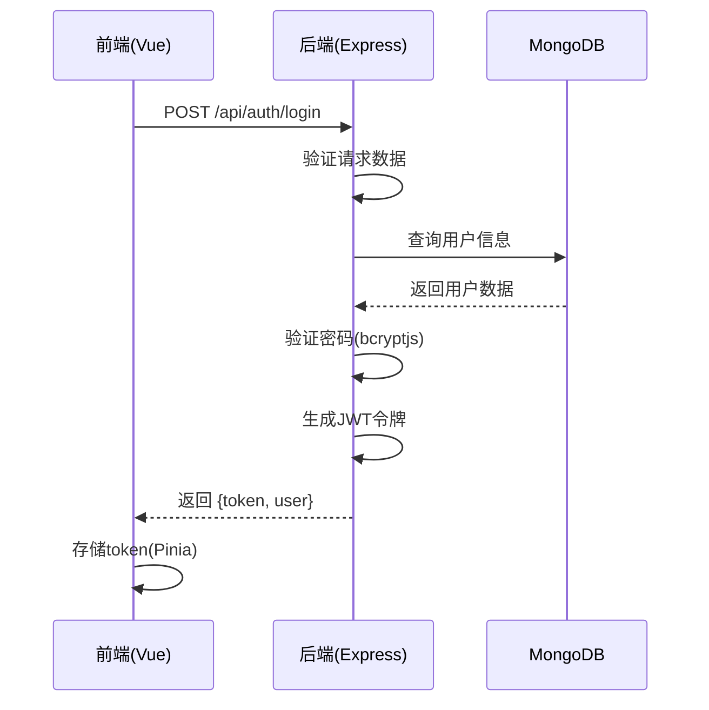
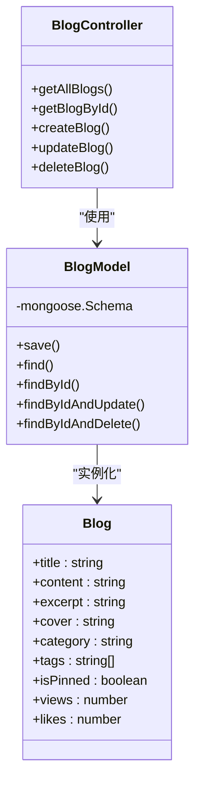
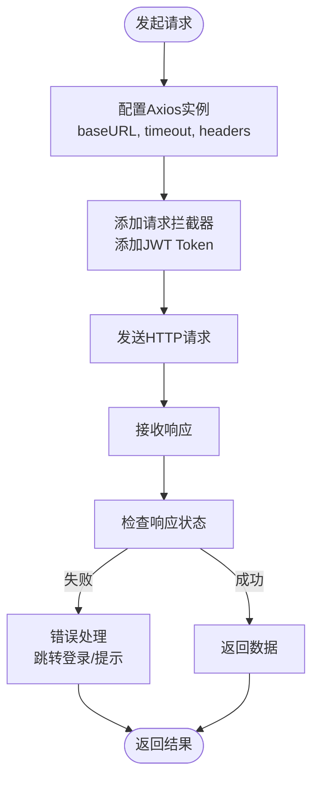
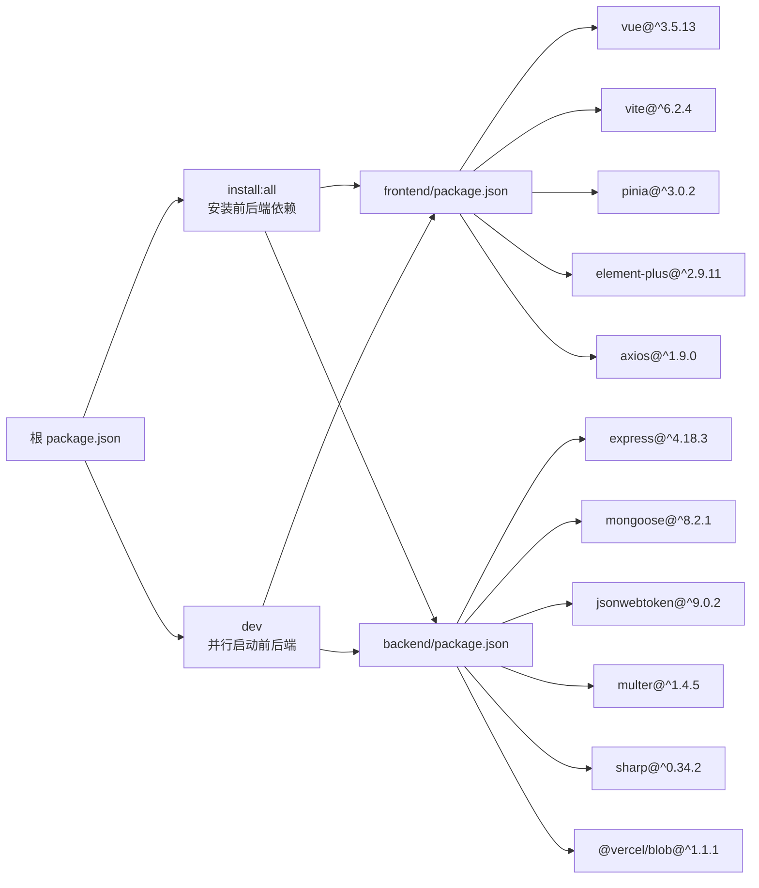

# 开发者指南

<cite>
**本文档引用的文件**   
- [README.md](file://README.md)
- [package.json](file://package.json)
- [backend/package.json](file://backend/package.json)
- [frontend/package.json](file://frontend/package.json)
- [backend/app.js](file://backend/app.js)
- [backend/controllers/authController.js](file://backend/controllers/authController.js)
- [backend/controllers/blogController.js](file://backend/controllers/blogController.js)
- [backend/models/User.js](file://backend/models/User.js)
- [backend/models/Blog.js](file://backend/models/Blog.js)
- [frontend/src/main.js](file://frontend/src/main.js)
- [frontend/src/api/index.ts](file://frontend/src/api/index.ts)
- [frontend/src/services/api.ts](file://frontend/src/services/api.ts)
- [frontend/vite.config.js](file://frontend/vite.config.js)
- [backend/vercel.json](file://backend/vercel.json)
</cite>

## 目录
1. [简介](#简介)
2. [项目结构](#项目结构)
3. [核心组件](#核心组件)
4. [架构概览](#架构概览)
5. [详细组件分析](#详细组件分析)
6. [依赖分析](#依赖分析)
7. [性能考量](#性能考量)
8. [故障排除指南](#故障排除指南)
9. [结论](#结论)

## 简介
本项目是一个功能全面的全栈个人网站，采用前后端分离架构，集成了博客、文档库、图库、评论系统、用户中心和管理面板。项目为 Vercel Serverless 环境优化，支持现代化的 Web 技术栈，具备响应式设计、动态粒子背景和文档在线预览等特性。本文档旨在为新加入的开发者提供详尽的入门指导，涵盖从环境搭建到开发调试的完整流程。

## 项目结构
项目采用清晰的分层结构，前端与后端分离，便于独立开发与部署。整体结构如下：

```mermaid
graph TB
subgraph "根目录"
README[README.md]
PKG[package.json]
CF[cloudflare-worker.js]
end
subgraph "前端 (Vue 3 + Vite)"
Frontend[frontend/]
F_PKG[package.json]
F_SRC[src/]
F_VITE[vite.config.js]
F_ESLINT[eslint.config.js]
subgraph "前端源码"
F_API[api/]
F_COMPONENTS[components/]
F_VIEWS[views/]
F_STORE[store/]
F_ROUTER[router/]
F_UTILS[utils/]
F_TYPES[types/]
F_COMPOSABLES[composables/]
end
end
subgraph "后端 (Node.js + Express)"
Backend[backend/]
B_PKG[package.json]
B_APP[app.js]
B_ROUTES[routes/]
B_CONTROLLERS[controllers/]
B_MODELS[models/]
B_MIDDLEWARE[middleware/]
B_UTILS[utils/]
B_VERCEL[vercel.json]
end
Frontend --> Backend : "API 调用"
Backend --> DB[(MongoDB Atlas)]
Backend --> BLOB[(Vercel Blob)]
README --> Frontend
README --> Backend
```

**Diagram sources**
- [README.md](file://README.md#L1-L174)
- [package.json](file://package.json#L1-L52)

**Section sources**
- [README.md](file://README.md#L1-L174)
- [package.json](file://package.json#L1-L52)

## 核心组件
项目由多个核心模块构成，包括用户认证、博客管理、文档库、图库、评论系统和统一搜索。前端使用 Vue 3 和 Pinia 实现响应式 UI 与状态管理，后端基于 Express 和 MongoDB 提供 RESTful API。文件上传通过 Vercel Blob 服务实现，文档预览集成 Vue-Office 和 pdfjs-dist。系统采用 JWT 进行身份验证，并通过中间件实现权限控制。

**Section sources**
- [README.md](file://README.md#L1-L174)
- [backend/app.js](file://backend/app.js#L1-L237)

## 架构概览
系统采用典型的前后端分离架构，前端通过 Vite 构建，后端以 Express 为基础运行在 Vercel Serverless 环境中。数据库使用 MongoDB Atlas，文件存储使用 Vercel Blob。Cloudflare Worker 可作为 API 代理，提升访问稳定性。

```mermaid
graph TD
A[客户端浏览器] --> B[前端 Vue 应用]
B --> C[Cloudflare Worker (可选)]
C --> D[后端 Express API]
D --> E[MongoDB Atlas]
D --> F[Vercel Blob]
G[GitHub Pages] --> B
H[Vercel] --> D
I[Cloudflare] --> C
style A fill:#f9f,stroke:#333
style B fill:#bbf,stroke:#333
style D fill:#f96,stroke:#333
style E fill:#6f9,stroke:#333
style F fill:#69f,stroke:#333
```

**Diagram sources**
- [backend/app.js](file://backend/app.js#L1-L237)
- [cloudflare-worker.js](file://cloudflare-worker.js#L1-L20)

## 详细组件分析

### 用户认证系统分析
用户认证基于 JWT 实现，包含注册、登录、权限验证等流程。前端通过 `auth.ts` 调用后端 `/api/auth` 接口，后端使用 `authController.js` 处理逻辑，并通过 `auth.js` 中间件进行路由保护。



**Diagram sources**
- [backend/controllers/authController.js](file://backend/controllers/authController.js#L1-L50)
- [frontend/src/api/auth.ts](file://frontend/src/api/auth.ts#L1-L30)

### 博客系统分析
博客系统支持 Markdown 编辑、分类、标签、置顶和搜索。前端通过 `blog.ts` 调用 `/api/blogs` 接口，后端由 `blogController.js` 处理，数据模型定义在 `Blog.js`。



**Diagram sources**
- [backend/controllers/blogController.js](file://backend/controllers/blogController.js#L1-L100)
- [backend/models/Blog.js](file://backend/models/Blog.js#L1-L50)

### 前端API服务分析
前端统一的API服务封装在 `services/api.ts` 中，使用 Axios 配置基础URL和拦截器，处理请求和响应。



**Diagram sources**
- [frontend/src/services/api.ts](file://frontend/src/services/api.ts#L1-L40)
- [frontend/src/api/index.ts](file://frontend/src/api/index.ts#L1-L20)

## 依赖分析
项目依赖清晰分层，前端与后端各自维护 `package.json`。根目录的 `package.json` 通过 `concurrently` 统一管理开发脚本。



**Diagram sources**
- [package.json](file://package.json#L1-L52)
- [frontend/package.json](file://frontend/package.json#L1-L46)
- [backend/package.json](file://backend/package.json#L1-L33)

**Section sources**
- [package.json](file://package.json#L1-L52)
- [frontend/package.json](file://frontend/package.json#L1-L46)
- [backend/package.json](file://backend/package.json#L1-L33)

## 性能考量
- **前端构建**: 使用 Vite 提升开发服务器启动速度和热更新效率。
- **数据库连接**: 在 Vercel Serverless 环境中，通过连接池和重试机制优化 MongoDB 连接。
- **静态资源**: 图片上传使用 `sharp` 进行压缩，文档存储于 Vercel Blob，提升加载速度。
- **缓存策略**: 建议在生产环境中引入 Redis 缓存热门博客和文档数据。
- **CDN加速**: 前端部署于 GitHub Pages 或 Vercel，结合 Cloudflare CDN 提升全球访问速度。

## 故障排除指南
常见问题及解决方案：

**Section sources**
- [backend/app.js](file://backend/app.js#L1-L237)
- [README.md](file://README.md#L1-L174)

| 问题现象 | 可能原因 | 解决方案 |
|--------|--------|--------|
| 数据库连接失败 | MongoDB Atlas 未开放 IP 白名单 | 在 Atlas 控制台添加 `0.0.0.0/0` 到网络访问列表 |
| 文件上传失败 | Vercel Blob Token 未配置 | 检查 `BLOB_READ_WRITE_TOKEN` 环境变量 |
| 前后端无法通信 | CORS 配置不匹配 | 确保 `CORS_ORIGIN` 包含前端域名 |
| JWT 认证失败 | JWT_SECRET 不一致 | 检查前后端环境变量中的密钥是否相同 |
| 文档预览空白 | LibreOffice 未安装或转换失败 | 检查服务器环境或使用替代方案 |

## 结论
本项目结构清晰、技术先进，适合个人开发者快速搭建功能丰富的个人网站。通过本文档，新开发者可快速掌握项目架构、开发流程和调试技巧。建议遵循代码规范，合理使用 Git 分支管理，持续优化性能与用户体验。