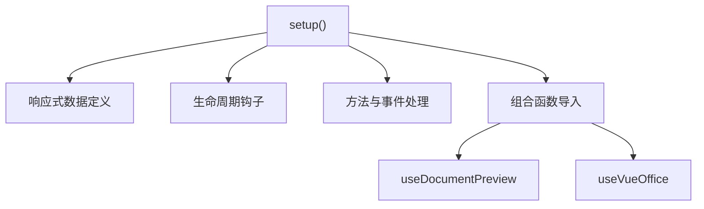
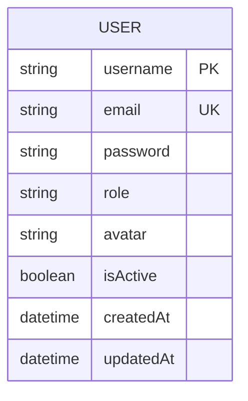
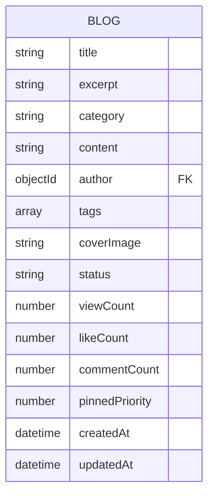
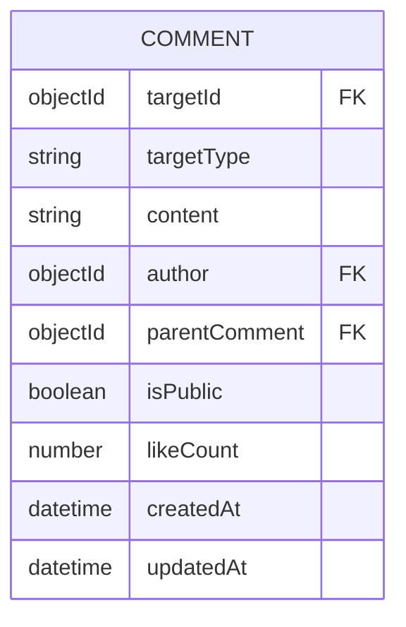

# 技术栈与依赖

<cite>
**本文档引用文件**  
- [frontend/package.json](file://frontend/package.json)
- [backend/package.json](file://backend/package.json)
- [frontend/vite.config.js](file://frontend/vite.config.js)
- [frontend/src/main.js](file://frontend/src/main.js)
- [frontend/src/router/index.js](file://frontend/src/router/index.js)
- [frontend/src/store/index.js](file://frontend/src/store/index.js)
- [backend/app.js](file://backend/app.js)
- [backend/models/User.js](file://backend/models/User.js)
- [backend/models/Blog.js](file://backend/models/Blog.js)
- [backend/models/Comment.js](file://backend/models/Comment.js)
- [backend/models/BlogLike.js](file://backend/models/BlogLike.js)
- [backend/models/Gallery.js](file://backend/models/Gallery.js)
- [backend/vercel.json](file://backend/vercel.json)
- [README.md](file://README.md)
- [cloudflare-worker.js](file://cloudflare-worker.js)
</cite>

## 目录
1. [技术栈概览](#技术栈概览)  
2. [前端技术栈分析](#前端技术栈分析)  
   - [Vue 3 与 Composition API](#vue-3-与-composition-api)  
   - [Vite 构建工具](#vite-构建工具)  
   - [Pinia 状态管理](#pinia-状态管理)  
   - [Element Plus UI 框架](#element-plus-ui-框架)  
3. [后端技术栈分析](#后端技术栈分析)  
   - [Express.js 服务框架](#expressjs-服务框架)  
   - [Mongoose 数据模型抽象](#mongoose-数据模型抽象)  
   - [JWT 身份认证](#jwt-身份认证)  
4. [数据库与存储方案](#数据库与存储方案)  
   - [MongoDB 数据库](#mongodb-数据库)  
   - [Vercel Blob 文件存储](#vercel-blob-文件存储)  
5. [部署架构与环境](#部署架构与环境)  
   - [Vercel Serverless 部署](#vercel-serverless-部署)  
   - [Cloudflare Worker 代理](#cloudflare-worker-代理)  
6. [核心依赖包与功能说明](#核心依赖包与功能说明)  
7. [技术栈全景图](#技术栈全景图)  

## 技术栈概览

本项目采用现代化全栈技术组合，构建了一个功能完整的个人网站系统。整体架构分为前端、后端、数据库和部署环境四大部分：

- **前端**：基于 Vue 3 + Vite + Pinia + Element Plus 的现代化前端架构，支持响应式布局与组件化开发。
- **后端**：使用 Express.js 搭建 RESTful API 服务，结合 Mongoose 实现 MongoDB 数据建模，JWT 实现用户认证。
- **数据库**：采用 MongoDB Atlas 云数据库，支持灵活的文档型数据存储。
- **部署**：前后端分别部署于 Vercel Serverless 环境，文件存储使用 Vercel Blob，可选 Cloudflare Worker 作为 API 代理以提升访问稳定性。

该技术选型兼顾开发效率、性能表现与可维护性，适用于中小型个人项目或内容型网站。

## 前端技术栈分析

### Vue 3 与 Composition API

Vue 3 是当前主流的渐进式前端框架，本项目采用其 Composition API 模式进行开发，显著提升了组件的复用性与逻辑组织能力。

**优势分析**：
- **逻辑聚合**：将相关逻辑（如用户认证、数据获取）集中定义在 `setup()` 中，避免 Options API 的分散问题。
- **组合函数（Composables）**：通过 `useDocumentPreview.js` 和 `useVueOffice.js` 等自定义 Hook 实现功能复用，降低重复代码。
- **TypeScript 支持**：结合 `tsconfig.json` 提供强类型检查，提升代码健壮性。



**Section sources**  
- [frontend/src/main.js](file://frontend/src/main.js#L0-L47)
- [frontend/src/composables/useDocumentPreview.js](file://frontend/src/composables/useDocumentPreview.js)
- [frontend/src/composables/useVueOffice.js](file://frontend/src/composables/useVueOffice.js)

### Vite 构建工具

Vite 是基于原生 ES 模块的前端构建工具，显著提升开发体验与构建性能。

**关键配置**：
- **开发服务器代理**：通过 `vite.config.js` 配置 `/api` 路径代理至后端 `http://localhost:3000`，解决跨域问题。
- **代码分割优化**：使用 `manualChunks` 将第三方库（如 Vue、Pinia）与粒子特效库（particles.js）分离打包，减少主包体积。
- **别名配置**：`@` 指向 `src` 目录，简化模块导入路径。

```javascript
// vite.config.js 片段
build: {
  rollupOptions: {
    output: {
      manualChunks: {
        vendor: ['vue', 'vue-router', 'pinia'],
        particles: ['particles.js']
      }
    }
  }
}
```

**Section sources**  
- [frontend/vite.config.js](file://frontend/vite.config.js#L0-L52)

### Pinia 状态管理

Pinia 是 Vue 官方推荐的状态管理库，替代 Vuex，提供更简洁的 API 与更好的 TypeScript 支持。

**实现结构**：
- **主入口**：`src/store/index.js` 创建并导出 Pinia 实例。
- **模块化设计**：`modules/auth.js` 管理用户认证状态，`modules/blog.js` 管理博客相关状态。
- **自动加载**：在 `main.js` 中通过 `app.use(createPinia())` 注册。

```mermaid
classDiagram
class Pinia {
+createPinia()
}
class AuthModule {
+state : { user, token }
+actions : login(), logout()
+getters : isAuthenticated()
}
class BlogModule {
+state : { blogs, currentBlog }
+actions : fetchBlogs(), addBlog()
}
Pinia --> AuthModule : "包含"
Pinia --> BlogModule : "包含"
```

**Diagram sources**  
- [frontend/src/store/index.js](file://frontend/src/store/index.js#L0-L9)
- [frontend/src/store/modules/auth.js](file://frontend/src/store/modules/auth.js)
- [frontend/src/store/modules/blog.js](file://frontend/src/store/modules/blog.js)

**Section sources**  
- [frontend/src/store/index.js](file://frontend/src/store/index.js#L0-L9)
- [frontend/src/main.js](file://frontend/src/main.js#L38-L42)

### Element Plus UI 框架

Element Plus 是一套为 Vue 3 设计的桌面端组件库，提供丰富的 UI 组件如表格、表单、对话框等。

**集成方式**：
- 在 `main.js` 中通过 `app.use(ElementPlus)` 全局注册。
- 引入 CSS 文件 `element-plus/dist/index.css`。
- 图标组件通过 `@element-plus/icons-vue` 动态注册。

该框架显著提升开发效率，确保界面风格统一。

**Section sources**  
- [frontend/src/main.js](file://frontend/src/main.js#L15-L18)

## 后端技术栈分析

### Express.js 服务框架

Express.js 是 Node.js 的轻量级 Web 框架，用于构建 RESTful API。

**核心功能**：
- **路由管理**：`routes/` 目录下按模块划分路由（如 `blog.js`, `authRoutes.js`）。
- **中间件机制**：使用 `cors` 处理跨域，`express.json()` 解析 JSON 请求体。
- **环境适配**：通过 `isVercel` 判断是否运行在 Vercel 环境，动态调整静态文件服务。

```javascript
// app.js 片段
app.use(cors({
  origin: ['https://vorest0628.github.io', 'http://localhost:5173']
}))
app.use(express.json())
```

**Section sources**  
- [backend/app.js](file://backend/app.js#L29-L75)

### Mongoose 数据模型抽象

Mongoose 是 MongoDB 的 ODM（对象数据建模）库，提供 Schema 定义、数据验证、中间件等功能。

**模型示例分析**：

#### 用户模型（User）
- **字段**：用户名、邮箱、密码（加密存储）、角色、头像。
- **验证规则**：邮箱格式、密码长度、唯一性约束。
- **中间件**：`pre('save')` 自动加密密码。
- **方法**：`comparePassword()` 验证密码。



**Diagram sources**  
- [backend/models/User.js](file://backend/models/User.js#L0-L89)

#### 博客模型（Blog）
- **字段**：标题、摘要、内容、分类、标签、封面图、作者。
- **索引优化**：文本索引支持全文搜索，复合索引优化置顶与状态查询。



**Diagram sources**  
- [backend/models/Blog.js](file://backend/models/Blog.js#L0-L57)

#### 评论模型（Comment）
- **多态关联**：通过 `targetId` + `targetType` 关联博客、图库、文档等。
- **嵌套结构**：支持评论回复（`parentComment` 字段）。
- **虚拟字段**：`replies` 自动聚合子评论。



**Diagram sources**  
- [backend/models/Comment.js](file://backend/models/Comment.js#L0-L66)

**Section sources**  
- [backend/models/User.js](file://backend/models/User.js#L0-L89)
- [backend/models/Blog.js](file://backend/models/Blog.js#L0-L57)
- [backend/models/Comment.js](file://backend/models/Comment.js#L0-L66)

### JWT 身份认证

JWT（JSON Web Token）用于用户登录状态管理。

**实现流程**：
1. 用户登录时，后端验证凭据，生成 JWT。
2. 前端存储 Token（通常在 localStorage）。
3. 后续请求通过 `Authorization` 头携带 Token。
4. 后端中间件 `middleware/auth.js` 验证 Token 有效性。

依赖包 `jsonwebtoken` 提供签发与验证功能。

**Section sources**  
- [backend/middleware/auth.js](file://backend/middleware/auth.js)

## 数据库与存储方案

### MongoDB 数据库

项目使用 MongoDB 作为主数据库，部署于 MongoDB Atlas 云服务。

**优势**：
- **灵活模式**：无需预定义表结构，适合内容型网站。
- **高性能**：支持索引、聚合管道，满足复杂查询需求。
- **云托管**：Atlas 提供免费集群，易于集成。

环境变量 `MONGODB_URI` 配置连接字符串。

**Section sources**  
- [backend/app.js](file://backend/app.js#L0-L27)
- [README.md](file://README.md#L96-L129)

### Vercel Blob 文件存储

文件（如文档、图片）上传使用 Vercel Blob 服务。

**实现方式**：
- 依赖包 `@vercel/blob` 提供上传与下载接口。
- 环境变量 `BLOB_READ_WRITE_TOKEN` 配置访问密钥。
- 上传文件返回唯一 URL，存储于数据库记录中。

该方案避免了传统文件服务器的运维成本，与 Vercel 生态无缝集成。

**Section sources**  
- [backend/package.json](file://backend/package.json#L0-L32)
- [README.md](file://README.md#L132-L160)

## 部署架构与环境

### Vercel Serverless 部署

前后端均部署于 Vercel，采用 Serverless 架构。

**后端部署**：
- `vercel.json` 配置路由规则，将 `/api/*` 指向 `app.js`。
- 自动识别 `package.json` 启动脚本，运行 Node.js 函数。

```json
{
  "routes": [
    { "src": "/api/(.*)", "dest": "/app.js" }
  ]
}
```

**前端部署**：
- 使用 `vite build` 构建静态文件。
- 部署至 GitHub Pages 或 Vercel。

**Section sources**  
- [backend/vercel.json](file://backend/vercel.json#L0-L18)
- [README.md](file://README.md#L132-L160)

### Cloudflare Worker 代理

为解决 Vercel 在中国大陆访问不稳定问题，可选 Cloudflare Worker 作为 API 代理。

**工作原理**：
- Worker 接收前端请求，转发至 Vercel 后端。
- 添加 CORS 头部，支持跨域。
- 缓存策略优化响应速度。

```javascript
// cloudflare-worker.js
const API_ORIGIN = 'https://your-backend.vercel.app'
```

前端配置 `VITE_APP_API_URL` 指向 Worker 域名。

**Section sources**  
- [cloudflare-worker.js](file://cloudflare-worker.js#L0-L43)
- [README.md](file://README.md#L132-L160)

## 核心依赖包与功能说明

| 依赖包 | 版本 | 功能说明 |
|-------|------|---------|
| **@vercel/blob** | ^1.1.1 | Vercel Blob 文件上传与管理 |
| **sharp** | ^0.34.2 | 高性能图像处理（缩略图生成、格式转换） |
| **particles.js** | ^2.0.0 | 页面粒子背景动画效果 |
| **pdfjs-dist** | ^5.3.93 | PDF 文件前端渲染 |
| **@vue-office/docx** | ^1.6.3 | Word 文档在线预览 |
| **@vue-office/pptx** | ^1.0.1 | PPT 文件在线预览 |
| **mammoth** | ^1.9.1 | Word 文档转 HTML |
| **libreoffice-convert** | ^1.6.1 | 文档格式转换（需 LibreOffice 环境） |
| **pdf2pic** | ^3.2.0 | PDF 页面转图片 |
| **bcryptjs** | ^2.4.3 | 密码加密哈希 |
| **jsonwebtoken** | ^9.0.2 | JWT 生成与验证 |
| **mongoose** | ^8.2.1 | MongoDB 数据建模与操作 |
| **express** | ^4.18.3 | Web 服务框架 |
| **vite** | ^6.2.4 | 前端构建工具 |
| **vue** | ^3.5.13 | 前端框架 |
| **pinia** | ^3.0.2 | 状态管理 |
| **element-plus** | ^2.9.11 | UI 组件库 |

**Section sources**  
- [frontend/package.json](file://frontend/package.json#L0-L45)
- [backend/package.json](file://backend/package.json#L0-L32)

## 技术栈全景图

```mermaid
graph TB
subgraph "前端 (Vercel/GitHub Pages)"
A[Vue 3] --> B[Vite]
B --> C[Pinia]
C --> D[Element Plus]
D --> E[particles.js]
E --> F[PDF/Office 预览]
end
subgraph "后端 (Vercel Serverless)"
G[Express.js] --> H[Mongoose]
H --> I[MongoDB Atlas]
G --> J[JWT]
G --> K[@vercel/blob]
K --> L[Vercel Blob 存储]
G --> M[sharp]
end
subgraph "代理 (Cloudflare Worker)"
N[API 请求] --> O[转发至后端]
O --> P[添加 CORS]
end
A --> |API 调用| G
G --> |代理| N
M --> |图像处理| K
```

**Diagram sources**  
- [frontend/package.json](file://frontend/package.json)
- [backend/package.json](file://backend/package.json)
- [README.md](file://README.md)