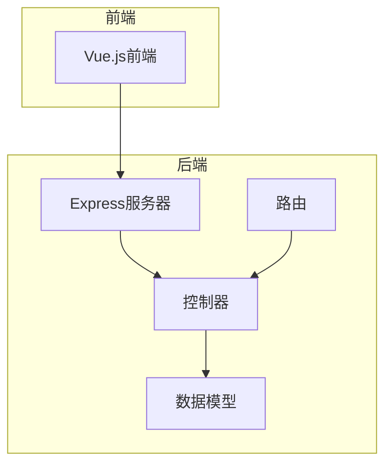
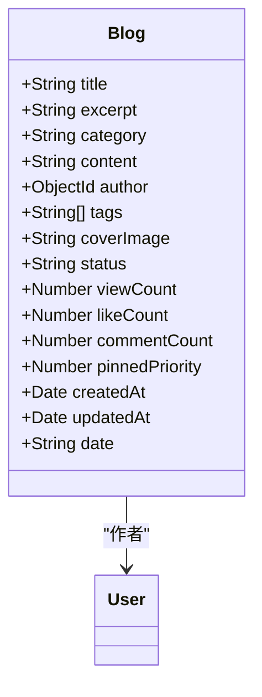
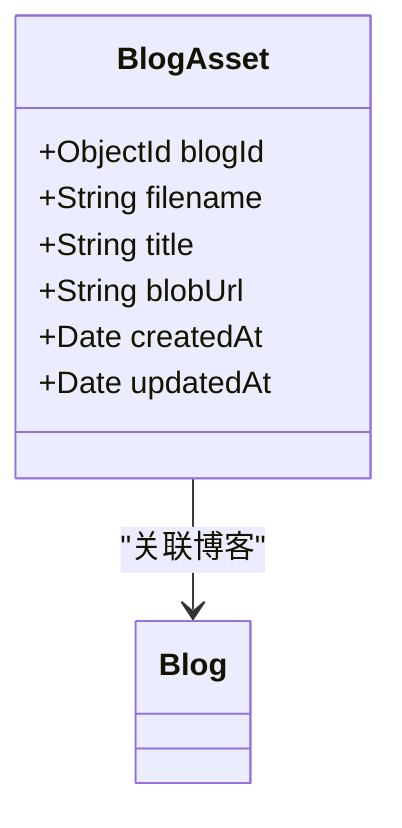
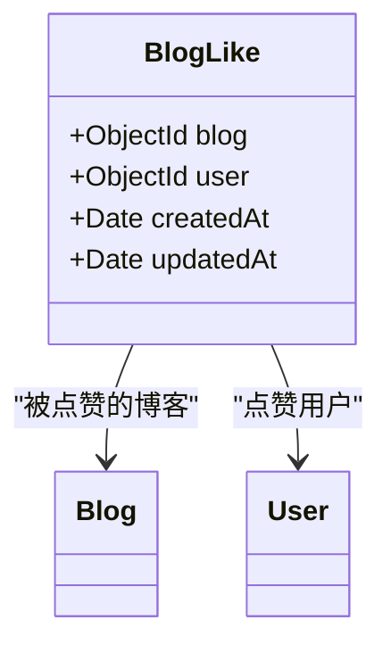
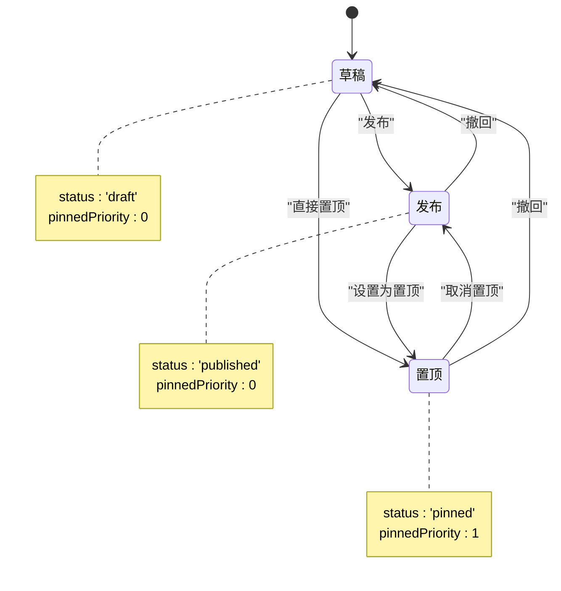
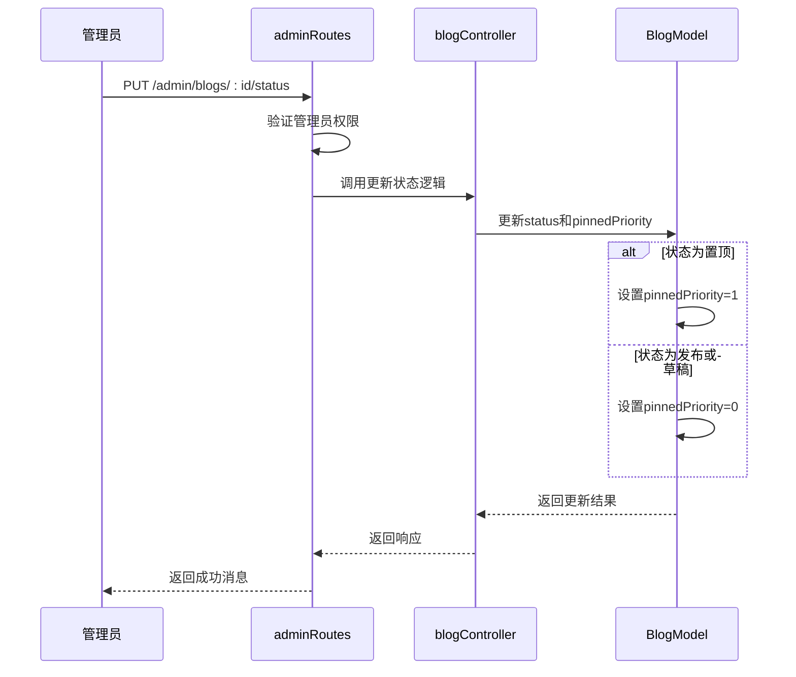
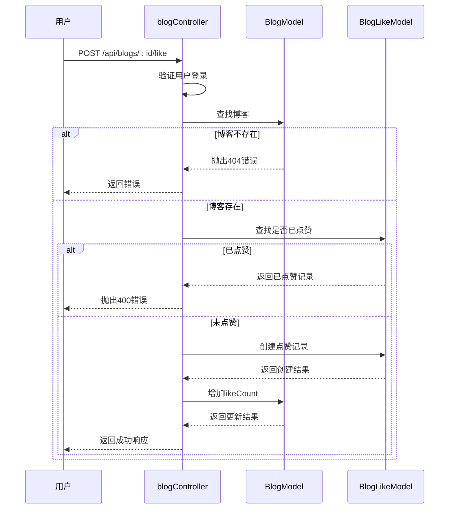
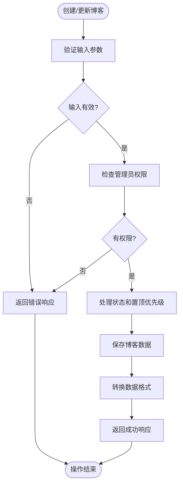

# Blog模型

<cite>
**本文档引用文件**   
- [Blog.js](file://backend/models/Blog.js)
- [BlogAsset.js](file://backend/models/BlogAsset.js)
- [BlogLike.js](file://backend/models/BlogLike.js)
- [blogController.js](file://backend/controllers/blogController.js)
- [adminRoutes.js](file://backend/routes/adminRoutes.js)
- [blog.js](file://backend/routes/blog.js)
</cite>

## 目录
1. [项目结构](#项目结构)
2. [核心数据模型分析](#核心数据模型分析)
3. [博客状态机与管理流程](#博客状态机与管理流程)
4. [点赞功能实现](#点赞功能实现)
5. [数据库查询优化建议](#数据库查询优化建议)
6. [CRUD操作实现细节](#crud操作实现细节)

## 项目结构

本项目采用前后端分离架构，后端基于Node.js和Express框架，使用Mongoose操作MongoDB数据库。博客系统的核心功能集中在`backend`目录下。



**图示来源**
- [项目结构](file://)

## 核心数据模型分析

### Blog模型字段设计

**Blog模型**是博客系统的核心数据结构，定义了博客文章的完整信息。



**图示来源**
- [Blog.js](file://backend/models/Blog.js#L1-L130)

**字段说明**：
- **标题**：博客标题，必填字段，自动去除首尾空格
- **摘要**：博客摘要，必填字段，最大长度500字符
- **分类**：博客分类，必填字段，字符串类型
- **内容**：博客正文内容，必填字段
- **作者**：关联用户ID，引用User模型
- **标签**：标签数组，支持多个标签
- **封面图**：封面图片URL，默认为空字符串
- **状态**：博客状态，枚举值['draft', 'published', 'pinned']，默认'draft'
- **阅读量**：浏览次数统计，默认0
- **点赞数**：点赞数量统计，默认0
- **评论数**：评论数量统计，默认0
- **置顶优先级**：数值越大优先级越高，默认0

**Section sources**
- [Blog.js](file://backend/models/Blog.js#L1-L130)

### BlogAsset模型：静态资源管理

**BlogAsset模型**用于管理博客中的静态资源文件，如图片、附件等。



**图示来源**
- [BlogAsset.js](file://backend/models/BlogAsset.js#L1-L38)

**字段说明**：
- **blogId**：关联的博客ID，引用Blog模型
- **filename**：文件名，必填字段
- **title**：资源标题，可选
- **blobUrl**：资源的blob URL，必填字段

该模型通过复合唯一索引`{blogId: 1, filename: 1}`确保同一博客下文件名的唯一性，有效防止文件名冲突。

**Section sources**
- [BlogAsset.js](file://backend/models/BlogAsset.js#L1-L38)

### BlogLike模型：点赞关系管理

**BlogLike模型**记录用户对博客的点赞行为，实现点赞去重和统计功能。



**图示来源**
- [BlogLike.js](file://backend/models/BlogLike.js#L1-L31)

**字段说明**：
- **blog**：被点赞的博客ID，引用Blog模型
- **user**：点赞用户的ID，引用User模型

通过复合唯一索引`{blog: 1, user: 1}`确保一个用户只能对一篇博客点赞一次，实现了点赞去重的核心功能。

**Section sources**
- [BlogLike.js](file://backend/models/BlogLike.js#L1-L31)

## 博客状态机与管理流程

### 博客状态机实现

博客系统实现了基于状态机的内容管理流程，支持草稿、发布和置顶三种状态。



**图示来源**
- [Blog.js](file://backend/models/Blog.js#L60-L65)
- [adminRoutes.js](file://backend/routes/adminRoutes.js#L400-L430)

**状态说明**：
- **草稿**（draft）：文章创建后的初始状态，仅管理员可见
- **发布**（published）：正常发布的文章，对所有用户可见
- **置顶**（pinned）：置顶文章，优先级高于普通发布文章

**Section sources**
- [Blog.js](file://backend/models/Blog.js#L60-L65)
- [adminRoutes.js](file://backend/routes/adminRoutes.js#L400-L430)

### 管理后台控制流程

管理员通过`adminRoutes.js`中的路由实现博客状态的管理和控制。



**图示来源**
- [adminRoutes.js](file://backend/routes/adminRoutes.js#L400-L430)
- [blogController.js](file://backend/controllers/blogController.js#L250-L280)

**控制流程说明**：
1. 管理员发送状态更新请求到`/admin/blogs/:id/status`端点
2. 中间件验证管理员身份和权限
3. 调用博客控制器的更新逻辑
4. 根据新状态自动设置`pinnedPriority`：
   - 置顶状态：`pinnedPriority`设为1
   - 其他状态：`pinnedPriority`设为0
5. 返回更新结果

**Section sources**
- [adminRoutes.js](file://backend/routes/adminRoutes.js#L400-L430)
- [blogController.js](file://backend/controllers/blogController.js#L250-L280)

## 点赞功能实现

### 点赞功能架构

博客点赞功能通过`BlogLike`模型和相关控制器方法实现完整的点赞/取消点赞流程。



**图示来源**
- [blogController.js](file://backend/controllers/blogController.js#L300-L350)
- [blog.js](file://backend/routes/blog.js#L20-L22)

**Section sources**
- [blogController.js](file://backend/controllers/blogController.js#L300-L350)
- [blog.js](file://backend/routes/blog.js#L20-L22)

### 点赞功能核心逻辑

点赞功能的核心逻辑在`blogController.js`中实现，包含以下关键步骤：

1. **权限验证**：检查用户是否已登录
2. **博客存在性检查**：验证目标博客是否存在
3. **去重检查**：查询`BlogLike`模型，检查用户是否已点赞
4. **创建点赞记录**：在`BlogLike`集合中创建新记录
5. **更新点赞数**：增加对应博客的`likeCount`字段

```javascript
// 点赞博客
exports.likeBlog = async (req, res, next) => {
  try {
    const { id } = req.params
    
    if (!req.user) {
      throw new ApiError(401, '请先登录')
    }

    const blog = await Blog.findById(id)
    if (!blog) {
      throw new ApiError(404, '博客不存在')
    }

    // 检查是否已经点赞
    const existingLike = await BlogLike.findOne({
      blog: id,
      user: req.user.id
    })

    if (existingLike) {
      throw new ApiError(400, '您已经点赞过这篇博客')
    }

    // 创建点赞记录
    await BlogLike.create({
      blog: id,
      user: req.user.id
    })

    // 更新博客点赞数
    blog.likeCount += 1
    await blog.save()

    res.json({
      success: true,
      message: '点赞成功',
      data: { likeCount: blog.likeCount }
    })
  } catch (error) {
    next(error)
  }
}
```

**Section sources**
- [blogController.js](file://backend/controllers/blogController.js#L300-L350)

## 数据库查询优化建议

### 索引优化策略

Blog模型已定义了多个索引以优化查询性能：

```mermaid
erDiagram
BLOG {
string title PK
string excerpt
string category
string content
objectId author
string[] tags
string coverImage
string status
number viewCount
number likeCount
number commentCount
number pinnedPriority
date createdAt
date updatedAt
}
index "文本索引" on (title, content, excerpt, category, tags)
index "分类索引" on (category)
index "状态索引" on (status)
index "置顶优先级索引" on (pinnedPriority)
index "时间索引" on (createdAt)
index "复合索引" on (status, pinnedPriority, createdAt)
```

**图示来源**
- [Blog.js](file://backend/models/Blog.js#L85-L105)

**现有索引分析**：
- **文本索引**：支持对标题、内容、摘要、分类和标签的全文搜索
- **分类索引**：优化按分类查询的性能
- **状态索引**：优化按状态过滤的查询
- **时间索引**：优化按创建时间排序的查询
- **复合索引**：优化首页展示等复杂查询

**Section sources**
- [Blog.js](file://backend/models/Blog.js#L85-L105)

### 复合索引优化建议

针对列表页性能，建议建立以下复合索引：

```javascript
// 建议的复合索引
blogSchema.index({ 
  status: 1, 
  category: 1, 
  pinnedPriority: -1, 
  createdAt: -1 
})

// 标签查询优化索引
blogSchema.index({ 
  tags: 1, 
  status: 1, 
  createdAt: -1 
})
```

这些复合索引可以显著提升以下场景的查询性能：
- 按状态和分类组合查询
- 按标签过滤的查询
- 首页和分类页的综合排序查询

**Section sources**
- [Blog.js](file://backend/models/Blog.js#L85-L105)

## CRUD操作实现细节

### 创建与更新操作

博客的创建和更新操作在`blogController.js`中实现，遵循标准的CRUD模式。



**图示来源**
- [blogController.js](file://backend/controllers/blogController.js#L150-L250)
- [adminRoutes.js](file://backend/routes/adminRoutes.js#L300-L350)

**Section sources**
- [blogController.js](file://backend/controllers/blogController.js#L150-L250)
- [adminRoutes.js](file://backend/routes/adminRoutes.js#L300-L350)

### 创建操作实现

创建博客的实现细节：

```javascript
exports.createBlog = async (req, res, next) => {
  try {
    // 构建博客数据
    const status = req.body.status || 'draft'
    const blogData = {
      title: req.body.title,
      excerpt: req.body.excerpt,
      content: req.body.content,
      category: req.body.category,
      tags: req.body.tags || [],
      status,
      pinnedPriority: status === 'pinned' ? 1 : 0,
      author: req.user.id
    }

    // 创建博客
    const blog = await Blog.create(blogData)
    
    // ...返回响应
  } catch (error) {
    next(error)
  }
}
```

关键点：
- 自动设置作者为当前登录用户
- 根据状态自动设置`pinnedPriority`
- 默认状态为'draft'（草稿）

**Section sources**
- [blogController.js](file://backend/controllers/blogController.js#L150-L180)

### 更新操作实现

更新博客的实现细节：

```javascript
exports.updateBlog = async (req, res, next) => {
  try {
    const { id } = req.params
    const updateData = req.body

    // 查找现有博客
    const existingBlog = await Blog.findById(id)
    if (!existingBlog) {
      throw new ApiError(404, '博客不存在')
    }

    // 检查权限
    if (req.user.role !== 'admin') {
      throw new ApiError(403, '没有权限修改此博客')
    }

    // 处理置顶优先级
    if (updateData.status) {
      updateData.pinnedPriority = updateData.status === 'pinned' ? 1 : 0
    }

    // 合并更新数据
    Object.assign(existingBlog, updateData)
    
    // 保存博客
    const updatedBlog = await existingBlog.save()
    
    // ...返回响应
  } catch (error) {
    next(error)
  }
}
```

关键点：
- 先查找现有博客记录
- 严格检查管理员权限
- 自动处理状态变更时的`pinnedPriority`同步
- 使用`Object.assign`合并更新数据

**Section sources**
- [blogController.js](file://backend/controllers/blogController.js#L180-L250)

### 软删除操作实现

系统实现了软删除模式，通过`deleteOne()`方法删除博客：

```javascript
exports.deleteBlog = async (req, res, next) => {
  try {
    // 查找博客
    const blog = await Blog.findById(req.params.id)
    
    // 检查博客是否存在
    if (!blog) {
      throw new ApiError(404, '博客不存在')
    }

    // 检查权限
    if (req.user.role !== 'admin') {
      throw new ApiError(403, '没有权限删除此博客')
    }

    // 删除博客
    await blog.deleteOne()

    res.json({ success: true, message: '博客已删除' })
  } catch (error) {
    next(error)
  }
}
```

**Section sources**
- [blogController.js](file://backend/controllers/blogController.js#L250-L280)