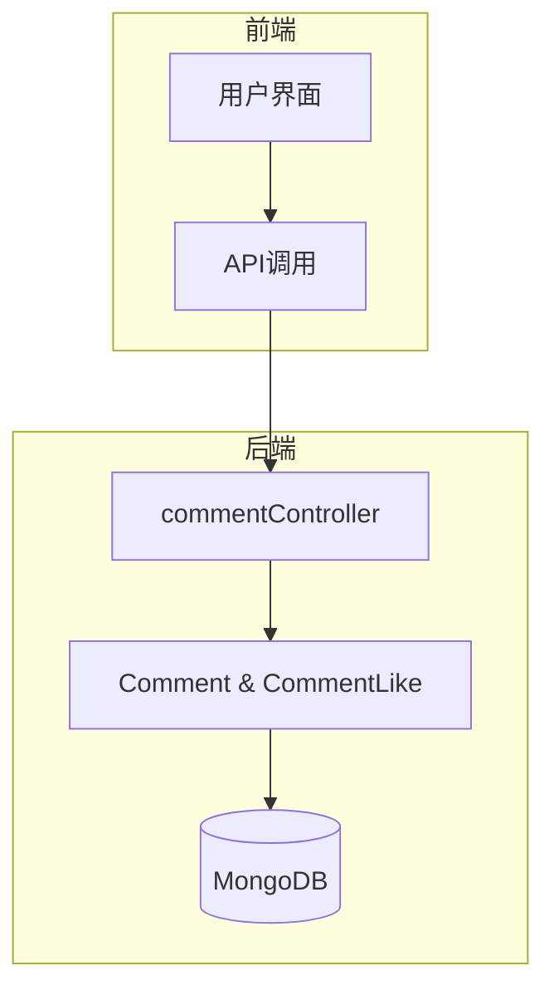
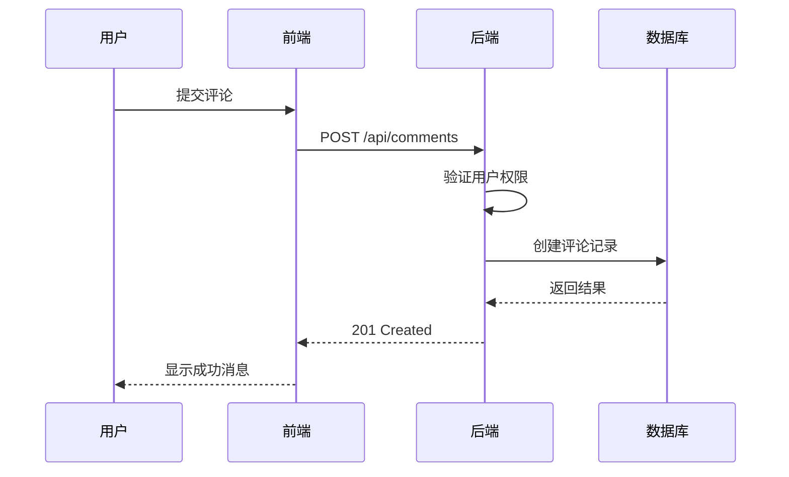
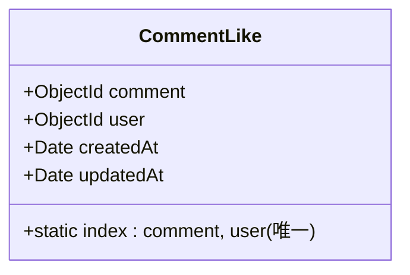
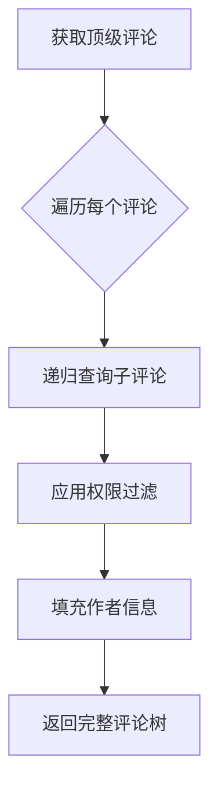
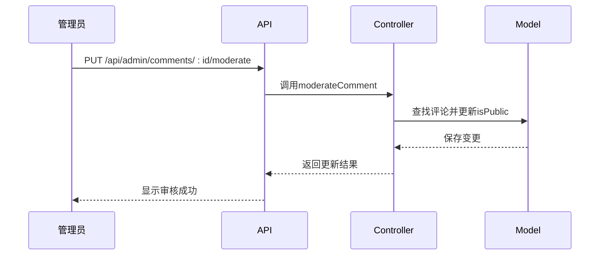
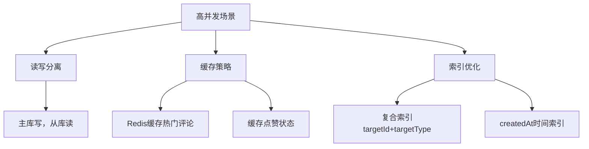
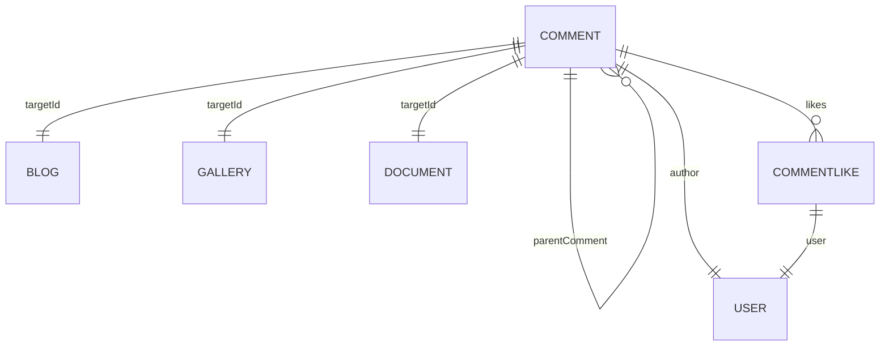

# Comment模型

<cite>
**本文档引用文件**   
- [Comment.js](file://backend/models/Comment.js)
- [CommentLike.js](file://backend/models/CommentLike.js)
- [commentController.js](file://backend/controllers/commentController.js)
</cite>

## 目录
1. [简介](#简介)
2. [项目结构](#项目结构)
3. [核心组件](#核心组件)
4. [架构概览](#架构概览)
5. [详细组件分析](#详细组件分析)
6. [依赖分析](#依赖分析)
7. [性能考虑](#性能考虑)
8. [故障排除指南](#故障排除指南)
9. [结论](#结论)

## 简介
本文档详细阐述了评论系统的设计与实现，涵盖Comment模型的结构设计、多级嵌套评论树的实现机制、点赞功能逻辑、审核机制以及高并发场景下的性能优化策略。目标是为开发者和维护人员提供全面的技术参考。

## 项目结构
项目采用前后端分离架构，后端基于Node.js + Express + Mongoose实现，前端使用Vue.js构建。评论系统相关代码主要分布在`backend/models`和`backend/controllers`目录下。



**图示来源**
- [Comment.js](file://backend/models/Comment.js)
- [CommentLike.js](file://backend/models/CommentLike.js)
- [commentController.js](file://backend/controllers/commentController.js)

**本节来源**
- [Comment.js](file://backend/models/Comment.js)
- [CommentLike.js](file://backend/models/CommentLike.js)

## 核心组件
评论系统由两个核心数据模型构成：`Comment`（评论）和`CommentLike`（评论点赞），分别用于存储评论内容和用户点赞关系。

**本节来源**
- [Comment.js](file://backend/models/Comment.js#L1-L82)
- [CommentLike.js](file://backend/models/CommentLike.js#L1-L31)

## 架构概览
系统通过RESTful API提供评论的增删改查及点赞功能，结合Mongoose ODM实现MongoDB的数据操作，权限控制通过JWT中间件完成。



**图示来源**
- [commentController.js](file://backend/controllers/commentController.js#L150-L180)

## 详细组件分析

### Comment模型分析
`Comment`模型定义了评论的核心数据结构，支持多种目标资源类型的评论，并实现多级嵌套回复。

#### 数据结构
```mermaid
classDiagram
class Comment {
+ObjectId targetId
+String targetType
+String content
+ObjectId author
+ObjectId parentComment
+Boolean isPublic
+Number likeCount
+Date createdAt
+Date updatedAt
+Array replies
+static index : targetId, targetType, isPublic
+static index : createdAt
}
Comment : targetType枚举值 : Blog, Gallery, Document, General
Comment : replies 虚拟字段，关联子评论
```

**图示来源**
- [Comment.js](file://backend/models/Comment.js#L15-L82)

**本节来源**
- [Comment.js](file://backend/models/Comment.js#L15-L82)

#### 字段说明
- **targetId**: 关联目标对象的ID（如博客文章ID）
- **targetType**: 目标类型，支持`Blog`、`Gallery`、`Document`、`General`
- **content**: 评论内容，最大2000字符
- **author**: 评论作者ID，引用User模型
- **parentComment**: 父评论ID，实现回复功能，null表示顶级评论
- **isPublic**: 是否公开显示
- **likeCount**: 点赞数统计
- **replies**: 虚拟字段，自动填充子评论列表

### CommentLike模型分析
`CommentLike`模型用于管理用户对评论的点赞行为，防止重复点赞。

#### 数据结构


**图示来源**
- [CommentLike.js](file://backend/models/CommentLike.js#L1-L31)

**本节来源**
- [CommentLike.js](file://backend/models/CommentLike.js#L1-L31)

#### 防重复点赞机制
通过在`comment`和`user`字段上创建复合唯一索引，确保同一用户对同一条评论只能点赞一次。

```javascript
commentLikeSchema.index({ comment: 1, user: 1 }, { unique: true })
```

### 多级嵌套评论树实现
系统通过`parentComment`字段和虚拟字段`replies`实现无限层级的评论嵌套。

#### 查询逻辑


**图示来源**
- [commentController.js](file://backend/controllers/commentController.js#L80-L140)

**本节来源**
- [commentController.js](file://backend/controllers/commentController.js#L80-L140)

#### 递归查询实现
```javascript
const getReplies = async (commentId) => {
  const replies = await Comment.find({ parentComment: commentId })
  for (const reply of replies) {
    reply.replies = await getReplies(reply._id)
  }
  return replies
}
```

### 评论审核机制
管理员可通过API接口审核评论的公开状态。

#### 审核流程


**图示来源**
- [commentController.js](file://backend/controllers/commentController.js#L390-L410)

**本节来源**
- [commentController.js](file://backend/controllers/commentController.js#L390-L410)

#### 权限控制
- 管理员可审核所有评论
- 普通用户只能查看公开评论或自己的私有评论
- 未登录用户仅能查看公开评论

### 性能优化方案

#### 防止无限递归查询
1. **限制层级深度**：可在查询时添加层级参数，避免过深嵌套
2. **路径枚举模式**：在评论中存储祖先路径，减少递归查询
3. **分页加载回复**：仅在用户点击"查看回复"时加载子评论

#### 高并发性能调优


**图示来源**
- [Comment.js](file://backend/models/Comment.js#L70-L75)
- [commentController.js](file://backend/controllers/commentController.js)

**本节来源**
- [Comment.js](file://backend/models/Comment.js#L70-L75)
- [commentController.js](file://backend/controllers/commentController.js)

#### 具体优化建议
- **索引优化**：已创建`targetId, targetType, isPublic`复合索引和`createdAt`时间索引
- **缓存策略**：对热门内容的评论列表进行Redis缓存
- **分页处理**：所有评论查询均支持分页，限制单页最大数量
- **批量操作**：删除评论时递归删除子评论，确保数据一致性
- **连接池**：配置MongoDB连接池以应对高并发

## 依赖分析
评论系统依赖于用户认证、目标资源模型和数据库持久化。



**图示来源**
- [Comment.js](file://backend/models/Comment.js)
- [CommentLike.js](file://backend/models/CommentLike.js)

**本节来源**
- [Comment.js](file://backend/models/Comment.js)
- [CommentLike.js](file://backend/models/CommentLike.js)

## 性能考虑
- **查询性能**：通过合理索引设计确保查询效率
- **写入性能**：点赞操作涉及两个操作（创建点赞记录+更新计数），建议使用事务或队列异步处理
- **内存使用**：深层嵌套评论可能导致内存占用过高，建议限制最大层级
- **扩展性**：当前设计支持水平扩展，可通过增加MongoDB副本集提升性能

## 故障排除指南
常见问题及解决方案：

| 问题现象 | 可能原因 | 解决方案 |
|--------|--------|--------|
| 无法发表评论 | 未登录 | 检查认证状态 |
| 点赞失败 | 已点赞 | 提示用户不能重复点赞 |
| 评论不显示 | 权限不足 | 检查isPublic状态和用户角色 |
| 性能缓慢 | 缺少索引 | 确认相关字段已建立索引 |
| 数据不一致 | 异常中断 | 检查点赞数与实际点赞记录是否匹配 |

**本节来源**
- [commentController.js](file://backend/controllers/commentController.js)

## 结论
评论系统设计合理，功能完整，支持多级嵌套、点赞、审核等核心功能。通过Mongoose的虚拟字段和引用机制实现了优雅的数据关联，权限控制严密。建议在高并发场景下引入缓存机制，并考虑对深层嵌套评论进行分页加载优化，以进一步提升系统性能和用户体验。