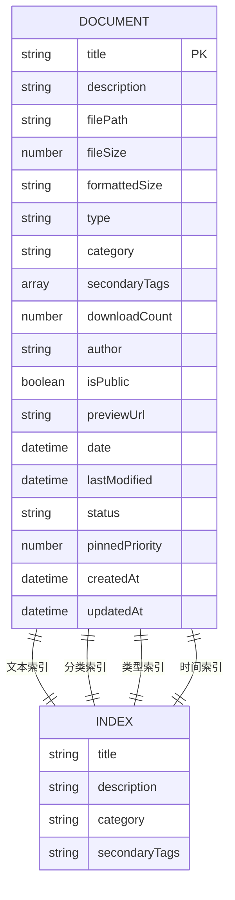
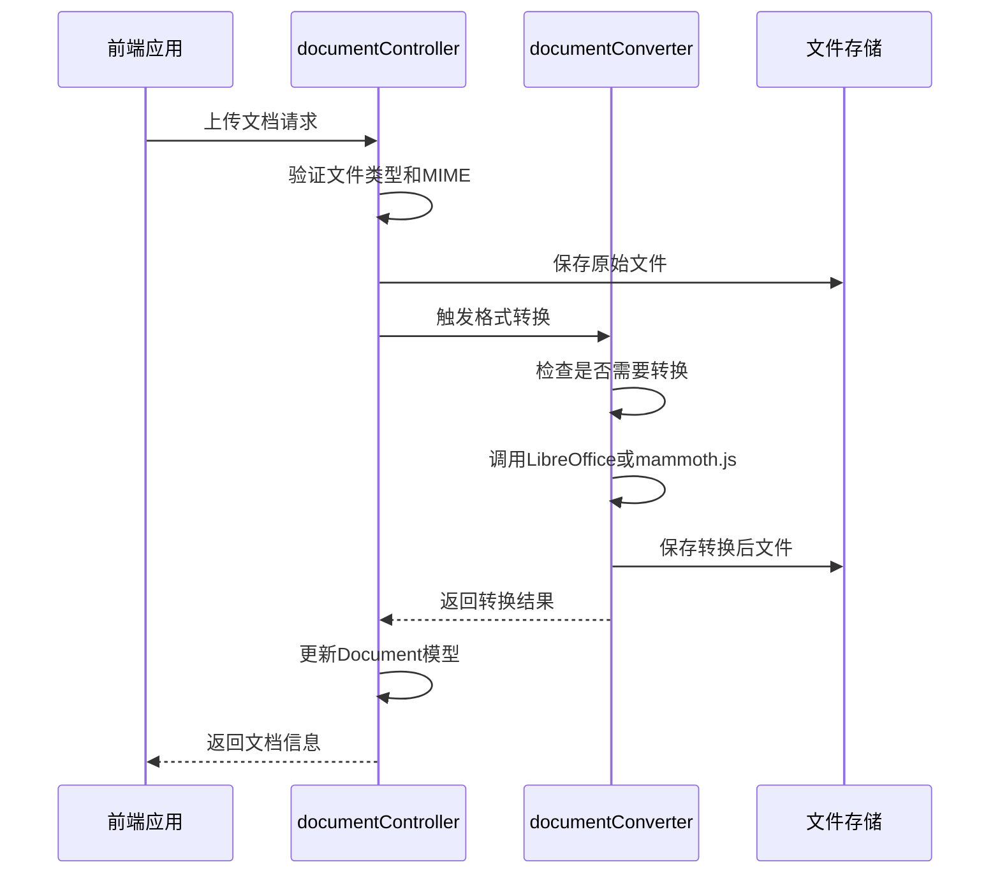
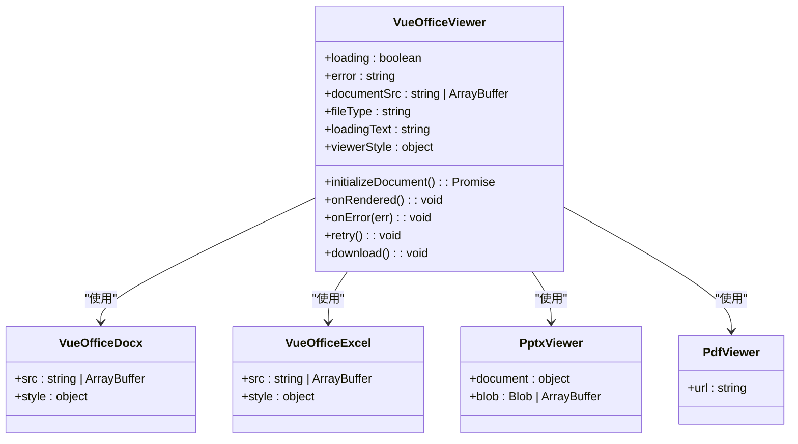
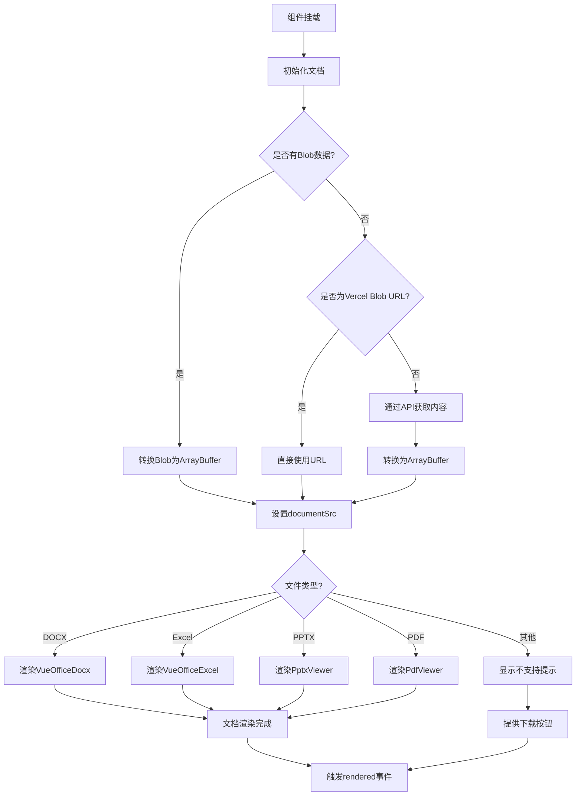
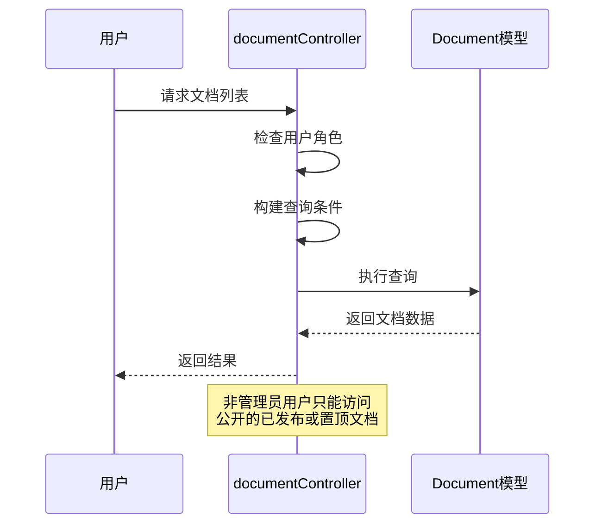

# Document模型

<cite>
**本文档引用文件**   
- [Document.js](file://backend/models/Document.js)
- [documentController.js](file://backend/controllers/documentController.js)
- [documentConverter.js](file://backend/utils/documentConverter.js)
- [VueOfficeViewer.vue](file://frontend/src/components/document-preview/VueOfficeViewer.vue)
</cite>

## 目录
1. [文档模型](#文档模型)
2. [字段结构分析](#字段结构分析)
3. [文档上传与转换流程](#文档上传与转换流程)
4. [前端预览组件实现](#前端预览组件实现)
5. [权限控制策略](#权限控制策略)
6. [安全建议与扩展性](#安全建议与扩展性)

## 文档模型

本系统通过`Document`模型实现文档的统一管理，支持多种文件格式的存储、分类、标签化和预览。模型设计兼顾功能性与可扩展性，为文档管理系统提供了坚实的数据基础。

**文档模型来源**
- [Document.js](file://backend/models/Document.js#L1-L152)

## 字段结构分析

`Document`模型定义了完整的文档元数据结构，包含文件信息、分类标签、访问统计和状态管理等核心属性。

### 核心字段定义

```json
{
  "title": "文档标题",
  "description": "文档描述",
  "filePath": "文件存储路径",
  "fileSize": "文件大小(字节)",
  "formattedSize": "格式化后的文件大小",
  "type": "文件类型",
  "category": "文档分类",
  "secondaryTags": "次要标签数组",
  "downloadCount": "下载次数",
  "author": "作者",
  "isPublic": "是否公开",
  "previewUrl": "预览URL",
  "date": "文档日期",
  "lastModified": "最后修改时间",
  "status": "文档状态",
  "pinnedPriority": "置顶优先级"
}
```

### 字段详细说明

#### 基础信息字段
- **title**: 文档标题，必填项，最大长度200字符
- **description**: 文档描述，最大长度1000字符
- **filePath**: 文件存储路径，必填项，支持本地路径或Vercel Blob URL
- **fileSize**: 文件大小（字节），用于计算格式化大小
- **formattedSize**: 格式化后的文件大小（如"2.5 MB"），由预处理函数自动生成

#### 文件类型与分类
- **type**: 文件类型，枚举值包括`PDF`、`DOCX`、`PPT`、`PPTX`、`XLSX`、`TXT`、`MD`和`其他`
- **category**: 文档分类，必填项，最大长度50字符
- **secondaryTags**: 次要标签数组，每个标签最大长度20字符

#### 统计与状态
- **downloadCount**: 下载次数，默认值0
- **author**: 作者，默认值"Admin"
- **isPublic**: 是否公开，默认值true
- **previewUrl**: 预览URL，用于外部预览服务
- **date**: 文档日期，默认值当前时间
- **lastModified**: 最后修改时间，默认值当前时间
- **status**: 文档状态，枚举值`draft`（草稿）、`published`（已发布）、`pinned`（置顶）
- **pinnedPriority**: 置顶优先级，数值越大优先级越高，默认值0

### 索引设计



**图示来源**
- [Document.js](file://backend/models/Document.js#L130-L140)

**本节来源**
- [Document.js](file://backend/models/Document.js#L1-L152)

## 文档上传与转换流程

文档上传后触发自动转换与预览生成流程，确保多种格式文件的可访问性。

### 上传处理流程



**图示来源**
- [documentController.js](file://backend/controllers/documentController.js#L800-L988)
- [documentConverter.js](file://backend/utils/documentConverter.js#L1-L292)

### 转换器核心功能

`documentConverter.js`提供了完整的文档转换能力：

#### 转换方法
- **convertDocxToHtml**: 将DOCX转换为HTML
- **convertDocxToText**: 将DOCX转换为纯文本
- **convertToPdf**: 将文档转换为PDF
- **convertToPdfWithCommand**: 使用命令行LibreOffice转换
- **smartConvert**: 智能转换，避免重复转换

#### 转换策略
1. 优先使用命令行LibreOffice进行转换
2. 命令行失败时使用JS库作为备选方案
3. 实现缓存机制，避免重复转换相同文件
4. 验证转换结果的有效性（文件大小、PDF头部等）

```javascript
async smartConvert(inputPath, targetFormat = 'pdf') {
  const convertedPath = this.getConvertedFilePath(inputPath, targetFormat)
  
  // 如果转换后的文件已存在且有效，直接返回
  if (this.isConvertedFileValid(inputPath, convertedPath)) {
    return convertedPath
  }
  
  // 进行转换
  if (targetFormat === 'pdf') {
    return await this.convertToPdf(inputPath, convertedPath)
  }
  // ...其他格式处理
}
```

**本节来源**
- [documentConverter.js](file://backend/utils/documentConverter.js#L1-L292)
- [documentController.js](file://backend/controllers/documentController.js#L800-L988)

## 前端预览组件实现

`VueOfficeViewer.vue`组件负责文档的前端渲染和用户交互。

### 组件结构



**图示来源**
- [VueOfficeViewer.vue](file://frontend/src/components/document-preview/VueOfficeViewer.vue#L1-L290)

### 预览流程



**图示来源**
- [VueOfficeViewer.vue](file://frontend/src/components/document-preview/VueOfficeViewer.vue#L1-L290)

### 核心逻辑

```javascript
const initializeDocument = async () => {
  try {
    loading.value = true
    error.value = ''
    
    if (props.blob) {
      // 将Blob转换为ArrayBuffer
      const arrayBuffer = await props.blob.arrayBuffer()
      documentSrc.value = arrayBuffer
    } else if (props.document.filePath && props.document.filePath.startsWith('https://')) {
      // 直接使用Vercel Blob URL
      documentSrc.value = props.document.filePath
    } else {
      // 从API获取文档内容
      const response = await fetch(`/api/documents/${props.document.id}/content`)
      documentSrc.value = await response.arrayBuffer()
    }
    
    loading.value = false
  } catch (err) {
    error.value = err.message || '文档加载失败'
    loading.value = false
  }
}
```

**本节来源**
- [VueOfficeViewer.vue](file://frontend/src/components/document-preview/VueOfficeViewer.vue#L1-L290)

## 权限控制策略

系统通过多层次的权限控制确保文档访问的安全性。

### 后端权限控制



**图示来源**
- [documentController.js](file://backend/controllers/documentController.js#L100-L200)

### 权限判断逻辑

```javascript
// 获取文档列表时的权限控制
const query = {}

// 角色访问控制
if (!req.user || req.user.role !== 'admin') {
  query.isPublic = true
  query.status = { $in: ['published', 'pinned'] }
}

// 获取单个文档时的权限检查
const isAdmin = req.user && req.user.role === 'admin'
if (!isAdmin && (document.status !== 'published')) {
  throw new ApiError(403, '您没有权限预览此文档')
}
```

### 预览权限处理

对于PPTX等复杂格式，系统提供多种预览方案：

1. **Office Online**: 使用微软官方服务预览
2. **Google Docs**: 使用Google Docs查看器
3. **本地下载**: 提供下载选项作为备选

```html
<div class="option-card">
  <div class="option-title">🌐 Office Online 预览</div>
  <button class="option-btn" onclick="previewWithOfficeOnline()">
    打开Office Online预览
  </button>
</div>
```

**本节来源**
- [documentController.js](file://backend/controllers/documentController.js#L100-L799)

## 安全建议与扩展性

### MIME类型验证安全建议

为防止文件上传漏洞，建议实施严格的MIME类型验证：

```javascript
const getContentType = (fileType) => {
  const typeMap = {
    'docx': 'application/vnd.openxmlformats-officedocument.wordprocessingml.document',
    'xlsx': 'application/vnd.openxmlformats-officedocument.spreadsheetml.sheet',
    'pdf': 'application/pdf',
    'pptx': 'application/vnd.openxmlformats-officedocument.presentationml.presentation',
    'md': 'text/markdown; charset=utf-8',
    'txt': 'text/plain; charset=utf-8'
  }
  return typeMap[fileType?.toLowerCase()] || 'application/octet-stream'
}
```

### 大文件分片上传支持

现有架构可通过以下方式支持大文件分片上传：

1. **前端分片**: 使用`File.slice()`方法将大文件分割
2. **分片上传**: 逐个上传分片并记录状态
3. **服务端合并**: 所有分片上传完成后合并文件
4. **断点续传**: 记录已上传分片，支持中断后继续

### 架构扩展点

| 扩展点 | 实现方案 |
|-------|---------|
| **更多文件格式** | 集成更多转换库，如`pdf2htmlEX` |
| **全文搜索** | 使用Elasticsearch替代MongoDB文本索引 |
| **版本控制** | 添加文档版本历史功能 |
| **协作编辑** | 集成Yjs等实时协作库 |
| **OCR支持** | 集成Tesseract.js处理扫描文档 |

**本节来源**
- [documentController.js](file://backend/controllers/documentController.js#L1-L988)
- [documentConverter.js](file://backend/utils/documentConverter.js#L1-L292)
- [Document.js](file://backend/models/Document.js#L1-L152)