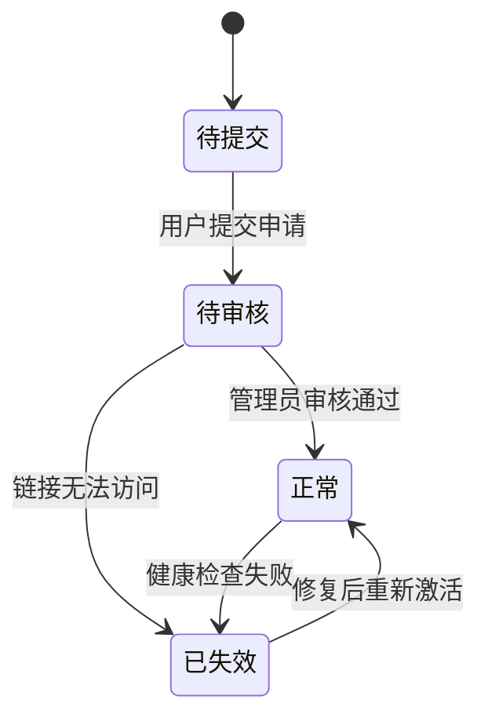

# FriendLink模型

<cite>
**本文档引用的文件**  
- [FriendLink.js](file://backend/models/FriendLink.js)
- [friendLinkController.js](file://backend/controllers/friendLinkController.js)
- [FriendLinks.vue](file://frontend/src/views/FriendLinks.vue)
</cite>

## 目录
1. [FriendLink模型字段组成](#friendlink模型字段组成)  
2. [友链审核流程实现机制](#友链审核流程实现机制)  
3. [前端友链列表展示逻辑](#前端友链列表展示逻辑)  
4. [安全防护与质量维护措施](#安全防护与质量维护措施)

## FriendLink模型字段组成

`FriendLink` 模型定义了友情链接的核心数据结构，包含站点信息、状态控制、访问统计等多个维度的属性。该模型基于 Mongoose 构建，具备完整的数据验证和索引优化机制。

### 基础信息字段
- **name**: 站点名称，必填项，最大长度为50字符，自动去除首尾空格。
- **url**: 链接地址，必填项，支持带协议（http/https）或不带协议的格式，通过正则表达式进行合法性校验。
- **avatar**: 头像图片路径，可选字段，默认值为 `/uploads/avatars/default.png`。
- **description**: 站点描述，最大长度200字符，用于展示网站简介。
- **category**: 分类标签，枚举类型，取值包括：`个人博客`、`技术社区`、`学习资源`、`工具网站`、`友情链接`、`其他`，用于分类管理。
- **tags**: 标签数组，每个标签最大20字符，支持多标签分类。

### 状态与审核字段
- **status**: 当前状态，枚举值为 `正常`、`待审核`、`已失效`，由 `isActive` 字段自动同步。
- **isActive**: 是否激活，布尔类型，决定链接是否对外展示。`true` 表示已通过审核并激活，`false` 表示待审核。
- **lastChecked**: 最后检查时间，记录最近一次健康检查的时间戳。

### 联系与管理字段
- **email**: 联系邮箱，必须符合标准邮箱格式。
- **contactInfo**: 联系信息，最大100字符，用于管理员沟通。
- **remark**: 备注信息，最大500字符，仅供管理员查看。

### 统计与时间字段
- **visitCount**: 访问次数，整数类型，初始为0，每次点击访问时递增。
- **createdAt**: 创建时间，由 Mongoose 自动维护。
- **updatedAt**: 更新时间，由 Mongoose 自动维护。

### 虚拟字段与方法
- **formattedUrl**: 虚拟字段，自动为不带协议的 URL 添加 `https://` 前缀。
- **incrementVisit()**: 实例方法，用于增加访问次数并保存。
- **checkAccessibility()**: 实例方法，模拟检测链接是否可访问，并更新 `status` 和 `lastChecked`。
- **checkAllLinks()**: 静态方法，批量检查所有友链的可访问性。

### 索引设计
为提升查询性能，模型定义了多个索引：
- 文本索引：`name` 和 `description`，支持全文搜索。
- 单字段索引：`category`、`status`、`isActive`、`visitCount`（倒序），优化分类与状态筛选。

**Section sources**  
- [FriendLink.js](file://backend/models/FriendLink.js#L1-L203)

## 友链审核流程实现机制

友链审核流程通过 `friendLinkController.js` 中的控制器方法实现，区分普通用户提交与管理员审核操作，状态变迁逻辑清晰。

### 普通用户提交：applyFriendLink
当用户通过前端页面申请友链时，调用 `applyFriendLink` 接口：

1. **参数校验**：
   - 必填字段：`name`、`url`、`email`。
   - 邮箱格式验证使用正则 `/^[^\s@]+@[^\s@]+\.[^\s@]+$/`。
   - URL 格式化：若无协议前缀，默认添加 `https://`。

2. **重复性检查**：
   - 查询数据库中是否已存在相同 `url` 的记录，防止重复申请。

3. **创建记录**：
   - 设置 `isActive: false`，表示待审核状态。
   - 若未提供头像，则尝试调用 `getFavicon(url)` 自动获取目标网站的 favicon。
   - 保存后返回成功响应：“友情链接申请提交成功，等待管理员审核”。

```javascript
const friendLinkData = {
  name: name.trim(),
  url: formattedUrl,
  email: email.trim(),
  isActive: false // 默认待审核
}
```

### 管理员审核：updateFriendLink
管理员通过后台管理界面操作，调用 `updateFriendLink` 接口进行审核通过：

1. **查找目标友链**：
   - 根据 `_id` 查询友链记录，若不存在则抛出 404 错误。

2. **字段更新逻辑**：
   - 支持更新名称、URL、描述、头像、分类等字段。
   - 若更新 URL，需检查是否已被其他友链占用（排除自身）。
   - 若清空头像字段，系统将尝试重新自动获取 favicon。

3. **状态同步机制**：
   - 在 `FriendLink` 模型的 `pre('save')` 中间件中，自动根据 `isActive` 值设置 `status`：
     ```js
     if (this.isActive === true) {
       this.status = '正常'
     } else {
       this.status = '待审核'
     }
     ```
   - 因此，管理员只需将 `isActive` 设为 `true`，状态即自动变为“正常”。

4. **保存并响应**：
   - 保存后返回更新后的友链数据及成功提示。

### 状态变迁图示



**Diagram sources**  
- [friendLinkController.js](file://backend/controllers/friendLinkController.js#L230-L351)  
- [FriendLink.js](file://backend/models/FriendLink.js#L142-L152)

**Section sources**  
- [friendLinkController.js](file://backend/controllers/friendLinkController.js#L230-L351)  
- [FriendLink.js](file://backend/models/FriendLink.js#L142-L152)

## 前端友链列表展示逻辑

前端通过 `FriendLinks.vue` 组件展示友链列表，根据审核状态进行过滤，确保仅展示已激活的链接。

### 数据获取流程
1. 组件挂载时调用 `getFriendLinks()` 方法。
2. 通过 `friendLinkApi.getFriendLinks()` 发起 GET 请求，获取所有友链数据。
3. 若请求失败，显示错误信息并提供“重试”按钮，同时展示模拟数据作为降级方案。

### 审核状态过滤
使用计算属性 `filteredLinks` 对数据进行过滤：

```js
const filteredLinks = computed(() => {
  let links = allLinks.value.filter(link => link.isActive === true)
  
  if (selectedCategory.value !== '全部') {
    links = links.filter(link => link.category === selectedCategory.value)
  }
  
  return links
})
```

- **核心逻辑**：只保留 `isActive === true` 的友链，即管理员已审核通过的链接。
- **分类筛选**：支持按分类（如“学习资源”、“工具网站”）进一步过滤。

### 状态显示处理
- **文本显示**：`getStatusText(link.isActive)` 返回“正常”或“待审核”。
- **样式控制**：`getStatusClass(link.isActive)` 返回 CSS 类名，分别对应绿色（正常）和黄色（待审核）标签。

### 用户交互
- 点击友链卡片或“访问”按钮时：
  1. 调用 `visitLink(link)` 方法。
  2. 先通过 `clickFriendLink(id)` 接口记录访问统计。
  3. 使用 `window.open()` 打开目标网站。

**Section sources**  
- [FriendLinks.vue](file://frontend/src/views/FriendLinks.vue#L0-L456)

## 安全防护与质量维护措施

为防止恶意链接注入并保障友链质量，系统在前后端均实施了多重安全策略。

### URL合法性校验
- **后端校验**：
  - 使用正则表达式验证 URL 格式：
    ```js
    /^(https?:\/\/)?([\da-z\.-]+)\.([a-z\.]{2,6})([\/\w \.-]*)*\/?$/i
    ```
  - 自动格式化：对不带协议的 URL 默认添加 `https://`。
- **前端校验**：
  - `getFormattedUrl()` 方法确保链接可安全打开，避免跳转至非法协议（如 `javascript:`）。

### XSS过滤策略
- **输入净化**：
  - 所有字符串字段均启用 `trim: true`，去除首尾空格，防止注入。
  - 描述、标签等富文本内容在前端展示时使用文本插值 `{{ }}`，避免 HTML 解析。
- **头像安全**：
  - 头像路径为相对路径或 HTTPS 外链，前端通过 `getLinkAvatar()` 统一处理，防止非法资源加载。

### 防止重复与滥用
- **唯一性约束**：
  - 创建或更新时检查 `url` 是否已存在，避免重复添加。
- **邮箱必填**：
  - 申请友链必须提供有效邮箱，便于管理员联系，降低恶意提交风险。

### 定期健康检查机制
- **自动检查**：
  - `checkAccessibility()` 方法可模拟 HTTP 请求检测链接可用性。
  - `checkAllLinks()` 静态方法支持定时任务（如每日一次）批量检查所有友链。
- **状态更新**：
  - 若检测失败，自动将 `status` 设为“已失效”，并在下次审核前不再展示。
- **建议实践**：
  - 配置定时任务（Cron Job）每日执行健康检查。
  - 对连续多次检查失败的友链发送邮件通知管理员处理。

**Section sources**  
- [FriendLink.js](file://backend/models/FriendLink.js#L9-L203)  
- [friendLinkController.js](file://backend/controllers/friendLinkController.js#L58-L351)