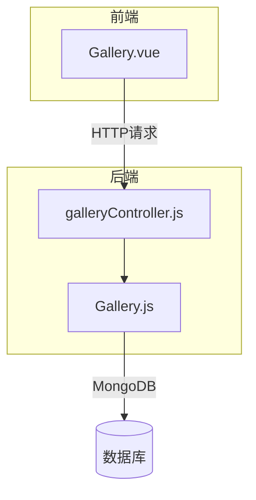
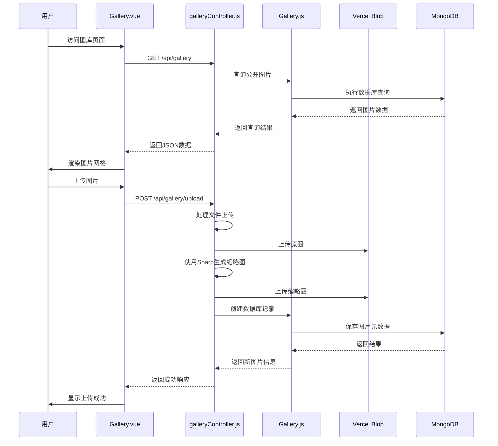
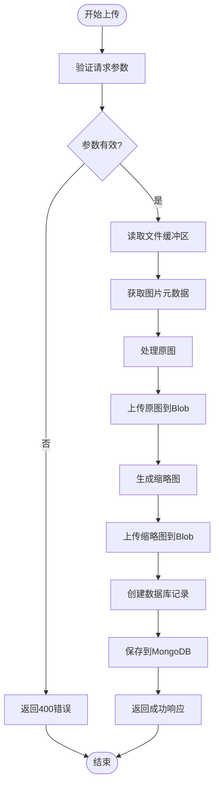
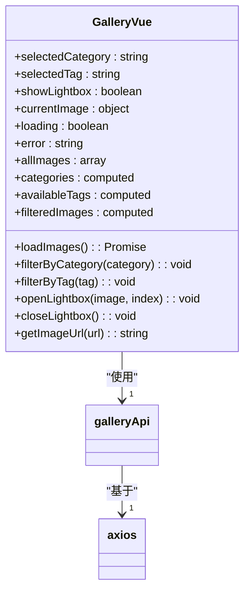
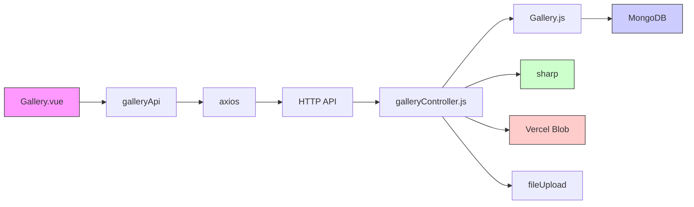

# Gallery模型

<cite>
**本文档引用文件**  
- [Gallery.js](file://backend/models/Gallery.js#L1-L119)
- [galleryController.js](file://backend/controllers/galleryController.js#L1-L217)
- [Gallery.vue](file://frontend/src/views/Gallery.vue#L1-L799)
</cite>

## 目录
1. [简介](#简介)
2. [项目结构](#项目结构)
3. [核心组件](#核心组件)
4. [架构概览](#架构概览)
5. [详细组件分析](#详细组件分析)
6. [依赖关系分析](#依赖关系分析)
7. [性能优化建议](#性能优化建议)
8. [故障排查指南](#故障排查指南)
9. [结论](#结论)

## 简介
本技术文档全面介绍图库系统（Gallery）的设计与实现，涵盖后端数据模型、图片处理流程、分类筛选机制以及前端展示逻辑。系统基于Mongoose构建数据模型，使用Sharp库进行图片压缩与格式转换，通过Vercel Blob实现云端存储，并结合Vue 3的响应式特性实现现代化的前端交互体验。文档将深入解析图片上传、元数据管理、分类过滤、标签检索及前端懒加载等关键功能。

## 项目结构
图库系统分布在前后端多个目录中，形成清晰的分层架构：

- **后端模型层**：`backend/models/Gallery.js` 定义了图片数据结构
- **后端控制器层**：`backend/controllers/galleryController.js` 实现业务逻辑
- **前端视图层**：`frontend/src/views/Gallery.vue` 提供用户界面
- **工具模块**：`backend/utils/fileUpload.js` 和 `sharp` 库处理文件上传与图像转换

该结构遵循MVC设计模式，实现了前后端职责分离，便于维护和扩展。



**图源**  
- [Gallery.js](file://backend/models/Gallery.js#L1-L119)
- [galleryController.js](file://backend/controllers/galleryController.js#L1-L217)
- [Gallery.vue](file://frontend/src/views/Gallery.vue#L1-L799)

## 核心组件
图库系统的核心组件包括数据模型、控制器和前端组件，三者协同工作实现完整的图片管理功能。

### 数据模型设计
`Gallery` 模型定义了图片的完整元数据结构，包含以下字段：

- **基础信息**：
  - `title`: 图片标题（必填，最大100字符）
  - `description`: 描述（最大500字符）
  - `author`: 作者（默认为Admin）
  
- **文件路径**：
  - `thumbnail`: 缩略图URL
  - `fullSize`: 原图URL
  
- **分类与标签**：
  - `category`: 分类（摄影、游戏、编程、设计）
  - `secondaryTags`: 次要标签数组
  
- **状态控制**：
  - `status`: 状态（draft, published）
  - `isPublic`: 是否公开
  
- **尺寸信息**：
  - `width`, `height`: 原始尺寸
  - `aspect`: 虚拟字段，计算宽高比
  
- **EXIF元数据**：
  - `camera`, `lens`, `aperture`, `shutterSpeed`, `iso`, `focalLength`, `location`
  
- **时间戳**：
  - `date`: 拍摄/创建日期
  - `createdAt`, `updatedAt`: 记录创建和更新时间

**字段验证规则**：
- 标题必须填写且不超过100字符
- 分类必须为预设值之一
- 标签长度不超过20字符
- 使用`timestamps`选项自动管理创建和更新时间

**索引优化**：
- 文本索引：`{ title: 'text', description: 'text' }` 支持全文搜索
- 复合索引：`{ category: 1, secondaryTags: 1 }` 优化分类和标签查询
- 时间索引：`{ date: -1 }` 支持按时间排序

**Section sources**
- [Gallery.js](file://backend/models/Gallery.js#L1-L119)

## 架构概览
图库系统采用前后端分离架构，通过RESTful API进行通信，整体流程如下：



**图源**  
- [galleryController.js](file://backend/controllers/galleryController.js#L1-L217)
- [Gallery.vue](file://frontend/src/views/Gallery.vue#L1-L799)

## 详细组件分析

### 后端处理流程分析

#### 图片上传处理流程
当用户上传图片时，系统执行以下处理流程：



**关键处理步骤**：
1. **文件上传处理**：使用`imageUpload.single('image')`中间件处理单文件上传
2. **元数据提取**：通过`sharp(fileBuffer).metadata()`获取图片宽度、高度等信息
3. **原图上传**：直接将原始文件缓冲区上传至Vercel Blob存储
4. **缩略图生成**：使用Sharp库将图片缩放至400px宽度并生成新缓冲区
5. **数据库记录**：创建包含Blob URL的Gallery文档

**Section sources**
- [galleryController.js](file://backend/controllers/galleryController.js#L1-L217)

#### 图片处理与转换
系统使用Sharp库执行图片处理，主要功能包括：

- **格式保持**：自动识别并保持原始图片格式（JPEG, PNG, WebP等）
- **无损压缩**：在不损失视觉质量的前提下优化文件大小
- **尺寸调整**：生成400px宽度的缩略图用于列表展示
- **元数据提取**：获取EXIF信息如相机型号、光圈、快门速度等

```javascript
// 缩略图生成代码示例
const thumbnailBuffer = await sharp(fileBuffer).resize(400).toBuffer();
```

此处理确保了：
- 缩略图加载速度快，提升用户体验
- 原图保持高质量，满足高清查看需求
- 统一的缩略图尺寸，保证网格布局美观

### 前端组件分析

#### 图库浏览与筛选功能
`Gallery.vue` 组件实现了现代化的图片浏览界面，主要特性包括：

- **响应式网格布局**：使用CSS多列布局实现自适应网格
- **分类筛选**：通过按钮组切换不同分类
- **标签过滤**：动态显示当前分类下的可用标签
- **懒加载**：使用`loading="lazy"`属性延迟加载图片



**图源**  
- [Gallery.vue](file://frontend/src/views/Gallery.vue#L1-L799)

#### 前端交互逻辑
组件的核心交互逻辑如下：

1. **初始化加载**：`onMounted`钩子调用`loadImages()`获取图片数据
2. **分类过滤**：`filterByCategory`方法更新选中分类并重置标签筛选
3. **标签过滤**：`filterByTag`方法更新选中标签
4. **灯箱预览**：`openLightbox`方法打开图片预览并禁用页面滚动
5. **键盘导航**：监听键盘事件实现ESC关闭、左右箭头切换图片

**计算属性**：
- `categories`: 从所有图片中提取唯一分类，添加"全部"选项
- `availableTags`: 根据当前分类动态计算可用标签
- `filteredImages`: 结合分类和标签筛选条件返回最终图片列表

## 依赖关系分析
系统各组件之间的依赖关系如下：



**关键依赖说明**：
- **前端依赖**：Vue 3组合式API、Axios HTTP客户端
- **后端依赖**：Mongoose ODM、Sharp图像处理库、Vercel Blob存储
- **环境依赖**：BLOB_READ_WRITE_TOKEN环境变量配置

**Section sources**
- [Gallery.vue](file://frontend/src/views/Gallery.vue#L1-L799)
- [galleryController.js](file://backend/controllers/galleryController.js#L1-L217)

## 性能优化建议

### 数据库查询优化
1. **时间轴展示优化**：已建立`{ date: -1 }`索引，支持高效的时间排序查询
2. **全文搜索优化**：文本索引覆盖标题和描述字段，提升搜索性能
3. **分页查询**：使用`skip`和`limit`实现分页，避免一次性加载过多数据

### 图片加载优化
1. **懒加载**：前端使用`loading="lazy"`属性，仅当图片进入视口时才加载
2. **CDN加速**：Vercel Blob提供全球CDN分发，加快图片加载速度
3. **缓存策略**：浏览器自动缓存Blob URL，减少重复请求

### 搜索功能优化建议
1. **复合索引扩展**：考虑添加`{ category: 1, date: -1 }`索引，优化按分类时间排序
2. **标签索引优化**：为`secondaryTags`单独建立索引，提升标签查询性能
3. **聚合查询**：使用MongoDB聚合管道实现更复杂的筛选逻辑

```javascript
// 示例：优化的聚合查询
Gallery.aggregate([
  { $match: { isPublic: true, status: 'published' } },
  { $sort: { date: -1 } },
  { $skip: skip },
  { $limit: limit },
  { $project: { 
      title: 1, 
      description: 1, 
      thumbnail: 1, 
      category: 1, 
      secondaryTags: 1,
      date: 1,
      aspect: { $divide: ["$width", "$height"] }
    }
  }
])
```

## 故障排查指南

### 常见问题及解决方案
1. **图片上传失败**：
   - 检查`BLOB_READ_WRITE_TOKEN`环境变量是否配置
   - 确认Vercel Blob服务是否可用
   - 验证文件大小是否超过限制

2. **缩略图不显示**：
   - 检查`thumbnail`字段URL是否正确
   - 确认Vercel Blob中文件是否存在
   - 查看浏览器控制台是否有404错误

3. **分类筛选无效**：
   - 验证数据库中`category`字段值是否符合预设选项
   - 检查前端`categories`计算属性逻辑

4. **EXIF信息丢失**：
   - 确认原始图片包含EXIF数据
   - 检查Sharp处理是否保留元数据

### 错误处理机制
系统实现了多层次的错误处理：

- **前端错误处理**：`loadImages`方法捕获异常并显示错误状态
- **后端错误处理**：使用`catchAsync`包装器统一处理异步错误
- **API错误响应**：返回标准化的JSON错误格式

```javascript
// 错误响应格式
{
  success: false,
  message: "错误描述"
}
```

**Section sources**
- [galleryController.js](file://backend/controllers/galleryController.js#L1-L217)
- [Gallery.vue](file://frontend/src/views/Gallery.vue#L1-L799)

## 结论
图库系统通过合理的数据模型设计、高效的图片处理流程和现代化的前端交互，实现了完整的图片管理功能。系统采用Mongoose定义数据结构，利用Sharp库进行图像处理，通过Vercel Blob实现云端存储，并结合Vue 3的响应式特性提供流畅的用户体验。建议进一步优化数据库索引以支持更复杂的查询场景，并考虑增加图片EXIF信息的前端展示功能。