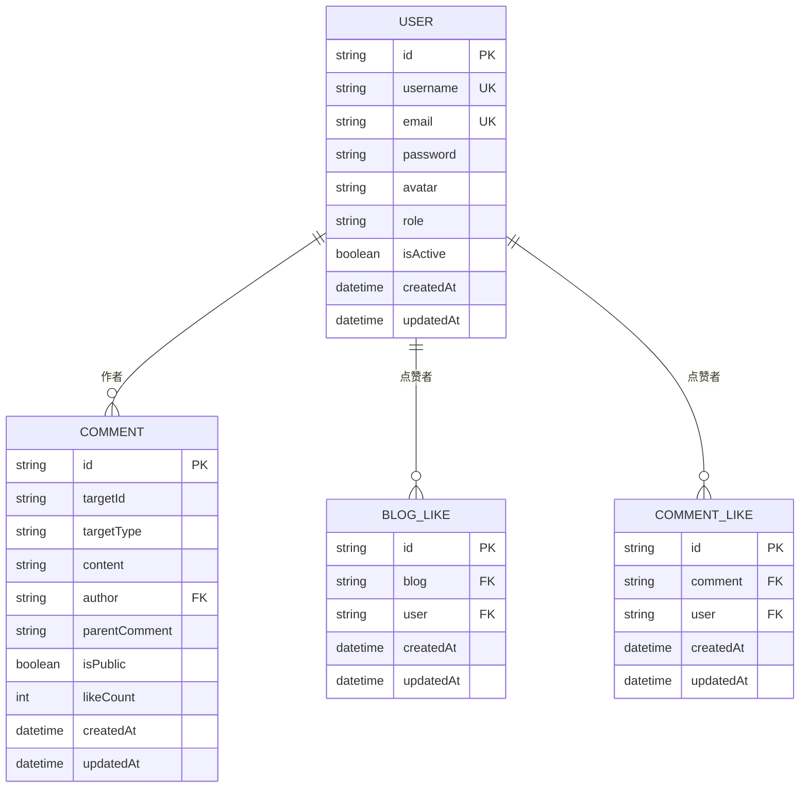

# User模型

<cite>
**本文档引用文件**  
- [User.js](file://backend/models/User.js#L1-L90)
- [authController.js](file://backend/controllers/authController.js#L1-L142)
- [auth.js](file://backend/middleware/auth.js#L1-L67)
- [authRoutes.js](file://backend/routes/authRoutes.js#L1-L26)
</cite>

## 目录
1. [简介](#简介)
2. [项目结构](#项目结构)
3. [核心组件](#核心组件)
4. [架构概览](#架构概览)
5. [详细组件分析](#详细组件分析)
6. [依赖关系分析](#依赖关系分析)
7. [性能考虑](#性能考虑)
8. [故障排查指南](#故障排查指南)
9. [结论](#结论)

## 简介
本文档全面描述了用户系统的核心数据模型——User模型，涵盖其字段定义、验证规则、密码加密机制、角色权限控制以及与其他模型的关联关系。结合认证控制器和中间件，详细说明注册、登录流程及常见问题的排查方法，旨在为开发者提供清晰的技术参考。

## 项目结构
项目采用前后端分离架构，后端基于Node.js + Express + MongoDB（Mongoose）实现，前端使用Vue.js构建。用户相关逻辑集中在`backend/models/User.js`中定义数据结构，在`controllers/authController.js`中实现业务逻辑，并通过`routes/authRoutes.js`暴露API接口。


**图示来源**  
- [authRoutes.js](file://backend/routes/authRoutes.js#L1-L26)
- [authController.js](file://backend/controllers/authController.js#L1-L142)
- [auth.js](file://backend/middleware/auth.js#L1-L67)
- [User.js](file://backend/models/User.js#L1-L90)

## 核心组件
User模型是系统身份认证的基础，定义了用户的基本属性、安全机制和行为方法。其核心功能包括：
- 用户名、邮箱、密码等基础信息存储
- 密码自动加密（bcrypt）
- 角色权限区分（user/admin）
- 唯一性约束与格式验证
- 提供密码比对方法

**组件来源**  
- [User.js](file://backend/models/User.js#L1-L90)

## 架构概览
系统采用典型的MVC架构模式，围绕User模型构建认证体系。用户通过前端发起注册或登录请求，经由Express路由分发至认证控制器，控制器调用User模型进行数据操作，并利用JWT生成认证令牌。


**图示来源**  
- [User.js](file://backend/models/User.js#L1-L90)
- [authController.js](file://backend/controllers/authController.js#L1-L142)
- [auth.js](file://backend/middleware/auth.js#L1-L67)
- [authRoutes.js](file://backend/routes/authRoutes.js#L1-L26)

## 详细组件分析

### User模型字段定义
User模型定义了用户账户的核心属性及其约束规则。

**: 用户名**
- 类型：字符串
- 必填：是
- 唯一性：是（唯一索引）
- 长度：3-20字符
- 验证消息：用户名不能为空 / 至少3个字符 / 最多20个字符

**: 邮箱**
- 类型：字符串
- 必填：是
- 唯一性：是（唯一索引）
- 格式：符合标准邮箱正则表达式
- 自动转换：小写存储
- 验证消息：邮箱不能为空 / 请输入有效的邮箱地址

**: 密码**
- 类型：字符串
- 必填：是
- 最小长度：6字符
- 安全设置：查询时不返回（select: false）
- 存储方式：bcrypt加密（见中间件）

**: 头像**
- 类型：字符串
- 默认值：default-avatar.png

**: 角色**
- 类型：字符串
- 取值范围：user, admin
- 默认值：user

**: 是否激活**
- 类型：布尔值
- 默认值：true
- 用途：用于禁用账户而不删除数据

**: 时间戳**
- createdAt：创建时间（自动生成）
- updatedAt：更新时间（自动生成）

**组件来源**  
- [User.js](file://backend/models/User.js#L1-L90)

### 密码加密与验证机制
系统使用bcryptjs库对用户密码进行单向加密存储，确保即使数据库泄露也无法直接获取明文密码。


**图示来源**  
- [User.js](file://backend/models/User.js#L70-L85)

#### 密码验证流程
当用户登录时，系统通过`comparePassword`方法验证输入密码与数据库中哈希值是否匹配。

```javascript
// User模型中的方法
userSchema.methods.comparePassword = async function(candidatePassword) {
  return await bcrypt.compare(candidatePassword, this.password)
}
```

该方法利用bcrypt的恒定时间比较算法防止时序攻击。

**组件来源**  
- [User.js](file://backend/models/User.js#L87-L89)

### 角色权限控制
系统通过`role`字段实现基础的角色权限管理，结合中间件`checkRole`实现细粒度访问控制。

**: 角色定义**
- user：普通用户，可发表评论、点赞等
- admin：管理员，拥有所有权限

**: 权限检查中间件**
```javascript
exports.checkRole = (...roles) => {
  return (req, res, next) => {
    if (!req.user || !roles.includes(req.user.role)) {
      return next(new ApiError(403, '没有权限执行此操作'))
    }
    next()
  }
}
```

示例：管理员专用路由
```javascript
router.get('/admin/dashboard', auth, checkRole('admin'), adminController.dashboard)
```

**组件来源**  
- [auth.js](file://backend/middleware/auth.js#L55-L66)
- [User.js](file://backend/models/User.js#L60-L63)

### 模型关联关系
User模型作为系统核心实体，被多个其他模型通过外键引用。



**图示来源**  
- [User.js](file://backend/models/User.js#L1-L90)
- [Comment.js](file://backend/models/Comment.js#L1-L81)
- [BlogLike.js](file://backend/models/BlogLike.js#L1-L31)
- [CommentLike.js](file://backend/models/CommentLike.js#L1-L31)

## 依赖关系分析
User模型作为身份认证的核心，与其他模块存在紧密依赖关系。


**图示来源**  
- [User.js](file://backend/models/User.js#L1-L90)
- [authController.js](file://backend/controllers/authController.js#L1-L142)
- [auth.js](file://backend/middleware/auth.js#L1-L67)
- [authRoutes.js](file://backend/routes/authRoutes.js#L1-L26)

## 性能考虑
- **索引优化**：在`username`和`email`字段上建立唯一索引，提升查询效率
- **密码字段排除**：默认查询不返回密码字段（`select: false`），减少网络传输开销
- **JWT状态无存储**：服务端不保存会话状态，减轻服务器内存压力
- **批量操作预留**：模型设计支持未来扩展如软删除、多设备登录等

## 故障排查指南

### 常见问题1：密码重置失败
**: 现象**
用户无法完成密码重置，提示"用户名/邮箱或密码错误"

**: 排查步骤**
1. 检查`User.findOne()`是否正确查询到用户（注意`.select('+password')`）
2. 确认前端传递的密码是否经过正确编码（避免特殊字符截断）
3. 验证bcrypt哈希过程是否正常执行（检查`pre('save')`中间件是否触发）

**: 解决方案**
```javascript
// 确保在更新密码时重新触发加密
await User.findByIdAndUpdate(userId, { password: newPassword }, { runValidators: true })
```

### 常见问题2：JWT签发异常
**: 现象**
登录后无法生成令牌，返回500错误

**: 排查步骤**
1. 检查环境变量`JWT_SECRET`是否配置
2. 验证`process.env.JWT_EXPIRES_IN`格式是否正确（如'7d'）
3. 确认用户对象的`_id`和`role`字段存在且可序列化

**: 解决方案**
```bash
# .env文件示例
JWT_SECRET=your_strong_secret_key_here
JWT_EXPIRES_IN=7d
```

**: 调试技巧**
在`generateToken`函数中添加日志：
```javascript
console.log('Generating token for:', userId, userRole)
```

**组件来源**  
- [authController.js](file://backend/controllers/authController.js#L20-L40)
- [auth.js](file://backend/middleware/auth.js#L1-L67)

## 结论
User模型作为系统身份认证的核心，设计合理且功能完整。通过Mongoose的Schema验证、bcrypt密码加密、JWT无状态认证和细粒度权限控制，构建了一个安全可靠的用户管理体系。建议未来可扩展以下功能：
- 添加手机号字段及验证
- 支持OAuth第三方登录
- 实现多因素认证（MFA）
- 增加登录失败次数限制