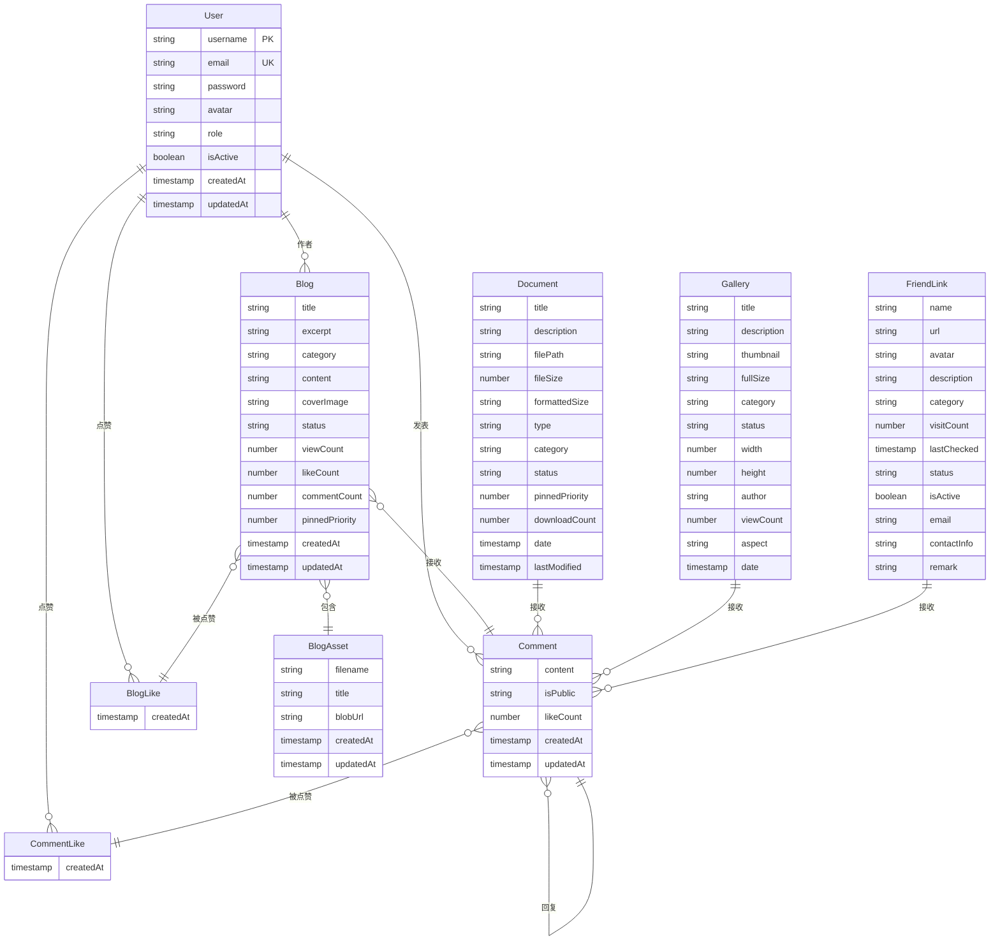

# 数据库设计与数据模型

<cite>
**本文档引用的文件**  
- [User.js](file://backend/models/User.js)
- [Blog.js](file://backend/models/Blog.js)
- [Comment.js](file://backend/models/Comment.js)
- [Document.js](file://backend/models/Document.js)
- [Gallery.js](file://backend/models/Gallery.js)
- [FriendLink.js](file://backend/models/FriendLink.js)
- [BlogAsset.js](file://backend/models/BlogAsset.js)
- [BlogLike.js](file://backend/models/BlogLike.js)
- [CommentLike.js](file://backend/models/CommentLike.js)
- [Visit.js](file://backend/models/Visit.js)
</cite>

## 目录
1. [数据库设计与数据模型](#数据库设计与数据模型)
2. [用户模型 (User)](#用户模型-user)
3. [博客模型 (Blog)](#博客模型-blog)
4. [评论模型 (Comment)](#评论模型-comment)
5. [文档模型 (Document)](#文档模型-document)
6. [相册模型 (Gallery)](#相册模型-gallery)
7. [友情链接模型 (FriendLink)](#友情链接模型-friendlink)
8. [博客资源模型 (BlogAsset)](#博客资源模型-blogasset)
9. [点赞行为模型 (BlogLike, CommentLike)](#点赞行为模型-bloglike-commentlike)
10. [实体关系图 (ERD)](#实体关系图-erd)
11. [数据生命周期与访问模式](#数据生命周期与访问模式)

## 用户模型 (User)

该模型定义了系统中用户的核心数据结构，包含身份信息、权限控制和安全机制。

**字段结构与验证规则：**
- **username**: 用户名，必填，长度3-20字符，唯一索引
- **email**: 邮箱，必填，格式验证，唯一索引
- **password**: 密码，必填，最小6字符，保存前自动加密，查询时不返回
- **avatar**: 头像路径，可选，默认值为`default-avatar.png`
- **role**: 角色，枚举值`user`或`admin`，默认为`user`
- **isActive**: 账户是否激活，默认为`true`
- **createdAt / updatedAt**: 时间戳，由Mongoose自动生成

**安全机制：**
- 使用 `bcryptjs` 对密码进行哈希加密
- 通过 `pre('save')` 中间件在保存前自动处理密码加密
- 提供 `comparePassword` 方法用于验证用户输入的密码

**索引设置：**
- 唯一索引：`username`, `email`

**Section sources**
- [User.js](file://backend/models/User.js#L1-L90)

## 博客模型 (Blog)

该模型用于管理博客文章，支持分类、标签、状态管理和内容展示。

**字段结构与验证规则：**
- **title**: 标题，必填
- **excerpt**: 摘要，必填，最大500字符
- **category**: 分类，必填
- **content**: 正文，必填
- **author**: 作者，引用 `User` 模型的 ObjectId
- **tags**: 标签数组，字符串类型
- **coverImage**: 封面图URL，可选
- **status**: 状态，枚举值 `draft`, `published`, `pinned`，默认为 `draft`
- **viewCount / likeCount / commentCount**: 统计字段，分别记录浏览、点赞、评论数
- **pinnedPriority**: 置顶优先级，数值越大越靠前
- **createdAt / updatedAt**: 时间戳

**虚拟字段：**
- **date**: 从 `createdAt` 提取的日期字符串（YYYY-MM-DD），用于前端展示

**索引设置：**
- 文本索引：`title`, `content`, `excerpt`, `category`, `tags`（支持全文搜索）
- 单字段索引：`category`, `status`, `pinnedPriority`, `createdAt`
- 复合索引：`{ status: 1, pinnedPriority: -1, createdAt: -1 }`（优化首页查询）

**Section sources**
- [Blog.js](file://backend/models/Blog.js#L1-L131)

## 评论模型 (Comment)

该模型实现通用评论系统，支持多类型目标（博客、相册、文档）和嵌套回复。

**字段结构与验证规则：**
- **targetId**: 目标对象ID（如博客ID），必填
- **targetType**: 目标类型，枚举值 `Blog`, `Gallery`, `Document`, `General`，必填
- **content**: 评论内容，必填，最大2000字符
- **author**: 评论者，引用 `User` 模型
- **parentComment**: 父评论ID，引用自身模型，实现嵌套结构
- **isPublic**: 是否公开，默认为 `true`
- **likeCount**: 点赞数统计
- **createdAt / updatedAt**: 时间戳

**嵌套评论树实现：**
- 使用 `parentComment` 字段形成父子关系
- 通过虚拟字段 `replies` 自动关联子评论：
  ```js
  commentSchema.virtual('replies', {
    ref: 'Comment',
    localField: '_id',
    foreignField: 'parentComment'
  });
  ```
- 查询时启用 `{ populate: 'replies' }` 可获取完整评论树

**索引设置：**
- 复合索引：`{ targetId: 1, targetType: 1, isPublic: 1 }`（快速定位目标评论）
- 时间索引：`createdAt`（按时间排序）

**Section sources**
- [Comment.js](file://backend/models/Comment.js#L1-L83)

## 文档模型 (Document)

该模型用于管理可下载的文档资源，支持多种格式和元数据。

**字段结构与验证规则：**
- **title / description**: 标题与描述，带长度限制
- **filePath**: 文件存储路径，必填
- **fileSize / formattedSize**: 文件大小（字节）与格式化显示（如 "2.34 MB"）
- **type**: 文件类型，枚举值 `PDF`, `DOCX`, `PPT`, `PPTX`, `XLSX`, `TXT`, `MD`, `其他`
- **category / secondaryTags**: 分类与标签
- **downloadCount**: 下载次数统计
- **author**: 作者，默认为 `Admin`
- **isPublic**: 是否公开
- **previewUrl**: 预览链接
- **date / lastModified**: 文档日期与最后修改时间
- **status / pinnedPriority**: 状态与置顶优先级
- **createdAt / updatedAt**: 时间戳

**功能方法：**
- `incrementDownloadCount()`: 原子性增加下载次数并保存

**预处理逻辑：**
- 保存前自动调用 `formatFileSize()` 格式化文件大小

**索引设置：**
- 文本索引：`title`, `description`, `category`, `secondaryTags`
- 分类索引：`category`, `secondaryTags`
- 类型索引：`type`
- 时间索引：`date`

**Section sources**
- [Document.js](file://backend/models/Document.js#L1-L153)

## 相册模型 (Gallery)

该模型用于管理图片资源，支持EXIF信息存储和展示。

**字段结构与验证规则：**
- **title / description**: 图片标题与描述
- **thumbnail / fullSize**: 缩略图与原图路径，必填
- **category**: 分类，枚举值 `摄影`, `游戏`, `编程`, `设计`
- **secondaryTags**: 次要标签
- **status**: 状态 `draft` 或 `published`
- **date**: 拍摄/创建日期
- **width / height**: 图片尺寸
- **author**: 作者
- **viewCount**: 查看次数
- **isPublic**: 是否公开
- **exif**: EXIF信息对象（相机、镜头、光圈、快门、ISO等）
- **createdAt / updatedAt**: 时间戳

**虚拟字段：**
- **aspect**: 宽高比，计算 `width / height`

**索引设置：**
- 文本索引：`title`, `description`
- 分类索引：`category`, `secondaryTags`
- 时间索引：`date`

**Section sources**
- [Gallery.js](file://backend/models/Gallery.js#L1-L120)

## 友情链接模型 (FriendLink)

该模型用于管理外部链接，支持状态跟踪和访问统计。

**字段结构与验证规则：**
- **name / url**: 名称与链接地址，必填，URL格式验证
- **avatar**: 头像路径
- **description**: 描述
- **category**: 分类，枚举值 `个人博客`, `技术社区`, `学习资源`, `工具网站`, `友情链接`, `其他`
- **tags**: 标签数组
- **visitCount**: 访问次数
- **lastChecked**: 最后检查时间
- **status**: 状态 `正常`, `待审核`, `已失效`
- **isActive**: 是否激活
- **email / contactInfo / remark**: 联系信息与备注

**虚拟字段：**
- **formattedUrl**: 自动补全协议（`http://` 或 `https://`）

**中间件逻辑：**
- 保存前根据 `isActive` 自动更新 `status`

**功能方法：**
- `incrementVisit()`: 增加访问次数
- `checkAccessibility()`: 检查链接有效性（模拟HTTP请求）
- `checkAllLinks()`: 静态方法，批量检查所有链接

**索引设置：**
- 文本索引：`name`, `description`
- 分类索引：`category`
- 状态索引：`status`, `isActive`
- 访问量索引：`visitCount`

**Section sources**
- [FriendLink.js](file://backend/models/FriendLink.js#L1-L203)

## 博客资源模型 (BlogAsset)

该模型用于管理博客关联的资源文件（如图片、附件）。

**字段结构与验证规则：**
- **blogId**: 关联博客ID，引用 `Blog` 模型，必填
- **filename**: 文件名，必填
- **title**: 资源标题，可选
- **blobUrl**: 资源的Blob URL，必填
- **createdAt / updatedAt**: 时间戳

**索引设置：**
- 复合唯一索引：`{ blogId: 1, filename: 1 }`（确保同一博客下文件名唯一）

**Section sources**
- [BlogAsset.js](file://backend/models/BlogAsset.js#L1-L39)

## 点赞行为模型 (BlogLike, CommentLike)

这两个模型采用相似设计，用于记录用户对内容的点赞行为。

### 博客点赞 (BlogLike)
- **blog**: 被点赞的博客ID，引用 `Blog`
- **user**: 点赞用户ID，引用 `User`
- **createdAt / updatedAt**: 时间戳
- **索引**: `{ blog: 1, user: 1 }` 唯一索引（防止重复点赞）

### 评论点赞 (CommentLike)
- 结构与 `BlogLike` 完全相同，仅引用 `Comment` 模型
- 实现方式一致，确保点赞行为的原子性和唯一性

**设计优势：**
- 分离点赞记录与内容统计，通过聚合查询更新 `likeCount`
- 高效防止重复操作，提升用户体验

**Section sources**
- [BlogLike.js](file://backend/models/BlogLike.js#L1-L32)
- [CommentLike.js](file://backend/models/CommentLike.js)

## 实体关系图 (ERD)



**Diagram sources**
- [User.js](file://backend/models/User.js)
- [Blog.js](file://backend/models/Blog.js)
- [Comment.js](file://backend/models/Comment.js)
- [Document.js](file://backend/models/Document.js)
- [Gallery.js](file://backend/models/Gallery.js)
- [FriendLink.js](file://backend/models/FriendLink.js)
- [BlogAsset.js](file://backend/models/BlogAsset.js)
- [BlogLike.js](file://backend/models/BlogLike.js)
- [CommentLike.js](file://backend/models/CommentLike.js)

## 数据生命周期与访问模式

### 数据生命周期
| 模型 | 创建 | 更新 | 删除 | 归档 |
|------|------|------|------|------|
| User | 注册 | 修改资料 | 软删除（isActive=false） | 不适用 |
| Blog | 发布 | 编辑内容 | 软删除（status=draft） | 置顶管理 |
| Comment | 发表 | 编辑内容 | 软删除（isPublic=false） | 回收站 |
| Document | 上传 | 更新文件 | 软删除（status=draft） | 版本控制 |
| Gallery | 上传 | 更新元数据 | 软删除（status=draft） | 备份 |
| FriendLink | 提交 | 更新信息 | 软删除（isActive=false） | 历史记录 |

### 主要访问模式
1. **高频读取**：
   - 博客列表（按状态+时间排序）
   - 公开评论树（按时间排序）
   - 友情链接列表（按分类+访问量）
   - 文档/相册库（按分类+时间）

2. **写入密集**：
   - 评论提交
   - 点赞操作
   - 访问统计（浏览、下载、点击）

3. **聚合查询**：
   - 博客统计（总浏览、点赞、评论数）
   - 用户贡献度分析
   - 链接健康度检查

### 查询优化建议
- 为所有高频查询字段建立索引
- 使用投影（projection）减少网络传输
- 对统计字段采用异步更新策略
- 利用缓存层（如Redis）缓存热门内容

**Section sources**
- 所有模型文件均涉及数据生命周期与访问模式设计