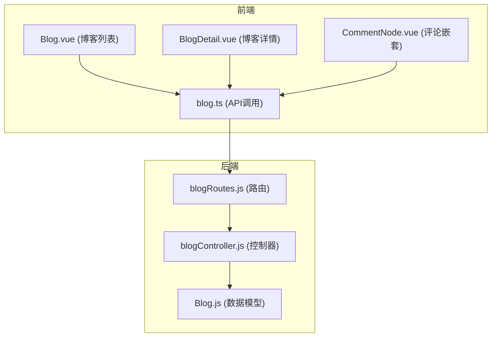
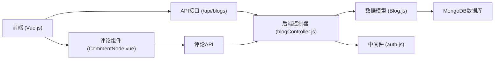
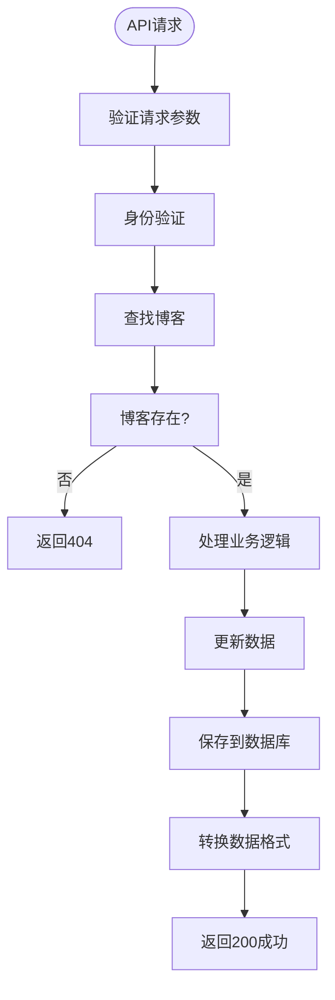
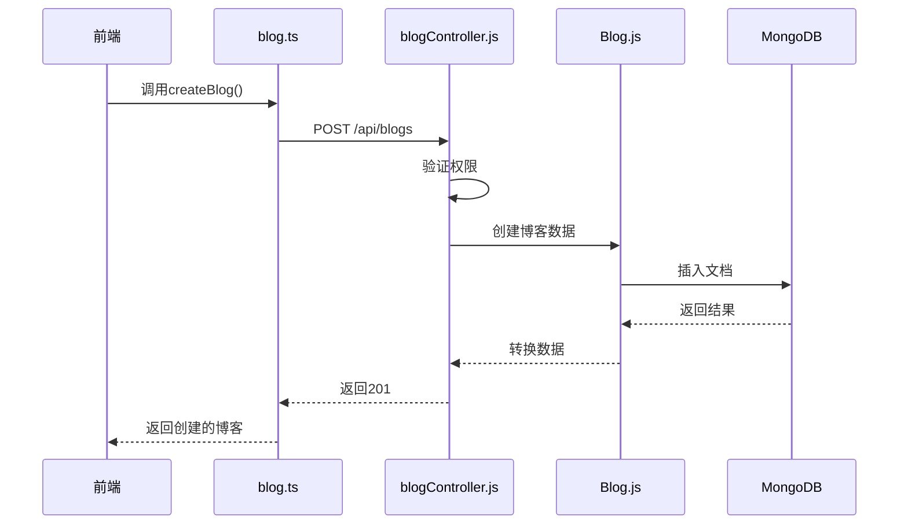
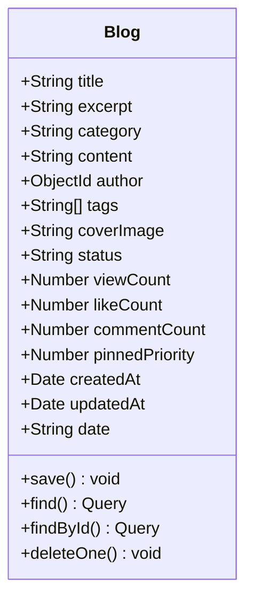
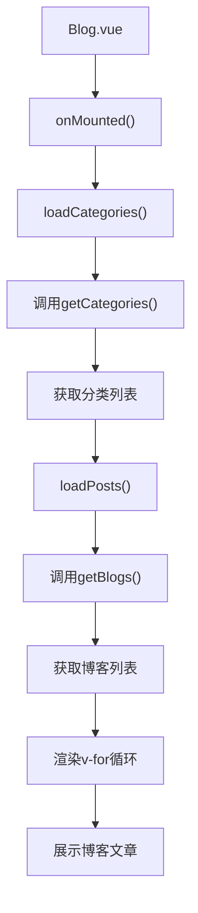
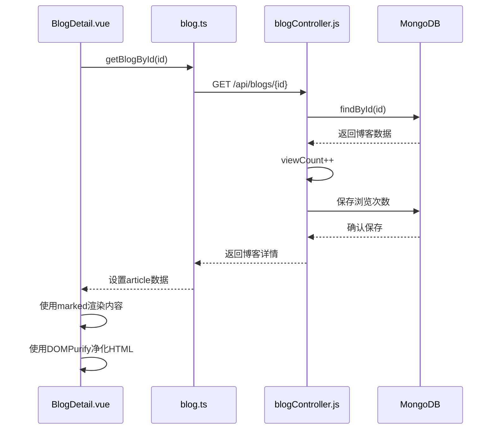
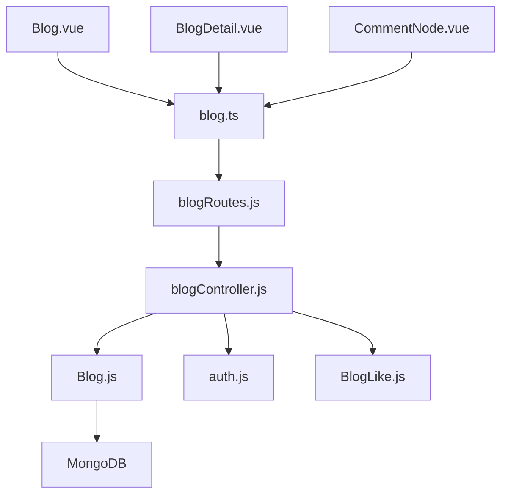

# 博客管理系统

<cite>
**本文档引用文件**  
- [blogController.js](file://backend/controllers/blogController.js)
- [Blog.js](file://backend/models/Blog.js)
- [blog.ts](file://frontend/src/api/blog.ts)
- [Blog.vue](file://frontend/src/views/Blog.vue)
- [BlogDetail.vue](file://frontend/src/views/BlogDetail.vue)
- [CommentNode.vue](file://frontend/src/components/CommentNode.vue)
- [blogRoutes.js](file://backend/routes/blogRoutes.js)
</cite>

## 目录
1. [项目结构](#项目结构)
2. [核心组件](#核心组件)
3. [架构概览](#架构概览)
4. [详细组件分析](#详细组件分析)
5. [依赖分析](#依赖分析)
6. [性能考虑](#性能考虑)
7. [故障排除指南](#故障排除指南)
8. [结论](#结论)

## 项目结构

项目采用前后端分离架构，前端位于`frontend`目录，后端位于`backend`目录。

**图表来源**  
- [blogController.js](file://backend/controllers/blogController.js)
- [Blog.js](file://backend/models/Blog.js)
- [blog.ts](file://frontend/src/api/blog.ts)
- [Blog.vue](file://frontend/src/views/Blog.vue)
- [BlogDetail.vue](file://frontend/src/views/BlogDetail.vue)

**章节来源**  
- [blogController.js](file://backend/controllers/blogController.js)
- [Blog.js](file://backend/models/Blog.js)
- [blog.ts](file://frontend/src/api/blog.ts)
- [Blog.vue](file://frontend/src/views/Blog.vue)
- [BlogDetail.vue](file://frontend/src/views/BlogDetail.vue)

## 核心组件

系统核心功能围绕博客的CRUD操作、分类标签管理、点赞机制和访问统计展开。后端通过`blogController.js`处理所有博客相关请求，前端通过`blog.ts`调用API，在`Blog.vue`中展示列表，在`BlogDetail.vue`中渲染详情。

**章节来源**  
- [blogController.js](file://backend/controllers/blogController.js)
- [blog.ts](file://frontend/src/api/blog.ts)
- [Blog.vue](file://frontend/src/views/Blog.vue)
- [BlogDetail.vue](file://frontend/src/views/BlogDetail.vue)

## 架构概览

系统采用典型的MVC架构，前端通过API与后端交互，后端处理业务逻辑并与数据库通信。

**图表来源**  
- [blogController.js](file://backend/controllers/blogController.js)
- [Blog.js](file://backend/models/Blog.js)
- [blog.ts](file://frontend/src/api/blog.ts)
- [Blog.vue](file://frontend/src/views/Blog.vue)
- [BlogDetail.vue](file://frontend/src/views/BlogDetail.vue)
- [CommentNode.vue](file://frontend/src/components/CommentNode.vue)

## 详细组件分析

### 博客控制器分析

`blogController.js`是博客功能的核心，实现了完整的CRUD操作和业务逻辑。

#### 博客数据流分析

**图表来源**  
- [blogController.js](file://backend/controllers/blogController.js)

#### 博客创建流程

**图表来源**  
- [blogController.js](file://backend/controllers/blogController.js#L145-L200)
- [blog.ts](file://frontend/src/api/blog.ts#L35-L42)
- [Blog.js](file://backend/models/Blog.js)

**章节来源**  
- [blogController.js](file://backend/controllers/blogController.js#L145-L200)
- [blog.ts](file://frontend/src/api/blog.ts#L35-L42)

### 博客模型分析

`Blog.js`定义了博客的数据结构和验证规则。

**图表来源**  
- [Blog.js](file://backend/models/Blog.js)

**章节来源**  
- [Blog.js](file://backend/models/Blog.js)

### 前端组件分析

#### 博客列表展示

**图表来源**  
- [Blog.vue](file://frontend/src/views/Blog.vue)

#### 博客详情渲染

**图表来源**  
- [BlogDetail.vue](file://frontend/src/views/BlogDetail.vue#L100-L150)
- [blogController.js](file://backend/controllers/blogController.js#L86-L149)

**章节来源**  
- [BlogDetail.vue](file://frontend/src/views/BlogDetail.vue#L100-L150)
- [blogController.js](file://backend/controllers/blogController.js#L86-L149)

## 依赖分析

系统各组件之间存在明确的依赖关系，形成了清晰的调用链。

**图表来源**  
- [blogController.js](file://backend/controllers/blogController.js)
- [Blog.js](file://backend/models/Blog.js)
- [blog.ts](file://frontend/src/api/blog.ts)
- [Blog.vue](file://frontend/src/views/Blog.vue)
- [BlogDetail.vue](file://frontend/src/views/BlogDetail.vue)
- [CommentNode.vue](file://frontend/src/components/CommentNode.vue)

**章节来源**  
- [blogController.js](file://backend/controllers/blogController.js)
- [Blog.js](file://backend/models/Blog.js)
- [blog.ts](file://frontend/src/api/blog.ts)

## 性能考虑

系统在性能方面进行了多项优化：

1. **分页查询**：使用`skip`和`limit`实现分页，避免一次性加载大量数据
2. **并行执行**：使用`Promise.all`并行执行查询和计数操作
3. **数据库索引**：在`Blog.js`中为常用查询字段创建了多个索引
4. **缓存优化**：前端组件使用计算属性和响应式数据减少重复计算
5. **懒加载**：图片使用`loading="lazy"`属性实现懒加载

## 故障排除指南

### 常见问题及解决方案

1. **博客无法创建**
   - 检查用户权限是否为管理员
   - 验证请求体是否包含必需字段（title, excerpt, content）
   - 检查后端日志中的错误信息

2. **浏览次数不增加**
   - 确认`getBlogById`方法中是否正确递增`viewCount`
   - 检查数据库保存操作是否成功
   - 验证前端是否正确调用了API

3. **点赞功能失效**
   - 检查用户是否已登录
   - 验证`BlogLike`模型是否正确创建
   - 确认`likeCount`字段是否同步更新

4. **富文本内容显示异常**
   - 检查`marked`配置是否正确
   - 验证`DOMPurify`是否过滤了必要的HTML标签
   - 确认图片路径处理逻辑是否正确

**章节来源**  
- [blogController.js](file://backend/controllers/blogController.js)
- [BlogDetail.vue](file://frontend/src/views/BlogDetail.vue)

## 结论

博客管理系统实现了完整的博客管理功能，包括CRUD操作、分类标签管理、点赞机制和访问统计。系统采用前后端分离架构，后端使用Node.js和MongoDB，前端使用Vue.js。通过合理的数据模型设计和API接口规划，系统具有良好的可扩展性和维护性。管理员可以通过后台界面管理博客内容，普通用户可以浏览和评论博客文章。系统还实现了SEO优化和内容安全过滤，确保了网站的安全性和可访问性。