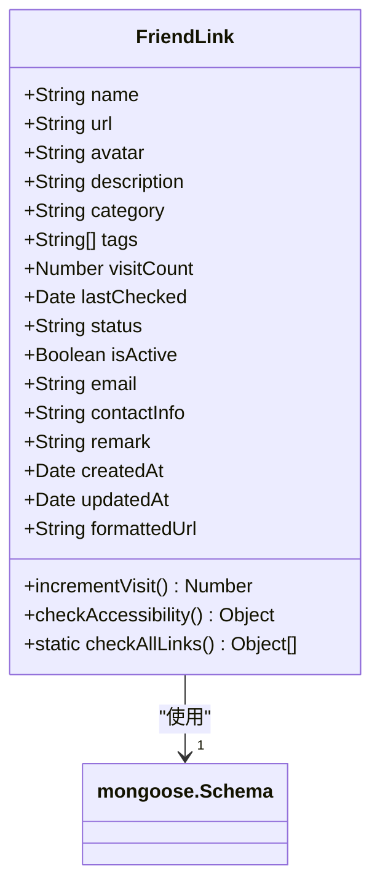
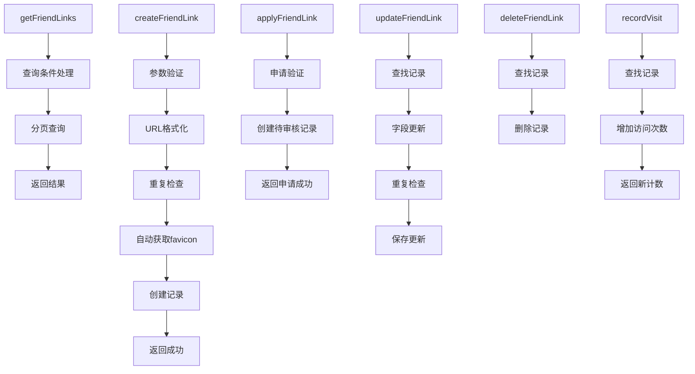
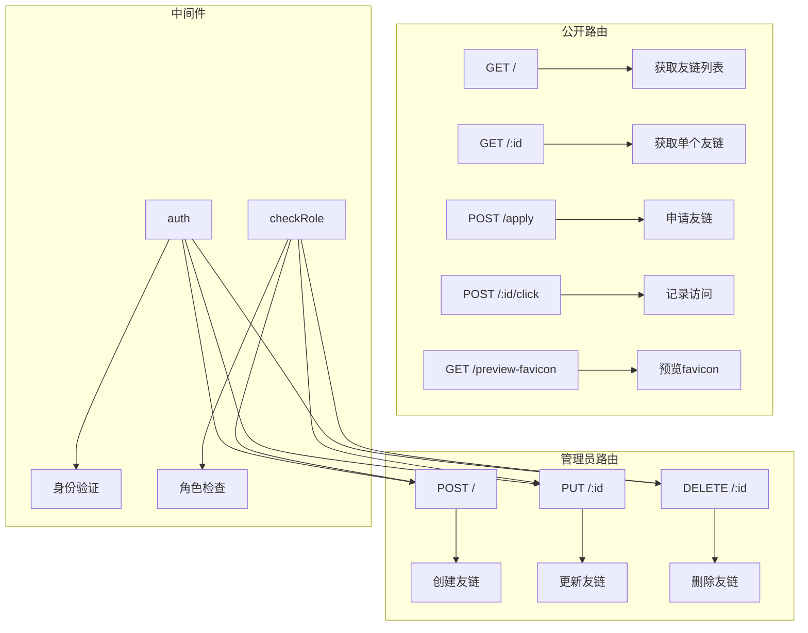
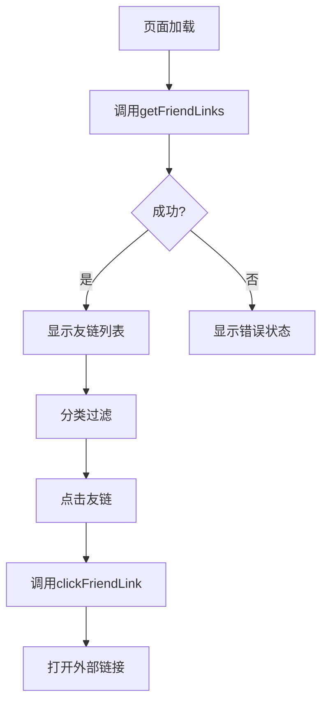
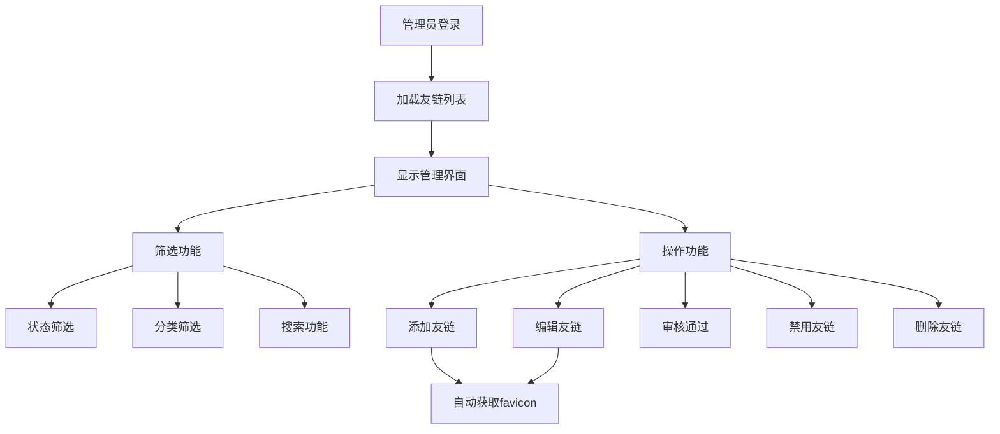
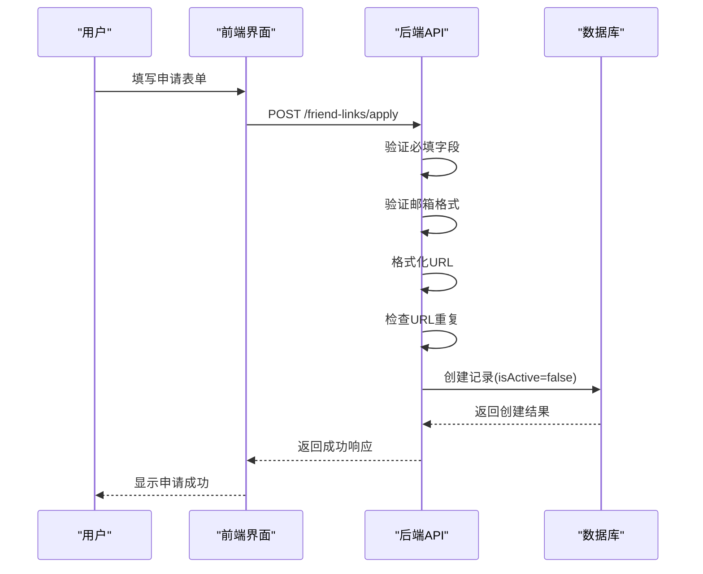
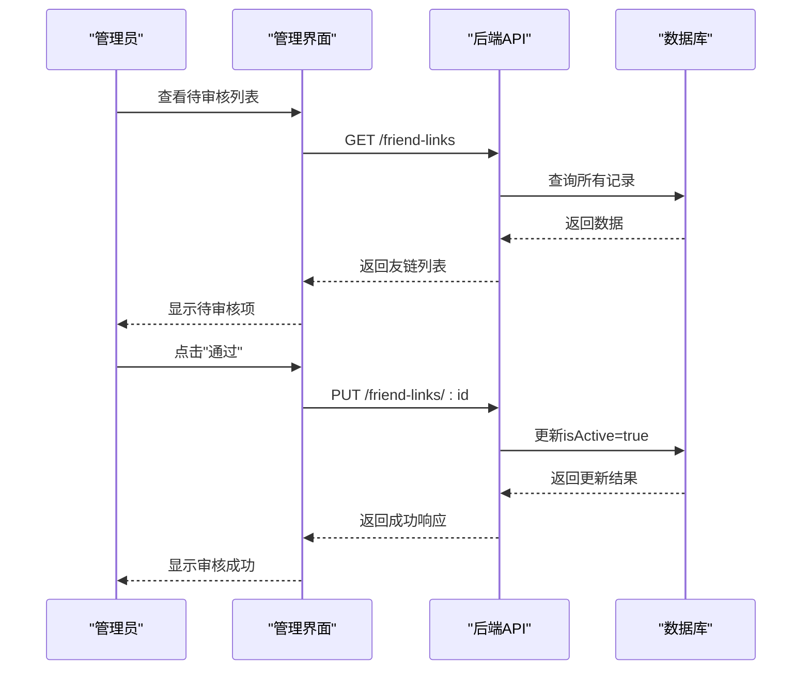
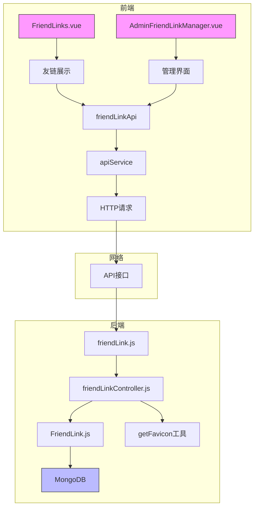

# 友情链接系统

<cite>
**本文档引用文件**  
- [FriendLink.js](file://backend/models/FriendLink.js)
- [friendLinkController.js](file://backend/controllers/friendLinkController.js)
- [friendLink.ts](file://frontend/src/api/friendLink.ts)
- [FriendLinks.vue](file://frontend/src/views/FriendLinks.vue)
- [AdminFriendLinkManager.vue](file://frontend/src/views/Admin/components/AdminFriendLinkManager.vue)
- [friendLink.js](file://backend/routes/friendLink.js)
</cite>

## 目录
1. [系统概述](#系统概述)
2. [数据模型设计](#数据模型设计)
3. [后端功能实现](#后端功能实现)
4. [前端交互逻辑](#前端交互逻辑)
5. [友链申请与审核流程](#友链申请与审核流程)
6. [安全与验证机制](#安全与验证机制)
7. [性能优化策略](#性能优化策略)
8. [系统架构图](#系统架构图)

## 系统概述

友情链接系统是一个完整的前后端分离的网站资源管理模块，支持用户申请、管理员审核、分类展示和访问统计等功能。系统通过RESTful API提供服务，前端使用Vue.js构建响应式界面。

系统主要功能包括：
- 用户提交友情链接申请
- 管理员审核和管理友链
- 前端展示已通过的友链
- 自动获取网站favicon图标
- 记录友链访问次数
- 支持分类和搜索功能

**Section sources**
- [friendLinkController.js](file://backend/controllers/friendLinkController.js#L1-L352)
- [friendLink.js](file://backend/routes/friendLink.js#L1-L34)

## 数据模型设计

### 友情链接数据结构



**Diagram sources**
- [FriendLink.js](file://backend/models/FriendLink.js#L10-L202)

**Section sources**
- [FriendLink.js](file://backend/models/FriendLink.js#L10-L202)

### 字段说明

:名称: 友链网站名称，必填项，最大长度50字符  
:URL: 网站地址，必填项，支持带协议和不带协议的格式  
:图标: 网站头像/Logo路径，可自动获取favicon  
:描述: 网站描述信息，最大长度200字符  
:分类: 链接分类，枚举值包括"个人博客"、"技术社区"、"学习资源"、"工具网站"、"友情链接"、"其他"  
:标签: 标签数组，用于关键词标记  
:访问次数: 记录该友链被点击的总次数  
:最后检查时间: 上次检查链接有效性的日期  
:状态: 链接状态，枚举值包括"正常"、"待审核"、"已失效"  
:是否激活: 布尔值，表示链接是否已通过审核并激活  
:邮箱: 联系邮箱，用于审核沟通  
:联系信息: 其他联系方式（如QQ、微信等）  
:备注: 管理员备注信息，最大长度500字符  
:创建时间: 记录创建时间戳  
:更新时间: 记录最后更新时间戳  

### 虚拟字段与方法

:formattedUrl: 虚拟字段，自动为不带协议的URL添加"https://"前缀  
:incrementVisit(): 实例方法，增加访问次数并保存  
:checkAccessibility(): 实例方法，检查链接有效性并更新状态  
:checkAllLinks(): 静态方法，批量检查所有链接的有效性  

### 索引设计

:文本索引: 在name和description字段上创建，支持全文搜索  
:分类索引: 在category字段上创建，提高分类查询性能  
:状态索引: 在status字段上创建，优化状态筛选  
:激活状态索引: 在isActive字段上创建，加速审核状态查询  
:访问量索引: 在visitCount字段上创建降序索引，支持热门排序  

**Section sources**
- [FriendLink.js](file://backend/models/FriendLink.js#L10-L202)

## 后端功能实现

### 控制器方法



**Diagram sources**
- [friendLinkController.js](file://backend/controllers/friendLinkController.js#L1-L352)

**Section sources**
- [friendLinkController.js](file://backend/controllers/friendLinkController.js#L1-L352)

### API端点配置



**Diagram sources**
- [friendLink.js](file://backend/routes/friendLink.js#L1-L34)

**Section sources**
- [friendLink.js](file://backend/routes/friendLink.js#L1-L34)

### 核心功能逻辑

#### 友链创建流程

1. 验证必填字段（名称、URL）
2. 格式化URL（自动添加https://）
3. 检查URL是否已存在
4. 尝试自动获取网站favicon
5. 设置默认状态为"待审核"
6. 创建数据库记录

#### 友链更新流程

1. 查找指定ID的友链记录
2. 验证更新字段的有效性
3. 检查URL是否被其他友链使用
4. 处理favicon自动获取逻辑
5. 保存更新后的记录

#### 访问记录流程

1. 查找指定ID的友链记录
2. 调用incrementVisit()方法增加访问次数
3. 返回新的访问计数

**Section sources**
- [friendLinkController.js](file://backend/controllers/friendLinkController.js#L1-L352)

## 前端交互逻辑

### API服务封装

```mermaid
classDiagram
class friendLinkApi {
+getFriendLinks(params) Promise
+getFriendLinkById(id) Promise
+previewFavicon(url) Promise
+applyFriendLink(data) Promise
+createFriendLink(data) Promise
+updateFriendLink(id, data) Promise
+deleteFriendLink(id) Promise
+clickFriendLink(id) Promise
}
friendLinkApi --> apiService : "依赖"
apiService --> "axios" : "使用"
```

**Diagram sources**
- [friendLink.ts](file://frontend/src/api/friendLink.ts#L1-L223)

**Section sources**
- [friendLink.ts](file://frontend/src/api/friendLink.ts#L1-L223)

### 用户界面组件

#### 友链展示页面 (FriendLinks.vue)



**Diagram sources**
- [FriendLinks.vue](file://frontend/src/views/FriendLinks.vue#L1-L455)

**Section sources**
- [FriendLinks.vue](file://frontend/src/views/FriendLinks.vue#L1-L455)

#### 管理界面组件 (AdminFriendLinkManager.vue)



**Diagram sources**
- [AdminFriendLinkManager.vue](file://frontend/src/views/Admin/components/AdminFriendLinkManager.vue#L1-L799)

**Section sources**
- [AdminFriendLinkManager.vue](file://frontend/src/views/Admin/components/AdminFriendLinkManager.vue#L1-L799)

### 前端核心逻辑

#### 友链展示逻辑

- 仅显示isActive为true的已通过友链
- 支持按分类进行过滤
- 显示访问次数统计
- 点击友链时记录访问并打开新窗口
- 自动处理URL格式（添加https://）
- 图标加载失败时显示默认图标

#### 管理功能逻辑

- 提供完整的CRUD操作界面
- 支持状态切换（通过/禁用）
- 集成favicon自动获取功能
- 实时搜索和筛选
- 模态框形式的创建/编辑界面
- 删除前的确认对话框

**Section sources**
- [FriendLinks.vue](file://frontend/src/views/FriendLinks.vue#L1-L455)
- [AdminFriendLinkManager.vue](file://frontend/src/views/Admin/components/AdminFriendLinkManager.vue#L1-L799)

## 友链申请与审核流程

### 申请流程



**Diagram sources**
- [friendLinkController.js](file://backend/controllers/friendLinkController.js#L290-L351)
- [friendLink.ts](file://frontend/src/api/friendLink.ts#L50-L58)
- [friendLink.js](file://backend/routes/friendLink.js#L20)

**Section sources**
- [friendLinkController.js](file://backend/controllers/friendLinkController.js#L290-L351)

### 审核流程



**Diagram sources**
- [friendLinkController.js](file://backend/controllers/friendLinkController.js#L140-L210)
- [AdminFriendLinkManager.vue](file://frontend/src/views/Admin/components/AdminFriendLinkManager.vue#L280-L300)

**Section sources**
- [friendLinkController.js](file://backend/controllers/friendLinkController.js#L140-L210)
- [AdminFriendLinkManager.vue](file://frontend/src/views/Admin/components/AdminFriendLinkManager.vue#L280-L300)

### 完整流程说明

1. **用户申请**：用户通过公开接口提交友链申请，系统验证基本信息后创建待审核记录
2. **自动处理**：系统尝试自动获取网站favicon作为图标
3. **管理员审核**：管理员在后台查看待审核列表，决定是否通过申请
4. **状态更新**：通过审核后，isActive设置为true，友链将在前端展示
5. **访问统计**：每次用户点击友链，都会记录访问次数
6. **定期检查**：系统可定期检查所有友链的有效性，自动标记失效链接

**Section sources**
- [friendLinkController.js](file://backend/controllers/friendLinkController.js#L1-L352)
- [AdminFriendLinkManager.vue](file://frontend/src/views/Admin/components/AdminFriendLinkManager.vue#L1-L799)

## 安全与验证机制

### 输入验证

:前端验证: 
- 必填字段检查
- 邮箱格式验证
- URL格式提示

:后端验证:
- 名称非空且不超过50字符
- URL格式正则验证
- 邮箱格式正则验证
- 分类值在允许范围内
- 状态值在允许范围内

### 防重复机制

- 创建时检查URL是否已存在
- 更新时检查新URL是否被其他友链使用
- 使用findOne查询避免重复记录

### XSS防护

- 所有用户输入字段使用trim()去除首尾空格
- 前端展示时对内容进行HTML转义
- 限制字段最大长度防止超长输入
- URL字段仅允许合法的网址格式

### 自动化功能

:favicon自动获取:
- 用户未提供图标时，自动调用getFavicon工具
- 基于网站域名获取favicon
- 失败时使用默认图标，不影响主流程

:URL格式化:
- 自动为不带协议的URL添加"https://"前缀
- 统一URL存储格式
- 前端展示时确保可点击

**Section sources**
- [friendLinkController.js](file://backend/controllers/friendLinkController.js#L1-L352)
- [FriendLink.js](file://backend/models/FriendLink.js#L10-L202)

## 性能优化策略

### 缓存策略

- 数据库索引优化查询性能
- 前端对友链列表进行本地缓存
- 频繁访问的静态资源使用CDN

### 静态化渲染

- 友链列表页面支持SSR（服务端渲染）
- 已通过的友链可生成静态HTML
- 减少数据库查询压力
- 提升页面加载速度

### 异步处理

- favicon获取使用异步处理
- 访问记录更新异步执行
- 批量检查链接有效性使用循环异步

### 资源优化

- 图标使用合适尺寸，避免过大文件
- 列表采用分页加载，避免一次性加载过多数据
- 响应数据精简，仅返回必要字段

**Section sources**
- [friendLinkController.js](file://backend/controllers/friendLinkController.js#L1-L352)
- [FriendLinks.vue](file://frontend/src/views/FriendLinks.vue#L1-L455)

## 系统架构图



**Diagram sources**
- [FriendLinks.vue](file://frontend/src/views/FriendLinks.vue#L1-L455)
- [AdminFriendLinkManager.vue](file://frontend/src/views/Admin/components/AdminFriendLinkManager.vue#L1-L799)
- [friendLink.js](file://backend/routes/friendLink.js#L1-L34)
- [friendLinkController.js](file://backend/controllers/friendLinkController.js#L1-L352)
- [FriendLink.js](file://backend/models/FriendLink.js#L10-L202)

**Section sources**
- [FriendLinks.vue](file://frontend/src/views/FriendLinks.vue#L1-L455)
- [AdminFriendLinkManager.vue](file://frontend/src/views/Admin/components/AdminFriendLinkManager.vue#L1-L799)
- [friendLink.js](file://backend/routes/friendLink.js#L1-L34)
- [friendLinkController.js](file://backend/controllers/friendLinkController.js#L1-L352)
- [FriendLink.js](file://backend/models/FriendLink.js#L10-L202)