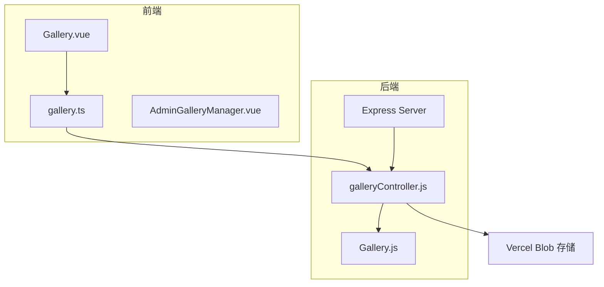
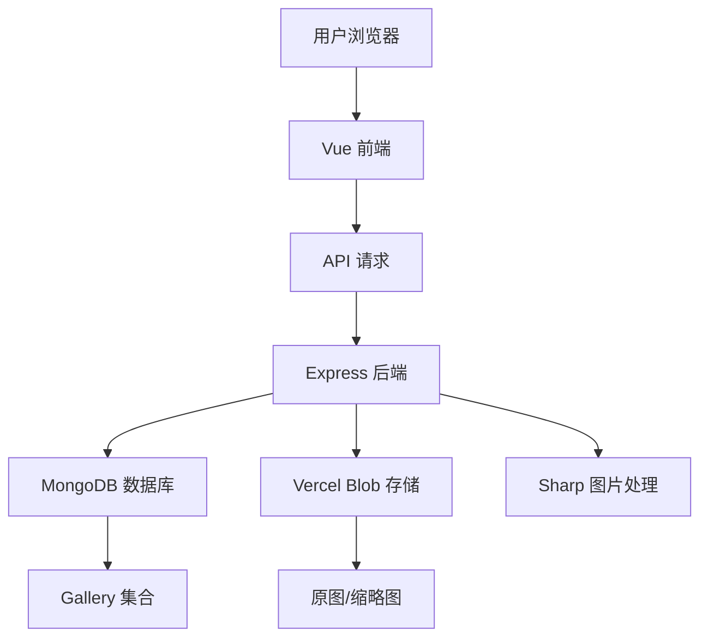
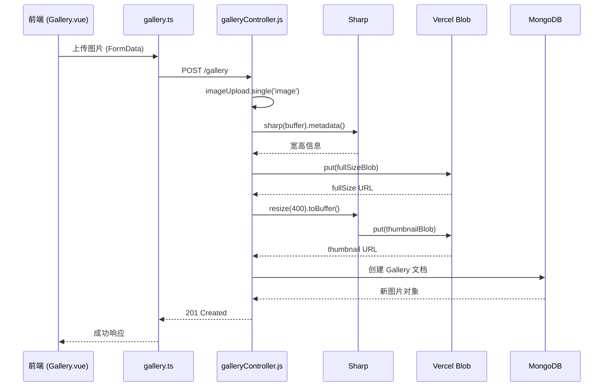
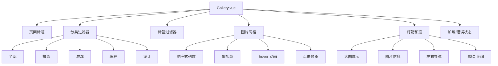
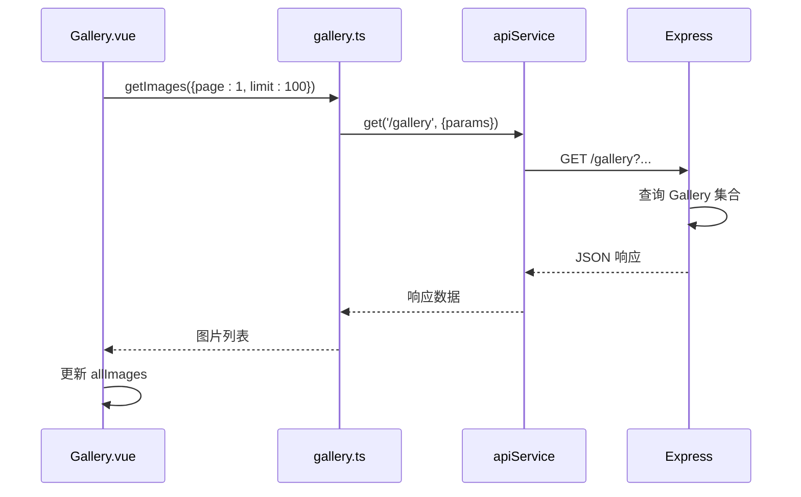
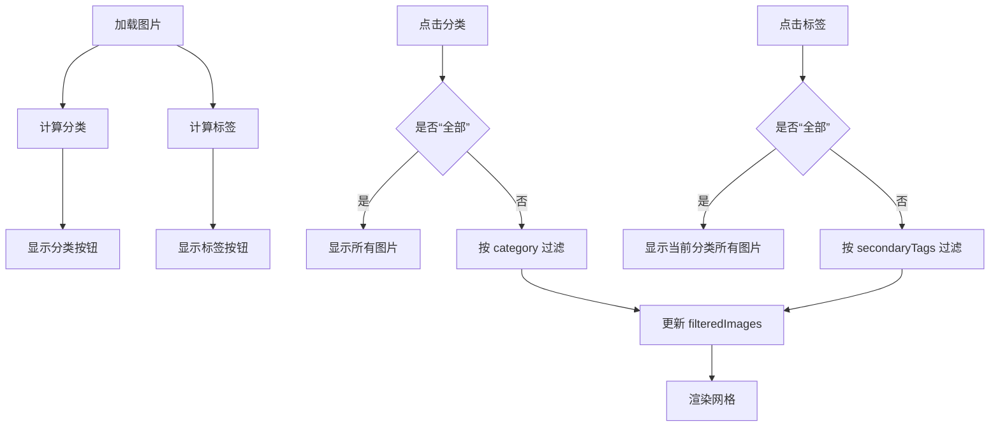
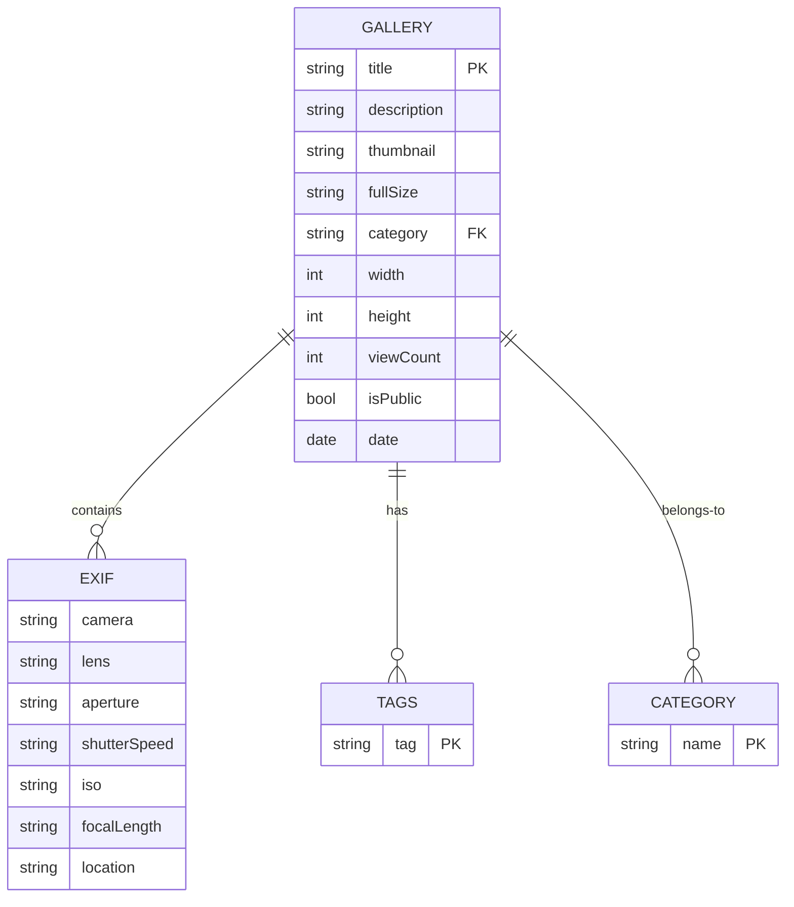

# 图库管理系统

<cite>
**本文档引用文件**  
- [galleryController.js](file://backend/controllers/galleryController.js)
- [Gallery.js](file://backend/models/Gallery.js)
- [gallery.ts](file://frontend/src/api/gallery.ts)
- [Gallery.vue](file://frontend/src/views/Gallery.vue)
- [AdminGalleryManager.vue](file://frontend/src/views/Admin/components/AdminGalleryManager.vue)
</cite>

## 目录
1. [项目结构](#项目结构)  
2. [核心组件](#核心组件)  
3. [架构概览](#架构概览)  
4. [详细组件分析](#详细组件分析)  
5. [依赖分析](#依赖分析)  
6. [性能优化策略](#性能优化策略)  
7. [安全与成本控制](#安全与成本控制)  
8. [结论](#结论)

## 项目结构

图库管理系统采用前后端分离架构，前端基于 Vue 3 + Vite 构建，后端使用 Node.js + Express + MongoDB。系统主要分为以下模块：

- **前端 (frontend)**：包含视图组件、API 调用、状态管理
- **后端 (backend)**：提供 RESTful API，处理图片上传、分类管理、EXIF 信息等
- **静态资源 (assets)**：打包后的 JS/CSS 文件

关键路径：
- 后端控制器：`backend/controllers/galleryController.js`
- 数据模型：`backend/models/Gallery.js`
- 前端 API 接口：`frontend/src/api/gallery.ts`
- 图库展示页面：`frontend/src/views/Gallery.vue`
- 管理后台：`frontend/src/views/Admin/components/AdminGalleryManager.vue`



**图源**  
- [galleryController.js](file://backend/controllers/galleryController.js)
- [Gallery.js](file://backend/models/Gallery.js)
- [gallery.ts](file://frontend/src/api/gallery.ts)
- [Gallery.vue](file://frontend/src/views/Gallery.vue)

## 核心组件

图库管理系统的核心功能包括图片上传、分类管理、标签过滤、EXIF 信息展示、响应式网格布局等。

- **图片上传**：支持多字段（标题、描述、分类、标签）与文件上传
- **分类管理**：支持“摄影”、“游戏”、“编程”、“设计”四大分类
- **标签系统**：动态标签过滤，支持多标签组合筛选
- **EXIF 信息**：自动提取并存储相机、镜头、光圈、快门、ISO 等信息
- **性能优化**：使用 Sharp 进行图片压缩，Vercel Blob 实现 CDN 加速
- **安全校验**：MIME 类型检查、文件大小限制、路径安全处理

**组件源**  
- [galleryController.js](file://backend/controllers/galleryController.js#L35-L215)
- [Gallery.js](file://backend/models/Gallery.js#L1-L120)
- [Gallery.vue](file://frontend/src/views/Gallery.vue#L0-L821)

## 架构概览

系统采用典型的三层架构：表现层（前端）、应用层（后端 API）、数据层（MongoDB + Vercel Blob）。



**图源**  
- [galleryController.js](file://backend/controllers/galleryController.js)
- [Gallery.js](file://backend/models/Gallery.js)

## 详细组件分析

### 图片上传流程分析

图片上传是图库系统的核心功能，涉及前端表单、后端中间件、图片处理、数据库存储等多个环节。

#### 上传流程序列图



**图源**  
- [galleryController.js](file://backend/controllers/galleryController.js#L97-L148)
- [gallery.ts](file://frontend/src/api/gallery.ts#L45-L60)
- [Gallery.vue](file://frontend/src/views/Gallery.vue)

#### 数据模型设计

```mermaid
classDiagram
class Gallery {
+String title
+String description
+String thumbnail
+String fullSize
+String category
+String[] secondaryTags
+String status
+Date date
+Number width
+Number height
+String author
+Number viewCount
+Boolean isPublic
+Object exif
+Number aspect (virtual)
}
Gallery : +required : title, thumbnail, fullSize, category
Gallery : +enum : category = [摄影, 游戏, 编程, 设计]
Gallery : +default : status = 'draft', isPublic = true
Gallery : +index : {title, description} (text)
Gallery : +index : {category, secondaryTags}
Gallery : +index : date
```

**图源**  
- [Gallery.js](file://backend/models/Gallery.js#L1-L120)

### 前端展示与交互分析

#### 图库页面组件结构



**图源**  
- [Gallery.vue](file://frontend/src/views/Gallery.vue#L0-L821)

#### 前端 API 调用流程



**图源**  
- [gallery.ts](file://frontend/src/api/gallery.ts#L20-L35)
- [Gallery.vue](file://frontend/src/views/Gallery.vue#L185-L236)

### 分类与标签过滤逻辑

#### 过滤流程图



**图源**  
- [Gallery.vue](file://frontend/src/views/Gallery.vue#L185-L236)

## 依赖分析

系统依赖关系清晰，前后端通过 REST API 解耦，核心依赖如下：



**图源**  
- [Gallery.js](file://backend/models/Gallery.js)
- [galleryController.js](file://backend/controllers/galleryController.js)

## 性能优化策略

### 图片压缩与 CDN 加速

系统使用 **Sharp** 库进行图片处理，实现以下优化：

- **原图存储**：保留原始图片用于高质量展示
- **缩略图生成**：自动生成 400px 宽度的缩略图用于列表展示
- **CDN 加速**：通过 Vercel Blob 实现全球 CDN 分发
- **懒加载**：前端使用 `loading="lazy"` 实现图片懒加载
- **响应式网格**：基于 CSS `column-count` 实现自适应布局

```javascript
// 图片处理代码示例
const thumbnailBuffer = await sharp(fileBuffer).resize(400).toBuffer();
const thumbnailBlob = await put(`gallery/thumbnails/${Date.now()}-${originalName}`, thumbnailBuffer, {
    access: 'public',
    contentType: req.file.mimetype,
});
```

**组件源**  
- [galleryController.js](file://backend/controllers/galleryController.js#L118-L125)

### 响应式加载与动画

前端采用现代化加载策略：

- **骨架屏**：加载时显示动画
- **渐进显示**：图片按顺序淡入
- **错误处理**：图片加载失败显示占位符
- **键盘导航**：支持 ESC 关闭、左右键切换

```css
.masonry-item {
  opacity: 0;
  animation: fadeInUp 0.6s ease-out forwards;
}

@keyframes fadeInUp {
  from { opacity: 0; transform: translateY(30px); }
  to { opacity: 1; transform: translateY(0); }
}
```

**组件源**  
- [Gallery.vue](file://frontend/src/views/Gallery.vue#L700-L710)

## 安全与成本控制

### 图片安全校验

系统在上传环节实施多重安全校验：

- **MIME 类型检查**：通过 `fileUpload.js` 中间件验证
- **文件大小限制**：防止超大文件上传
- **路径安全**：使用 Vercel Blob 自动生成安全 URL
- **权限控制**：非公开图片禁止访问
- **输入验证**：标题、描述长度限制

```javascript
// 安全校验示例
if (!req.file) {
  return res.status(400).json({ success: false, message: '请选择要上传的图片' });
}
```

**组件源**  
- [galleryController.js](file://backend/controllers/galleryController.js#L102-L105)

### 存储成本控制策略

- **双图存储**：仅存储原图和缩略图，避免多尺寸冗余
- **自动清理**：删除数据库记录时同步删除 Blob 文件
- **按需生成**：不预先生成多种尺寸，减少存储开销
- **CDN 缓存**：利用 Vercel 全球边缘节点降低带宽成本

```javascript
// 删除时清理 Blob
await del(image.fullSize);
await del(image.thumbnail);
```

**组件源**  
- [galleryController.js](file://backend/controllers/galleryController.js#L175-L185)

## 结论

图库管理系统实现了完整的图片管理功能，具备以下特点：

- **功能完整**：支持上传、分类、标签、EXIF、预览等核心功能
- **架构清晰**：前后端分离，职责明确，易于维护
- **性能优异**：Sharp 压缩 + Vercel CDN + 懒加载，保障加载速度
- **安全可靠**：多重校验 + 权限控制 + 安全存储
- **成本可控**：精简存储策略 + 自动清理机制

系统可扩展性强，未来可增加：
- EXIF 信息自动提取
- AI 标签生成
- 图片搜索（基于内容）
- 用户权限分级
- 批量操作支持

整体设计合理，代码结构清晰，具备良好的可维护性和扩展性。