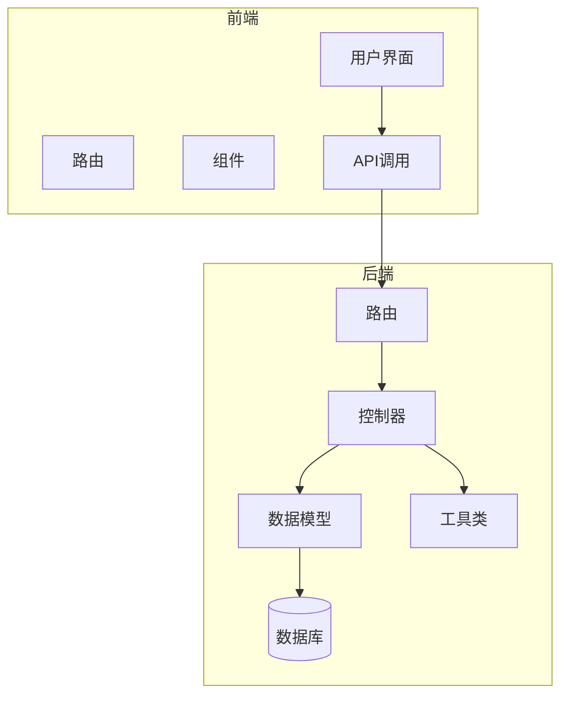
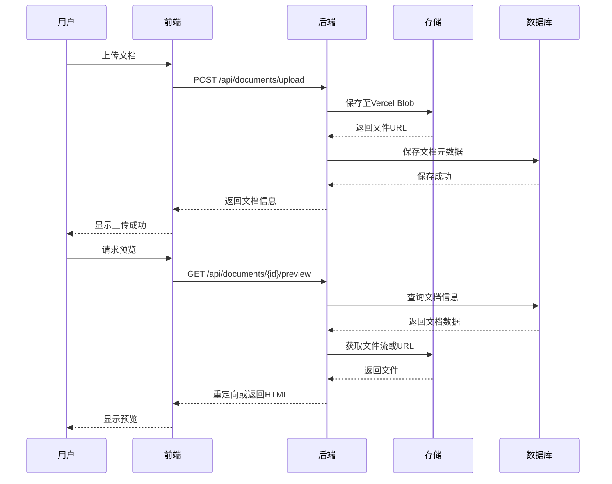
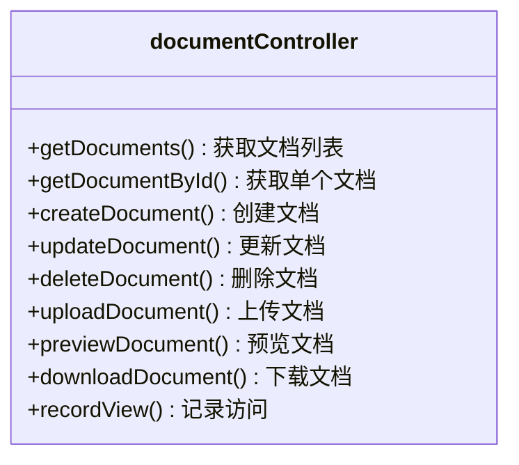
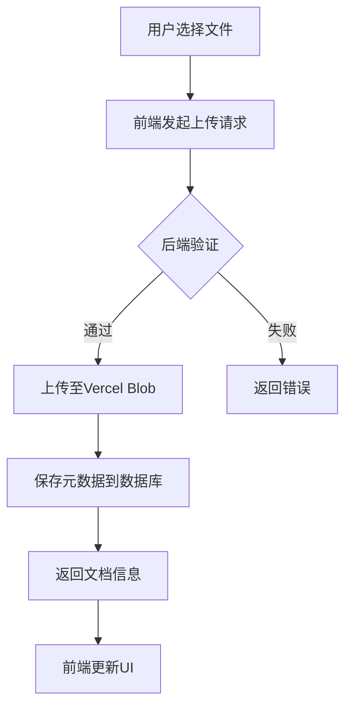
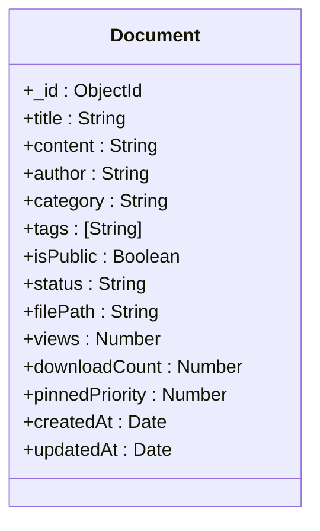
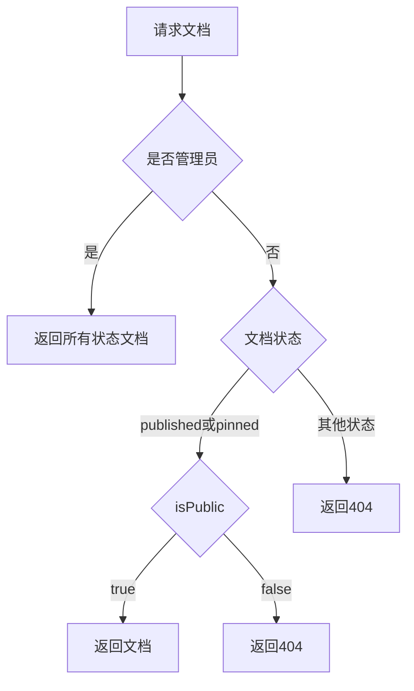
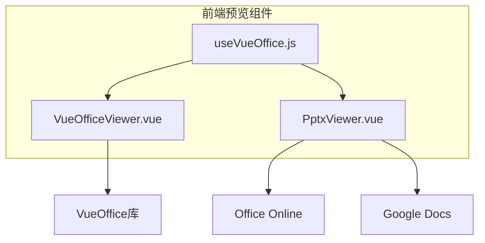

# 文档库系统

<cite>
**本文档引用文件**  
- [documentController.js](file://backend/controllers/documentController.js)
- [documentConverter.js](file://backend/utils/documentConverter.js)
- [Document.js](file://backend/models/Document.js)
- [PptxViewer.vue](file://frontend/src/components/document-preview/PptxViewer.vue)
- [VueOfficeViewer.vue](file://frontend/src/components/document-preview/VueOfficeViewer.vue)
</cite>

## 目录
1. [简介](#简介)
2. [项目结构](#项目结构)
3. [核心组件](#核心组件)
4. [架构概览](#架构概览)
5. [详细组件分析](#详细组件分析)
6. [依赖分析](#依赖分析)
7. [性能考虑](#性能考虑)
8. [故障排除指南](#故障排除指南)
9. [结论](#结论)

## 简介
本文档系统实现了完整的文档管理功能，涵盖文档上传、格式转换、在线预览与分类管理全流程。系统采用前后端分离架构，后端基于Node.js与MongoDB，前端使用Vue框架。核心功能包括多格式文档上传、Vercel Blob云存储、元数据提取、数据库记录、跨格式在线预览等。系统支持PDF、DOCX、PPTX等多种文档格式的上传与预览，并通过VueOffice库实现前端集成。

## 项目结构
项目采用分层架构，分为前端（frontend）与后端（backend）两大模块。后端包含控制器、中间件、模型、路由和工具类；前端包含API调用、组件、路由、状态管理等。



**图示来源**  
- [documentController.js](file://backend/controllers/documentController.js)
- [Document.js](file://backend/models/Document.js)

## 核心组件
系统核心组件包括文档控制器、文档转换工具、文档模型、前端预览组件等。`documentController.js`负责处理文档的增删改查、上传下载、预览等API逻辑；`documentConverter.js`提供格式转换支持；`Document.js`定义文档数据结构；前端`VueOfficeViewer.vue`和`PptxViewer.vue`实现跨格式预览。

**章节来源**  
- [documentController.js](file://backend/controllers/documentController.js#L1-L50)
- [documentConverter.js](file://backend/utils/documentConverter.js#L1-L10)
- [Document.js](file://backend/models/Document.js#L1-L5)

## 架构概览
系统采用MVC架构模式，前端通过RESTful API与后端交互。文档上传后存储于Vercel Blob或本地uploads目录，元数据存入MongoDB。预览时根据文件类型选择不同策略：PDF、TXT、MD直接流式传输；DOCX由前端mammoth.js解析；PPTX通过Office Online或Google Docs嵌入式预览。



**图示来源**  
- [documentController.js](file://backend/controllers/documentController.js#L100-L200)
- [Document.js](file://backend/models/Document.js#L10-L20)

## 详细组件分析

### 文档控制器分析
`documentController.js`是文档管理的核心，包含15个API接口，处理文档全生命周期操作。

#### 主要功能函数


**图示来源**  
- [documentController.js](file://backend/controllers/documentController.js#L20-L40)

#### 文档上传流程


**图示来源**  
- [documentController.js](file://backend/controllers/documentController.js#L800-L900)

### 文档转换工具分析
`documentConverter.js`提供文档格式转换能力，支持多种格式到HTML或文本的转换。

#### 转换支持矩阵
```mermaid
erDiagram
FORMAT {
string type PK
string description
string converter
boolean supported
}
FORMAT ||--o{ PDF : "支持"
FORMAT ||--o{ DOCX : "支持"
FORMAT ||--o{ PPTX : "支持"
FORMAT ||--o{ TXT : "支持"
FORMAT ||--o{ MD : "支持"
PDF {
string type "pdf"
string converter "内置流式传输"
boolean supported true
}
DOCX {
string type "docx"
string converter "前端mammoth.js"
boolean supported true
}
PPTX {
string type "pptx"
string converter "Office Online嵌入"
boolean supported true
}
```

**图示来源**  
- [documentConverter.js](file://backend/utils/documentConverter.js#L1-L100)

### 文档模型分析
`Document.js`定义了文档的数据结构和访问控制规则。

#### 数据模型字段


**图示来源**  
- [Document.js](file://backend/models/Document.js#L1-L30)

#### 访问控制逻辑


**图示来源**  
- [documentController.js](file://backend/controllers/documentController.js#L50-L100)

### 前端预览组件分析
前端通过`VueOfficeViewer.vue`和`PptxViewer.vue`实现多格式文档预览。

#### 预览组件架构


**图示来源**  
- [VueOfficeViewer.vue](file://frontend/src/components/document-preview/VueOfficeViewer.vue#L1-L20)
- [PptxViewer.vue](file://frontend/src/components/document-preview/PptxViewer.vue#L1-L20)

## 依赖分析
系统依赖关系清晰，各组件职责分明。

```mermaid
graph TD
A[documentController.js] --> B[Document.js]
A --> C[documentConverter.js]
A --> D[@vercel/blob]
E[VueOfficeViewer.vue] --> F[VueOffice]
G[PptxViewer.vue] --> H[Office Online]
G --> I[Google Docs]
A --> J[fileUpload.js]
```

**图示来源**  
- [documentController.js](file://backend/controllers/documentController.js#L1-L20)
- [VueOfficeViewer.vue](file://frontend/src/components/document-preview/VueOfficeViewer.vue#L1-L10)

## 性能考虑
系统在大文件处理、缓存策略和性能优化方面有以下设计：

1. **大文件处理**：使用流式传输避免内存溢出，Vercel Blob支持大文件存储
2. **缓存策略**：静态文件由CDN缓存，数据库查询结果可配置Redis缓存
3. **预览优化**：PPTX采用外部服务预览，减轻服务器压力
4. **并发控制**：使用异步非阻塞I/O处理文件上传和下载
5. **资源清理**：删除文档时自动清理Vercel Blob文件

## 故障排除指南
常见问题及解决方案：

- **文件上传失败**：检查`BLOB_READ_WRITE_TOKEN`环境变量配置
- **预览空白**：确认Vercel Blob URL可公开访问
- **PPTX无法预览**：检查Office Online或Google Docs服务可用性
- **DOCX解析错误**：确保前端mammoth.js库正确加载
- **数据库连接失败**：验证MongoDB连接字符串

**章节来源**  
- [documentController.js](file://backend/controllers/documentController.js#L1-L100)
- [documentConverter.js](file://backend/utils/documentConverter.js#L1-L50)

## 结论
文档库系统实现了完整的文档管理解决方案，具有良好的架构设计和扩展性。系统通过Vercel Blob实现可靠的文件存储，利用外部服务处理复杂格式预览，降低了服务器负担。前端组件化设计提高了代码复用性。未来可扩展方向包括：集成LibreOffice实现服务器端转换、增加文档搜索功能、支持更多文件格式等。