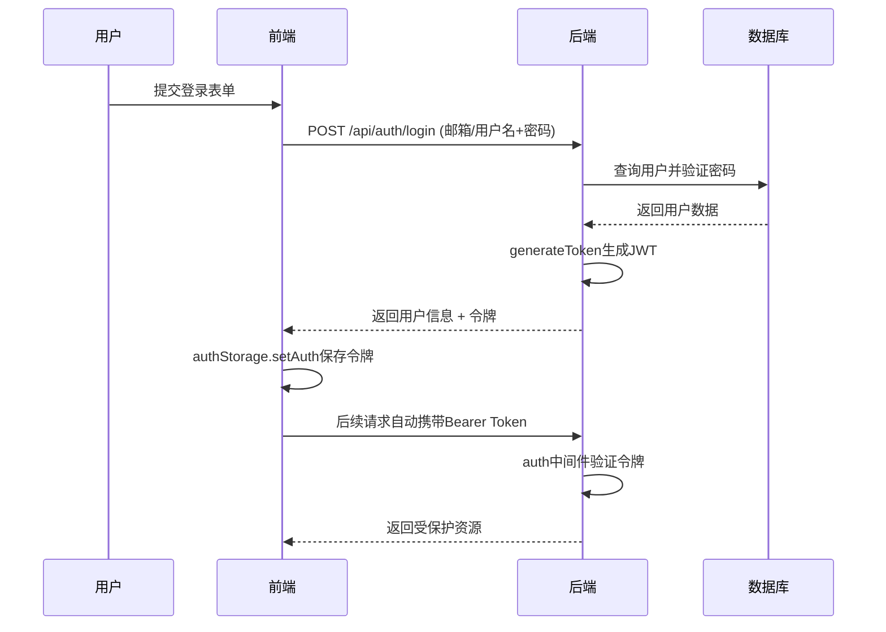
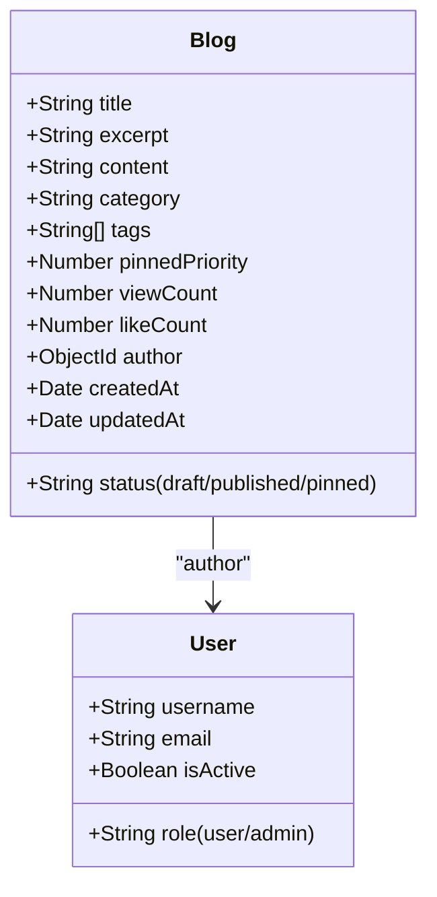
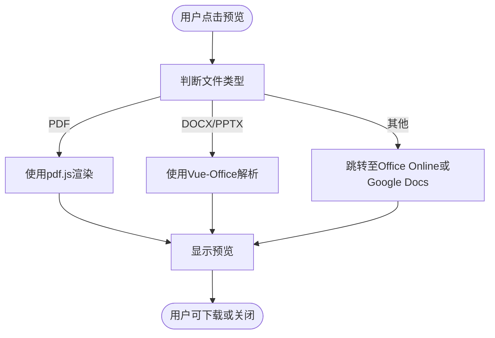
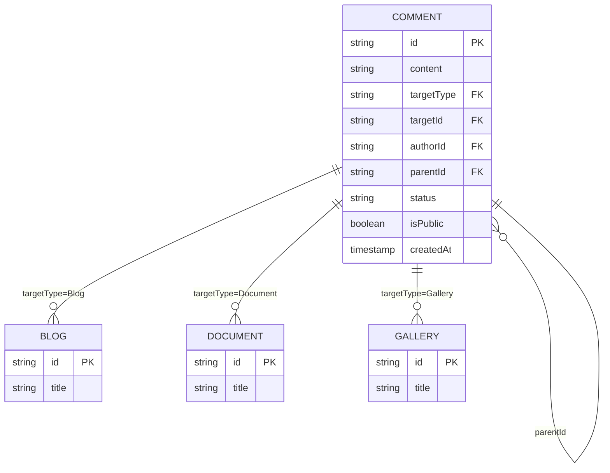
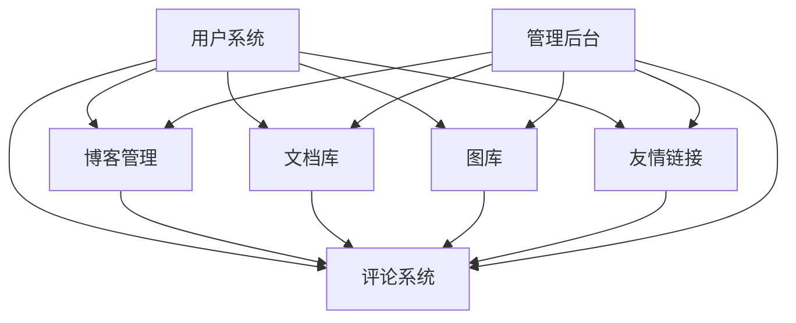

# 核心功能模块

<cite>
**本文档引用的文件**  
- [authController.js](file://backend/controllers/authController.js)
- [blogController.js](file://backend/controllers/blogController.js)
- [documentController.js](file://backend/controllers/documentController.js)
- [commentController.js](file://backend/controllers/commentController.js)
- [friendLinkController.js](file://backend/controllers/friendLinkController.js)
- [galleryController.js](file://backend/controllers/galleryController.js)
- [adminRoutes.js](file://backend/routes/adminRoutes.js)
- [authRoutes.js](file://backend/routes/authRoutes.js)
- [AdminPanel.vue](file://frontend/src/views/Admin/AdminPanel.vue)
- [AdminBlogManager.vue](file://frontend/src/views/Admin/components/AdminBlogManager.vue)
- [DocumentLibrary.vue](file://frontend/src/views/DocumentLibrary.vue)
- [VueOfficeViewer.vue](file://frontend/src/components/document-preview/VueOfficeViewer.vue)
- [CommentNode.vue](file://frontend/src/components/CommentNode.vue)
- [FriendLinks.vue](file://frontend/src/views/FriendLinks.vue)
- [Gallery.vue](file://frontend/src/views/Gallery.vue)
</cite>

## 目录
1. [用户认证模块](#用户认证模块)
2. [博客管理模块](#博客管理模块)
3. [文档库模块](#文档库模块)
4. [图库模块](#图库模块)
5. [评论系统模块](#评论系统模块)
6. [友情链接管理模块](#友情链接管理模块)
7. [模块关联性分析](#模块关联性分析)

## 用户认证模块

用户认证模块负责系统的身份验证与用户管理，是所有功能访问的基础安全屏障。该模块通过JWT（JSON Web Token）实现无状态认证，确保用户会话的安全性与可扩展性。

### 业务目标
- 实现用户注册、登录与身份验证
- 管理用户会话状态
- 提供管理员权限验证机制
- 支持邮箱或用户名登录

### 用户交互流程
1. **注册流程**：用户填写用户名、邮箱、密码 → 前端验证 → 发送POST请求至`/api/auth/register` → 后端检查唯一性 → 创建用户并返回JWT令牌
2. **登录流程**：用户输入邮箱/用户名与密码 → 前端提交 → 请求`/api/auth/login` → 验证凭证 → 返回用户信息与令牌
3. **权限访问**：携带JWT令牌访问受保护接口 → 中间件验证令牌 → 解析用户角色 → 允许或拒绝访问

### 关键操作能力
- 注册新用户（防止重复邮箱/用户名）
- 登录认证（支持邮箱或用户名）
- 获取当前用户信息（`/api/auth/me`）
- 前端本地存储管理（`authStorage`）

### 业务逻辑实现要点
后端控制器`authController.js`通过`generateToken`函数生成JWT令牌，并在`login`和`register`函数中返回。前端通过`authStorage`将令牌存入`localStorage`，并在请求拦截器中自动附加`Authorization`头。

**图示来源**
- [authController.js](file://backend/controllers/authController.js#L0-L64)
- [authRoutes.js](file://backend/routes/authRoutes.js#L0-L25)
- [auth.ts](file://frontend/src/api/auth.ts#L0-L60)

**本节来源**
- [authController.js](file://backend/controllers/authController.js#L0-L141)
- [auth.ts](file://frontend/src/api/auth.ts#L0-L161)

## 博客管理模块

博客管理模块是内容发布的核心，支持文章的创建、编辑、发布、置顶与分类管理，面向管理员提供完整的后台管理界面。

### 业务目标
- 实现博客文章的全生命周期管理（草稿、发布、置顶）
- 支持按分类、标签、状态筛选
- 提供Markdown内容编辑与预览
- 统计浏览量与点赞数

### 用户交互流程
1. **创建博客**：进入管理面板 → 点击“创建博客” → 填写标题、摘要、内容、分类、标签 → 选择状态（草稿/发布/置顶）→ 保存
2. **编辑博客**：在博客列表中选择文章 → 点击“编辑” → 修改内容 → 保存更新
3. **删除博客**：在列表中点击“删除” → 确认操作

### 关键操作能力
- 创建与编辑博客（支持Markdown）
- 设置文章状态（草稿、已发布、置顶）
- 按分类与标签组织内容
- 自动统计浏览次数（`viewCount`）
- 支持全文搜索

### 业务逻辑实现要点
后端`blogController.js`中的`createBlog`函数处理创建逻辑，自动设置`pinnedPriority`字段（置顶为1，否则为0），确保置顶文章在列表中优先显示。`getBlogs`函数根据状态筛选并排序，优先显示置顶文章。

前端`AdminBlogManager.vue`提供可视化表格管理界面，支持搜索、状态筛选与分页。

**图示来源**
- [Blog.js](file://backend/models/Blog.js)
- [blogController.js](file://backend/controllers/blogController.js#L0-L630)

**本节来源**
- [blogController.js](file://backend/controllers/blogController.js#L0-L630)
- [AdminBlogManager.vue](file://frontend/src/views/Admin/components/AdminBlogManager.vue#L0-L711)

## 文档库模块

文档库模块用于集中管理各类文档文件（PDF、DOCX、PPTX等），支持在线预览、分类存储与下载，提升知识共享效率。

### 业务目标
- 统一存储与管理文档资源
- 实现多种格式文档的在线预览
- 支持按类型、分类、标签检索
- 记录下载次数与访问统计

### 用户交互流程
1. **上传文档**：管理员进入文档管理 → 选择文件 → 填写标题、描述、分类 → 上传
2. **预览文档**：在文档库中点击“预览” → 系统自动选择预览方式（VueOffice、Office Online、Google Docs）
3. **下载文档**：点击“下载”按钮获取文件

### 关键操作能力
- 支持PDF、DOCX、PPTX、TXT等格式
- 集成VueOffice组件实现本地化预览
- 提供Office Online与Google Docs备选方案
- 显示文件大小、类型、上传时间

### 业务逻辑实现要点
前端`VueOfficeViewer.vue`组件根据文件类型动态选择预览方案：
- PPTX/PPT：使用`vue-office`库解析
- PDF：使用`pdf.js`渲染
- 其他：跳转至Office Online或Google Docs

后端`documentController.js`提供`/api/documents/:id/content`接口返回文件流，支持前端获取内容进行预览。

**图示来源**
- [VueOfficeViewer.vue](file://frontend/src/components/document-preview/VueOfficeViewer.vue#L124-L160)
- [documentController.js](file://backend/controllers/documentController.js#L591-L619)

**本节来源**
- [documentController.js](file://backend/controllers/documentController.js)
- [DocumentLibrary.vue](file://frontend/src/views/DocumentLibrary.vue#L61-L114)
- [VueOfficeViewer.vue](file://frontend/src/components/document-preview/VueOfficeViewer.vue)

## 图库模块

图库模块用于展示与管理网站图片资源，支持图片上传、分类与展示，增强视觉内容的表现力。

### 业务目标
- 集中管理网站图片资源
- 提供图片上传与元数据编辑
- 支持按分类浏览图片
- 管理图片发布状态（待审核/已发布）

### 用户交互流程
1. **上传图片**：管理员进入图库管理 → 点击上传 → 选择文件 → 填写标题、描述 → 提交
2. **浏览图片**：访问`/gallery`页面 → 按分类筛选 → 查看图片列表
3. **管理图片**：在后台审核待发布图片 → 编辑或删除

### 关键操作能力
- 支持常见图片格式（JPG、PNG、GIF等）
- 可设置图片标题与描述
- 管理图片状态（pending/published）
- 统计图片总数

### 业务逻辑实现要点
后端`galleryController.js`处理图片上传与管理，前端`Gallery.vue`展示图片网格。管理员可通过`AdminGalleryManager.vue`进行全量管理。

**本节来源**
- [galleryController.js](file://backend/controllers/galleryController.js)
- [Gallery.vue](file://frontend/src/views/Gallery.vue)

## 评论系统模块

评论系统模块支持对博客、文档、图库等内容的评论与互动，增强用户参与度。

### 业务目标
- 实现内容关联评论
- 支持评论审核机制
- 允许公开/隐藏评论
- 支持评论回复（嵌套结构）

### 用户交互流程
1. **发表评论**：在博客/文档页面填写评论 → 提交 → 进入审核队列
2. **查看评论**：页面加载时获取公开评论 → 显示评论树
3. **管理评论**：管理员审核评论 → 设为公开或拒绝

### 关键操作能力
- 关联目标类型（Blog/Gallery/Document）
- 支持嵌套回复（`parentId`）
- 管理评论状态（approved/pending/rejected）
- 控制公开性（`isPublic`）

### 业务逻辑实现要点
`Comment.js`模型定义`targetType`与`targetId`实现多态关联。`commentController.js`处理创建、审核与查询。前端`CommentNode.vue`递归渲染评论树。

**图示来源**
- [Comment.js](file://backend/models/Comment.js)
- [commentController.js](file://backend/controllers/commentController.js)

**本节来源**
- [commentController.js](file://backend/controllers/commentController.js)
- [CommentNode.vue](file://frontend/src/components/CommentNode.vue)

## 友情链接管理模块

友情链接管理模块用于维护外部网站链接，支持分类展示与点击统计。

### 业务目标
- 管理外部网站链接
- 按分类展示友链
- 记录点击次数
- 支持链接审核流程

### 用户交互流程
1. **添加友链**：管理员填写名称、URL、描述、分类 → 提交 → 等待审核
2. **展示友链**：前端`FriendLinks.vue`获取已批准链接 → 按分类渲染
3. **统计点击**：用户点击链接 → 后端记录`clickCount`

### 关键操作能力
- 支持链接分类管理
- 审核机制（approved/pending/rejected）
- 统计点击次数
- 显示友链Logo（可选）

### 业务逻辑实现要点
`FriendLink.js`模型定义链接元数据。`friendLinkController.js`处理CRUD操作。前端`FriendLinks.vue`提供分类展示。

**本节来源**
- [friendLinkController.js](file://backend/controllers/friendLinkController.js)
- [FriendLinks.vue](file://frontend/src/views/FriendLinks.vue)

## 模块关联性分析

各功能模块通过统一的数据模型与用户系统紧密关联，形成有机整体。

### 用户系统作为核心枢纽
所有模块的操作均与`User`模型关联：
- 博客有`author`字段指向用户
- 评论记录`authorId`
- 文档、图库、友链均有创建者信息

### 内容与评论的多态关联
通过`targetType`与`targetId`实现评论对多种内容的关联，避免为每种内容创建独立评论表。

### 管理后台的统一入口
`AdminPanel.vue`集成所有管理组件，提供一站式管理界面，包括：
- `AdminBlogManager`
- `AdminDocumentManager`
- `AdminGalleryManager`
- `AdminFriendLinkManager`
- `AdminCommentReview`
- `AdminUserManager`

### 数据统计的聚合
`adminRoutes.js`中的`/admin/dashboard`接口聚合各模块统计数据，为管理员提供全局视图。

**图示来源**
- [adminRoutes.js](file://backend/routes/adminRoutes.js#L116-L216)
- [AdminPanel.vue](file://frontend/src/views/Admin/AdminPanel.vue#L69-L89)

**本节来源**
- [adminRoutes.js](file://backend/routes/adminRoutes.js)
- [AdminPanel.vue](file://frontend/src/views/Admin/AdminPanel.vue)