# 用户认证系统

<cite>
**本文档引用文件**  
- [authController.js](file://backend/controllers/authController.js)
- [User.js](file://backend/models/User.js)
- [auth.js](file://backend/middleware/auth.js)
- [auth.ts](file://frontend/src/api/auth.ts)
- [LoginModal.vue](file://frontend/src/components/LoginModal.vue)
- [UserPanel.vue](file://frontend/src/views/User/UserPanel.vue)
- [auth.js](file://frontend/src/store/modules/auth.js)
- [authRoutes.js](file://backend/routes/authRoutes.js)
</cite>

## 目录
1. [简介](#简介)
2. [项目结构](#项目结构)
3. [核心组件](#核心组件)
4. [架构概览](#架构概览)
5. [详细组件分析](#详细组件分析)
6. [依赖分析](#依赖分析)
7. [性能考虑](#性能考虑)
8. [故障排除指南](#故障排除指南)
9. [结论](#结论)

## 简介
本系统为 my_website 提供完整的用户认证功能，涵盖注册、登录、JWT 令牌管理、用户信息获取等核心流程。系统采用前后端分离架构，后端使用 Node.js + Express + MongoDB，前端使用 Vue 3 + Pinia。认证机制基于 JWT（JSON Web Token），结合 bcrypt 密码加密、角色权限控制（user/admin）和中间件验证，确保安全性与可扩展性。

## 项目结构
用户认证系统分布在前后端多个目录中，形成清晰的分层架构：

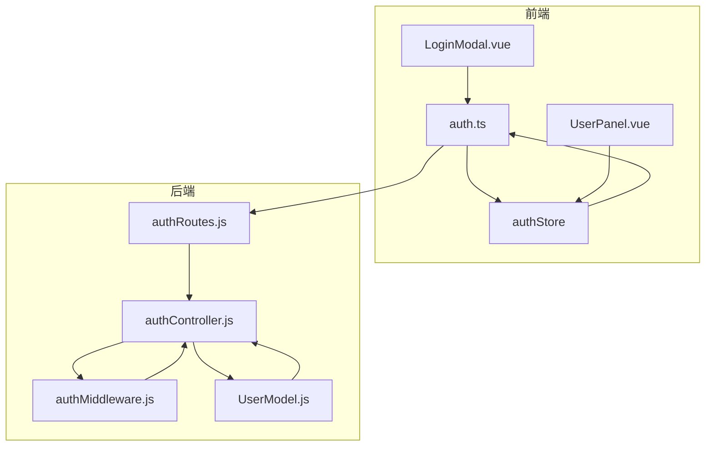

**图示来源**  
- [authController.js](file://backend/controllers/authController.js#L1-L141)
- [auth.ts](file://frontend/src/api/auth.ts#L1-L162)
- [authRoutes.js](file://backend/routes/authRoutes.js#L1-L25)

**本节来源**  
- [authController.js](file://backend/controllers/authController.js#L1-L141)
- [auth.ts](file://frontend/src/api/auth.ts#L1-L162)

## 核心组件
系统核心组件包括：
- **后端控制器**：`authController.js` 处理注册、登录、获取用户信息等逻辑
- **用户模型**：`User.js` 定义用户数据结构，包含密码加密和验证方法
- **认证中间件**：`auth.js` 实现 JWT 验证和角色权限检查
- **前端 API 封装**：`auth.ts` 提供统一的认证接口调用
- **状态管理**：`authStore` 管理用户登录状态和持久化
- **UI 组件**：`LoginModal.vue` 和 `UserPanel.vue` 实现用户交互界面

**本节来源**  
- [authController.js](file://backend/controllers/authController.js#L1-L141)
- [User.js](file://backend/models/User.js#L1-L89)
- [auth.js](file://backend/middleware/auth.js#L1-L66)

## 架构概览
系统采用典型的 RESTful API 架构，通过 JWT 实现无状态会话管理：

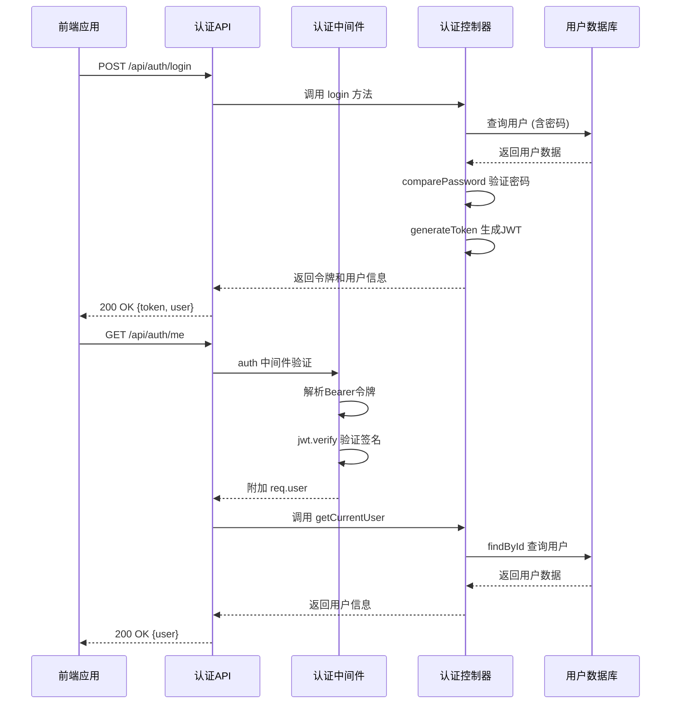

**图示来源**  
- [authController.js](file://backend/controllers/authController.js#L1-L141)
- [auth.js](file://backend/middleware/auth.js#L1-L66)
- [authRoutes.js](file://backend/routes/authRoutes.js#L1-L25)

## 详细组件分析

### 后端认证控制器分析
`authController.js` 是认证系统的核心，实现三大功能：注册、登录、获取用户信息。

#### 类图
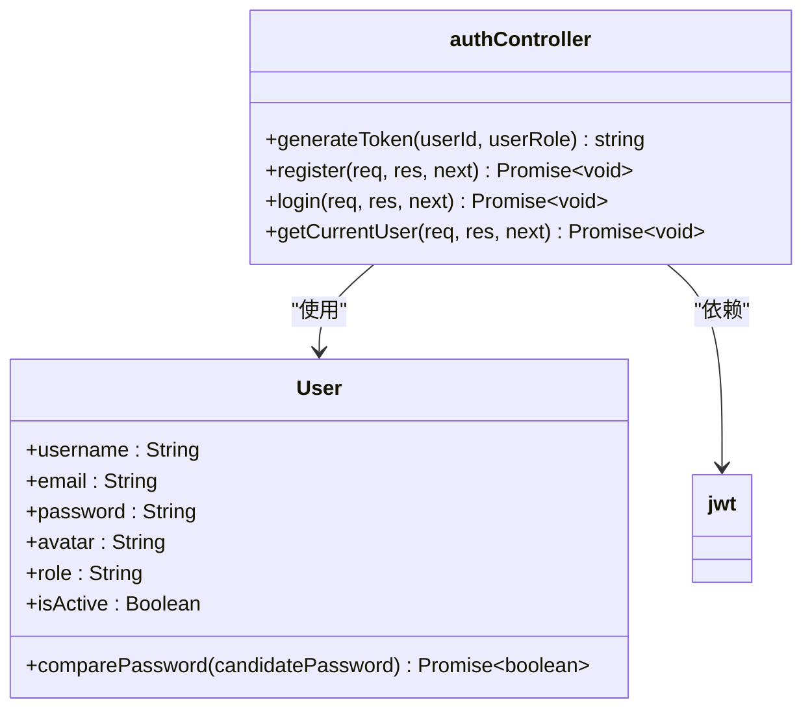

**图示来源**  
- [authController.js](file://backend/controllers/authController.js#L1-L141)
- [User.js](file://backend/models/User.js#L1-L89)

#### 注册流程
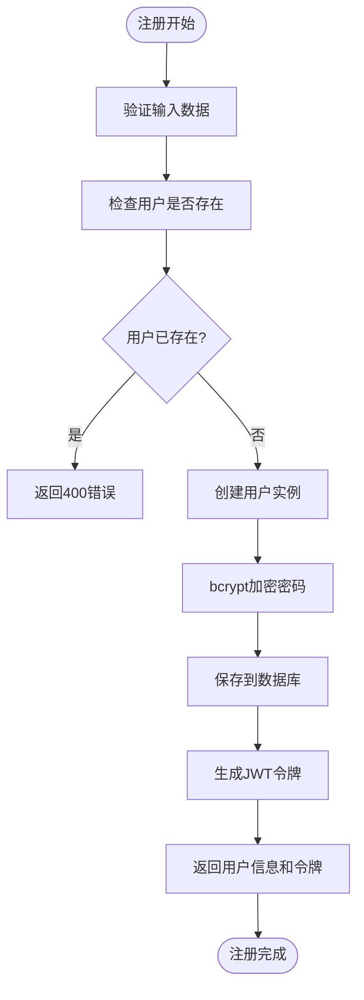

**本节来源**  
- [authController.js](file://backend/controllers/authController.js#L30-L69)
- [User.js](file://backend/models/User.js#L60-L70)

### 用户模型与密码安全分析
`User.js` 模型确保了用户数据的完整性和密码安全性。

#### 数据模型
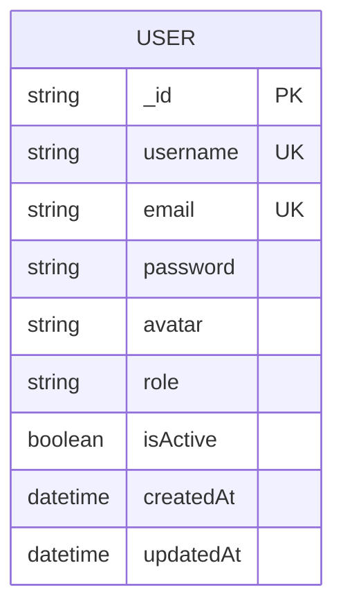

#### 密码加密流程
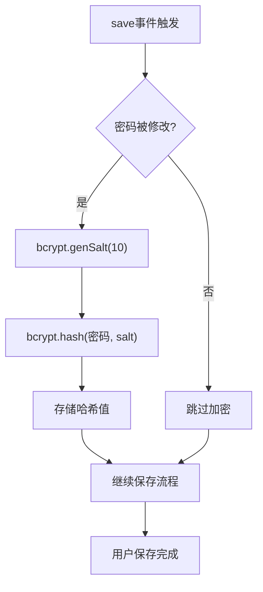

**本节来源**  
- [User.js](file://backend/models/User.js#L50-L89)

### 认证中间件分析
`auth.js` 中间件负责请求级别的身份验证和权限控制。

#### 认证流程
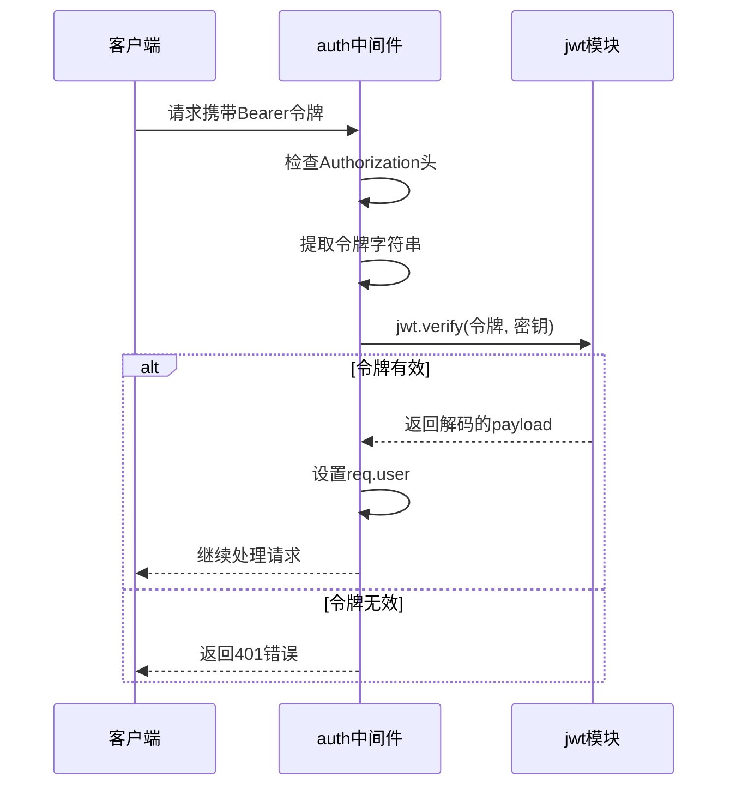

#### 角色权限检查
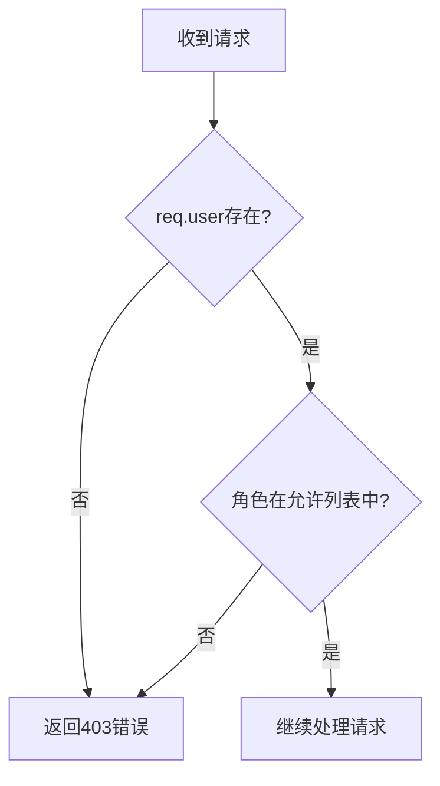

**本节来源**  
- [auth.js](file://backend/middleware/auth.js#L15-L66)

### 前端认证系统分析
前端通过 `auth.ts` 和 Pinia store 实现完整的认证管理。

#### 前端架构
```mermaid
classDiagram
class authApi {
+register(userData) Promise~LoginResponse~
+login(credentials) Promise~LoginResponse~
+getCurrentUser() Promise~AuthResponse~
}
class authStorage {
+setAuth(token, user)
+getAuth() {token, user}
+clearAuth()
+isAuthenticated()
+isAdmin()
}
class authStore {
-user : Ref~User~
-loading : Ref~boolean~
+isAuthenticated : ComputedRef~boolean~
+isAdmin : ComputedRef~boolean~
+initAuth()
+register()
+login()
+logout()
+updateUser()
}
authApi --> authStorage : "使用"
authStore --> authApi : "依赖"
authStore --> authStorage : "使用"
```

**本节来源**  
- [auth.ts](file://frontend/src/api/auth.ts#L1-L162)
- [auth.js](file://frontend/src/store/modules/auth.js#L1-L93)

### 登录模态框组件分析
`LoginModal.vue` 提供用户友好的登录/注册界面。

#### 交互流程
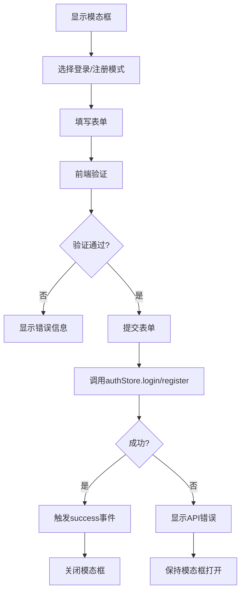

**本节来源**  
- [LoginModal.vue](file://frontend/src/components/LoginModal.vue#L1-L775)

### 用户面板组件分析
`UserPanel.vue` 为已登录用户提供个性化管理界面。

#### 组件逻辑
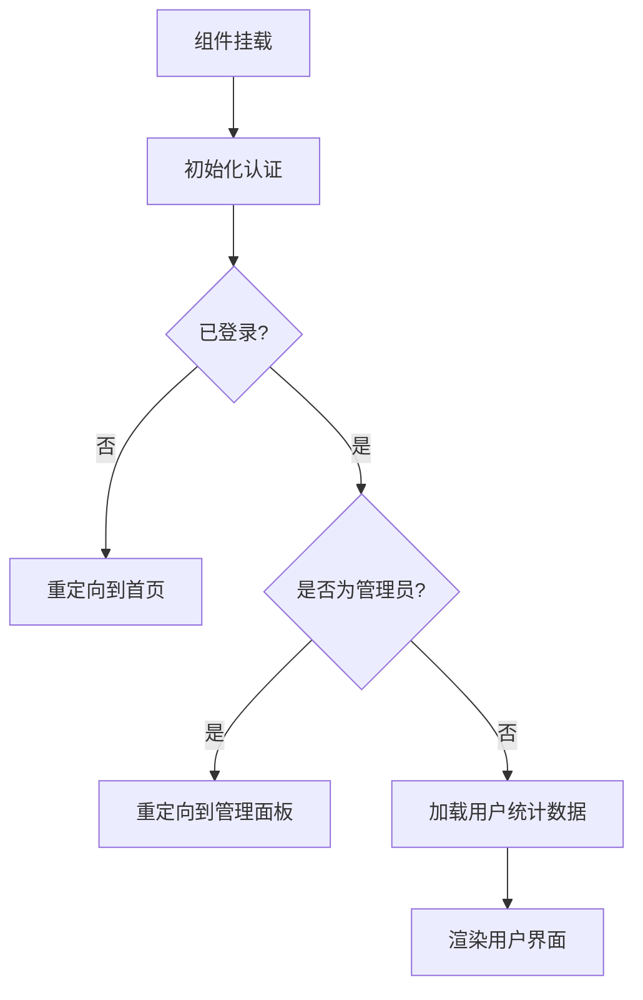

**本节来源**  
- [UserPanel.vue](file://frontend/src/views/User/UserPanel.vue#L1-L209)

## 依赖分析
系统各组件间存在明确的依赖关系：

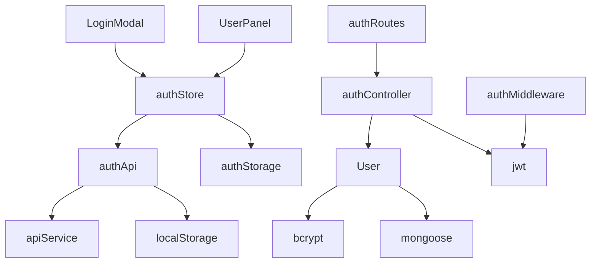

**图示来源**  
- [authController.js](file://backend/controllers/authController.js#L1-L141)
- [auth.ts](file://frontend/src/api/auth.ts#L1-L162)
- [auth.js](file://frontend/src/store/modules/auth.js#L1-L93)

## 性能考虑
1. **密码加密**：使用 bcrypt 的 10 轮哈希，平衡安全与性能
2. **JWT 签名**：使用 HS256 算法，计算开销小
3. **数据库查询**：用户名和邮箱字段建立唯一索引，加速查找
4. **前端缓存**：用户信息和令牌存储在 localStorage，减少重复请求
5. **Token 过期**：7 天过期策略，避免长期有效的安全风险

## 故障排除指南
### 常见问题及解决方案
- **登录失败**：检查用户名/邮箱和密码是否正确，账户是否被禁用
- **令牌过期**：系统会自动重定向到登录页，需重新登录
- **注册提示已存在**：尝试使用不同的用户名或邮箱
- **无法访问用户面板**：确认是否已登录，管理员用户会被重定向
- **CORS 错误**：确保前后端域名和端口配置正确

### 安全风险与应对
- **JWT 存储**：使用 localStorage 存储，存在 XSS 风险，建议结合 HttpOnly Cookie
- **密码安全**：bcrypt 加密确保即使数据库泄露，密码也难以破解
- **CSRF 防护**：JWT 认证天然免疫 CSRF，因令牌不通过 Cookie 传输
- **暴力破解**：可添加登录失败次数限制和验证码机制
- **令牌泄露**：设置合理的过期时间，提供用户登出功能清除令牌

**本节来源**  
- [authController.js](file://backend/controllers/authController.js#L1-L141)
- [auth.js](file://backend/middleware/auth.js#L1-L66)
- [auth.ts](file://frontend/src/api/auth.ts#L1-L162)

## 结论
my_website 的用户认证系统实现了安全、可靠、易用的用户管理功能。系统采用现代 Web 开发最佳实践，包括 JWT 无状态认证、bcrypt 密码加密、前后端分离架构和组件化设计。通过详细的错误处理、权限控制和用户体验优化，系统既满足了基本的认证需求，又为未来的功能扩展（如第三方登录、多因素认证）提供了良好的基础。建议后续增加密码强度检查、登录日志记录和账户锁定机制，进一步提升系统安全性。