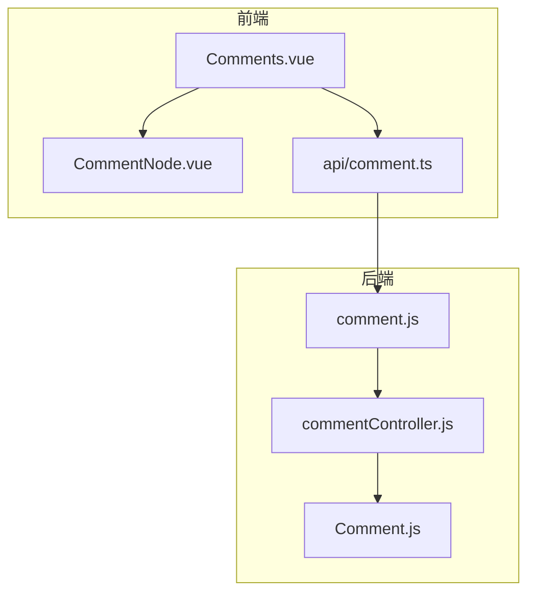
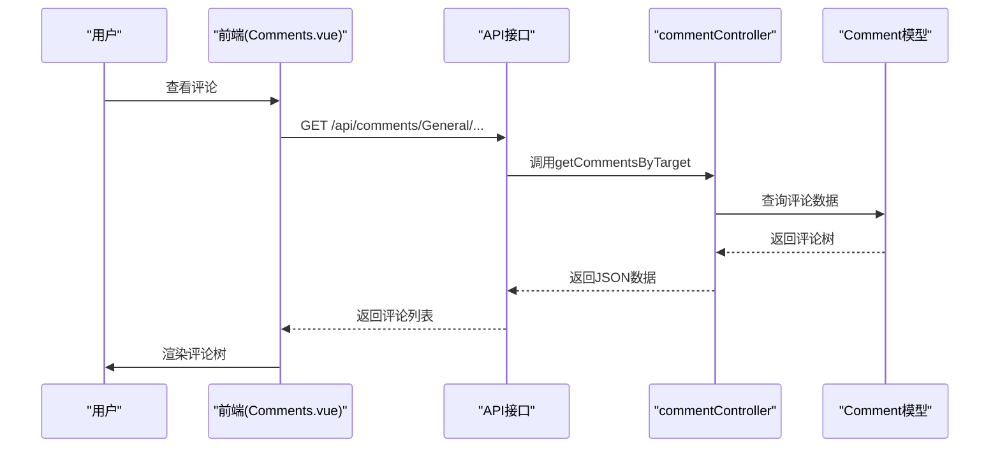
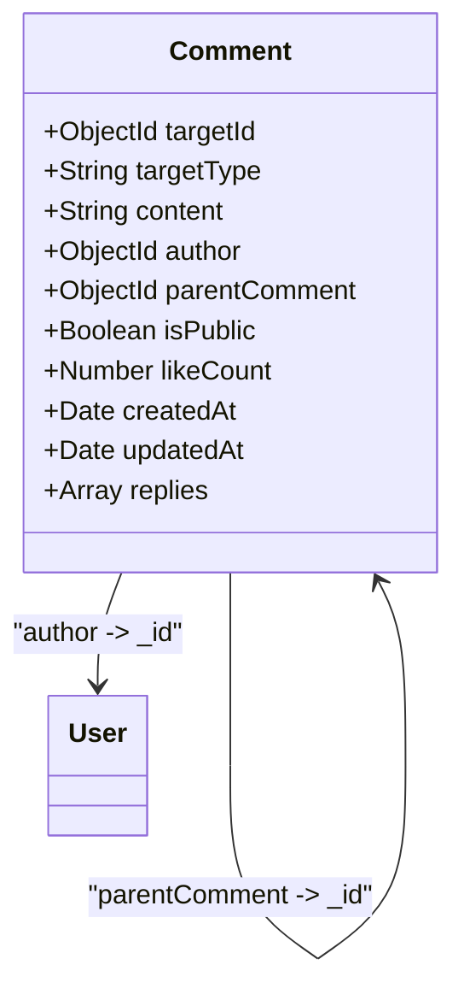
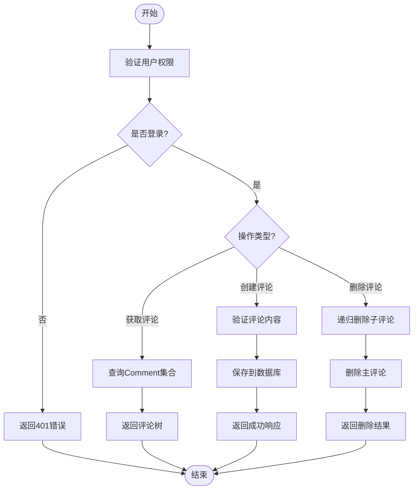
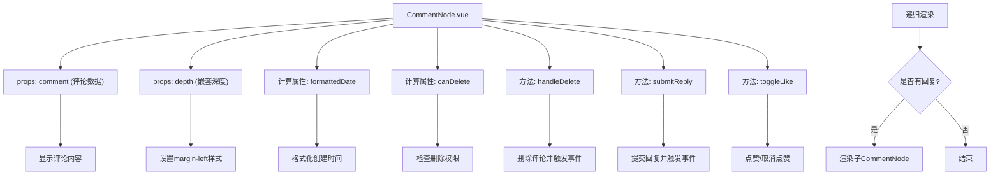
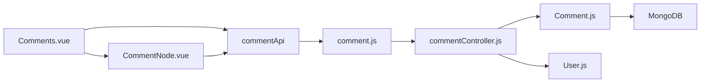

# 评论系统

<cite>
**本文档引用文件**  
- [Comment.js](file://backend/models/Comment.js)
- [commentController.js](file://backend/controllers/commentController.js)
- [comment.js](file://backend/routes/comment.js)
- [CommentNode.vue](file://frontend/src/components/CommentNode.vue)
- [Comments.vue](file://frontend/src/views/Comments.vue)
- [AdminCommentReview.vue](file://frontend/src/views/Admin/components/AdminCommentReview.vue)
</cite>

## 目录
1. [简介](#简介)
2. [项目结构](#项目结构)
3. [核心组件](#核心组件)
4. [架构概览](#架构概览)
5. [详细组件分析](#详细组件分析)
6. [依赖分析](#依赖分析)
7. [性能考量](#性能考量)
8. [故障排除指南](#故障排除指南)
9. [结论](#结论)

## 简介
本系统实现了完整的多级嵌套评论功能，支持评论的增删改查、父子级联、审核流程与点赞机制。系统采用树形结构设计，通过`parentId`实现无限层级嵌套，并结合`targetType`和`targetId`实现跨内容类型的评论关联。前端通过递归组件渲染评论树，后端提供分页加载和权限控制，确保系统性能与安全性。

## 项目结构
项目采用前后端分离架构，后端基于Node.js和Mongoose，前端基于Vue 3和Vite。

**图示来源**  
- [Comments.vue](file://frontend/src/views/Comments.vue)
- [CommentNode.vue](file://frontend/src/components/CommentNode.vue)
- [comment.js](file://backend/routes/comment.js)

**本节来源**  
- [Comments.vue](file://frontend/src/views/Comments.vue)
- [comment.js](file://backend/routes/comment.js)

## 核心组件
系统核心由评论模型、控制器和前端组件构成。`Comment`模型定义了树形结构，`commentController`处理所有业务逻辑，`CommentNode.vue`实现递归渲染。

**本节来源**  
- [Comment.js](file://backend/models/Comment.js)
- [commentController.js](file://backend/controllers/commentController.js)
- [CommentNode.vue](file://frontend/src/components/CommentNode.vue)

## 架构概览
系统采用MVC架构，前端通过API与后端交互，后端通过Mongoose操作MongoDB。

**图示来源**  
- [commentController.js](file://backend/controllers/commentController.js)
- [Comments.vue](file://frontend/src/views/Comments.vue)

## 详细组件分析

### 评论模型分析
`Comment`模型采用树形结构设计，支持多级嵌套和跨内容类型关联。

**图示来源**  
- [Comment.js](file://backend/models/Comment.js)

**本节来源**  
- [Comment.js](file://backend/models/Comment.js)

### 评论控制器分析
`commentController`提供了完整的CRUD操作和业务逻辑处理。

**图示来源**  
- [commentController.js](file://backend/controllers/commentController.js)

**本节来源**  
- [commentController.js](file://backend/controllers/commentController.js)

### 前端组件分析
`CommentNode.vue`作为递归组件，实现了多级评论的渲染和交互。

**图示来源**  
- [CommentNode.vue](file://frontend/src/components/CommentNode.vue)

**本节来源**  
- [CommentNode.vue](file://frontend/src/components/CommentNode.vue)

## 依赖分析
系统各组件之间存在明确的依赖关系，确保功能的完整性和可维护性。

**图示来源**  
- [Comments.vue](file://frontend/src/views/Comments.vue)
- [comment.js](file://backend/routes/comment.js)
- [Comment.js](file://backend/models/Comment.js)

**本节来源**  
- [Comments.vue](file://frontend/src/views/Comments.vue)
- [comment.js](file://backend/routes/comment.js)

## 性能考量
系统在处理多级嵌套评论时，需要注意性能优化，避免无限递归和大量数据查询。

1. **分页加载**：通过`page`和`limit`参数实现分页，避免一次性加载过多数据
2. **懒加载**：可以实现回复的懒加载，只有在用户点击"查看回复"时才加载
3. **索引优化**：在`targetId`、`targetType`和`createdAt`字段上创建索引，提高查询效率
4. **缓存机制**：可以引入Redis缓存热门评论，减少数据库压力

**本节来源**  
- [commentController.js](file://backend/controllers/commentController.js)
- [Comment.js](file://backend/models/Comment.js)

## 故障排除指南
常见问题及解决方案：

1. **评论无法显示**：检查`targetType`和`targetId`是否正确，确保数据库中有对应数据
2. **权限错误**：确认用户登录状态和角色权限，管理员可以查看所有评论
3. **递归渲染卡顿**：对于深度嵌套的评论，考虑实现懒加载或限制最大嵌套深度
4. **点赞状态不更新**：检查`checkLikeStatus`API是否正常工作，确保用户ID正确传递

**本节来源**  
- [commentController.js](file://backend/controllers/commentController.js)
- [CommentNode.vue](file://frontend/src/components/CommentNode.vue)

## 结论
本评论系统实现了完整的多级嵌套功能，通过合理的数据结构设计和前后端协作，提供了良好的用户体验。系统具有良好的扩展性，可以方便地添加新的功能，如评论审核、敏感词过滤等。建议在实际使用中根据数据量和访问频率进行性能优化，确保系统的稳定性和响应速度。