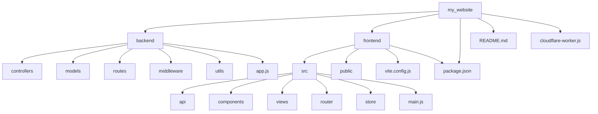
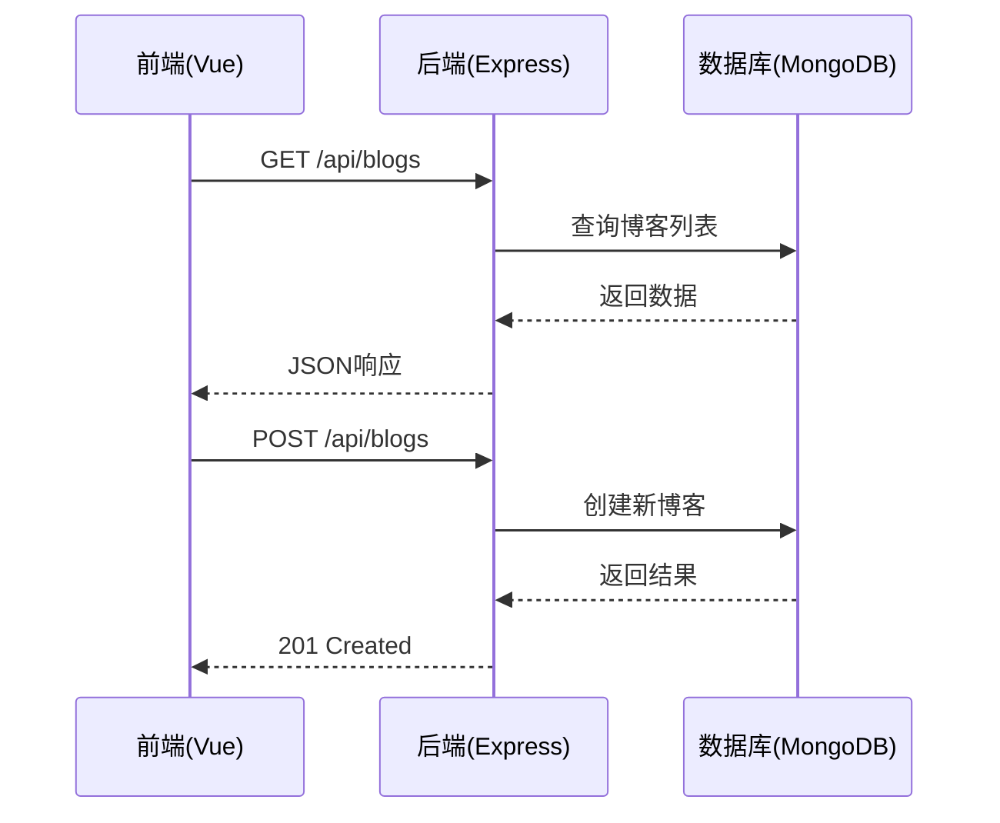
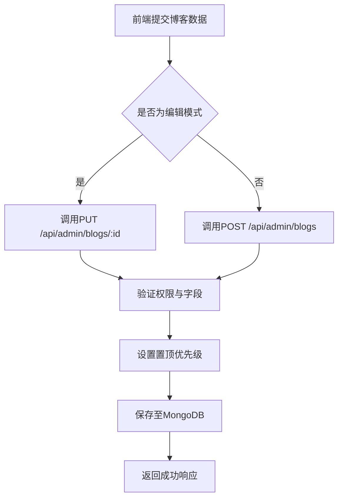
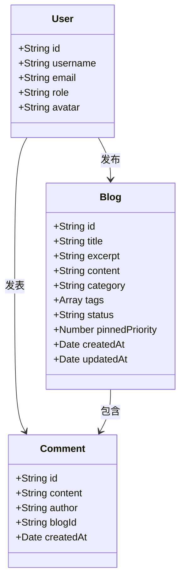

# 系统概述

<cite>
**本文档引用文件**  
- [README.md](file://README.md)
- [backend/app.js](file://backend/app.js)
- [backend/controllers/blogController.js](file://backend/controllers/blogController.js)
- [backend/routes/adminRoutes.js](file://backend/routes/adminRoutes.js)
- [frontend/src/views/Admin/components/AdminBlogManager.vue](file://frontend/src/views/Admin/components/AdminBlogManager.vue)
</cite>

## 目录
1. [项目结构](#项目结构)
2. [核心功能与架构设计](#核心功能与架构设计)
3. [前后端分离架构分析](#前后端分离架构分析)
4. [数据模型与业务逻辑](#数据模型与业务逻辑)
5. [用户权限与管理机制](#用户权限与管理机制)
6. [部署与运行环境](#部署与运行环境)

## 项目结构

本项目采用清晰的前后端分离目录结构，便于维护与扩展。整体结构如下：

**图示来源**  
- [README.md](file://README.md#L96-L129)

## 核心功能与架构设计

### 功能定位
`my_website` 是一个现代化的全栈个人网站平台，专为个人开发者和内容创作者设计，支持内容发布、作品展示与社交互动。系统集成了博客、文档库、图库、评论、用户管理与全局搜索六大核心模块。

### 架构设计
系统采用前后端分离架构，前端基于 Vue 3 + Vite 构建，后端使用 Node.js + Express + MongoDB 实现。前后端通过 RESTful API 进行通信，数据持久化由 Mongoose 操作 MongoDB 完成。

**Section sources**
- [README.md](file://README.md#L0-L174)

## 前后端分离架构分析

### 技术选型动机
- **前端：Vue 3 + Vite**  
  利用 Composition API 提升代码组织能力，Vite 提供极速开发体验。
- **后端：Express + MongoDB**  
  Express 轻量高效，适合构建 REST API；MongoDB 灵活的文档模型适配博客、文档等非结构化内容。
- **状态管理：Pinia**  
  替代 Vuex，提供更简洁的响应式状态管理。
- **部署优化：Vercel Serverless**  
  后端部署于 Vercel，利用其 Serverless 特性实现按需扩展与低成本运行。

### 协同工作机制
前端通过 `axios` 调用后端 `/api` 接口，后端在 `app.js` 中注册各模块路由，统一处理请求并返回 JSON 数据。

**Diagram sources**  
- [backend/app.js](file://backend/app.js#L113-L165)

## 数据模型与业务逻辑

### 核心数据模型
系统定义了多个 Mongoose 模型，包括：
- `Blog`：博客文章
- `Comment`：评论
- `Document`：文档
- `Gallery`：图库
- `User`：用户
- `Visit`：访问统计

### 博客创建与更新流程
博客的创建与更新由 `blogController.js` 和 `adminRoutes.js` 共同处理。

**Diagram sources**  
- [backend/controllers/blogController.js](file://backend/controllers/blogController.js#L145-L200)
- [backend/routes/adminRoutes.js](file://backend/routes/adminRoutes.js#L402-L514)

## 用户权限与管理机制

### 权限控制
系统采用基于角色的访问控制（RBAC），区分管理员与普通用户：
- **管理员**：可管理所有内容，包括审核评论、管理用户。
- **普通用户**：可发布评论、管理个人信息。

### 管理面板功能
管理员通过 `AdminBlogManager.vue` 界面管理博客，支持：
- 查看所有博客（含草稿）
- 编辑、删除博客
- 设置置顶、分类、标签

**Diagram sources**  
- [frontend/src/views/Admin/components/AdminBlogManager.vue](file://frontend/src/views/Admin/components/AdminBlogManager.vue#L29-L72)
- [backend/models/Blog.js](file://backend/models/Blog.js)

## 部署与运行环境

### 部署架构
项目为 Vercel Serverless 环境优化，部署方案如下：
1. **前端**：部署至 GitHub Pages 或 Vercel。
2. **后端**：作为独立 Vercel 项目部署，自动转为 Serverless Function。
3. **数据库**：使用 MongoDB Atlas 云数据库。
4. **文件存储**：集成 Vercel Blob 存储文档与图片。
5. **API代理**：可选 Cloudflare Worker 代理，提升国内访问稳定性。

### 环境变量配置
需在 `backend/setting.env` 和 `frontend/setting.env` 中配置：
- `MONGODB_URI`：数据库连接字符串
- `JWT_SECRET`：JWT 加密密钥
- `BLOB_READ_WRITE_TOKEN`：Vercel Blob 访问令牌

**Section sources**
- [README.md](file://README.md#L130-L174)
- [backend/app.js](file://backend/app.js#L0-L27)