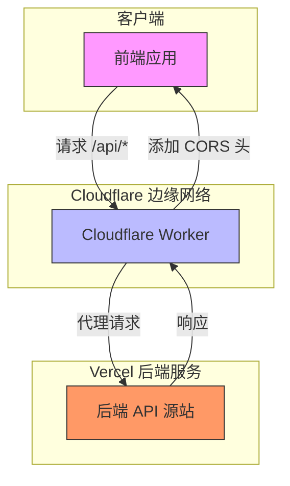
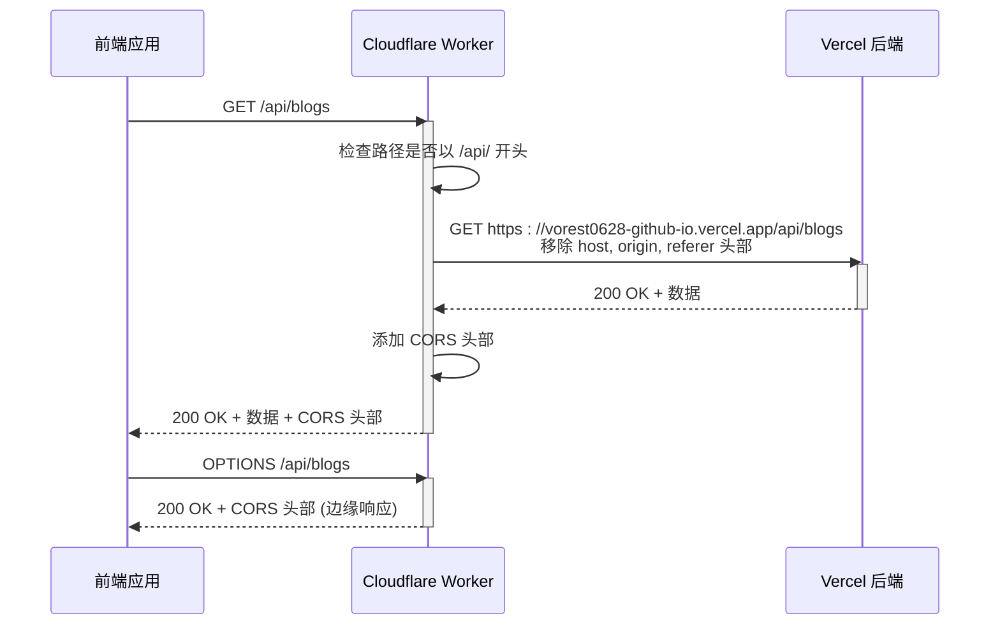
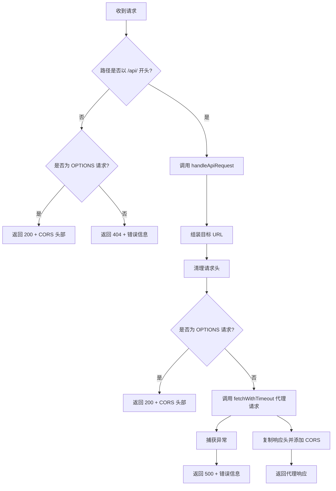
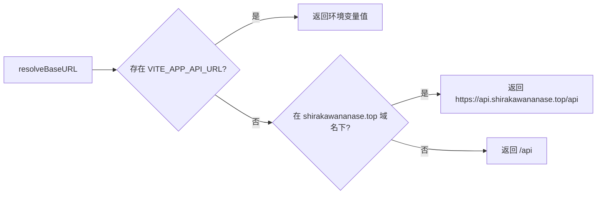

# Cloudflare Worker 反向代理

<cite>
**本文档引用文件**  
- [cloudflare-worker.js](file://cloudflare-worker.js#L1-L117)
- [frontend/src/services/api.ts](file://frontend/src/services/api.ts#L1-L236)
- [frontend/src/api/blog.ts](file://frontend/src/api/blog.ts#L1-L157)
</cite>

## 目录
1. [简介](#简介)
2. [项目结构](#项目结构)
3. [核心组件](#核心组件)
4. [架构概览](#架构概览)
5. [详细组件分析](#详细组件分析)
6. [依赖分析](#依赖分析)
7. [性能考虑](#性能考虑)
8. [故障排查指南](#故障排查指南)
9. [结论](#结论)

## 简介
本文档深入解析基于 Cloudflare Worker 实现的反向代理系统，旨在解决前端应用在特定网络环境下（如中国大陆）访问部署于 Vercel 的后端服务受限的问题。通过 Cloudflare Worker 作为中间代理层，实现 API 请求的统一入口、跨域（CORS）问题规避、DDoS 防护以及请求超时控制。文档详细阐述了 `cloudflare-worker.js` 中的路由转发逻辑、请求头处理和缓存策略，并说明前端 `api.ts` 如何与 Worker 代理协同工作，以及后端路由（如 `/api/blogs`）在代理下的访问路径转换机制。同时提供 Worker 部署步骤、域名绑定方法、性能优化建议，并列举代理配置不当导致的连接超时、CORS 错误等典型问题的解决方案。

## 项目结构
项目采用前后端分离架构，前端位于 `frontend/` 目录，后端通过 Vercel 部署，而 `cloudflare-worker.js` 文件位于项目根目录，作为独立的 Cloudflare Worker 脚本，负责代理所有 API 请求。



**图示来源**  
- [cloudflare-worker.js](file://cloudflare-worker.js#L1-L117)
- [frontend/src/services/api.ts](file://frontend/src/services/api.ts#L1-L236)

## 核心组件
核心组件包括位于边缘的 `cloudflare-worker.js` 和前端的 `apiService`。`cloudflare-worker.js` 是整个代理系统的核心，它拦截所有发往 `/api/` 路径的请求，将其转发至 Vercel 部署的后端，并在响应中注入 CORS 头部，从而解决跨域问题。前端的 `apiService` 是基于 Axios 封装的通用 API 服务，负责发起所有 API 请求，其 `baseURL` 会根据环境自动解析为 Worker 的地址。

**组件来源**  
- [cloudflare-worker.js](file://cloudflare-worker.js#L1-L117)
- [frontend/src/services/api.ts](file://frontend/src/services/api.ts#L1-L236)

## 架构概览
系统采用三层架构：前端应用、Cloudflare Worker 代理层、Vercel 后端服务。前端应用的所有 API 请求均通过 Worker 代理层，该层运行在 Cloudflare 的全球边缘网络上，具有低延迟和高可用性。Worker 仅处理以 `/api/` 开头的请求，对于非 API 请求（如静态资源）直接返回 404，避免不必要的回源。对于 OPTIONS 预检请求，Worker 直接在边缘返回 200 状态码和 CORS 头部，极大提升了预检请求的响应速度。



**图示来源**  
- [cloudflare-worker.js](file://cloudflare-worker.js#L1-L117)
- [frontend/src/services/api.ts](file://frontend/src/services/api.ts#L1-L236)

## 详细组件分析

### Cloudflare Worker 请求处理分析
`cloudflare-worker.js` 的核心是 `handleRequest` 函数，它根据请求路径进行路由分发。



**图示来源**  
- [cloudflare-worker.js](file://cloudflare-worker.js#L1-L117)

#### 路由转发逻辑
Worker 通过检查 `URL.pathname` 是否以 `/api/` 开头来决定是否代理该请求。所有匹配的请求将被转发至 `API_ORIGIN`（`https://vorest0628-github-io.vercel.app`）对应的路径。例如，前端请求 `/api/blogs`，Worker 会将其转换为 `https://vorest0628-github-io.vercel.app/api/blogs` 并转发。

#### 请求头处理
为避免源站因 `host`、`origin`、`referer` 等头部信息不匹配而拒绝请求，Worker 在代理前会主动删除这些头部：
```javascript
const headers = new Headers(request.headers)
headers.delete('host')
headers.delete('origin')
headers.delete('referer')
```
这确保了请求能顺利到达 Vercel 源站。

#### 超时与错误处理
为防止后端响应缓慢导致用户长时间等待，Worker 使用 `fetchWithTimeout` 函数，设置 8 秒超时。若超时或发生网络错误，Worker 会捕获异常并返回 500 状态码及错误信息，避免出现 522（连接超时）等更差的用户体验。

**组件来源**  
- [cloudflare-worker.js](file://cloudflare-worker.js#L1-L117)

### 前端 API 服务分析
前端 `api.ts` 文件中的 `apiService` 是与后端交互的统一入口。其 `baseURL` 通过 `resolveBaseURL` 函数动态确定：
- 若环境变量 `VITE_APP_API_URL` 存在，则使用该值。
- 若在 `shirakawananase.top` 域名下访问，则使用 `https://api.shirakawananase.top/api`（即 Worker 地址）。
- 否则，使用相对路径 `/api`。



**图示来源**  
- [frontend/src/services/api.ts](file://frontend/src/services/api.ts#L1-L236)

`apiService` 还集成了请求和响应拦截器：
- **请求拦截器**：自动从 `localStorage` 读取 `token` 并添加到 `Authorization` 头部。
- **响应拦截器**：当收到 401（未授权）响应时，自动清除本地 token 并重定向到首页，实现无感登出。

**组件来源**  
- [frontend/src/services/api.ts](file://frontend/src/services/api.ts#L1-L236)

### 博客 API 接口分析
以 `blog.ts` 为例，展示了前端如何定义具体的 API 接口。所有接口均通过 `apiService` 发起，路径为相对路径（如 `/blogs`）。当 `baseURL` 指向 Worker 时，实际请求路径即为 `https://api.shirakawananase.top/api/blogs`，实现了与代理层的无缝集成。

**组件来源**  
- [frontend/src/api/blog.ts](file://frontend/src/api/blog.ts#L1-L157)

## 依赖分析
系统依赖关系清晰，前端应用依赖 `apiService` 发起请求，`apiService` 的 `baseURL` 指向 Cloudflare Worker，而 Worker 则依赖 Vercel 后端作为源站。这种设计实现了前后端的解耦，Worker 作为中间层可以独立部署和配置。


**图示来源**  
- [frontend/src/services/api.ts](file://frontend/src/services/api.ts#L1-L236)
- [cloudflare-worker.js](file://cloudflare-worker.js#L1-L117)

## 性能考虑
1. **边缘计算优势**：Cloudflare Worker 运行在全球边缘节点，使 API 请求无需绕行至 Vercel 所在区域，显著降低延迟。
2. **预检请求优化**：OPTIONS 请求直接在边缘响应，避免了与源站的往返，极大提升了跨域请求的效率。
3. **超时控制**：8 秒超时机制防止了长时间等待，提升了用户体验。
4. **缓存策略**：当前 Worker 未显式配置缓存。可通过在 `handleApiRequest` 中根据请求方法（如 GET）和响应头，使用 `Cache API` 实现边缘缓存，进一步提升性能。

## 故障排查指南
### 连接超时
- **现象**：前端报错 `Network Error` 或 `timeout`。
- **原因**：Worker 到 Vercel 源站的连接超时（超过 8 秒）。
- **解决方案**：
  1. 检查 Vercel 应用是否正常运行。
  2. 检查 `API_ORIGIN` 常量是否正确。
  3. 考虑适当增加 `fetchWithTimeout` 的超时时间（如 10 秒）。

### CORS 错误
- **现象**：浏览器控制台报错 `CORS policy`。
- **原因**：Worker 未正确添加 CORS 头部。
- **解决方案**：
  1. 检查 `cloudflare-worker.js` 中 `Access-Control-Allow-Origin` 等头部是否正确设置。
  2. 确保 `handleApiRequest` 和主 `handleRequest` 函数中的 OPTIONS 响应逻辑都包含了 CORS 头部。

### 404 Not Found
- **现象**：请求返回 404，提示“仅支持 /api/ 路径”。
- **原因**：请求路径未以 `/api/` 开头。
- **解决方案**：
  1. 检查前端 `apiService` 的 `baseURL` 是否正确指向了 `/api` 路径。
  2. 确认后端路由确实以 `/api/` 为前缀。

### 500 服务器错误
- **现象**：请求返回 500，提示“代理服务器错误”。
- **原因**：Worker 内部发生未捕获的异常。
- **解决方案**：
  1. 登录 Cloudflare 控制台，查看 Worker 的日志（Logs），根据 `console.error` 输出的错误信息进行排查。
  2. 检查 `targetUrl` 组装逻辑是否正确。

**组件来源**  
- [cloudflare-worker.js](file://cloudflare-worker.js#L1-L117)
- [frontend/src/services/api.ts](file://frontend/src/services/api.ts#L1-L236)

## 结论
Cloudflare Worker 作为反向代理，成功解决了 Vercel 服务在特定网络环境下的访问问题。通过精心设计的路由逻辑、请求头处理和错误处理机制，实现了高性能、高可用的 API 代理。前端通过动态配置 `baseURL` 与 Worker 无缝集成，整体架构清晰、易于维护。未来可通过引入边缘缓存进一步优化性能。该方案是解决跨域、网络延迟和 DDoS 防护等问题的有效实践。