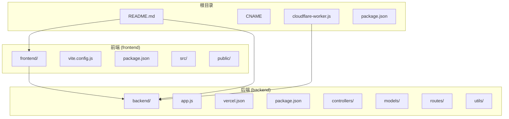
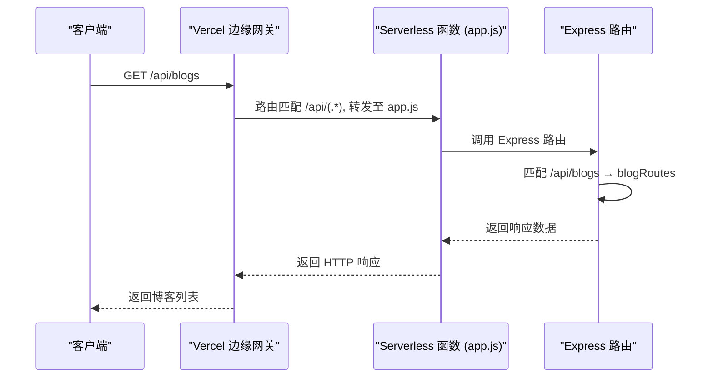

# Vercel 部署配置

<cite>
**本文档引用文件**  
- [vercel.json](file://backend/vercel.json)
- [app.js](file://backend/app.js)
- [package.json](file://backend/package.json)
- [vite.config.js](file://frontend/vite.config.js)
- [package.json](file://frontend/package.json)
- [cloudflare-worker.js](file://cloudflare-worker.js)
- [README.md](file://README.md)
</cite>

## 目录
1. [项目结构](#项目结构)
2. [后端部署配置](#后端部署配置)
3. [前端构建与部署](#前端构建与部署)
4. [Vercel 路由与函数配置](#vercel-路由与函数配置)
5. [环境变量与安全配置](#环境变量与安全配置)
6. [部署流程与自动化](#部署流程与自动化)
7. [常见问题与故障排查](#常见问题与故障排查)

## 项目结构

本项目采用前后端分离架构，前端使用 Vue 3 + Vite 构建，后端使用 Express + MongoDB 实现 RESTful API。整体结构清晰，模块化程度高，便于独立部署与维护。



**图示来源**  
- [README.md](file://README.md#L96-L129)
- 项目结构信息来自文件系统

## 后端部署配置

后端服务基于 Express 框架构建，部署于 Vercel Serverless 平台。通过 `vercel.json` 文件定义构建行为和路由规则，确保 API 请求正确路由至 `app.js` 入口文件。

### vercel.json 配置解析

`vercel.json` 是 Vercel 的核心部署配置文件，位于 `backend/` 目录下，其内容如下：

```json
{
  "version": 2,
  "builds": [
    {
      "src": "app.js",
      "use": "@vercel/node"
    }
  ],
  "routes": [
    {
      "src": "/api/(.*)",
      "dest": "/app.js"
    },
    {
      "src": "/(.*)",
      "dest": "/app.js"
    }
  ]
}
```

- **version**: 使用 Vercel v2 配置格式
- **builds**: 指定 `app.js` 为入口文件，使用 `@vercel/node` 构建器
- **routes**: 所有以 `/api/` 开头或任意路径的请求均转发至 `app.js`，由 Express 路由处理

此配置确保所有 API 请求（如 `/api/blogs`）和根路径请求均能被正确处理。

**本节来源**  
- [vercel.json](file://backend/vercel.json#L0-L18)
- [app.js](file://backend/app.js#L0-L27)

## 前端构建与部署

前端使用 Vite 构建工具，配置文件 `vite.config.js` 定义了开发服务器代理、构建输出路径及代码分割策略。

### vite.config.js 关键配置

```js
export default defineConfig(({ mode }) => {
  const env = loadEnv(mode, process.cwd(), '')
  
  return {
    plugins: [vue()],
    base: mode === 'production' ? '/' : '/',
    resolve: { alias: { '@': resolve(__dirname, 'src') } },
    server: {
      port: 5173,
      proxy: {
        '/api': {
          target: 'http://localhost:3000',
          changeOrigin: true,
          rewrite: path => path.replace(/^\/api/, '/api')
        }
      }
    },
    build: {
      outDir: 'dist',
      assetsDir: 'assets',
      sourcemap: false,
      chunkSizeWarningLimit: 1000,
      rollupOptions: {
        output: {
          manualChunks: {
            vendor: ['vue', 'vue-router', 'pinia'],
            particles: ['particles.js']
          }
        }
      }
    }
  }
})
```

#### 构建配置说明
- **outDir**: 构建输出目录为 `dist`，符合 Vercel 默认部署路径
- **assetsDir**: 静态资源存放于 `assets` 子目录
- **sourcemap**: 生产环境关闭 sourcemap 以提升安全性
- **chunkSizeWarningLimit**: 设置代码块警告阈值为 1000KB
- **manualChunks**: 手动分割第三方库，提升加载性能

#### 开发代理配置
开发时通过 `proxy` 将 `/api` 请求代理至本地后端 `http://localhost:3000`，实现前后端分离开发。

**本节来源**  
- [vite.config.js](file://frontend/vite.config.js#L0-L52)
- [package.json](file://frontend/package.json#L0-L45)

## Vercel 路由与函数配置

Vercel 的 Serverless 函数机制将 `app.js` 作为单个函数部署，所有请求通过 `routes` 规则路由至该函数，由 Express 内部路由进一步分发。

### 请求处理流程



**图示来源**  
- [vercel.json](file://backend/vercel.json#L0-L18)
- [app.js](file://backend/app.js#L75-L100)

### 静态资源处理

在 Vercel 环境中，静态文件服务被禁用（`if (!isVercel)`），文件上传通过 Vercel Blob 存储：

```js
if (!isVercel) {
  app.use('/uploads', express.static(path.join(__dirname, 'uploads')))
} else {
  console.log('⚠️ Vercel环境禁用静态文件服务')
}
```

所有文件资源通过 `/api` 路由由 `assetRoutes` 处理，并重定向至 Vercel Blob。

**本节来源**  
- [app.js](file://backend/app.js#L29-L75)

## 环境变量与安全配置

项目通过环境变量管理敏感信息，如数据库连接、JWT 密钥等。

### 后端环境变量

在 Vercel 项目设置中需配置以下环境变量：
- `MONGODB_URI`: MongoDB Atlas 连接字符串
- `JWT_SECRET`: JWT 签名密钥
- `BLOB_READ_WRITE_TOKEN`: Vercel Blob 读写令牌

```js
// app.js 中根据环境加载配置
const isVercel = process.env.VERCEL === '1' || process.env.NODE_ENV === 'production'
if (!isVercel) {
  require('dotenv').config({ path: path.join(__dirname, 'setting.env') })
}
```

### CORS 安全配置

```js
app.use(cors({
  origin: [
    'https://vorest0628.github.io',
    'https://shirakawananase.top',
    'http://shirakawananase.top',
    'http://localhost:5173'
  ],
  credentials: true
}))
```

允许前端域名跨域访问，确保本地开发与生产环境兼容。

**本节来源**  
- [app.js](file://backend/app.js#L29-L75)
- [README.md](file://README.md#L132-L160)

## 部署流程与自动化

### 完整部署流程

1. **前端部署**
   - 执行 `npm run build` 生成 `dist` 目录
   - 推送至 GitHub 仓库
   - 通过 GitHub Pages 或 Vercel 部署前端

2. **后端部署**
   - 将 `backend/` 目录作为独立 Vercel 项目部署
   - Vercel 自动识别 `package.json` 并使用 `@vercel/node` 构建
   - 配置环境变量

3. **可选：Cloudflare Worker 代理**
   - 修改 `cloudflare-worker.js` 中的 `API_ORIGIN` 为后端 Vercel 域名
   - 在 Cloudflare Workers 发布脚本
   - 前端 `VITE_APP_API_URL` 指向 Worker 域名

```js
// cloudflare-worker.js
const API_ORIGIN = 'https://vorest0628-github-io.vercel.app'
```

**本节来源**  
- [README.md](file://README.md#L132-L160)
- [cloudflare-worker.js](file://cloudflare-worker.js#L0-L103)

## 常见问题与故障排查

### 数据库连接失败
- **现象**: `数据库连接未就绪，请稍后重试`
- **原因**: MongoDB Atlas 未开放 IP 白名单
- **解决方案**: 在 MongoDB Atlas 网络访问设置中添加 `0.0.0.0/0`

### 构建失败
- **检查 `vercel.json` 路径是否正确**
- **确保 `app.js` 为模块入口**
- **依赖版本兼容性检查**

### API 500 错误
- 查看 Vercel 日志中的 `console.log` 输出
- 检查环境变量是否配置完整
- 确认 `MONGODB_URI` 格式正确

**本节来源**  
- [app.js](file://backend/app.js#L200-L236)
- [README.md](file://README.md#L132-L160)