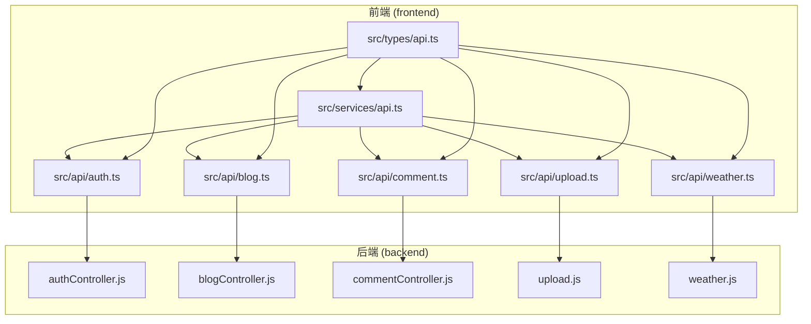
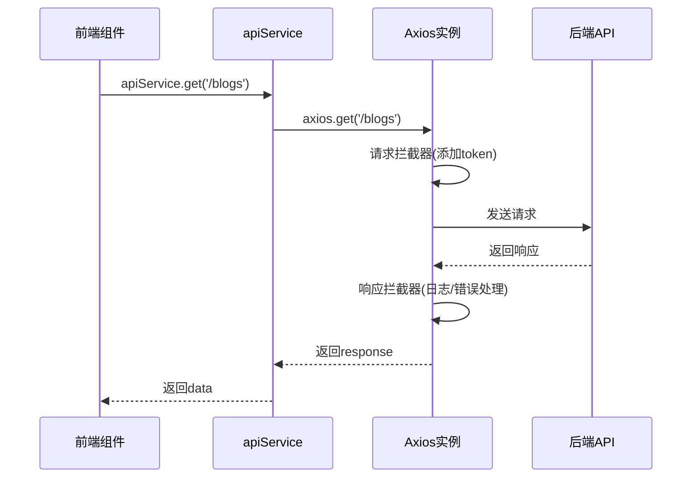
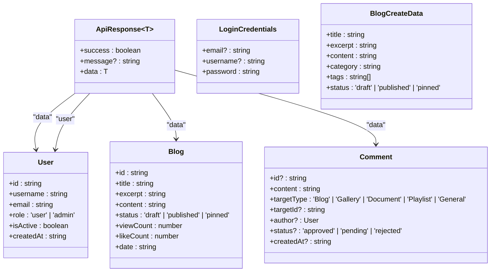
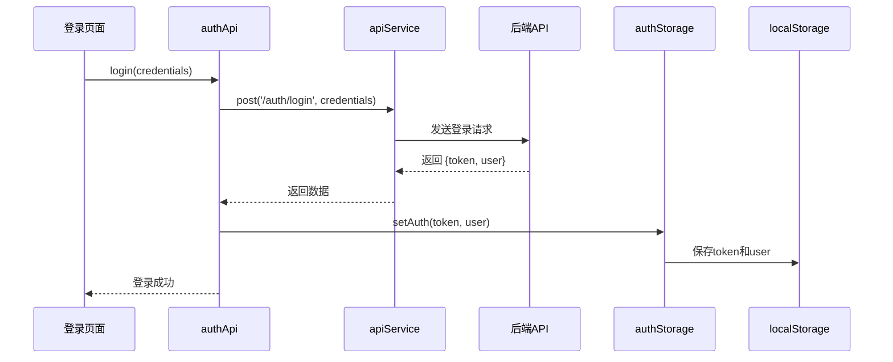

# 前端API服务与接口封装

<cite>
**本文档引用文件**  
- [api.ts](file://frontend/src/services/api.ts)
- [api.ts](file://frontend/src/types/api.ts)
- [auth.ts](file://frontend/src/api/auth.ts)
- [blog.ts](file://frontend/src/api/blog.ts)
- [comment.ts](file://frontend/src/api/comment.ts)
- [upload.ts](file://frontend/src/api/upload.ts)
- [weather.ts](file://frontend/src/api/weather.ts)
</cite>

## 目录
1. [项目结构](#项目结构)  
2. [核心组件](#核心组件)  
3. [统一API服务封装](#统一api服务封装)  
4. [类型安全与前后端契约](#类型安全与前后端契约)  
5. [认证与令牌管理](#认证与令牌管理)  
6. [业务模块API详解](#业务模块api详解)  
7. [特殊接口实现](#特殊接口实现)  
8. [最佳实践与调试](#最佳实践与调试)  

## 项目结构

`my_website` 项目采用前后端分离架构，前端位于 `frontend` 目录，后端位于 `backend` 目录。前端使用 Vue.js 框架，通过 Vite 构建，API 服务层集中管理所有网络请求。

前端API相关文件主要分布在以下目录：
- `src/services/api.ts`：Axios 实例与统一请求封装
- `src/types/api.ts`：全局 TypeScript 类型定义
- `src/api/`：各业务模块的API接口函数



**图示来源**  
- [api.ts](file://frontend/src/services/api.ts)
- [auth.ts](file://frontend/src/api/auth.ts)
- [blog.ts](file://frontend/src/api/blog.ts)
- [comment.ts](file://frontend/src/api/comment.ts)
- [upload.ts](file://frontend/src/api/upload.ts)
- [weather.ts](file://frontend/src/api/weather.ts)

**本节来源**  
- [api.ts](file://frontend/src/services/api.ts)
- [types/api.ts](file://frontend/src/types/api.ts)

## 核心组件

前端API架构的核心组件包括：
- **统一请求服务**：基于 Axios 封装的 `apiService`，提供标准化的HTTP方法
- **类型系统**：`types/api.ts` 定义了前后端交互的完整数据契约
- **拦截器机制**：自动处理认证令牌注入与错误响应
- **模块化API**：各业务模块（如 auth、blog）独立封装接口函数

这些组件共同实现了高内聚、低耦合的API调用体系，提升了代码可维护性与开发效率。

**本节来源**  
- [api.ts](file://frontend/src/services/api.ts)
- [types/api.ts](file://frontend/src/types/api.ts)

## 统一API服务封装

`src/services/api.ts` 是整个前端API体系的核心，基于 Axios 实现了企业级请求封装。

### Axios实例配置

```typescript
const api: AxiosInstance = axios.create({
  baseURL: resolveBaseURL(),
  timeout: 30000
})
```

- **动态baseURL**：通过 `resolveBaseURL()` 函数根据环境变量或域名自动切换API地址
- **超时设置**：30秒超时，避免请求长时间挂起

### 请求与响应拦截器

#### 请求拦截器
```typescript
api.interceptors.request.use(
  (config) => {
    const token = localStorage.getItem('token')
    if (token) {
      config.headers.Authorization = `Bearer ${token}`
    }
    config.metadata = { startTime: new Date() }
    return config
  }
)
```
- **自动认证注入**：从 `localStorage` 读取JWT令牌并添加到 `Authorization` 头
- **请求计时**：记录请求开始时间，用于性能监控

#### 响应拦截器
```typescript
api.interceptors.response.use(
  (response) => {
    const duration = 计算耗时
    console.log(`✅ API响应: ${response.config.method?.toUpperCase()} ${response.config.url} (${duration}ms)`)
    return response
  },
  (error) => {
    const duration = 计算耗时
    console.error(`❌ API错误: ${cfg?.method?.toUpperCase()} ${cfg?.url} (${duration}ms)`)

    if (error.response?.status === 401) {
      localStorage.removeItem('token')
      localStorage.removeItem('user')
      window.location.href = '/'
    }

    if (!error.response) {
      console.error('🌐 网络连接错误，请检查服务器状态')
    }

    return Promise.reject(error)
  }
)
```
- **自动认证刷新**：当收到401状态码时，清除本地认证信息并重定向至首页
- **网络异常处理**：检测无响应情况，提示用户检查网络
- **日志输出**：打印请求/响应详情，便于调试

### 服务方法封装

`apiService` 提供了简洁的API调用接口，直接返回 `data` 字段，简化调用逻辑：

```typescript
export const apiService = {
  get<T = any>(url: string, config?: AxiosRequestConfig): Promise<T> {
    return api.get<T>(url, config).then(r => r.data)
  },
  post<T = any>(url: string, data?: any, config?: AxiosRequestConfig): Promise<T> {
    return api.post<T>(url, data, config).then(r => r.data)
  },
  upload<T = any>(url: string, formData: FormData, config?: AxiosRequestConfig): Promise<T> {
    return api.post<T>(url, formData, { headers: { 'Content-Type': 'multipart/form-data' }, ...(config || {}) }).then(r => r.data)
  },
  download(url: string, filename: string, config?: AxiosRequestConfig): Promise<void> {
    // 实现文件下载逻辑
  }
}
```

- **简化返回值**：自动解包 `response.data`，避免重复 `.then(r => r.data)`
- **文件上传支持**：`upload` 方法自动设置 `multipart/form-data` 头部
- **文件下载支持**：`download` 方法创建临时链接实现浏览器下载



**图示来源**  
- [api.ts](file://frontend/src/services/api.ts#L150-L230)

**本节来源**  
- [api.ts](file://frontend/src/services/api.ts)

## 类型安全与前后端契约

`src/types/api.ts` 文件定义了完整的TypeScript类型系统，确保前后端数据交互的类型安全。

### 核心数据模型

```typescript
export interface User {
  id: string
  username: string
  email: string
  role: 'user' | 'admin'
  isActive: boolean
  createdAt: string
}

export interface Blog {
  id: string
  title: string
  excerpt: string
  content: string
  status: 'draft' | 'published' | 'pinned'
  viewCount: number
  likeCount: number
  date: string
}

export interface Comment {
  id?: string
  content: string
  targetType: 'Blog' | 'Gallery' | 'Document' | 'Playlist' | 'General'
  targetId?: string
  author?: User | { _id: string; username: string }
  status?: 'approved' | 'pending' | 'rejected'
  createdAt?: string
}
```

- **强类型约束**：所有字段均有明确类型，避免运行时错误
- **枚举类型**：使用联合类型（如 `'draft' | 'published'`）约束状态值
- **可选字段**：使用 `?` 标记可选属性，符合实际数据结构

### API响应规范

```typescript
export interface ApiResponse<T = any> {
  success: boolean
  message?: string
  data: T
}

export interface PaginatedResult<T = any> {
  items: T[]
  total: number
  page: number
  pageSize: number
}
```

- **统一响应格式**：所有API返回 `{ success, message, data }` 结构
- **分页支持**：`PaginatedResult` 标准化分页接口

### 请求参数类型

```typescript
export interface LoginCredentials {
  email?: string
  username?: string
  password: string
}

export interface BlogCreateData {
  title: string
  excerpt: string
  content: string
  category: string
  tags: string[]
  status: 'draft' | 'published' | 'pinned'
}
```

- **输入验证**：在编译时检查参数完整性
- **可选字段**：支持部分更新（如 `BlogUpdateData extends Partial<BlogCreateData>`）



**图示来源**  
- [types/api.ts](file://frontend/src/types/api.ts#L100-L300)

**本节来源**  
- [types/api.ts](file://frontend/src/types/api.ts)

## 认证与令牌管理

认证系统由 `auth.ts` 模块实现，包含API调用与本地存储管理。

### 认证API接口

```typescript
export const authApi = {
  login(credentials: LoginCredentials): Promise<LoginResponse>,
  register(userData: RegisterData): Promise<LoginResponse>,
  getCurrentUser(): Promise<AuthResponse>,
  refreshToken(): Promise<{ token: string }>
}
```

- **登录/注册**：返回包含 `token` 和 `user` 信息的响应
- **获取用户信息**：`/auth/me` 接口验证令牌有效性
- **令牌刷新**：支持JWT令牌续期

### 本地存储管理

```typescript
export const authStorage = {
  setAuth(token: string, user: User): void {
    localStorage.setItem('token', token)
    localStorage.setItem('user', JSON.stringify(user))
  },
  getAuth(): { token: string | null; user: User | null } {
    const token = localStorage.getItem('token')
    const userStr = localStorage.getItem('user')
    return { token, user: userStr ? JSON.parse(userStr) as User : null }
  },
  clearAuth(): void {
    localStorage.removeItem('token')
    localStorage.removeItem('user')
  },
  isAuthenticated(): boolean {
    return !!localStorage.getItem('token')
  },
  isAdmin(): boolean {
    const { user } = this.getAuth()
    return user?.role === 'admin'
  }
}
```

- **持久化存储**：使用 `localStorage` 保存令牌和用户信息
- **认证状态检查**：`isAuthenticated()` 和 `isAdmin()` 便捷方法
- **自动重定向**：在响应拦截器中检测401错误并清除状态



**图示来源**  
- [auth.ts](file://frontend/src/api/auth.ts#L50-L100)

**本节来源**  
- [auth.ts](file://frontend/src/api/auth.ts)
- [api.ts](file://frontend/src/services/api.ts)

## 业务模块API详解

各业务模块遵循统一的设计模式：导入 `apiService` 和类型定义，导出命名的API对象。

### 博客模块 (blog.ts)

```typescript
export const blogApi = {
  getBlogs(params?: BlogListParams): Promise<BlogListResponse>,
  getBlogById(id: string): Promise<ApiResponse<Blog>>,
  createBlog(data: BlogCreateData): Promise<ApiResponse<Blog>>,
  updateBlog(id: string, data: BlogUpdateData): Promise<ApiResponse<Blog>>,
  deleteBlog(id: string): Promise<{ success: boolean }>,
  likeBlog(id: string): Promise<ApiResponse<{ likeCount: number }>>
}
```

- **列表与详情分离**：`getBlogs` 返回摘要列表，`getBlogById` 返回完整内容
- **点赞功能**：独立的 `likeBlog`/`unlikeBlog` 接口
- **搜索与分类**：支持多条件查询

### 评论模块 (comment.ts)

```typescript
export const commentApi = {
  getComments(params?: CommentListParams): Promise<CommentListResponse>,
  createComment(data: CommentCreateData): Promise<ApiResponse<Comment>>,
  replyComment(parentId: string, data: CommentReplyData): Promise<ApiResponse<Comment>>,
  likeComment(id: string): Promise<ApiResponse<{ likeCount: number }>>,
  reviewComment(id: string, data: ReviewData): Promise<{ success: boolean }>
}
```

- **树形结构支持**：通过 `parentId` 实现评论嵌套
- **审核机制**：管理员可审核评论状态
- **举报功能**：支持用户举报不当内容

```mermaid
classDiagram
class blogApi {
+getBlogs(params) : Promise~BlogListResponse~
+getBlogById(id) : Promise~ApiResponse~Blog~~
+createBlog(data) : Promise~ApiResponse~Blog~~
+updateBlog(id, data) : Promise~ApiResponse~Blog~~
+deleteBlog(id) : Promise~{success}~
+likeBlog(id) : Promise~ApiResponse~{likeCount}~~
}
class commentApi {
+getComments(params) : Promise~CommentListResponse~
+createComment(data) : Promise~ApiResponse~Comment~~
+replyComment(parentId, data) : Promise~ApiResponse~Comment~~
+likeComment(id) : Promise~ApiResponse~{likeCount}~~
+reviewComment(id, data) : Promise~{success}~
}
blogApi --> apiService : "使用"
commentApi --> apiService : "使用"
blogApi --> types : "导入类型"
commentApi --> types : "导入类型"
```

**图示来源**  
- [blog.ts](file://frontend/src/api/blog.ts)
- [comment.ts](file://frontend/src/api/comment.ts)

**本节来源**  
- [blog.ts](file://frontend/src/api/blog.ts)
- [comment.ts](file://frontend/src/api/comment.ts)

## 特殊接口实现

### 文件上传 (upload.ts)

```typescript
export async function uploadImage(file: File): Promise<UploadResponse> {
  const form = new FormData()
  form.append('image', file)
  const response = await apiService.post('/uploads/images', form, { 
    headers: { 'Content-Type': 'multipart/form-data' } 
  })
  if (!response?.success) throw new Error(response?.message || '上传失败')
  return response.data
}
```

- **FormData封装**：自动构造表单数据
- **类型检查**：确保响应成功后再返回数据
- **错误抛出**：失败时抛出明确错误信息

### 天气服务 (weather.ts)

```typescript
export const weatherApi = {
  getCurrentWeather(params: WeatherParams): Promise<WeatherData>,
  getWeatherForecast(params: WeatherParams): Promise<WeatherForecast[]>,
  getWeatherByIP(): Promise<WeatherData>,
  searchCities(keyword: string): Promise<CityInfo[]>
}
```

- **多数据源**：支持坐标、城市名、IP等多种查询方式
- **丰富数据**：包含当前天气、预报、空气质量、生活指数等
- **用户偏好**：支持关注城市与个性化配置

**本节来源**  
- [upload.ts](file://frontend/src/api/upload.ts)
- [weather.ts](file://frontend/src/api/weather.ts)

## 最佳实践与调试

### API调用示例

```typescript
// 获取博客列表
const fetchBlogs = async () => {
  try {
    const result = await blogApi.getBlogs({ page: 1, pageSize: 10 })
    console.log('博客列表:', result)
  } catch (error) {
    console.error('获取博客失败:', error)
  }
}

// 创建评论
const submitComment = async (content: string, blogId: string) => {
  try {
    const commentData = { content, targetType: 'Blog', targetId: blogId }
    const response = await commentApi.createComment(commentData)
    console.log('评论成功:', response)
  } catch (error) {
    console.error('评论失败:', error)
  }
}
```

### 调试技巧

1. **启用日志**：`api.ts` 中的 `console.log` 语句可监控所有请求
2. **检查网络面板**：浏览器开发者工具中查看请求头、状态码、响应体
3. **模拟数据**：在开发环境中可临时修改 `baseURL` 指向Mock服务
4. **错误处理**：始终使用 `try-catch` 包裹异步API调用

### 错误处理策略

- **客户端错误 (4xx)**：提示用户检查输入或重新登录
- **服务端错误 (5xx)**：显示友好错误信息，记录日志
- **网络错误**：提示用户检查网络连接
- **超时处理**：避免长时间等待，提供重试选项

**本节来源**  
- [api.ts](file://frontend/src/services/api.ts)
- [auth.ts](file://frontend/src/api/auth.ts)
- [blog.ts](file://frontend/src/api/blog.ts)