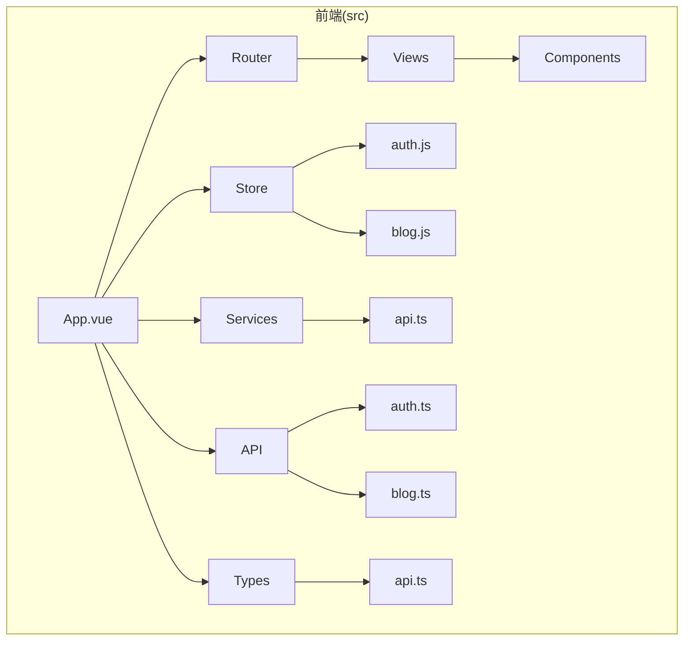
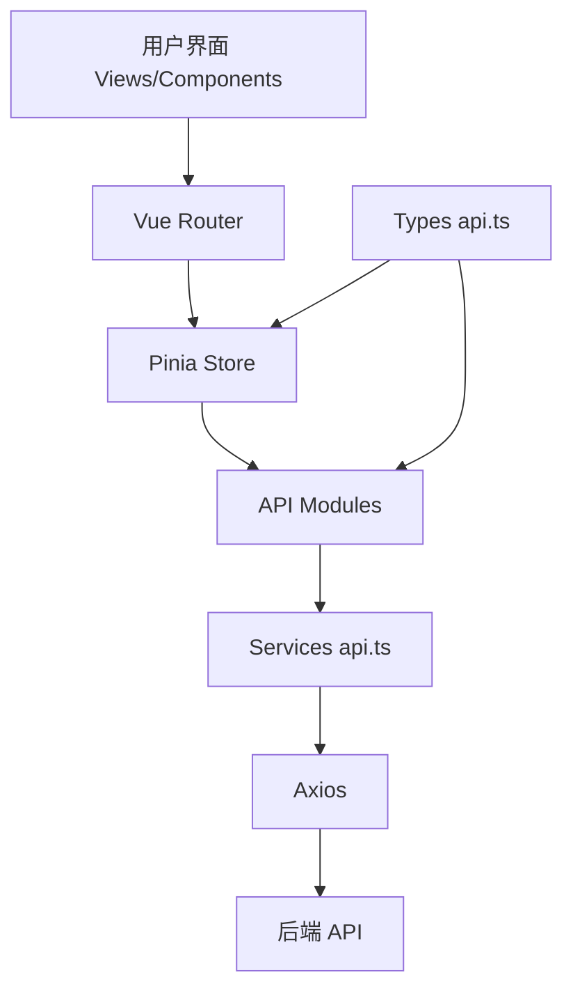
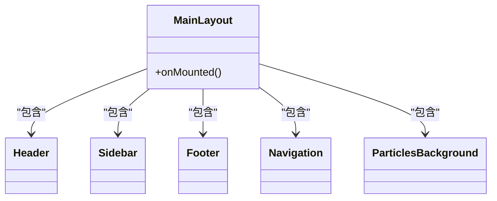
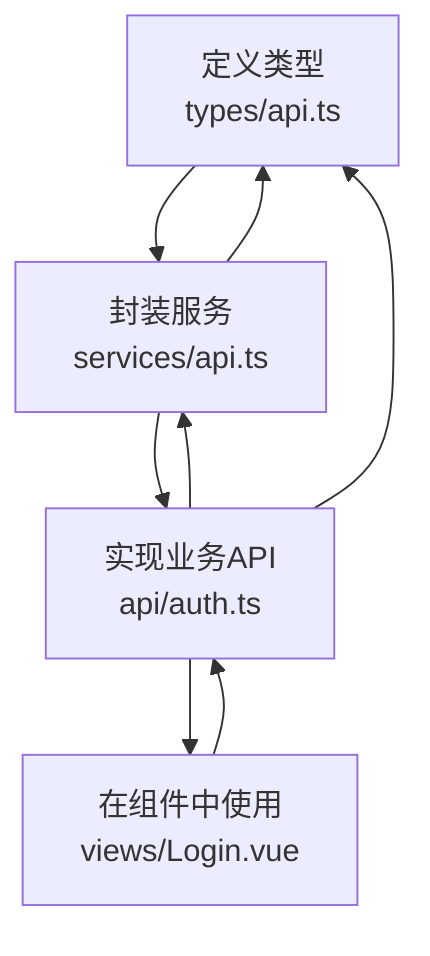
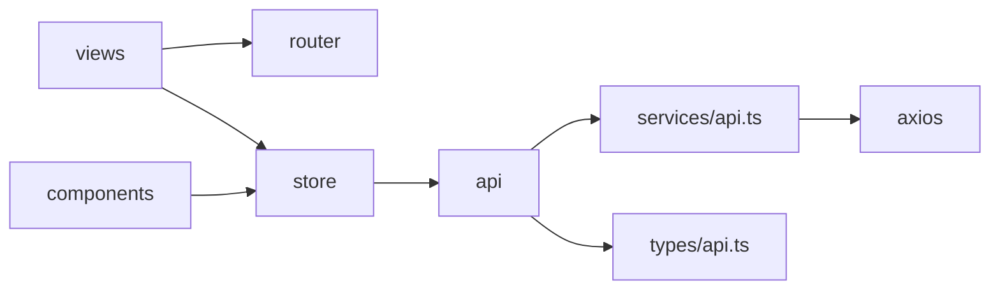

# 前端目录结构详解

<cite>
**本文档引用文件**  
- [main.js](file://frontend/src/main.js)
- [index.js](file://frontend/src/router/index.js)
- [index.js](file://frontend/src/store/index.js)
- [auth.js](file://frontend/src/store/modules/auth.js)
- [blog.js](file://frontend/src/store/modules/blog.js)
- [api.ts](file://frontend/src/services/api.ts)
- [auth.ts](file://frontend/src/api/auth.ts)
- [MainLayout.vue](file://frontend/src/components/MainLayout.vue)
- [types/api.ts](file://frontend/src/types/api.ts)
</cite>

## 目录

1. [项目结构](#项目结构)
2. [核心组件](#核心组件)
3. [架构概览](#架构概览)
4. [详细组件分析](#详细组件分析)
5. [依赖分析](#依赖分析)
6. [性能考量](#性能考量)
7. [故障排除指南](#故障排除指南)
8. [结论](#结论)

## 项目结构

`my_website` 项目的前端部分位于 `frontend/src` 目录下，采用基于功能的模块化组织方式，清晰地分离了不同职责的代码。主要目录包括：

- **api**: 存放与后端 API 交互的 TypeScript 接口定义和业务逻辑封装。
- **components**: 存放可复用的 UI 组件，如 `Header`、`Footer`、`Sidebar` 等。
- **views**: 存放页面级视图组件，每个 `.vue` 文件通常对应一个路由页面。
- **router**: 包含 Vue Router 的配置，定义了应用的路由规则和导航守卫。
- **store**: 使用 Pinia 进行状态管理，包含全局状态和模块化状态（如 `auth.js` 和 `blog.js`）。
- **services**: 封装底层 HTTP 服务，提供类型安全的请求方法。
- **types**: 定义全局 TypeScript 类型，确保前后端数据交互的类型安全。
- **composables**: 存放 Vue Composition API 的可组合函数，用于逻辑复用。
- **assets**: 存放静态资源文件，如 CSS 样式和图片。

这种结构遵循了现代 Vue.js 应用的最佳实践，提高了代码的可维护性和可扩展性。



**图示来源**
- [main.js](file://frontend/src/main.js#L1-L10)
- [index.js](file://frontend/src/router/index.js#L1-L50)
- [index.js](file://frontend/src/store/index.js#L1-L10)

## 核心组件

前端的核心在于其组件化架构和状态管理机制。`MainLayout.vue` 作为应用的主布局，通过组合 `Header`、`Sidebar`、`Footer` 等全局组件，为所有页面提供了统一的视觉结构和用户体验。`Pinia` 状态管理库通过 `store` 目录下的模块（如 `auth.js`）集中管理应用状态，实现了状态的可预测性和跨组件共享。`api` 目录下的 TypeScript 文件与 `services/api.ts` 协同工作，利用 `types/api.ts` 中定义的类型，实现了类型安全的 HTTP 请求，极大地减少了运行时错误。

**组件来源**
- [MainLayout.vue](file://frontend/src/components/MainLayout.vue#L1-L50)
- [auth.js](file://frontend/src/store/modules/auth.js#L1-L20)
- [api.ts](file://frontend/src/services/api.ts#L1-L50)

## 架构概览

该前端应用采用 Vue 3 的 Composition API 和 Vite 作为构建工具，构建了一个高效、模块化的单页应用（SPA）。整体架构遵循清晰的分层模式：

1.  **视图层 (Views & Components)**: 由 `.vue` 文件构成，负责 UI 展示和用户交互。
2.  **路由层 (Router)**: `router/index.js` 管理应用的导航，通过懒加载优化首屏性能，并使用路由守卫控制页面访问权限。
3.  **状态管理层 (Store)**: `store/index.js` 初始化 Pinia，`store/modules` 下的模块（如 `auth.js`）定义了状态、计算属性和操作方法。
4.  **服务层 (Services)**: `services/api.ts` 基于 Axios 封装了底层 HTTP 客户端，处理请求/响应拦截、错误处理和基础配置。
5.  **API 层 (API)**: `api/*.ts` 文件导入 `services/api.ts` 并调用其方法，实现具体的业务 API 调用，同时利用 `types/api.ts` 进行类型约束。
6.  **类型层 (Types)**: `types/api.ts` 为整个应用提供统一的数据类型定义，是实现类型安全的关键。



**图示来源**
- [index.js](file://frontend/src/router/index.js#L1-L50)
- [index.js](file://frontend/src/store/index.js#L1-L10)
- [auth.js](file://frontend/src/store/modules/auth.js#L1-L20)
- [api.ts](file://frontend/src/services/api.ts#L1-L50)
- [auth.ts](file://frontend/src/api/auth.ts#L1-L20)

## 详细组件分析

### MainLayout 与布局组件分析

`MainLayout.vue` 是整个应用的骨架，它通过 `<router-view>` 动态渲染当前路由对应的页面组件。其设计意图是提供一个包含头部、导航、侧边栏和页脚的固定布局，同时通过 CSS Grid 实现响应式设计，在桌面端和移动端呈现不同的布局效果。`Header`、`Footer`、`Sidebar` 等组件作为布局的一部分，被集中引入和管理，确保了全局 UI 元素的一致性。



**图示来源**
- [MainLayout.vue](file://frontend/src/components/MainLayout.vue#L1-L100)

**组件来源**
- [MainLayout.vue](file://frontend/src/components/MainLayout.vue#L1-L222)

### Pinia 状态管理分析

Pinia 状态管理模块的设计遵循了模块化原则。`store/index.js` 是入口文件，创建并导出 Pinia 实例。`auth.js` 模块是核心示例，它使用 `defineStore` 定义了一个名为 `auth` 的 store。

- **状态 (State)**: `user` 和 `loading` 用于存储用户信息和加载状态。
- **计算属性 (Getters)**: `isAuthenticated` 和 `isAdmin` 基于 `user` 状态派生出布尔值，便于在模板中使用。
- **动作 (Actions)**: `initAuth`、`login`、`logout` 等方法封装了业务逻辑，如调用 `authApi.login()` 进行登录，并在成功后更新 `user` 状态和 `authStorage`。

这种设计将状态逻辑与组件逻辑分离，使得状态变更可追踪、可预测。

```mermaid
classDiagram
class useAuthStore {
-user : User
-loading : boolean
+isAuthenticated : boolean
+isAdmin : boolean
+initAuth() : Promise~void~
+login(credentials) : Promise~LoginResponse~
+logout() : void
}
class authApi {
+login(credentials) : Promise~LoginResponse~
+getCurrentUser() : Promise~AuthResponse~
}
class authStorage {
+setAuth(token, user) : void
+getAuth() : {token, user}
+clearAuth() : void
}
useAuthStore --> authApi : "调用"
useAuthStore --> authStorage : "调用"
```

**图示来源**
- [auth.js](file://frontend/src/store/modules/auth.js#L1-L94)
- [auth.ts](file://frontend/src/api/auth.ts#L1-L50)

**组件来源**
- [auth.js](file://frontend/src/store/modules/auth.js#L1-L94)

### API 与类型安全分析

`api` 目录下的文件（如 `auth.ts`）与 `services/api.ts` 和 `types/api.ts` 共同构成了类型安全的网络请求体系。

1.  **类型定义**: `types/api.ts` 定义了所有 API 请求和响应的数据结构，例如 `LoginCredentials`、`LoginResponse` 和 `User`。
2.  **服务封装**: `services/api.ts` 使用 Axios 创建了一个 `api` 实例，并通过 `apiService` 对象暴露了 `get`、`post` 等方法，这些方法返回 `Promise<T>`，其中 `T` 是响应数据的类型。
3.  **业务 API**: `auth.ts` 导入 `apiService` 和类型定义，然后实现具体的业务方法。例如，`login` 方法接受 `LoginCredentials` 类型的参数，并返回 `Promise<LoginResponse>`。这确保了在调用 `authApi.login()` 时，传入的参数和返回的数据都符合预定义的类型。



**图示来源**
- [types/api.ts](file://frontend/src/types/api.ts#L1-L50)
- [api.ts](file://frontend/src/services/api.ts#L1-L50)
- [auth.ts](file://frontend/src/api/auth.ts#L1-L50)

**组件来源**
- [types/api.ts](file://frontend/src/types/api.ts#L1-L481)
- [api.ts](file://frontend/src/services/api.ts#L1-L237)
- [auth.ts](file://frontend/src/api/auth.ts#L1-L163)

## 依赖分析

该前端应用的依赖关系清晰且层次分明。`views` 和 `components` 依赖于 `router` 进行导航，依赖于 `store` 获取和修改状态。`store` 模块依赖于 `api` 模块来获取远程数据。`api` 模块则依赖于 `services/api.ts` 提供的底层 HTTP 能力和 `types/api.ts` 提供的类型定义。`services/api.ts` 本身依赖于外部库 `axios`。



**图示来源**
- [index.js](file://frontend/src/router/index.js#L1-L50)
- [auth.js](file://frontend/src/store/modules/auth.js#L1-L94)
- [auth.ts](file://frontend/src/api/auth.ts#L1-L50)
- [api.ts](file://frontend/src/services/api.ts#L1-L50)

**组件来源**
- [index.js](file://frontend/src/router/index.js#L1-L295)
- [auth.js](file://frontend/src/store/modules/auth.js#L1-L94)
- [auth.ts](file://frontend/src/api/auth.ts#L1-L163)
- [api.ts](file://frontend/src/services/api.ts#L1-L237)

## 性能考量

该项目在性能优化方面采取了多项措施：
- **路由懒加载**: 在 `router/index.js` 中，所有页面组件都使用 `import()` 函数进行动态导入，这使得代码可以按需加载，显著减小了初始包的大小。
- **Vite 构建**: 使用 Vite 作为构建工具，利用其原生 ES 模块支持和快速热重载（HMR），极大提升了开发体验和构建速度。
- **组件缓存**: 在 `MainLayout.vue` 中，使用 `<keep-alive>` 包裹 `router-view`，并根据路由元信息 `meta.keepAlive` 决定是否缓存组件实例，避免了重复渲染，提升了用户体验。
- **HTTP 优化**: `services/api.ts` 中的 Axios 实例配置了合理的超时时间，并通过拦截器统一处理请求和响应，减少了冗余代码。

## 故障排除指南

- **页面无法加载**: 检查 `router/index.js` 中的路由路径和组件导入路径是否正确。确认 `vite.config.js` 的配置无误。
- **状态更新不生效**: 确保在 Pinia store 中正确使用了 `ref` 和 `computed`。检查组件是否正确地从 store 中读取了状态。
- **API 请求失败**: 查看浏览器开发者工具的网络面板，确认请求 URL、方法和参数是否正确。检查 `services/api.ts` 中的 `baseURL` 是否配置正确。查看控制台日志，`api.ts` 文件中的拦截器会输出详细的请求和错误信息。
- **类型错误**: 当出现类型错误时，首先检查 `types/api.ts` 中的类型定义是否与后端 API 文档一致。确保在 `api/*.ts` 文件中正确使用了这些类型。

## 结论

`my_website` 的前端架构设计精良，充分体现了现代 Web 开发的最佳实践。通过 Vue 3 Composition API、Pinia 状态管理、Vite 构建工具和 TypeScript 类型系统，构建了一个模块化、可维护且类型安全的应用。`components`、`views`、`router`、`store` 和 `api` 各司其职，通过清晰的依赖关系协同工作。`MainLayout` 等布局组件确保了 UI 的一致性，而 `auth.js` 等状态管理模块则实现了复杂的状态逻辑。整体架构为应用的长期发展和功能扩展奠定了坚实的基础。