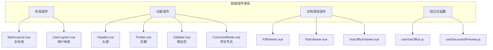
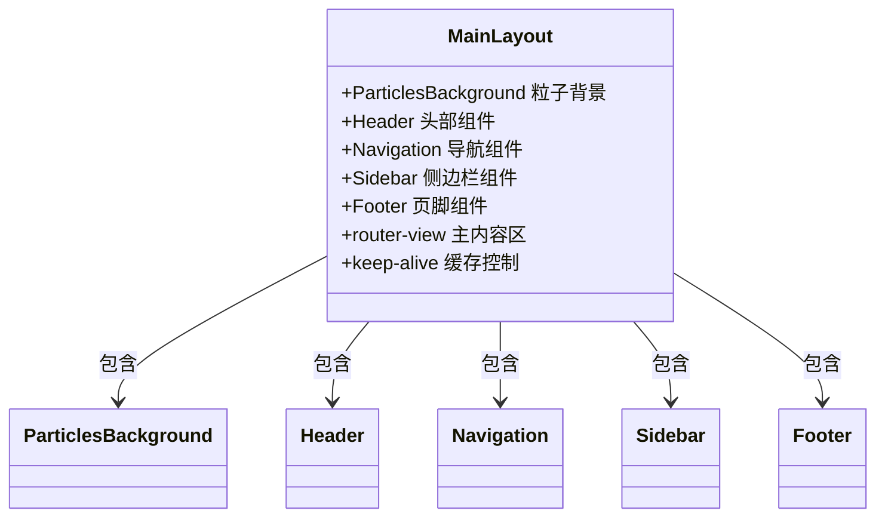
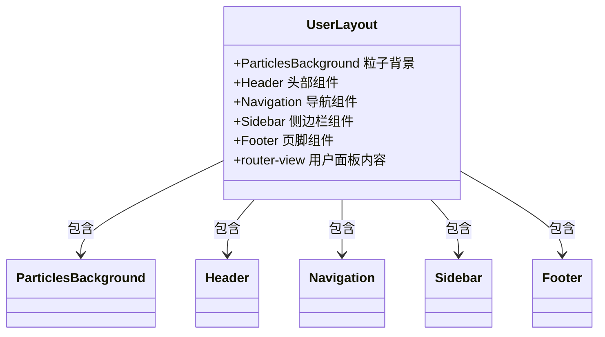
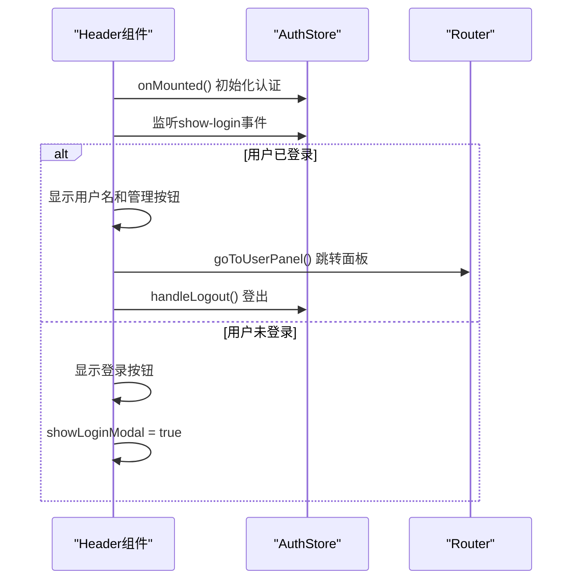
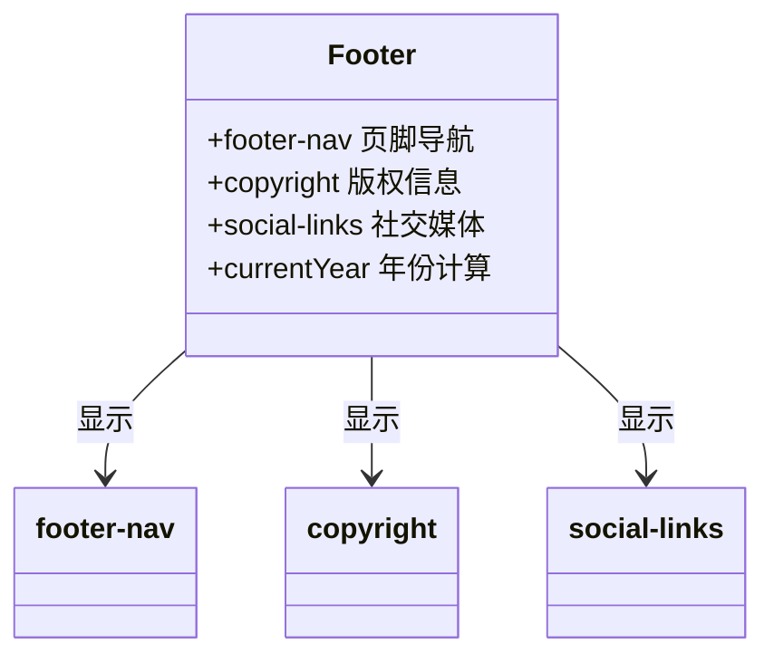
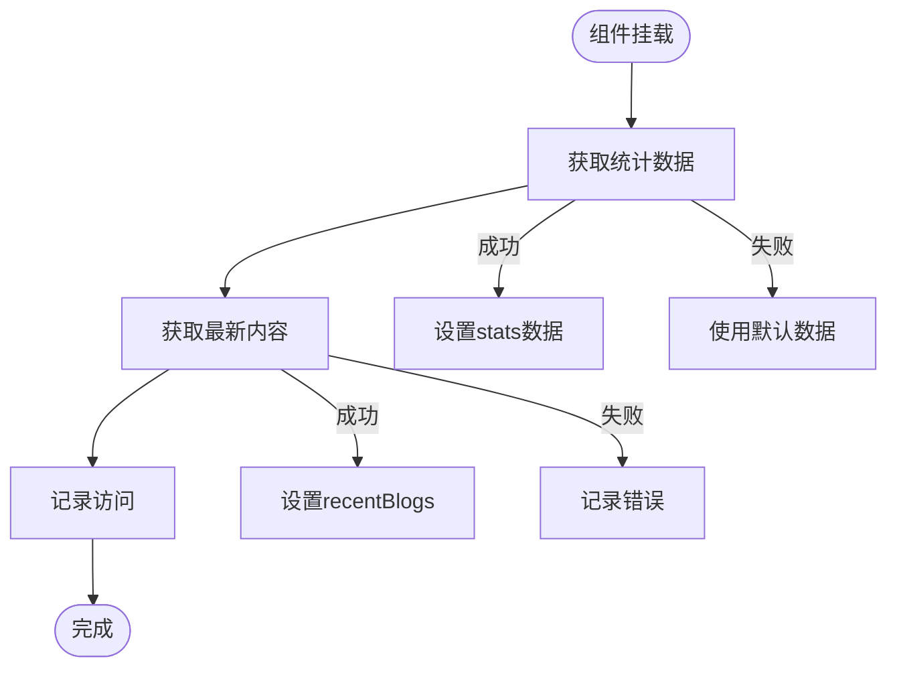
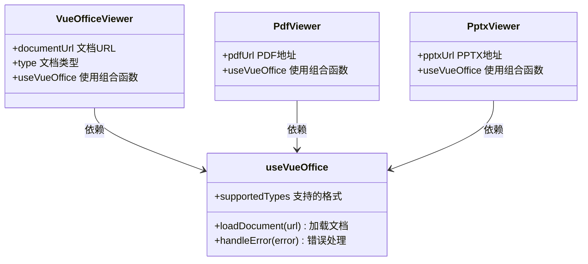
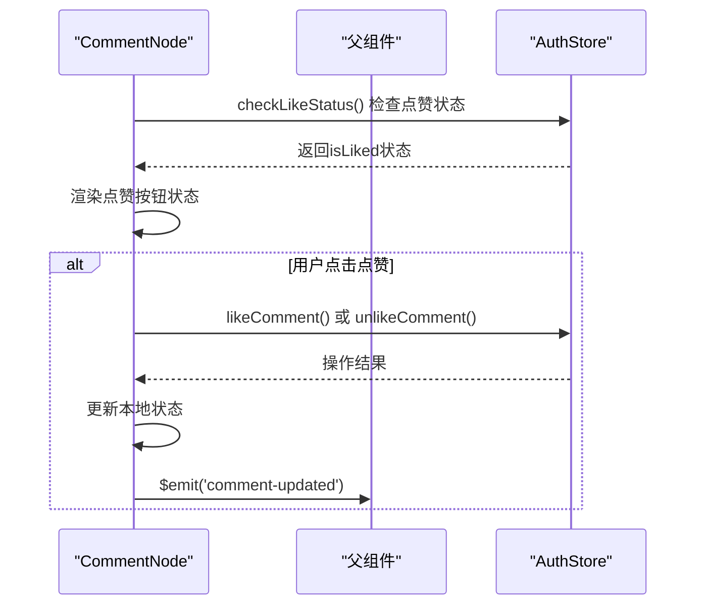
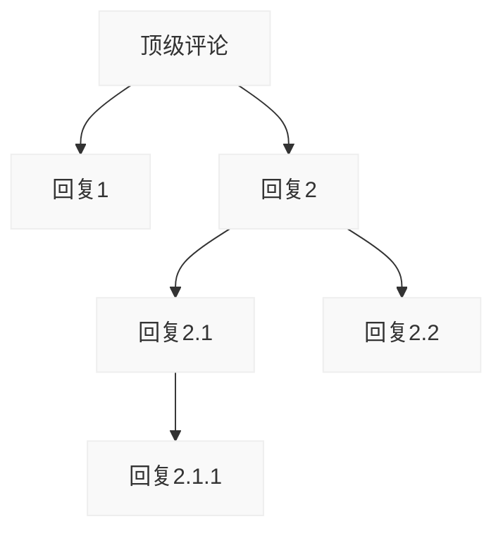

# 前端组件体系详解

<cite>
**本文档引用文件**  
- [MainLayout.vue](file://frontend/src/components/MainLayout.vue)
- [UserLayout.vue](file://frontend/src/components/UserLayout.vue)
- [Header.vue](file://frontend/src/components/Header.vue)
- [Footer.vue](file://frontend/src/components/Footer.vue)
- [Sidebar.vue](file://frontend/src/components/Sidebar.vue)
- [CommentNode.vue](file://frontend/src/components/CommentNode.vue)
- [PdfViewer.vue](file://frontend/src/components/PdfViewer.vue)
- [PptxViewer.vue](file://frontend/src/components/document-preview/PptxViewer.vue)
- [VueOfficeViewer.vue](file://frontend/src/components/document-preview/VueOfficeViewer.vue)
- [useVueOffice.js](file://frontend/src/composables/useVueOffice.js)
- [useDocumentPreview.js](file://frontend/src/composables/useDocumentPreview.js)
</cite>

## 目录
1. [项目结构概览](#项目结构概览)
2. [布局组件设计模式](#布局组件设计模式)
3. [功能组件实现机制](#功能组件实现机制)
4. [文档预览组件技术实现](#文档预览组件技术实现)
5. [全局UI组件样式与通信](#全局ui组件样式与通信)
6. [组件复用与逻辑封装](#组件复用与逻辑封装)
7. [嵌套评论组件深度解析](#嵌套评论组件深度解析)

## 项目结构概览

项目采用典型的前后端分离架构，前端位于`frontend`目录下，使用Vue 3 + Vite构建。组件体系主要集中在`src/components`目录中，分为布局组件、功能组件和文档预览组件三大类。



**图示来源**  
- [MainLayout.vue](file://frontend/src/components/MainLayout.vue)
- [UserLayout.vue](file://frontend/src/components/UserLayout.vue)
- [Header.vue](file://frontend/src/components/Header.vue)
- [Footer.vue](file://frontend/src/components/Footer.vue)
- [Sidebar.vue](file://frontend/src/components/Sidebar.vue)
- [CommentNode.vue](file://frontend/src/components/CommentNode.vue)
- [PdfViewer.vue](file://frontend/src/components/PdfViewer.vue)
- [PptxViewer.vue](file://frontend/src/components/document-preview/PptxViewer.vue)
- [VueOfficeViewer.vue](file://frontend/src/components/document-preview/VueOfficeViewer.vue)
- [useVueOffice.js](file://frontend/src/composables/useVueOffice.js)
- [useDocumentPreview.js](file://frontend/src/composables/useDocumentPreview.js)

## 布局组件设计模式

### MainLayout 主布局组件

`MainLayout.vue`作为网站主要布局容器，整合了头部、导航、主内容区、侧边栏和页脚等组件，采用CSS Grid实现响应式布局。



**图示来源**  
- [MainLayout.vue](file://frontend/src/components/MainLayout.vue#L1-L221)

**组件来源**  
- [MainLayout.vue](file://frontend/src/components/MainLayout.vue#L1-L221)

### UserLayout 用户布局组件

`UserLayout.vue`专为用户管理面板设计，与`MainLayout`结构相似但具有更宽的容器和更高的最小高度，以适应管理界面的复杂内容。



**图示来源**  
- [UserLayout.vue](file://frontend/src/components/UserLayout.vue#L1-L159)

**组件来源**  
- [UserLayout.vue](file://frontend/src/components/UserLayout.vue#L1-L159)

## 功能组件实现机制

### Header 头部组件

`Header.vue`负责显示网站标题、主导航和用户状态信息，通过Vuex store管理用户认证状态。



**图示来源**  
- [Header.vue](file://frontend/src/components/Header.vue#L1-L245)

**组件来源**  
- [Header.vue](file://frontend/src/components/Header.vue#L1-L245)

### Footer 页脚组件

`Footer.vue`提供页脚导航、版权信息和社交媒体链接，使用响应式设计适配不同屏幕尺寸。



**图示来源**  
- [Footer.vue](file://frontend/src/components/Footer.vue#L1-L137)

**组件来源**  
- [Footer.vue](file://frontend/src/components/Footer.vue#L1-L137)

### Sidebar 侧边栏组件

`Sidebar.vue`展示网站统计、最近文章和标签云等信息，通过API调用获取动态数据。



**图示来源**  
- [Sidebar.vue](file://frontend/src/components/Sidebar.vue#L1-L523)

**组件来源**  
- [Sidebar.vue](file://frontend/src/components/Sidebar.vue#L1-L523)

## 文档预览组件技术实现

### VueOffice集成方案

文档预览组件基于`vue-office`库实现，通过`useVueOffice.js`组合式函数封装通用逻辑，支持多种文档格式的在线预览。



**图示来源**  
- [useVueOffice.js](file://frontend/src/composables/useVueOffice.js)
- [VueOfficeViewer.vue](file://frontend/src/components/document-preview/VueOfficeViewer.vue)
- [PdfViewer.vue](file://frontend/src/components/PdfViewer.vue)
- [PptxViewer.vue](file://frontend/src/components/document-preview/PptxViewer.vue)

**组件来源**  
- [useVueOffice.js](file://frontend/src/composables/useVueOffice.js)
- [VueOfficeViewer.vue](file://frontend/src/components/document-preview/VueOfficeViewer.vue)
- [PdfViewer.vue](file://frontend/src/components/PdfViewer.vue)
- [PptxViewer.vue](file://frontend/src/components/document-preview/PptxViewer.vue)

### 组件调用示例

```vue
<!-- PDF预览 -->
<PdfViewer :pdf-url="documentUrl" />

<!-- PPTX预览 -->
<PptxViewer :pptx-url="presentationUrl" />

<!-- 通用文档预览 -->
<VueOfficeViewer 
  :document-url="fileUrl" 
  :type="fileType" 
/>
```

## 全局UI组件样式与通信

### 样式隔离策略

所有组件采用`<style scoped>`实现样式隔离，避免全局污染。同时通过CSS变量和全局样式定义基础视觉规范。

```css
/* 全局样式重置 */
* {
  margin: 0;
  padding: 0;
  box-sizing: border-box;
}

/* 根元素样式 */
html {
  font-family: 'Segoe UI', Tahoma, Geneva, Verdana, sans-serif;
  background: linear-gradient(...);
}
```

### 事件通信机制

组件间通过`$emit`和`props`进行通信，结合Vuex store实现跨组件状态管理。



**图示来源**  
- [CommentNode.vue](file://frontend/src/components/CommentNode.vue#L1-L367)

**组件来源**  
- [CommentNode.vue](file://frontend/src/components/CommentNode.vue#L1-L367)

## 组件复用与逻辑封装

### Composition API 实践

通过`useVueOffice.js`和`useDocumentPreview.js`封装可复用的业务逻辑，遵循Vue 3 Composition API设计模式。

```javascript
// useVueOffice.js
export function useVueOffice() {
  const loadDocument = (url) => {
    // 文档加载逻辑
  }
  
  const handleError = (error) => {
    // 错误处理逻辑
  }
  
  return {
    loadDocument,
    handleError
  }
}
```

### 自定义配置方法

组件支持通过属性、插槽和事件进行高度定制：

```vue
<CommentNode 
  :comment="commentData"
  :depth="0"
  @comment-deleted="handleDelete"
  @comment-added="handleAdd"
>
  <!-- 自定义插槽内容 -->
  <template #actions>
    <button @click="customAction">自定义操作</button>
  </template>
</CommentNode>
```

## 嵌套评论组件深度解析

### 递归渲染机制

`CommentNode.vue`作为递归组件，通过`v-for`循环渲染子评论，形成树状结构。



### 性能优化手段

1. **响应式数据最小化**：仅对必要数据使用`ref`和`computed`
2. **事件委托**：合理使用事件冒泡减少监听器数量
3. **懒加载**：回复表单按需渲染
4. **防抖处理**：对频繁操作进行节流控制

```javascript
// 点赞状态检查
const checkLikeStatus = async () => {
  try {
    const response = await commentApi.checkLikeStatus(id);
    isLiked.value = response.data.isLiked;
  } catch (error) {
    console.error('检查点赞状态失败:', error);
  }
}
```

**组件来源**  
- [CommentNode.vue](file://frontend/src/components/CommentNode.vue#L1-L367)