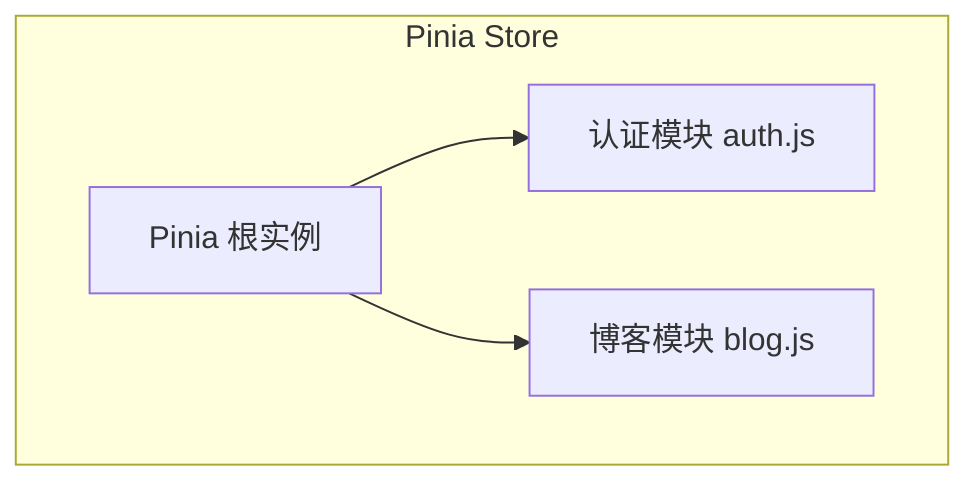
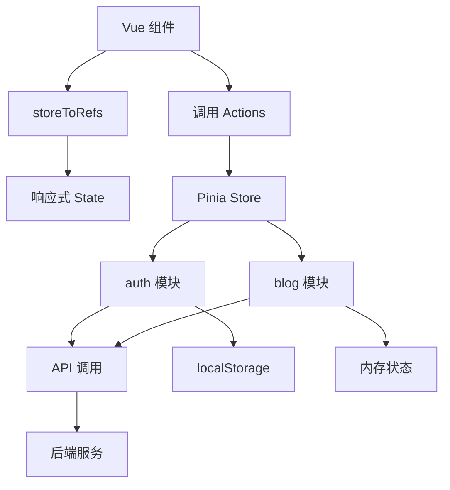
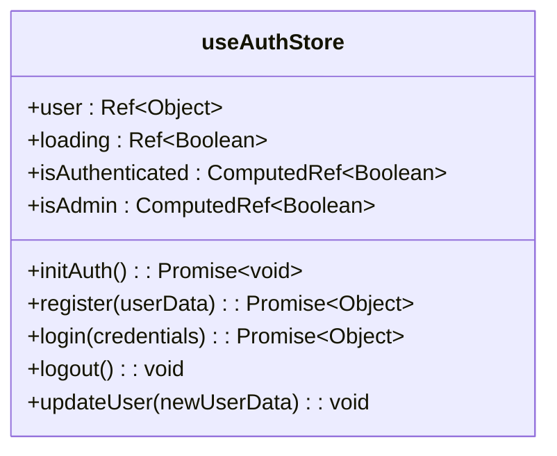
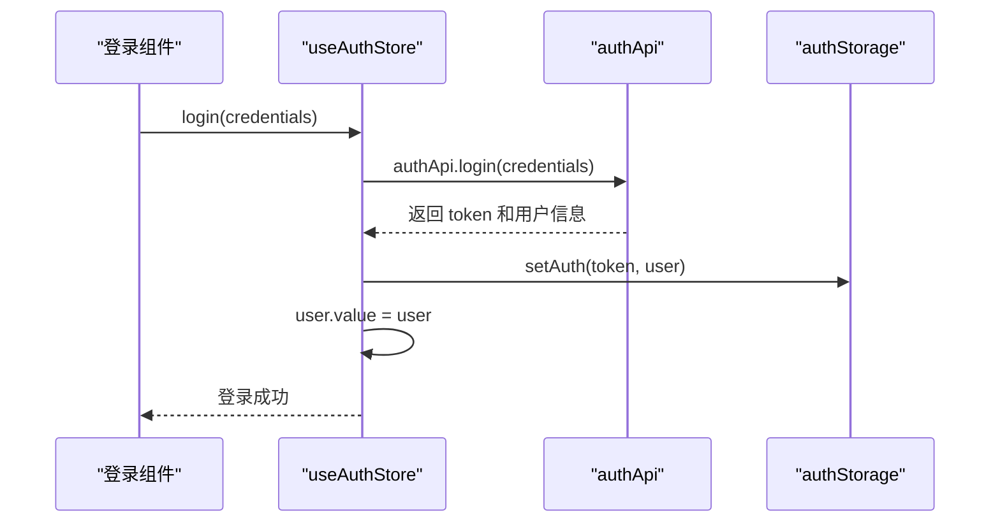
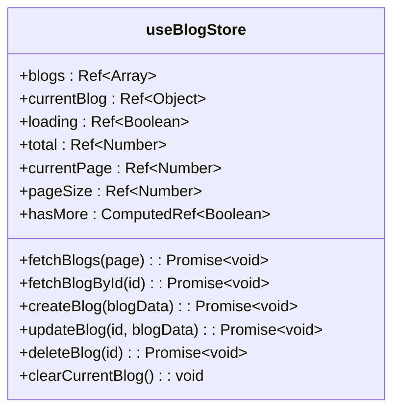
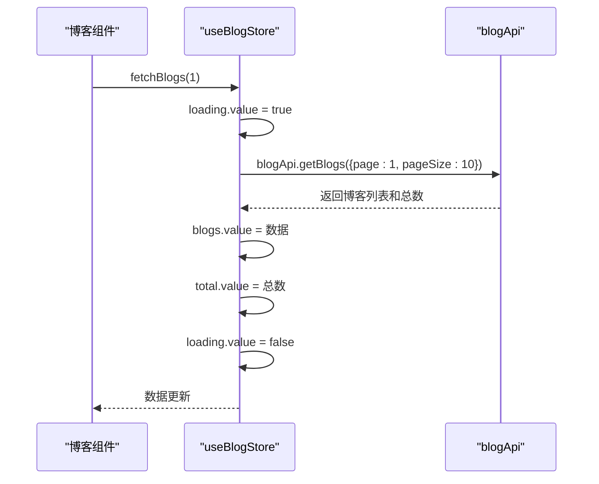
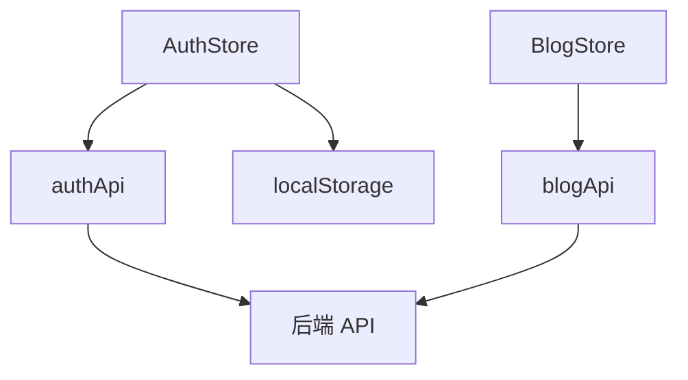

# Pinia状态管理

<cite>
**本文档引用的文件**  
- [index.js](file://frontend/src/store/index.js)
- [auth.js](file://frontend/src/store/modules/auth.js)
- [blog.js](file://frontend/src/store/modules/blog.js)
</cite>

## 目录
1. [简介](#简介)
2. [项目结构](#项目结构)
3. [核心组件](#核心组件)
4. [架构概览](#架构概览)
5. [详细组件分析](#详细组件分析)
6. [依赖分析](#依赖分析)
7. [性能考虑](#性能考虑)
8. [故障排除指南](#故障排除指南)
9. [结论](#结论)

## 简介
本文档全面阐述了 `my_website` 项目中基于 Pinia 的状态管理设计与实践。通过模块化组织方式，将全局状态划分为根 store 与子模块（如 `auth` 和 `blog`），实现了高内聚、低耦合的状态管理架构。文档详细解析了各模块中响应式状态定义、计算属性封装、异步操作处理机制，并重点说明了状态持久化方案、组件间共享机制及与 Vue 组件的响应式绑定技术。结合用户登录、博客数据管理等实际业务场景，展示状态变更的完整流程，并提供调试技巧与常见问题解决方案。

## 项目结构
`my_website` 项目的前端状态管理位于 `frontend/src/store` 目录下，采用模块化设计，分为根 store 和多个功能子模块。

**图示来源**  
- [index.js](file://frontend/src/store/index.js)
- [auth.js](file://frontend/src/store/modules/auth.js)
- [blog.js](file://frontend/src/store/modules/blog.js)

**本节来源**  
- [index.js](file://frontend/src/store/index.js#L1-L10)
- [auth.js](file://frontend/src/store/modules/auth.js#L1-L10)
- [blog.js](file://frontend/src/store/modules/blog.js#L1-L10)

## 核心组件
Pinia 作为 Vue 应用的状态管理库，在本项目中承担着全局状态集中管理的核心职责。其核心组件包括：

- **根 store 实例**：由 `createPinia()` 创建，作为所有模块的容器。
- **模块化 store**：通过 `defineStore` 定义独立的功能模块，如 `auth` 和 `blog`。
- **响应式状态 (state)**：使用 `ref` 定义可响应的数据。
- **计算属性 (getters)**：使用 `computed` 封装派生状态逻辑。
- **操作方法 (actions)**：封装同步与异步业务逻辑。

这些组件共同构成了一个清晰、可维护的状态管理体系。

**本节来源**  
- [index.js](file://frontend/src/store/index.js#L1-L10)
- [auth.js](file://frontend/src/store/modules/auth.js#L1-L94)
- [blog.js](file://frontend/src/store/modules/blog.js#L1-L159)

## 架构概览
整个 Pinia 状态管理架构采用分层模块化设计，确保职责分离与可扩展性。

**图示来源**  
- [index.js](file://frontend/src/store/index.js#L1-L10)
- [auth.js](file://frontend/src/store/modules/auth.js#L1-L94)
- [blog.js](file://frontend/src/store/modules/blog.js#L1-L159)

## 详细组件分析
### 认证模块 (auth.js) 分析
`auth.js` 模块负责用户认证相关的状态管理，包括登录、登出、用户信息维护等。

#### 类图：认证模块结构

**图示来源**  
- [auth.js](file://frontend/src/store/modules/auth.js#L1-L94)

#### 序列图：用户登录流程

**图示来源**  
- [auth.js](file://frontend/src/store/modules/auth.js#L50-L70)

**本节来源**  
- [auth.js](file://frontend/src/store/modules/auth.js#L1-L94)

### 博客模块 (blog.js) 分析
`blog.js` 模块管理博客相关的所有状态，包括博客列表、分页、详情等。

#### 类图：博客模块结构

**图示来源**  
- [blog.js](file://frontend/src/store/modules/blog.js#L1-L159)

#### 序列图：获取博客列表流程

**图示来源**  
- [blog.js](file://frontend/src/store/modules/blog.js#L25-L45)

**本节来源**  
- [blog.js](file://frontend/src/store/modules/blog.js#L1-L159)

## 依赖分析
Pinia 模块之间通过独立定义实现低耦合，但共享外部依赖如 API 服务。

**图示来源**  
- [auth.js](file://frontend/src/store/modules/auth.js#L5-L10)
- [blog.js](file://frontend/src/store/modules/blog.js#L5-L10)

**本节来源**  
- [auth.js](file://frontend/src/store/modules/auth.js#L1-L94)
- [blog.js](file://frontend/src/store/modules/blog.js#L1-L159)

## 性能考虑
- **状态持久化**：`auth` 模块通过 `localStorage` 实现自动登录，减少重复请求。
- **懒加载**：`blog` 模块采用分页加载，避免一次性获取大量数据。
- **响应式优化**：使用 `ref` 和 `computed` 确保仅在依赖变化时重新计算。
- **错误处理**：所有异步操作均包含 `try-catch`，防止状态异常。

## 故障排除指南
### 常见问题及解决方案
- **状态未更新**：
  - 检查是否使用 `storeToRefs` 解构状态，避免失去响应性。
  - 确认 action 是否正确修改了 `ref` 值。

- **内存泄漏**：
  - 避免在组件中直接持有 store 引用而不释放。
  - 使用 `onUnmounted` 清理定时器或监听器。

- **持久化失效**：
  - 检查 `authStorage` 的 `setAuth` 和 `clearAuth` 是否正确操作 `localStorage`。
  - 确保 token 过期机制与存储同步。

- **调试技巧**：
  - 使用 Vue DevTools 查看 store 状态变化。
  - 在 actions 中添加日志输出，追踪执行流程。
  - 利用 `pinia.use()` 注册插件进行状态快照监控。

**本节来源**  
- [auth.js](file://frontend/src/store/modules/auth.js#L50-L85)
- [blog.js](file://frontend/src/store/modules/blog.js#L25-L150)

## 结论
`my_website` 项目通过 Pinia 实现了高效、可维护的状态管理。模块化设计使功能职责清晰，响应式机制确保视图同步更新，异步操作封装提升了代码可读性。结合 `localStorage` 持久化与 `storeToRefs` 响应式绑定，构建了稳定的应用状态流。建议未来可引入 Pinia 插件进行日志记录或状态快照，进一步提升可调试性。