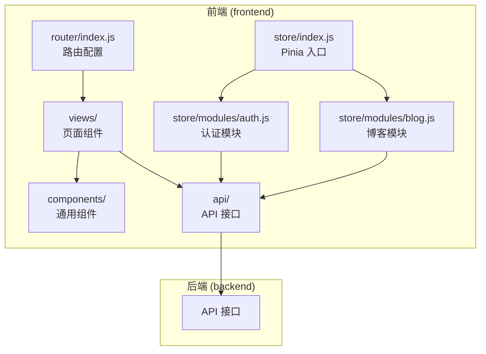
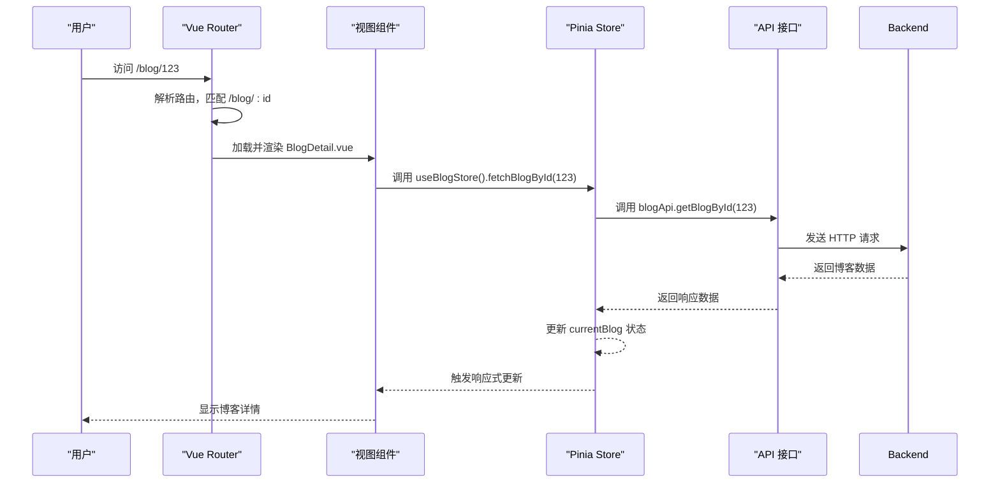
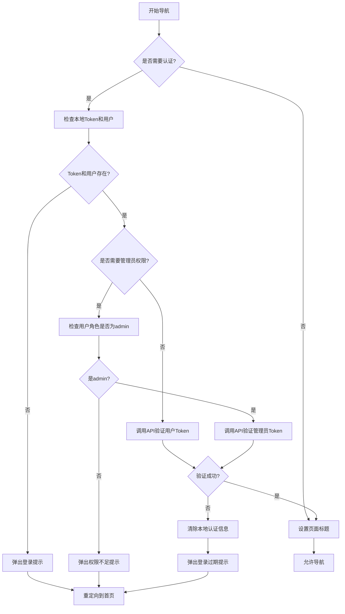
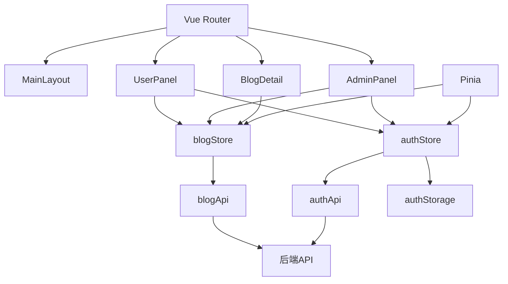

# 前端路由与状态管理

<cite>
**本文档引用文件**   
- [index.js](file://frontend/src/router/index.js)
- [auth.js](file://frontend/src/store/modules/auth.js)
- [blog.js](file://frontend/src/store/modules/blog.js)
- [index.js](file://frontend/src/store/index.js)
- [UserLayout.vue](file://frontend/src/components/UserLayout.vue)
</cite>

## 目录
1. [项目结构](#项目结构)
2. [核心组件](#核心组件)
3. [架构概览](#架构概览)
4. [详细组件分析](#详细组件分析)
5. [依赖分析](#依赖分析)
6. [性能考虑](#性能考虑)
7. [故障排除指南](#故障排除指南)
8. [结论](#结论)

## 项目结构

`my_website` 项目采用典型的前后端分离架构，前端基于 Vue.js 框架构建，后端使用 Node.js。前端代码位于 `frontend` 目录下，遵循模块化设计原则，主要结构如下：

- **`src/api`**: 定义与后端 API 交互的接口方法。
- **`src/components`**: 存放可复用的 UI 组件，如布局、导航、表单等。
- **`src/router`**: Vue Router 的配置文件，负责管理应用的路由。
- **`src/store`**: Pinia 状态管理的主入口和模块定义。
- **`src/views`**: 页面级组件，每个视图对应一个路由。
- **`src/utils`**: 工具函数，如认证相关的本地存储操作。

该结构清晰地分离了关注点，便于维护和扩展。



**图示来源**
- [index.js](file://frontend/src/router/index.js)
- [auth.js](file://frontend/src/store/modules/auth.js)
- [blog.js](file://frontend/src/store/modules/blog.js)
- [index.js](file://frontend/src/store/index.js)

## 核心组件

本项目的核心在于前端路由（Vue Router）和全局状态管理（Pinia）的协同工作。Vue Router 负责页面导航和视图切换，而 Pinia 则集中管理应用的共享状态，如用户认证信息和博客数据。两者通过在组件中注入和使用，实现了数据与视图的响应式绑定。

**组件来源**
- [index.js](file://frontend/src/router/index.js#L1-L295)
- [auth.js](file://frontend/src/store/modules/auth.js#L1-L94)
- [blog.js](file://frontend/src/store/modules/blog.js#L1-L159)

## 架构概览

整个前端应用的架构围绕着 `App.vue` 这个根组件展开。应用启动时，`main.js` 会创建 Vue 实例，并挂载 `App.vue`。`App.vue` 会引入并使用 `Pinia` 实例和 `Vue Router` 实例。

路由配置定义了应用的导航结构。当用户访问某个 URL 时，Vue Router 会根据配置找到对应的视图组件（如 `Home.vue`, `Blog.vue`），并将其渲染到 `<router-view>` 插槽中。同时，Pinia 的各个模块（如 `authStore`, `blogStore`）会为这些组件提供所需的数据和业务逻辑方法。



**图示来源**
- [index.js](file://frontend/src/router/index.js#L1-L295)
- [blog.js](file://frontend/src/store/modules/blog.js#L1-L159)
- [App.vue](file://frontend/src/App.vue)

## 详细组件分析

### 路由配置分析

`src/router/index.js` 文件是前端路由的核心配置。它使用 `createRouter` 和 `createWebHashHistory` 创建了一个基于 hash 模式的路由实例。

**路由定义与懒加载**
路由被组织在一个 `routes` 数组中，采用嵌套路由结构。根路径 `/` 使用 `MainLayout` 作为布局组件，其子路由（如首页、博客列表）将被渲染在布局的 `<router-view>` 中。所有页面组件都采用了**懒加载**（`import()` 函数），这可以显著减少应用的初始加载时间，实现按需加载。

```javascript
const Home = () => import('../views/Home.vue')
```

此外，代码还为懒加载添加了 `.catch()` 错误处理，确保在组件加载失败时能捕获错误并尝试重新加载，提高了应用的健壮性。

**路由元信息 (Meta)**
每个路由都定义了 `meta` 字段，用于存储附加信息：
- `title`: 用于动态设置页面标题。
- `keepAlive`: 标记是否需要缓存组件实例，避免重复渲染。
- `requiresAuth`: 标记该路由是否需要用户登录。
- `requiresAdmin`: 标记该路由是否需要管理员权限。

这些元信息是实现路由守卫和页面标题管理的关键。

**路由来源**
- [index.js](file://frontend/src/router/index.js#L1-L295)

### 路由守卫与权限控制

`router.beforeEach` 定义了全局前置守卫，这是实现访问控制的核心。

**守卫流程**
1.  **日志记录**: 记录路由导航信息，便于调试。
2.  **防止循环**: 检查 `from` 和 `to` 路径是否相同，防止无限重定向。
3.  **设置标题**: 根据 `to.meta.title` 动态更新 `document.title`。
4.  **权限验证**:
    *   如果目标路由需要认证 (`requiresAuth`) 或管理员权限 (`requiresAdmin`)，则从 `authStorage`（封装了 `localStorage`）中获取 `token` 和 `user` 信息。
    *   若未登录，则弹出提示并重定向到首页。
    *   若需要管理员权限，会进一步检查 `user.role` 是否为 `'admin'`。
    *   **Token 有效性验证**: 无论是普通用户还是管理员，守卫都会调用相应的 API（`getCurrentUser` 或 `verifyAdmin`）来验证 `token` 是否仍然有效。这里使用了 `Promise.race` 和超时机制，防止 API 请求长时间挂起，提升了用户体验。

此守卫机制确保了只有经过身份验证且拥有相应权限的用户才能访问受保护的页面（如 `/admin/dashboard` 和 `/user/panel`）。



**图示来源**
- [index.js](file://frontend/src/router/index.js#L150-L270)

### Pinia 状态管理分析

Pinia 是本项目的状态管理库，其入口文件 `src/store/index.js` 创建并导出了一个 `pinia` 实例。

**模块化设计**
状态被划分为多个模块，存放在 `src/store/modules/` 目录下，实现了关注点分离。

#### 认证模块 (auth.js)

`useAuthStore` 模块负责管理用户认证相关的状态和逻辑。

- **状态 (State)**:
    - `user`: 存储当前登录用户的信息（如 `id`, `role`）。
    - `loading`: 表示认证初始化过程的加载状态。
- **计算属性 (Getters)**:
    - `isAuthenticated`: 计算用户是否已登录。
    - `isAdmin`: 计算当前用户是否为管理员。
- **Actions (方法)**:
    - `initAuth`: 应用启动时调用，检查本地存储的 `token`，并尝试获取用户信息以恢复登录状态。
    - `login` / `register`: 处理登录和注册逻辑，成功后调用 `authStorage.setAuth()` 将 `token` 和 `user` 信息持久化到 `localStorage`，并更新 `user` 状态。
    - `logout`: 清除本地存储和 `user` 状态。
    - `updateUser`: 更新用户信息并同步到本地存储。

该模块通过 `authStorage` 对象封装了对 `localStorage` 的读写操作，保证了数据的一致性。

**认证模块来源**
- [auth.js](file://frontend/src/store/modules/auth.js#L1-L94)

#### 博客模块 (blog.js)

`useBlogStore` 模块负责管理博客相关的数据和操作。

- **状态 (State)**:
    - `blogs`: 存储当前页的博客列表。
    - `currentBlog`: 存储当前查看的博客详情。
    - `loading`: 全局加载状态。
    - `total`, `currentPage`, `pageSize`: 用于分页控制。
- **计算属性 (Getters)**:
    - `hasMore`: 判断是否还有更多博客可以加载。
- **Actions (方法)**:
    - `fetchBlogs`: 根据页码获取博客列表，更新 `blogs`, `total`, `currentPage` 状态。
    - `fetchBlogById`: 根据 ID 获取单篇博客详情，更新 `currentBlog` 状态。
    - `createBlog`, `updateBlog`, `deleteBlog`: 对博客进行增删改操作，并相应地更新 `blogs` 数组和 `total` 计数。例如，`deleteBlog` 会从 `blogs` 数组中过滤掉被删除的博客，并减少 `total`。
    - `clearCurrentBlog`: 清除当前博客详情。

该模块与 `blogApi` 紧密协作，将 API 调用和状态更新封装在一起，使得视图组件只需调用简单的 `store` 方法即可完成复杂的业务逻辑。

**博客模块来源**
- [blog.js](file://frontend/src/store/modules/blog.js#L1-L159)

### 视图与状态同步

以 `BlogDetail.vue` 页面为例，说明路由参数、API 调用和状态管理的协同工作：

1.  用户访问 `/blog/123`。
2.  Vue Router 匹配到 `blog-detail` 路由，并将 `123` 作为 `id` 参数传递给 `BlogDetail.vue` 组件。
3.  `BlogDetail.vue` 组件在 `onMounted` 钩子中，调用 `useBlogStore().fetchBlogById(id)`。
4.  `fetchBlogById` 方法执行，通过 `blogApi` 向后端发起请求。
5.  请求成功后，`fetchBlogById` 将返回的数据赋值给 `currentBlog` 状态。
6.  由于 `currentBlog` 是响应式的，`BlogDetail.vue` 组件会自动重新渲染，将 `currentBlog` 中的数据展示在页面上。

这种模式将数据获取和状态管理从视图组件中解耦，使组件逻辑更清晰。

## 依赖分析



**图示来源**
- [index.js](file://frontend/src/router/index.js)
- [auth.js](file://frontend/src/store/modules/auth.js)
- [blog.js](file://frontend/src/store/modules/blog.js)

## 性能考虑

1.  **懒加载**: 所有非首页的视图组件均采用懒加载，有效减少了首屏加载包的大小。
2.  **组件缓存**: 通过 `meta.keepAlive` 标记，对 `Home`, `Blog`, `Gallery` 等页面进行缓存，避免用户在这些页面间切换时重复渲染和数据请求。
3.  **分页加载**: `blogStore` 实现了分页功能，避免一次性加载所有博客数据，减轻了服务器和客户端的压力。
4.  **防抖与超时**: 路由守卫中的 API 验证使用了超时机制，防止因网络问题导致页面卡死。

## 故障排除指南

*   **页面无法加载，控制台报错 "组件加载失败"**: 检查网络连接，确认 `views` 目录下对应的 `.vue` 文件是否存在且路径正确。
*   **登录后无法访问管理员页面**: 检查后端返回的 `user` 对象中的 `role` 字段是否正确设置为 `'admin'`。检查 `localStorage` 中的 `user` 信息是否已更新。
*   **博客列表为空**: 检查 `blogApi.getBlogs()` 的 API 接口是否正常工作，确认后端数据库是否有数据。
*   **状态未更新**: 确保在 `store` 的 `actions` 中修改状态时，是直接修改 `ref` 包裹的变量（如 `user.value = ...`），而不是创建新的引用。
*   **路由守卫无限循环**: 检查 `beforeEach` 守卫中的 `next()` 调用，确保在所有分支逻辑中都正确调用了 `next()` 或 `next(false)`，避免遗漏。

## 结论

`my_website` 项目的前端架构设计良好。Vue Router 提供了灵活的路由管理和强大的导航守卫功能，实现了基于角色的访问控制（RBAC）。Pinia 的模块化设计使得状态管理清晰、可维护，`authStore` 和 `blogStore` 各司其职，通过响应式机制与视图组件无缝集成。懒加载、组件缓存和分页等技术的应用，保证了应用的性能。整体代码结构遵循了现代前端开发的最佳实践，为应用的稳定运行和后续扩展奠定了坚实的基础。