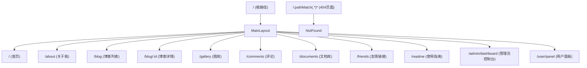
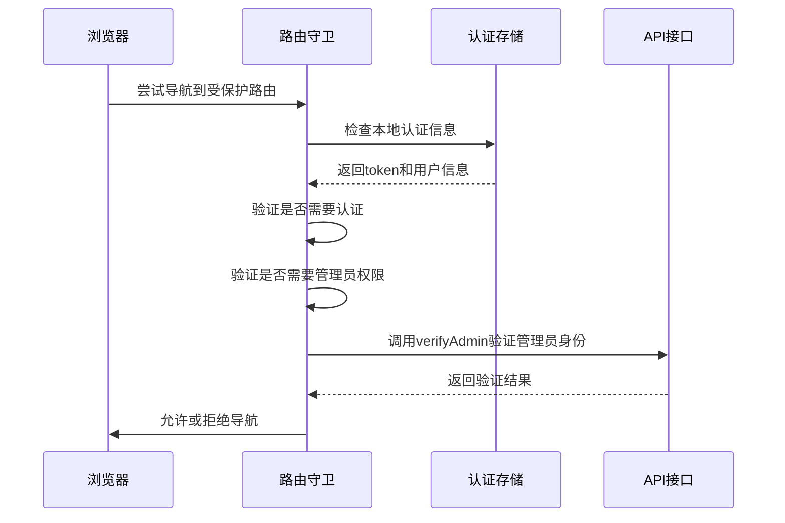

# 前端路由配置

<cite>
**本文档引用文件**   
- [index.js](file://frontend/src/router/index.js)
- [auth.js](file://frontend/src/utils/auth.js)
- [admin.ts](file://frontend/src/api/admin.ts)
- [AdminPanel.vue](file://frontend/src/views/Admin/AdminPanel.vue)
- [UserPanel.vue](file://frontend/src/views/User/UserPanel.vue)
</cite>

## 目录
1. [项目结构分析](#项目结构分析)
2. [核心组件分析](#核心组件分析)
3. [路由表结构设计](#路由表结构设计)
4. [页面组件懒加载策略](#页面组件懒加载策略)
5. [嵌套路由与布局](#嵌套路由与布局)
6. [动态路由参数匹配](#动态路由参数匹配)
7. [路由元信息应用](#路由元信息应用)
8. [路由守卫与权限控制](#路由守卫与权限控制)
9. [路由异常处理](#路由异常处理)
10. [性能优化建议](#性能优化建议)
11. [常见问题排查](#常见问题排查)

## 项目结构分析

根据项目目录结构，`my_website`项目采用前后端分离架构。前端代码位于`frontend`目录下，使用Vue.js框架构建，其中路由配置文件位于`frontend/src/router/index.js`。前端采用模块化组织方式，包含组件、视图、API接口、工具函数等目录。

后端代码位于`backend`目录，使用Node.js + Express框架，包含控制器、模型、中间件等标准MVC结构。前后端通过API进行通信，前端路由负责页面导航和用户体验，后端路由处理数据请求。

**Section sources**
- [index.js](file://frontend/src/router/index.js#L0-L294)

## 核心组件分析

前端路由系统的核心组件包括：
- **Vue Router**：版本4.5.1，提供路由功能
- **MainLayout**：主布局组件，作为所有页面的容器
- **路由守卫**：全局`beforeEach`守卫实现权限控制
- **懒加载组件**：通过`import()`语法实现按需加载

路由系统与认证模块紧密集成，通过`authStorage`和`adminApi`等工具实现用户状态管理和权限验证。

**Section sources**
- [index.js](file://frontend/src/router/index.js#L0-L294)
- [auth.js](file://frontend/src/utils/auth.js#L0-L107)

## 路由表结构设计

路由表采用嵌套结构设计，以`MainLayout`为根布局，包含多个子路由。这种设计实现了页面布局的复用，同时保持了路由的清晰结构。



**Diagram sources**
- [index.js](file://frontend/src/router/index.js#L56-L188)

**Section sources**
- [index.js](file://frontend/src/router/index.js#L56-L188)

## 页面组件懒加载策略

项目采用动态`import()`语法实现页面组件的懒加载，有效减少初始包体积，提升首屏加载速度。所有主要页面组件都通过箭头函数返回`import()`调用，确保按需加载。

```javascript
const Home = () => import('../views/Home.vue').catch(err => {
  console.error('Home组件加载失败:', err)
  return import('../views/Home.vue')
})
```

每个懒加载函数都包含错误处理机制，当组件加载失败时会记录错误日志并尝试重新加载，提高了应用的健壮性。这种策略特别适用于大型单页应用，可以显著改善用户体验。

**Section sources**
- [index.js](file://frontend/src/router/index.js#L4-L54)

## 嵌套路由与布局

项目使用嵌套路由实现布局复用。`MainLayout`作为父路由组件，包含所有子页面的公共布局（如头部、导航栏、页脚）。子路由通过`children`属性定义，继承父路由的布局。

```javascript
{
  path: '/',
  component: MainLayout,
  children: [
    { path: '', name: 'home', component: Home },
    { path: '/about', name: 'about', component: About },
    // 其他子路由...
  ]
}
```

这种设计模式遵循了组件化思想，避免了重复代码，同时保持了URL结构的清晰性。`MainLayout`组件负责渲染子路由内容，通过`<router-view>`插槽实现内容替换。

**Section sources**
- [index.js](file://frontend/src/router/index.js#L56-L188)

## 动态路由参数匹配

项目通过动态路由参数实现博客详情页的个性化展示。博客详情路由定义为`/blog/:id`，其中`:id`是动态参数，用于匹配不同的博客文章ID。

```javascript
{
  path: '/blog/:id',
  name: 'blog-detail',
  component: BlogDetail,
  meta: {
    title: '博客详情',
    keepAlive: false
  }
}
```

在`BlogDetail`组件中，可以通过`this.$route.params.id`获取动态参数值，然后根据ID请求相应的博客内容。这种模式支持无限数量的博客文章，而无需为每篇文章创建独立路由。

**Section sources**
- [index.js](file://frontend/src/router/index.js#L78-L85)

## 路由元信息应用

路由元信息（meta）用于存储页面的附加信息，如标题、权限要求、缓存策略等。项目中每个路由都配置了`meta`对象，实现多种功能：

```javascript
meta: {
  title: '首页',
  keepAlive: true,
  requiresAuth: false
}
```

- **页面标题控制**：在路由守卫中根据`meta.title`动态设置`document.title`
- **权限标记**：`requiresAuth`和`requiresAdmin`字段用于标识路由的访问权限
- **缓存策略**：`keepAlive`字段控制页面是否需要缓存状态

这些元信息在路由守卫中被读取和处理，实现了功能与配置的分离。

**Section sources**
- [index.js](file://frontend/src/router/index.js#L63-L188)

## 路由守卫与权限控制

项目实现了完善的全局路由守卫，通过`router.beforeEach`钩子函数进行权限验证和导航控制。



**Diagram sources**
- [index.js](file://frontend/src/router/index.js#L190-L294)
- [admin.ts](file://frontend/src/api/admin.ts#L0-L291)

**Section sources**
- [index.js](file://frontend/src/router/index.js#L190-L294)

路由守卫的主要功能包括：

1. **页面标题设置**：根据路由元信息动态更新页面标题
2. **循环重定向防护**：防止相同路径的重复导航
3. **身份验证**：检查用户登录状态，未登录用户重定向到首页
4. **权限验证**：管理员页面需要`role`为`admin`的用户才能访问
5. **Token有效性验证**：调用API验证token是否过期

对于管理员路由，系统会额外调用`adminApi.verifyAdmin()`接口验证管理员权限，确保安全性。所有API调用都添加了5秒超时处理，避免页面卡死。

## 路由异常处理

项目实现了全面的路由异常处理机制，确保应用的稳定性和用户体验。

```javascript
// 路由错误处理
router.onError((error) => {
  console.error('路由错误:', error)
})

// 404页面捕获
{
  path: '/:pathMatch(.*)*',
  name: 'not-found',
  component: NotFound,
  meta: {
    title: '页面不存在'
  }
}
```

异常处理包括：
- **404捕获**：使用通配符路由`/:pathMatch(.*)*`捕获所有未匹配的路径，显示自定义404页面
- **加载错误处理**：每个懒加载组件都包含`.catch()`错误处理
- **路由错误监听**：`router.onError`监听路由相关的错误
- **用户友好提示**：在权限验证失败时显示`alert`提示信息

这些机制共同构成了健壮的错误处理体系，有效防止了应用崩溃。

**Section sources**
- [index.js](file://frontend/src/router/index.js#L280-L294)

## 性能优化建议

基于当前路由实现，提出以下性能优化建议：

1. **路由预加载**：对于高频访问页面（如首页、博客列表），可实现路由预加载
```javascript
// 在首页加载完成后预加载博客页面
next()
if (to.name === 'home') {
  import('../views/Blog.vue') // 预加载
}
```

2. **组件缓存**：合理使用`keepAlive`属性，对频繁切换的页面进行缓存
3. **代码分割优化**：检查打包结果，确保每个懒加载模块的代码分割合理
4. **减少守卫复杂度**：对于非敏感页面，可简化权限验证逻辑
5. **异步组件优化**：考虑使用`defineAsyncComponent`进行更精细的错误处理

这些优化措施可以进一步提升应用的响应速度和用户体验。

**Section sources**
- [index.js](file://frontend/src/router/index.js#L0-L294)

## 常见问题排查

### 路由不生效
- **检查路由路径**：确保路径定义正确，注意大小写和斜杠
- **检查组件导入**：确认组件路径正确，文件存在
- **检查Vue Router版本**：确认与Vue版本兼容

### 参数丢失
- **动态参数**：使用`/blog/:id`而非`/blog?id=123`
- **查询参数**：通过`$route.query`访问，如`/search?q=vue`
- **参数传递**：使用`router.push({ name: 'blog-detail', params: { id: 1 } })`

### 权限控制失效
- **检查meta字段**：确保路由配置了正确的`requiresAuth`和`requiresAdmin`
- **检查用户角色**：确认用户`role`字段正确设置为`admin`
- **检查token存储**：确认`localStorage`中存在有效的`token`和`user`信息

### 页面标题不更新
- **检查守卫执行**：确认`beforeEach`守卫正常执行
- **检查meta.title**：确保每个路由都有`title`元信息
- **检查document.title**：在控制台手动测试`document.title = '测试'`

通过以上排查指南，可以快速定位和解决常见的路由问题。

**Section sources**
- [index.js](file://frontend/src/router/index.js#L190-L294)
- [auth.js](file://frontend/src/utils/auth.js#L0-L107)