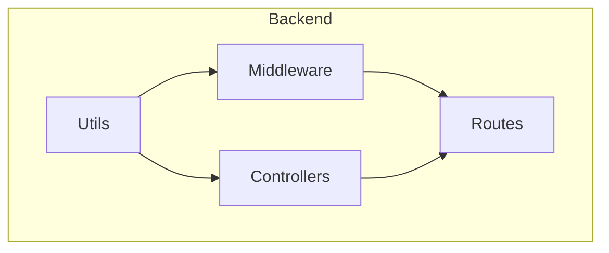
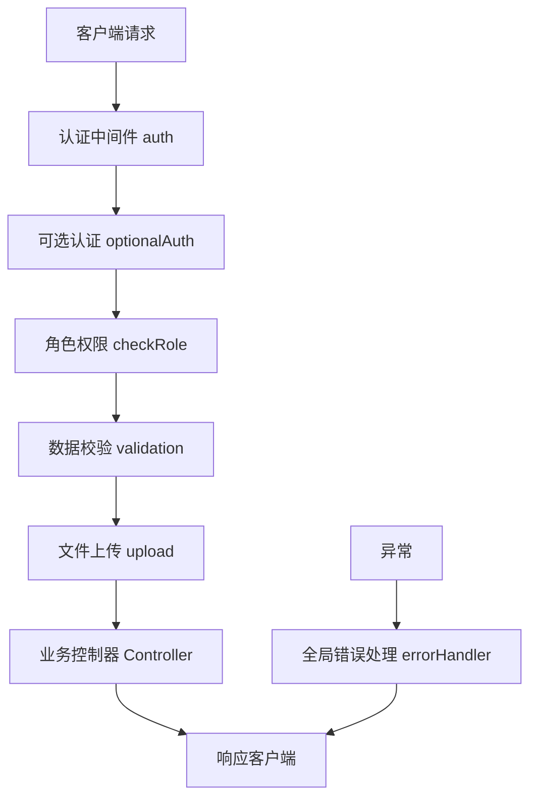
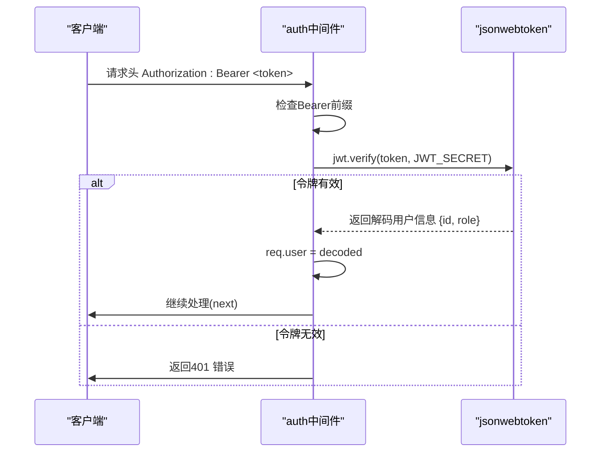
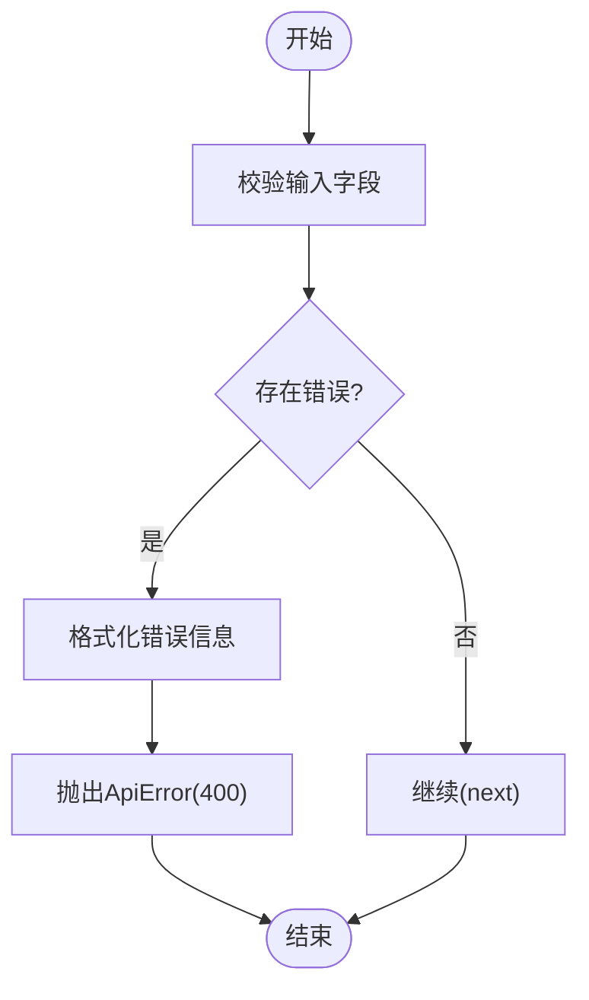
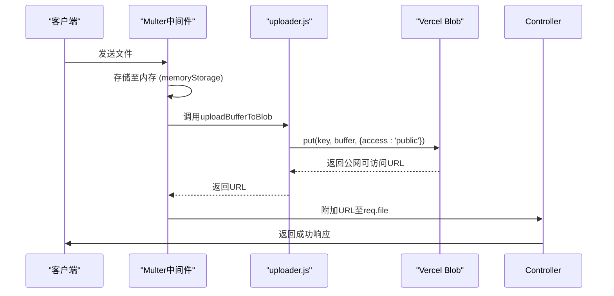
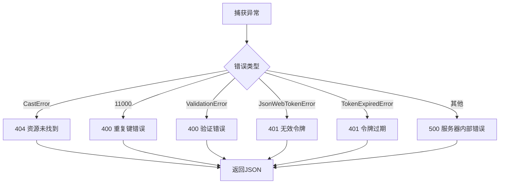
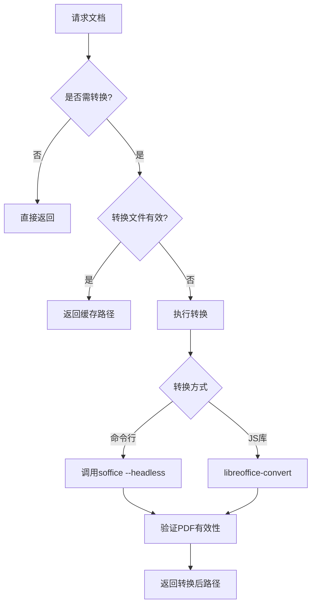

# 中间件与工具函数

<cite>
**本文档引用文件**  
- [auth.js](file://backend/middleware/auth.js#L1-L66)
- [validation.js](file://backend/middleware/validation.js#L1-L298)
- [upload.js](file://backend/middleware/upload.js#L1-L29)
- [error.js](file://backend/utils/error.js#L1-L57)
- [documentConverter.js](file://backend/utils/documentConverter.js#L1-L291)
- [fileUpload.js](file://backend/utils/fileUpload.js#L1-L138)
- [uploader.js](file://backend/utils/uploader.js#L1-L14)
</cite>

## 目录
1. [简介](#简介)
2. [项目结构](#项目结构)
3. [核心组件](#核心组件)
4. [架构概览](#架构概览)
5. [详细组件分析](#详细组件分析)
6. [依赖分析](#依赖分析)
7. [性能考量](#性能考量)
8. [故障排查指南](#故障排查指南)
9. [结论](#结论)

## 简介
本文档系统化梳理 my_website 后端中间件管道与核心工具模块，涵盖认证、验证、文件上传、错误处理及文档转换等关键功能。重点分析 JWT 无状态认证机制、Joi 风格请求校验、Vercel Blob 集成的文件上传流程、全局错误捕获策略以及多格式文档预览技术实现。通过代码级分析与流程图解，为开发者提供清晰的技术实现路径与调试方案。

## 项目结构
项目采用典型的分层架构，后端代码集中于 `backend` 目录，遵循 MVC 模式组织。核心中间件与工具函数分别位于 `middleware` 和 `utils` 目录，职责清晰，便于维护。



**图示来源**  
- [backend/middleware](file://backend/middleware)
- [backend/utils](file://backend/utils)

**本节来源**  
- [project_structure](file://#L1-L100)

## 核心组件
本系统核心中间件包括 `auth.js`（认证）、`validation.js`（请求校验）、`upload.js`（上传错误处理）；核心工具模块包括 `error.js`（错误处理）、`documentConverter.js`（文档转换）、`fileUpload.js` 与 `uploader.js`（文件上传协同）。

**本节来源**  
- [auth.js](file://backend/middleware/auth.js#L1-L66)
- [validation.js](file://backend/middleware/validation.js#L1-L298)
- [error.js](file://backend/utils/error.js#L1-L57)

## 架构概览
系统采用 Express.js 框架构建 RESTful API，中间件管道按顺序处理请求。认证与权限控制前置，数据校验紧随其后，文件上传与业务逻辑位于核心，错误处理位于管道末端。



**图示来源**  
- [auth.js](file://backend/middleware/auth.js#L1-L66)
- [validation.js](file://backend/middleware/validation.js#L1-L298)
- [error.js](file://backend/utils/error.js#L1-L57)

## 详细组件分析

### 认证中间件分析
`auth.js` 实现基于 JWT 的无状态认证，包含完整令牌签发、验证、刷新与角色权限校验逻辑。

#### JWT 认证流程


**图示来源**  
- [auth.js](file://backend/middleware/auth.js#L15-L35)

**本节来源**  
- [auth.js](file://backend/middleware/auth.js#L1-L66)

#### 可选认证与角色校验
提供 `optionalAuth` 中间件，允许在非强制登录场景下附加用户信息。`checkRole` 支持动态角色权限校验。

```javascript
// 示例：管理员专用路由
router.delete('/users/:id', auth, checkRole('admin'), userController.deleteUser)
```

**本节来源**  
- [auth.js](file://backend/middleware/auth.js#L39-L65)
- [authRoutes.js](file://backend/routes/authRoutes.js#L1-L25)

### 请求校验中间件分析
`validation.js` 使用自定义正则与逻辑实现请求数据格式校验，统一返回标准化错误响应。

#### 校验逻辑流程


**图示来源**  
- [validation.js](file://backend/middleware/validation.js#L1-L298)

**本节来源**  
- [validation.js](file://backend/middleware/validation.js#L1-L298)

#### 典型校验规则
- **邮箱**: `/^[^\s@]+@[^\s@]+\.[^\s@]+$/`
- **密码**: 至少8位，包含字母与数字
- **分页参数**: 页码≥1，每页数量1-100
- **ObjectId**: 24位十六进制字符串

### 文件上传处理分析
文件上传流程由 `fileUpload.js`、`uploader.js` 与 `upload.js` 协同完成，集成 Vercel Blob 实现云端存储。

#### 上传流程图解


**图示来源**  
- [fileUpload.js](file://backend/utils/fileUpload.js#L1-L138)
- [uploader.js](file://backend/utils/uploader.js#L1-L14)

**本节来源**  
- [fileUpload.js](file://backend/utils/fileUpload.js#L1-L138)
- [uploader.js](file://backend/utils/uploader.js#L1-L14)

#### 关键配置
- **存储方式**: 内存存储（`multer.memoryStorage()`），适配 Vercel Serverless 环境
- **文件类型过滤**: 基于扩展名白名单
- **大小限制**: 图片10MB，文档50MB，头像2MB
- **云端存储**: 通过 `@vercel/blob` 的 `put` 方法上传，返回 `result.url`

### 全局错误处理分析
`error.js` 提供统一的错误处理中间件，捕获异步异常并返回标准化 JSON 响应。

#### 错误处理流程


**图示来源**  
- [error.js](file://backend/utils/error.js#L1-L57)

**本节来源**  
- [error.js](file://backend/utils/error.js#L1-L57)

#### 异步错误捕获
使用 `catchAsync` 高阶函数包装异步控制器，将 Promise 错误自动传递给 `next`，避免重复的 try-catch。

```javascript
// 使用示例
const createBlog = catchAsync(async (req, res, next) => {
  // 业务逻辑
})
```

### 文档转换模块分析
`documentConverter.js` 实现多格式文档预览，支持 DOCX、PPTX 等转 PDF/HTML。

#### 转换逻辑流程


**图示来源**  
- [documentConverter.js](file://backend/utils/documentConverter.js#L1-L291)

**本节来源**  
- [documentConverter.js](file://backend/utils/documentConverter.js#L1-L291)

#### 技术实现
- **主方案**: 调用系统 LibreOffice 命令行 (`soffice`)，稳定性高
- **备选方案**: 使用 `libreoffice-convert` JS 库
- **智能缓存**: 转换结果存于 `converted/` 目录，检查文件修改时间与大小避免重复转换
- **文件验证**: 检查 PDF 头部 (`%PDF-`) 与最小文件大小，确保转换成功

## 依赖分析
系统依赖关系清晰，低层工具被高层中间件复用。

```mermaid
graph TD
error.js --> auth.js
error.js --> validation.js
error.js --> upload.js
fileUpload.js --> upload.js
uploader.js --> fileUpload.js
documentConverter.js -.-> "LibreOffice"
documentConverter.js -.-> "mammoth"
```

**图示来源**  
- [error.js](file://backend/utils/error.js#L1-L57)
- [fileUpload.js](file://backend/utils/fileUpload.js#L1-L138)
- [documentConverter.js](file://backend/utils/documentConverter.js#L1-L291)

**本节来源**  
- [package.json](file://package.json)
- [package-lock.json](file://package-lock.json)

## 性能考量
- **认证**: JWT 无状态，验证高效，但需注意密钥安全。
- **文件上传**: 内存存储避免 I/O，但大文件可能消耗内存，建议客户端分片。
- **文档转换**: 命令行调用资源消耗大，应异步处理或使用专用服务。
- **缓存**: `documentConverter` 的智能缓存显著提升重复访问性能。

## 故障排查指南

### 令牌过期处理
- **现象**: 客户端收到 "令牌已过期" 错误。
- **方案**: 前端应捕获 401 错误，引导用户重新登录或调用刷新令牌接口（若实现）。

### 大文件上传失败
- **现象**: 返回 "文件大小超出限制"。
- **方案**: 检查 `fileUpload.js` 中 `maxSize` 配置，确认客户端上传文件大小未超限。Vercel Blob 本身支持大文件，但中间件有限制。

### 恶意请求过滤
- **现象**: 频繁无效请求或尝试上传非法文件。
- **方案**: 
  1. `validation.js` 可扩展 IP 限流逻辑。
  2. `fileFilter` 严格校验文件扩展名，防止恶意文件上传。
  3. 部署 WAF（Web 应用防火墙）进行更高级防护。

### 文档转换失败
- **现象**: 转换后文件损坏或为空。
- **方案**: 
  1. 检查服务器是否安装 LibreOffice。
  2. 查看日志中 `soffice` 命令执行输出。
  3. 确认 `converted/` 目录有写入权限（非 Vercel 环境）。

**本节来源**  
- [auth.js](file://backend/middleware/auth.js#L1-L66)
- [fileUpload.js](file://backend/utils/fileUpload.js#L1-L138)
- [documentConverter.js](file://backend/utils/documentConverter.js#L1-L291)

## 结论
my_website 的中间件与工具模块设计合理，职责分明。JWT 认证安全高效，请求校验全面，文件上传适配 Serverless 环境，全局错误处理完善，文档转换功能强大。建议未来可增加 JWT 刷新令牌机制，并将文档转换迁移至异步任务队列以提升响应性能。