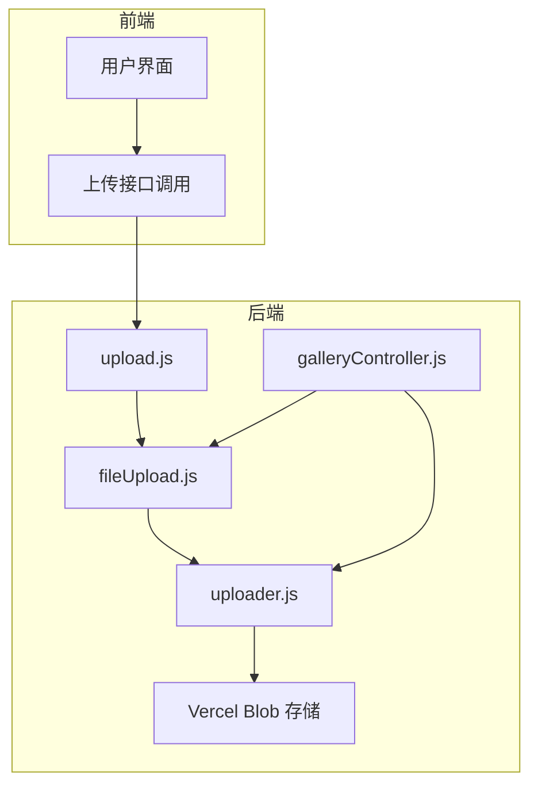
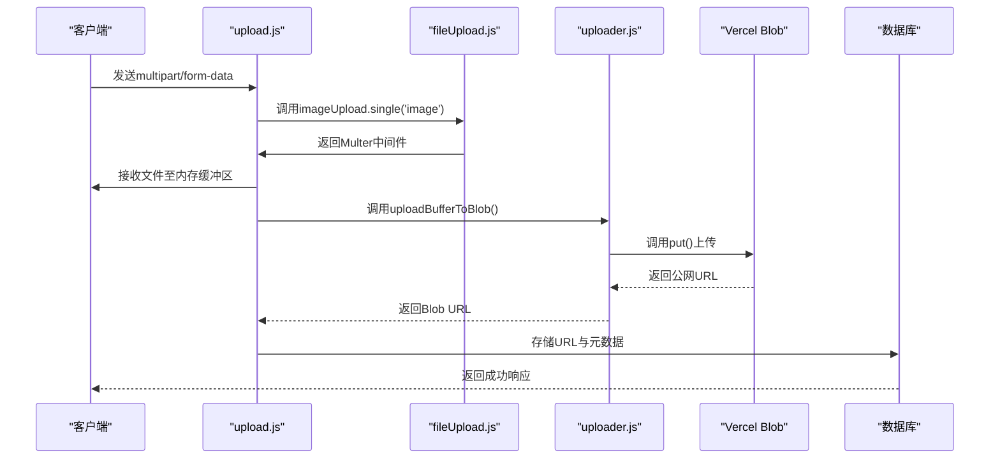
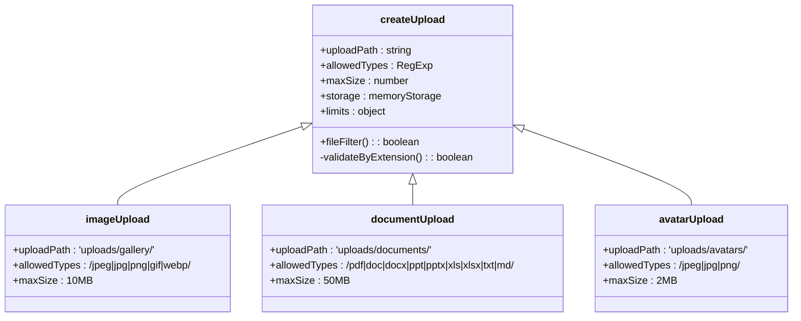
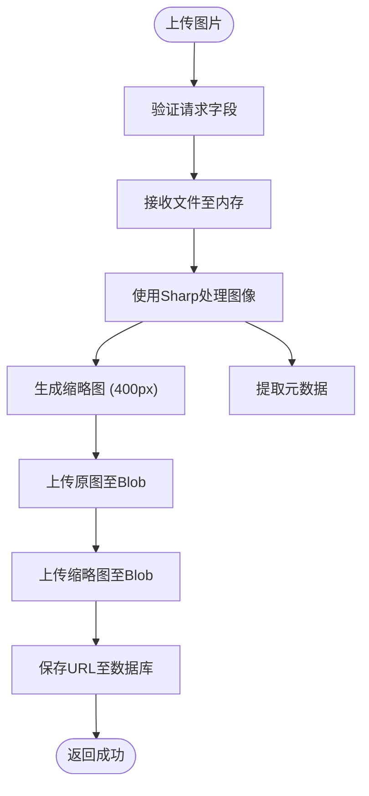

# 文件上传与处理工具

<cite>
**本文档引用文件**  
- [upload.js](file://backend/middleware/upload.js#L0-L27)
- [fileUpload.js](file://backend/utils/fileUpload.js#L0-L138)
- [uploader.js](file://backend/utils/uploader.js#L0-L14)
- [galleryController.js](file://backend/controllers/galleryController.js#L0-L217)
</cite>

## 目录
1. [项目结构](#项目结构)  
2. [核心组件](#核心组件)  
3. [文件上传链路架构](#文件上传链路架构)  
4. [详细组件分析](#详细组件分析)  
5. [依赖关系分析](#依赖关系分析)  
6. [性能与安全建议](#性能与安全建议)  
7. [典型使用场景](#典型使用场景)  
8. [故障排查指南](#故障排查指南)

## 项目结构

项目采用前后端分离架构，后端位于 `backend/` 目录，前端位于 `frontend/` 目录。文件上传相关逻辑集中在后端的 `middleware` 和 `utils` 模块中。



**图示来源**  
- [upload.js](file://backend/middleware/upload.js#L0-L27)
- [fileUpload.js](file://backend/utils/fileUpload.js#L0-L138)
- [uploader.js](file://backend/utils/uploader.js#L0-L14)
- [galleryController.js](file://backend/controllers/galleryController.js#L0-L217)

**本节来源**  
- [backend/middleware/upload.js](file://backend/middleware/upload.js#L0-L27)
- [backend/utils/fileUpload.js](file://backend/utils/fileUpload.js#L0-L138)

## 核心组件

文件上传系统由四个核心模块构成：
- **upload.js**：Multer中间件错误处理
- **fileUpload.js**：Multer配置与文件类型管理
- **uploader.js**：Vercel Blob云端写入
- **galleryController.js**：图片上传业务逻辑

这些模块协同工作，实现从客户端上传到云端存储的完整链路。

**本节来源**  
- [backend/middleware/upload.js](file://backend/middleware/upload.js#L0-L27)
- [backend/utils/fileUpload.js](file://backend/utils/fileUpload.js#L0-L138)
- [backend/utils/uploader.js](file://backend/utils/uploader.js#L0-L14)
- [backend/controllers/galleryController.js](file://backend/controllers/galleryController.js#L0-L217)

## 文件上传链路架构

系统采用内存存储 + 云端Blob的混合架构，避免Vercel无状态环境下的文件持久化问题。



**图示来源**  
- [upload.js](file://backend/middleware/upload.js#L0-L27)
- [fileUpload.js](file://backend/utils/fileUpload.js#L32-L80)
- [uploader.js](file://backend/utils/uploader.js#L0-L14)
- [galleryController.js](file://backend/controllers/galleryController.js#L97-L128)

## 详细组件分析

### upload.js：Multer错误处理中间件

该中间件统一捕获Multer上传过程中的常见错误，并转换为友好的API错误响应。

```javascript
const handleUploadError = (error, req, res, next) => {
  if (error instanceof multer.MulterError) {
    if (error.code === 'LIMIT_FILE_SIZE') {
      return next(new ApiError(400, '文件大小超出限制'));
    }
    if (error.code === 'LIMIT_FILE_COUNT') {
      return next(new ApiError(400, '文件数量超出限制'));
    }
    if (error.code === 'LIMIT_UNEXPECTED_FILE') {
      return next(new ApiError(400, '意外的文件字段'));
    }
  }
  next(error);
};
```

**本节来源**  
- [backend/middleware/upload.js](file://backend/middleware/upload.js#L0-L27)

### fileUpload.js：Multer配置工厂

提供通用的文件上传配置生成器，支持多种文件类型。



**图示来源**  
- [backend/utils/fileUpload.js](file://backend/utils/fileUpload.js#L32-L80)

**本节来源**  
- [backend/utils/fileUpload.js](file://backend/utils/fileUpload.js#L0-L138)

### uploader.js：Vercel Blob上传器

封装`@vercel/blob` SDK，提供缓冲区直接上传功能。

```javascript
async function uploadBufferToBlob(key, buffer, contentType, allowOverwrite = false) {
  const result = await put(key, buffer, {
    access: 'public',
    contentType,
    addRandomSuffix: !allowOverwrite
  })
  return result.url
}
```

**本节来源**  
- [backend/utils/uploader.js](file://backend/utils/uploader.js#L0-L14)

### galleryController.js：图片上传业务逻辑

实现图片上传、缩略图生成、EXIF清理和云端存储。



**图示来源**  
- [backend/controllers/galleryController.js](file://backend/controllers/galleryController.js#L97-L128)

**本节来源**  
- [backend/controllers/galleryController.js](file://backend/controllers/galleryController.js#L0-L217)

## 依赖关系分析

```mermaid
graph LR
A[upload.js] --> B[fileUpload.js]
B --> C[uploader.js]
D[galleryController.js] --> B
D --> C
C --> E[@vercel/blob]
B --> F[multer]
D --> G[sharp]
```

**图示来源**  
- [backend/middleware/upload.js](file://backend/middleware/upload.js#L0-L27)
- [backend/utils/fileUpload.js](file://backend/utils/fileUpload.js#L0-L138)
- [backend/utils/uploader.js](file://backend/utils/uploader.js#L0-L14)
- [backend/controllers/galleryController.js](file://backend/controllers/galleryController.js#L0-L217)

**本节来源**  
- [backend/package-lock.json](file://backend/package-lock.json#L1472-L1513)
- [backend/package-lock.json](file://backend/package-lock.json#L2497-L2532)

## 性能与安全建议

### 安全过滤建议
- **文件类型验证**：基于扩展名而非MIME类型，防止伪造
- **大小限制**：图片10MB、文档50MB、头像2MB
- **恶意文件检测**：可集成病毒扫描服务
- **路径遍历防护**：使用`path.extname()`提取扩展名，避免路径注入

### 常见问题解决方案
- **上传超时**：优化网络或分块上传（当前未实现）
- **存储配额不足**：监控Blob使用量，设置告警
- **EXIF信息泄露**：Sharp库自动清理元数据
- **并发上传冲突**：通过`addRandomSuffix`避免覆盖

## 典型使用场景

### 博客封面上传
```javascript
// 前端调用
const formData = new FormData();
formData.append('image', file);
formData.append('title', '博客标题');
await api.post('/api/gallery/upload', formData);
```

### 图库图片提交
```javascript
// 后端调用流程
const upload = imageUpload.single('image');
upload(req, res, async (err) => {
  if (err) return handleError(err);
  
  const buffer = req.file.buffer;
  const thumbnail = await sharp(buffer).resize(400).toBuffer();
  
  const fullUrl = await uploadBufferToBlob(
    `gallery/full/${Date.now()}-${req.file.originalname}`,
    buffer,
    req.file.mimetype
  );
});
```

**本节来源**  
- [backend/controllers/galleryController.js](file://backend/controllers/galleryController.js#L97-L128)
- [backend/utils/uploader.js](file://backend/utils/uploader.js#L0-L14)

## 故障排查指南

### 常见错误码
- **400 - 文件大小超出限制**：客户端文件超过配置的`maxSize`
- **400 - 文件类型不支持**：扩展名不在允许列表中
- **500 - 图片处理失败**：Sharp处理异常或Blob配置错误
- **Vercel环境警告**：生产环境禁用文件系统操作

### 调试建议
- 检查`BLOB_READ_WRITE_TOKEN`环境变量配置
- 验证`@vercel/blob` SDK版本兼容性
- 查看控制台日志中的文件类型验证失败详情
- 确保Sharp库正确安装（含平台特定二进制）

**本节来源**  
- [backend/middleware/upload.js](file://backend/middleware/upload.js#L0-L27)
- [backend/utils/fileUpload.js](file://backend/utils/fileUpload.js#L0-L138)
- [backend/controllers/galleryController.js](file://backend/controllers/galleryController.js#L0-L217)