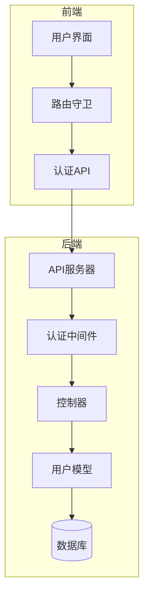
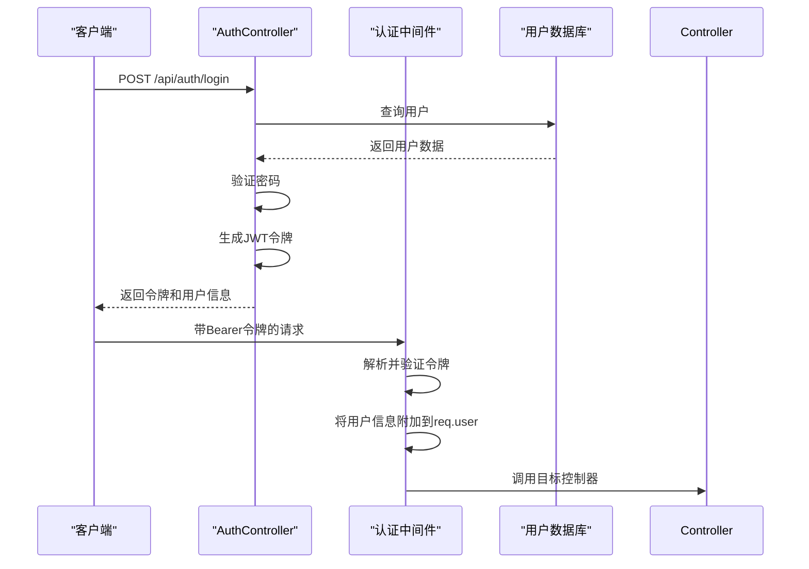
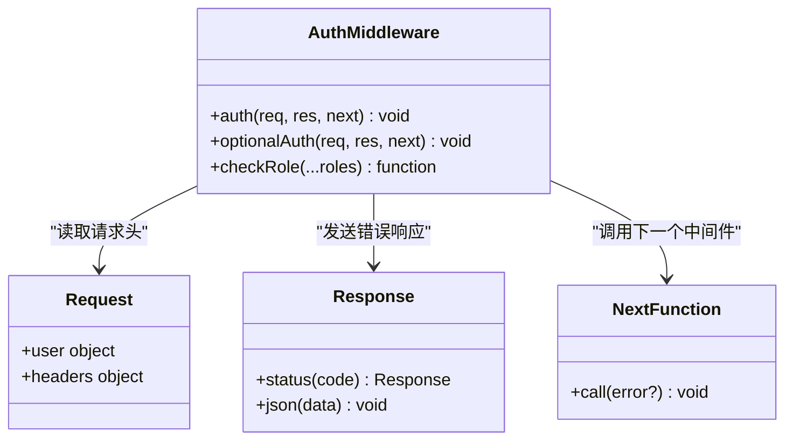
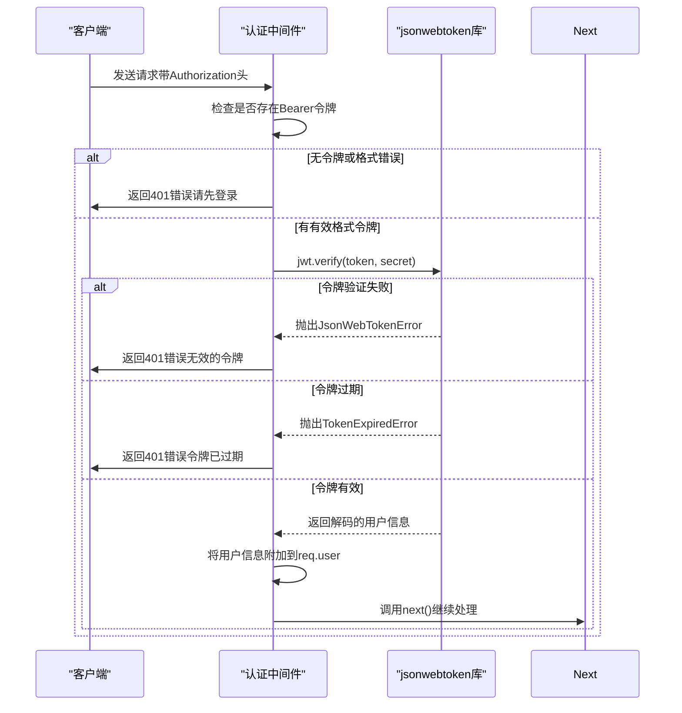
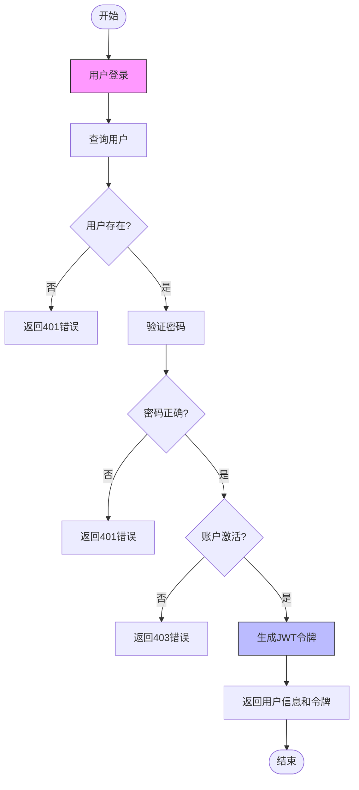
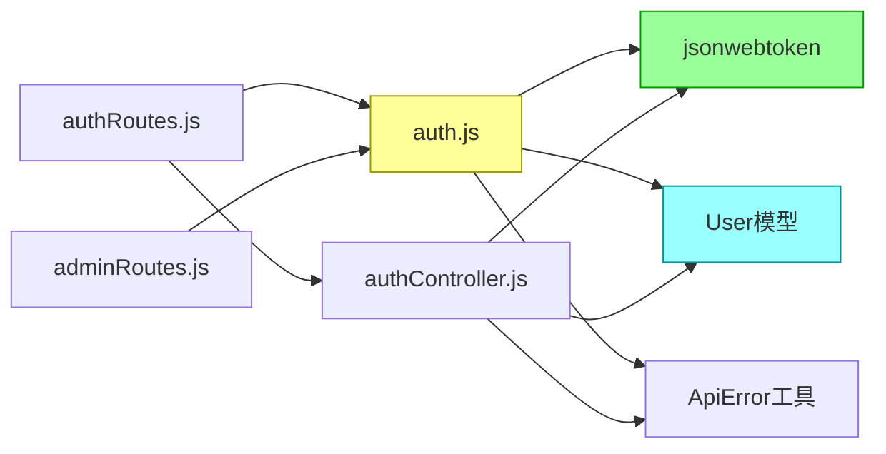

# 认证与安全中间件

<cite>
**本文档引用文件**  
- [auth.js](file://backend\middleware\auth.js)
- [authController.js](file://backend\controllers\authController.js)
- [authRoutes.js](file://backend\routes\authRoutes.js)
- [adminRoutes.js](file://backend\routes\adminRoutes.js)
- [User.js](file://backend\models\User.js)
- [auth.ts](file://frontend\src\api\auth.ts)
- [index.js](file://frontend\src\router\index.js)
</cite>

## 目录
1. [简介](#简介)
2. [项目结构](#项目结构)
3. [核心组件](#核心组件)
4. [架构概览](#架构概览)
5. [详细组件分析](#详细组件分析)
6. [依赖分析](#依赖分析)
7. [性能考虑](#性能考虑)
8. [故障排除指南](#故障排除指南)
9. [结论](#结论)

## 简介
本文档深入解析基于JWT的认证机制实现，涵盖`express-jwt`和`jsonwebtoken`库在用户身份验证中的应用。重点阐述token的签发、验证与刷新流程，权限控制策略，以及常见安全风险的防范措施。

## 项目结构
本项目采用前后端分离架构，后端使用Express框架实现RESTful API，前端使用Vue.js构建用户界面。认证逻辑主要集中在后端`middleware`和`controllers`目录中。



**图示来源**  
- [auth.js](file://backend\middleware\auth.js#L1-L66)
- [authController.js](file://backend\controllers\authController.js#L1-L141)

**本节来源**  
- [auth.js](file://backend\middleware\auth.js#L1-L66)
- [authController.js](file://backend\controllers\authController.js#L1-L141)

## 核心组件
认证系统的核心组件包括JWT令牌生成、验证中间件、角色权限检查和用户模型。这些组件协同工作，确保系统的安全性和可靠性。

**本节来源**  
- [auth.js](file://backend\middleware\auth.js#L1-L66)
- [User.js](file://backend\models\User.js#L1-L89)

## 架构概览
系统采用标准的JWT认证流程：用户登录后服务器生成包含用户信息的JWT令牌，客户端在后续请求中通过`Authorization: Bearer <token>`头携带令牌，服务器中间件验证令牌有效性并附加用户信息到请求对象。



**图示来源**  
- [authController.js](file://backend\controllers\authController.js#L1-L141)
- [auth.js](file://backend\middleware\auth.js#L1-L66)

## 详细组件分析

### JWT认证中间件分析
`auth.js`文件实现了三个核心认证功能：强制认证、可选认证和角色检查。

#### 认证中间件实现


**图示来源**  
- [auth.js](file://backend\middleware\auth.js#L1-L66)

#### 认证流程序列图


**图示来源**  
- [auth.js](file://backend\middleware\auth.js#L1-L66)

**本节来源**  
- [auth.js](file://backend\middleware\auth.js#L1-L66)

### 用户认证控制器分析
`authController.js`负责处理用户注册、登录和获取当前用户信息的业务逻辑。

#### 控制器方法流程图


**图示来源**  
- [authController.js](file://backend\controllers\authController.js#L1-L141)

#### 角色权限检查机制
系统通过`checkRole`中间件实现基于角色的访问控制（RBAC），支持管理员和普通用户两种角色。

```mermaid
flowchart TD
A[请求进入] --> B{req.user存在?}
B --> |否| C[返回403错误]
B --> |是| D{角色匹配?}
D --> |否| E[返回403错误]
D --> |是| F[调用next()继续]
classDef error fill:#fdd,stroke:#900;
class C,E error
```

**图示来源**  
- [auth.js](file://backend\middleware\auth.js#L50-L65)

**本节来源**  
- [authController.js](file://backend\controllers\authController.js#L1-L141)
- [auth.js](file://backend\middleware\auth.js#L1-L66)

## 依赖分析
认证系统依赖于多个关键库和模块，形成清晰的依赖关系。



**图示来源**  
- [auth.js](file://backend\middleware\auth.js#L1-L66)
- [authController.js](file://backend\controllers\authController.js#L1-L141)
- [authRoutes.js](file://backend\routes\authRoutes.js#L1-L25)
- [adminRoutes.js](file://backend\routes\adminRoutes.js#L1-L799)

**本节来源**  
- [auth.js](file://backend\middleware\auth.js#L1-L66)
- [authController.js](file://backend\controllers\authController.js#L1-L141)

## 性能考虑
- JWT验证是同步操作，不会阻塞事件循环
- 用户信息直接从令牌解码获取，避免了每次请求都查询数据库
- 密码使用bcrypt进行哈希处理，平衡了安全性与性能
- 令牌有效期设置为7天，减少频繁登录对服务器的压力

## 故障排除指南
### 常见认证问题及解决方案

**本节来源**  
- [auth.js](file://backend\middleware\auth.js#L1-L66)
- [authController.js](file://backend\controllers\authController.js#L1-L141)

#### 令牌格式错误
- **现象**：返回"请先登录"错误
- **原因**：请求头缺少`Authorization`字段或格式不是`Bearer <token>`
- **解决方案**：确保客户端正确设置请求头

#### 签名校验失败
- **现象**：返回"无效的令牌"错误
- **原因**：令牌被篡改或服务器JWT密钥已更改
- **解决方案**：检查`JWT_SECRET`环境变量一致性，确保令牌未被修改

#### 权限不足
- **现象**：返回"没有权限执行此操作"错误
- **原因**：用户角色不符合路由要求
- **解决方案**：检查`checkRole`中间件的角色参数，确认用户角色

#### 令牌过期
- **现象**：返回"令牌已过期"错误
- **解决方案**：用户需要重新登录获取新令牌，或实现刷新令牌机制

## 结论
本认证系统基于JWT标准实现了安全可靠的用户身份验证机制。通过`auth`中间件进行令牌验证，`checkRole`中间件实现角色权限控制，结合bcrypt密码哈希和环境变量密钥管理，形成了完整的安全体系。建议定期轮换JWT密钥，实施更完善的令牌刷新机制，并监控异常登录行为以增强系统安全性。