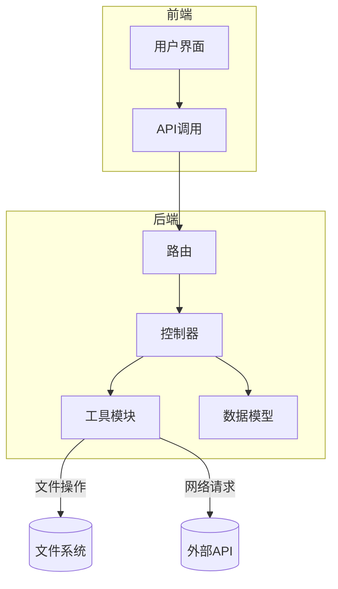
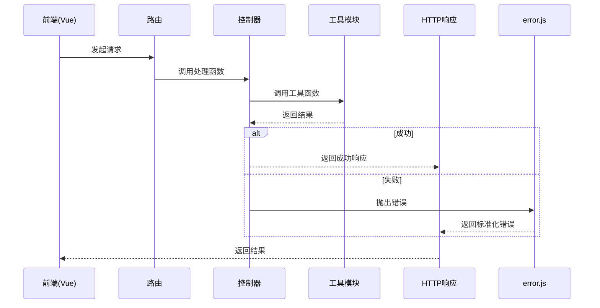
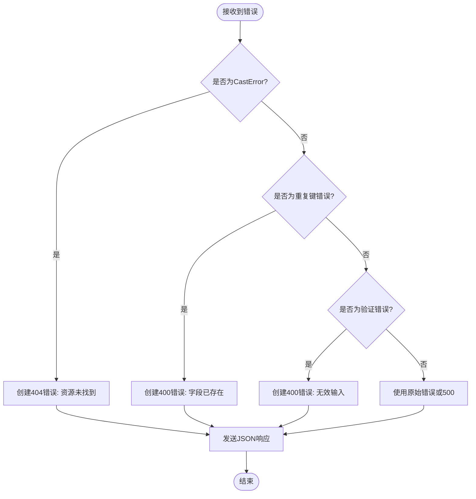
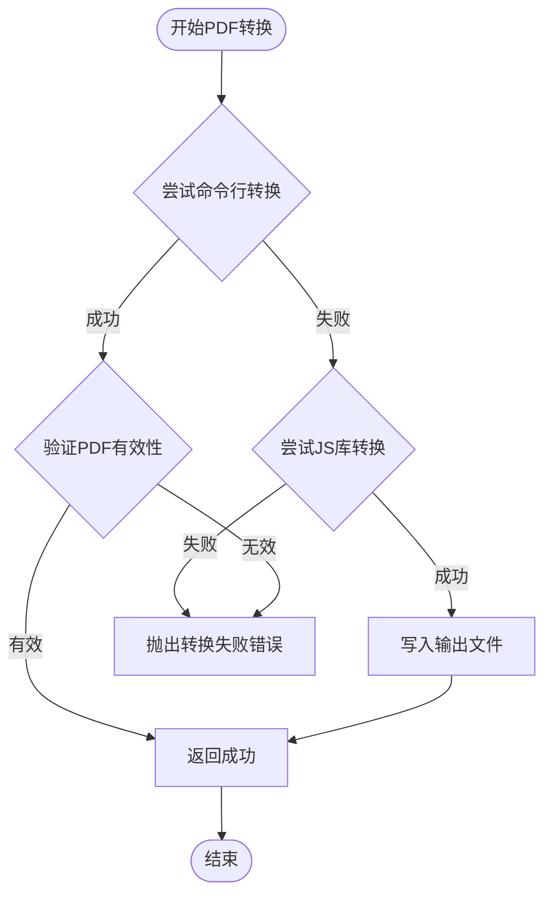
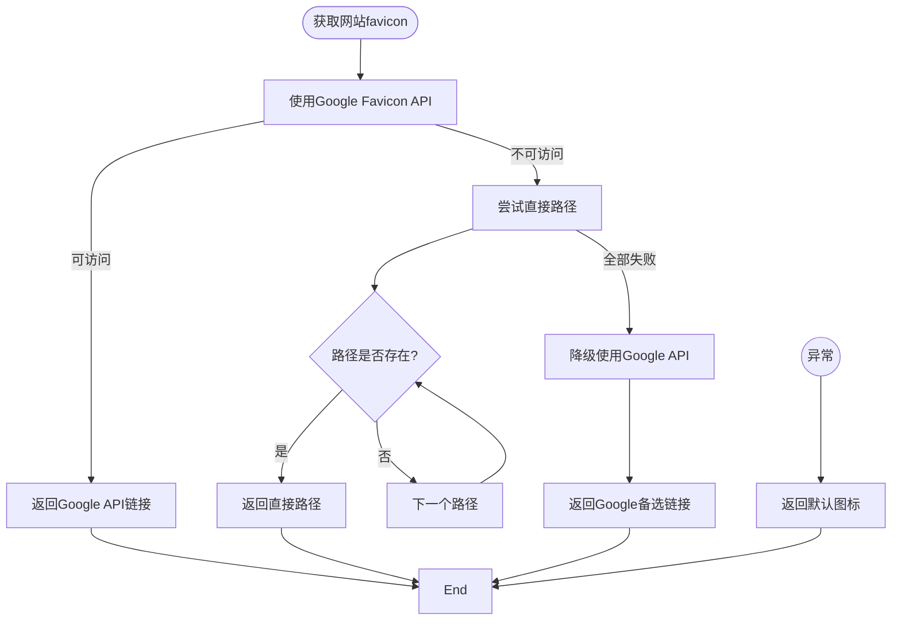
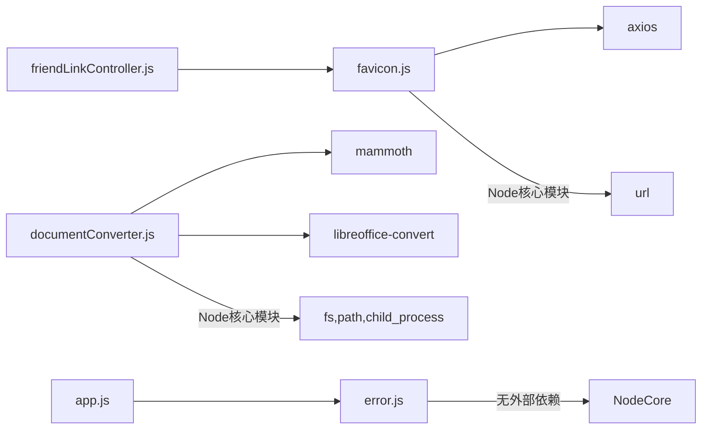

# 错误处理与文档转换工具

<cite>
**本文档引用的文件**
- [error.js](file://backend/utils/error.js#L0-L57)
- [documentConverter.js](file://backend/utils/documentConverter.js#L0-L291)
- [favicon.js](file://backend/utils/favicon.js#L0-L150)
- [upload.js](file://backend/middleware/upload.js#L0-L27)
- [app.js](file://backend/app.js#L77-L165)
- [friendLinkController.js](file://backend/controllers/friendLinkController.js#L231-L292)
- [AdminFriendLinkManager.vue](file://frontend/src/views/Admin/components/AdminFriendLinkManager.vue#L416-L456)
</cite>

## 目录
1. [简介](#简介)
2. [项目结构](#项目结构)
3. [核心组件](#核心组件)
4. [架构概览](#架构概览)
5. [详细组件分析](#详细组件分析)
6. [依赖分析](#依赖分析)
7. [性能考量](#性能考量)
8. [故障排除指南](#故障排除指南)
9. [结论](#结论)

## 简介
本文档系统化地描述了 `error.js`、`documentConverter.js` 和 `favicon.js` 三个核心工具模块的工作机制。重点解析全局错误处理中间件如何捕获异常并返回标准化响应，文档转换器如何支持多格式预览，以及 favicon 动态获取策略。文档包含调用链路示例与容错建议，适用于开发者理解与维护。

## 项目结构
项目采用前后端分离架构，后端位于 `backend/` 目录，前端位于 `frontend/` 目录。核心工具模块集中于 `backend/utils/` 目录下，包括错误处理、文档转换和 favicon 获取功能。这些工具被控制器和中间件广泛引用，形成稳定的服务支撑层。



**图示来源**
- [project_structure](file://#L1-L100)

## 核心组件
本文档分析三个核心工具模块：
- **error.js**：全局错误处理中间件，捕获异常并返回统一格式的HTTP响应。
- **documentConverter.js**：文档格式转换工具，支持将DOCX、PPTX等转为PDF或HTML用于前端预览。
- **favicon.js**：favicon获取服务，通过多种策略为外部网站获取图标。

**本节来源**
- [error.js](file://backend/utils/error.js#L0-L57)
- [documentConverter.js](file://backend/utils/documentConverter.js#L0-L291)
- [favicon.js](file://backend/utils/favicon.js#L0-L150)

## 架构概览
系统通过中间件链处理请求，`error.js` 位于链的末端，负责捕获所有未处理的错误。`documentConverter.js` 被文档控制器调用，实现文件转换。`favicon.js` 被友链控制器调用，为管理界面提供图标预览功能。



**图示来源**
- [app.js](file://backend/app.js#L113-L165)
- [error.js](file://backend/utils/error.js#L0-L57)

## 详细组件分析

### error.js 全局错误处理机制

`error.js` 模块实现了完整的错误处理方案，包含自定义错误类、中间件和异步错误捕获器。

#### 自定义API错误类
`ApiError` 类继承自 `Error`，用于创建结构化的API错误对象。

```javascript
class ApiError extends Error {
  constructor(statusCode, message) {
    super(message)
    this.statusCode = statusCode
    this.status = `${statusCode}`.startsWith('4') ? 'fail' : 'error'
    this.isOperational = true
    Error.captureStackTrace(this, this.constructor)
  }
}
```

**本节来源**
- [error.js](file://backend/utils/error.js#L2-L13)

#### 错误处理中间件
`errorHandler` 中间件捕获所有传递到它的错误，并根据错误类型返回相应的HTTP响应。



**图示来源**
- [error.js](file://backend/utils/error.js#L15-L50)

#### 异步错误捕获
`catchAsync` 函数包装异步控制器函数，自动捕获Promise拒绝并传递给错误处理中间件。

```javascript
const catchAsync = (fn) => {
  return (req, res, next) => {
    Promise.resolve(fn(req, res, next)).catch(next)
  }
}
```

**调用示例**
在控制器中抛出 `ApiError`，将被自动捕获：
```javascript
exports.getBlog = catchAsync(async (req, res, next) => {
  const blog = await Blog.findById(req.params.id)
  if (!blog) {
    throw new ApiError(404, '博客不存在') // 被errorHandler捕获
  }
  res.json({ success: true, data: blog })
})
```

**本节来源**
- [error.js](file://backend/utils/error.js#L52-L57)
- [friendLinkController.js](file://backend/controllers/friendLinkController.js#L231-L292)

### documentConverter.js 文档转换逻辑

`DocumentConverter` 类提供多种文档转换功能，支持智能缓存和多重转换策略。

#### DOCX转HTML
使用 `mammoth` 库将DOCX文件转换为HTML字符串，保留基本格式。

```javascript
async convertDocxToHtml(inputPath) {
  const result = await mammoth.convertToHtml({ path: inputPath })
  return result.value
}
```

#### PDF转换策略
采用双层策略确保转换成功率：
1. **优先使用命令行LibreOffice**：更稳定，支持更多格式。
2. **备选使用JS库**：当命令行失败时，使用 `libreoffice-convert` 库。



**图示来源**
- [documentConverter.js](file://backend/utils/documentConverter.js#L54-L89)

#### 智能转换
`smartConvert` 方法检查转换后文件的有效性，避免重复转换，提升性能。

```javascript
async smartConvert(inputPath, targetFormat = 'pdf') {
  const convertedPath = this.getConvertedFilePath(inputPath, targetFormat)
  
  if (this.isConvertedFileValid(inputPath, convertedPath)) {
    return convertedPath // 直接使用缓存
  }
  
  // 执行转换...
}
```

**本节来源**
- [documentConverter.js](file://backend/utils/documentConverter.js#L254-L291)

### favicon.js 图标获取策略

`favicon.js` 模块通过三级策略获取网站图标，确保高成功率。

#### 获取策略流程


**图示来源**
- [favicon.js](file://backend/utils/favicon.js#L86-L150)

#### 批量获取与前端集成
`getBatchFavicons` 支持批量处理。前端通过 `previewFavicon` API 调用此功能。

**前端调用示例**
```javascript
// AdminFriendLinkManager.vue
const fetchFavicon = async () => {
  const response = await friendLinkApi.previewFavicon(currentFriendLink.url)
  currentFriendLink.avatar = response.data.faviconUrl
}
```

**本节来源**
- [favicon.js](file://backend/utils/favicon.js#L0-L51)
- [AdminFriendLinkManager.vue](file://frontend/src/views/Admin/components/AdminFriendLinkManager.vue#L416-L456)

## 依赖分析
各工具模块依赖清晰，无循环依赖。



**图示来源**
- [package.json](file://backend/package.json)
- [documentConverter.js](file://backend/utils/documentConverter.js#L1-L10)

## 性能考量
- **错误处理**：轻量级，对性能影响极小。
- **文档转换**：计算密集型，建议异步处理或队列化。
- **favicon获取**：网络I/O密集型，已内置超时和重试机制。
- **智能缓存**：`smartConvert` 显著减少重复转换开销。

## 故障排除指南
针对常见问题提供解决方案：

| 问题 | 可能原因 | 解决方案 |
|------|--------|---------|
| 文档转换失败 | LibreOffice未安装 | 确保服务器安装LibreOffice |
| PDF文件损坏 | 转换过程被中断 | 检查磁盘空间和权限 |
| favicon获取失败 | 网络策略限制 | 检查服务器出站网络访问 |
| 编码不兼容 | 文件包含特殊字符 | 确保文件路径使用UTF-8编码 |
| 资源加载超时 | 目标网站响应慢 | 调整`checkUrlAccessibility`超时时间 |

**本节来源**
- [documentConverter.js](file://backend/utils/documentConverter.js#L54-L89)
- [favicon.js](file://backend/utils/favicon.js#L45-L91)

## 结论
`error.js`、`documentConverter.js` 和 `favicon.js` 构成了系统稳定运行的三大支柱。错误处理机制确保了API的健壮性，文档转换器扩展了文件预览能力，favicon服务提升了用户体验。三者设计合理，具备良好的可维护性和扩展性。