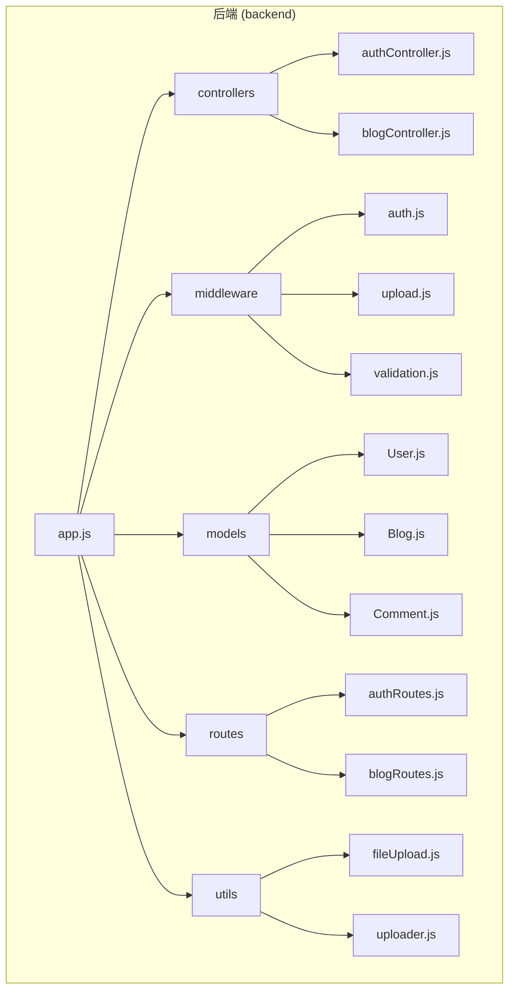
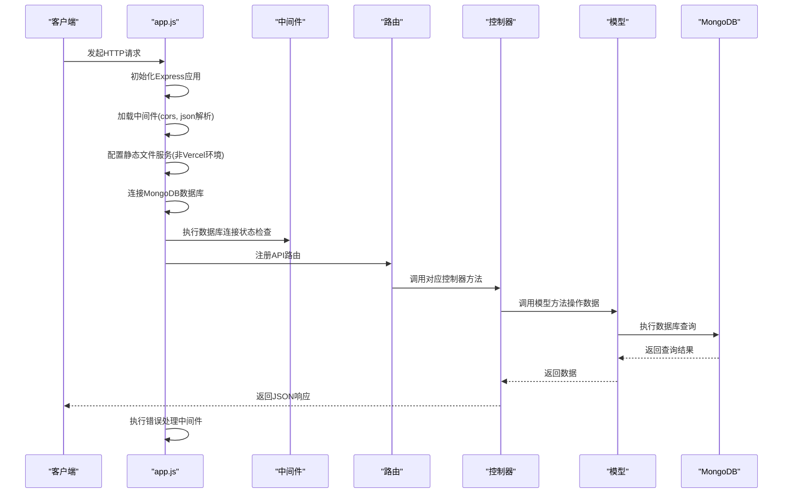
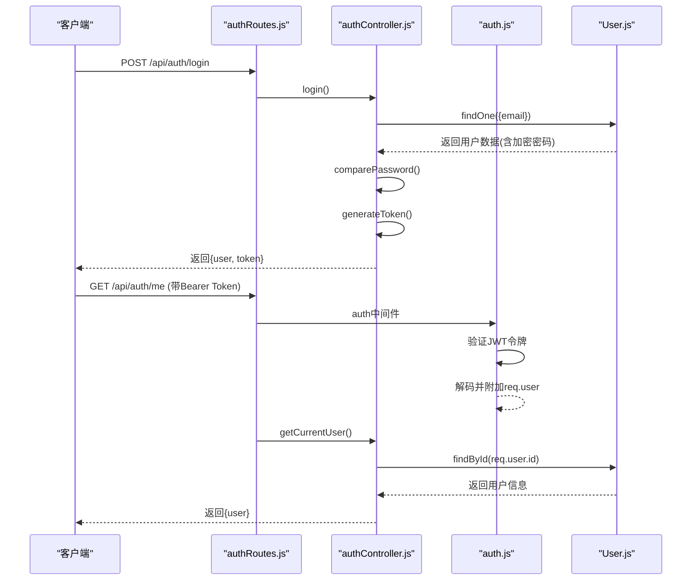
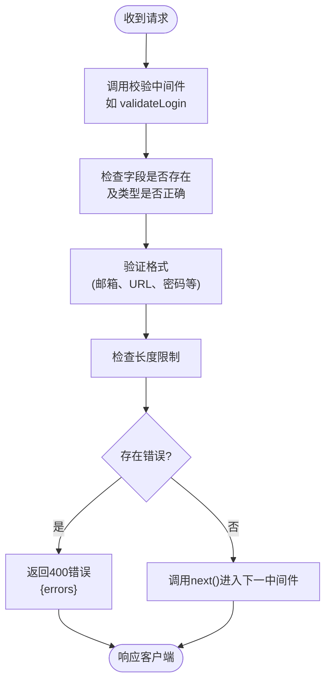
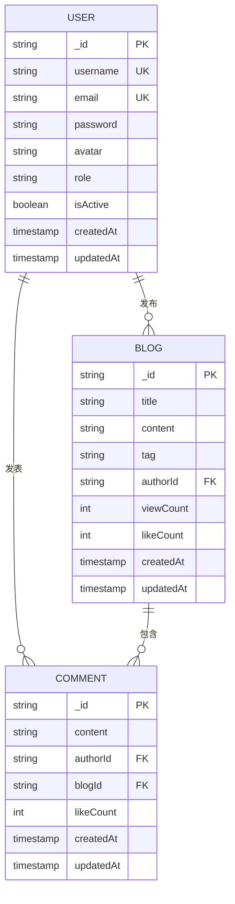
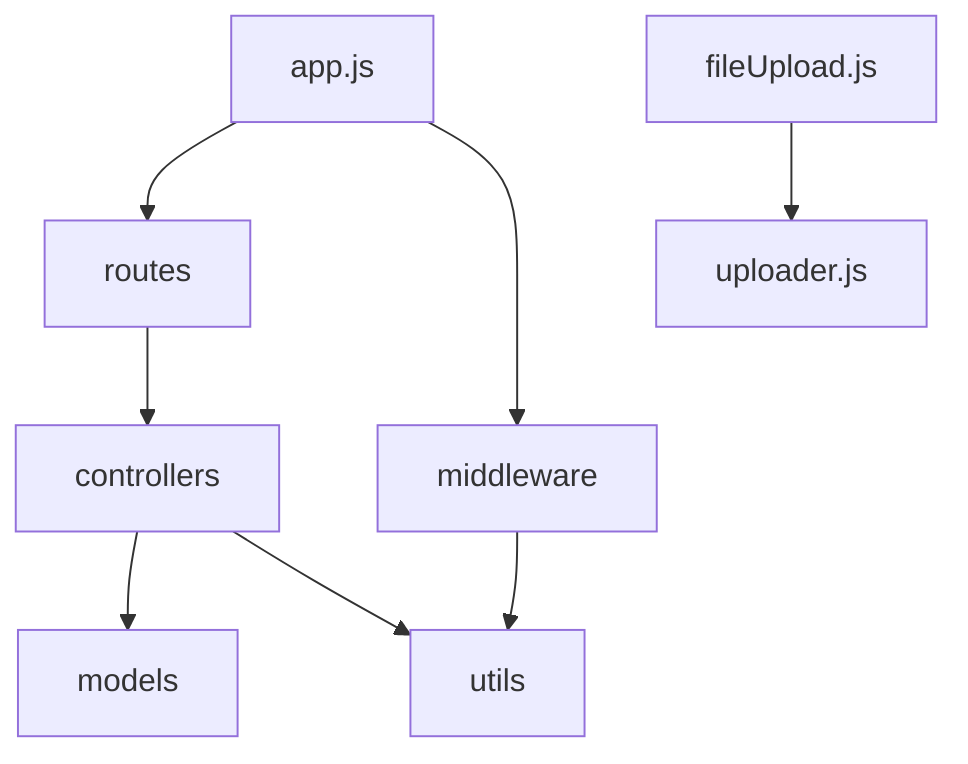

# 后端目录结构详解

<cite>
**本文档引用的文件**  
- [app.js](file://backend/app.js#L1-L237)
- [authRoutes.js](file://backend/routes/authRoutes.js#L1-L26)
- [authController.js](file://backend/controllers/authController.js#L1-L142)
- [auth.js](file://backend/middleware/auth.js#L1-L67)
- [validation.js](file://backend/middleware/validation.js#L1-L299)
- [fileUpload.js](file://backend/utils/fileUpload.js#L1-L139)
- [uploader.js](file://backend/utils/uploader.js#L1-L15)
- [User.js](file://backend/models/User.js)
- [Blog.js](file://backend/models/Blog.js)
- [Comment.js](file://backend/models/Comment.js)
</cite>

## 目录

1. [项目结构](#项目结构)
2. [核心组件](#核心组件)
3. [架构概览](#架构概览)
4. [详细组件分析](#详细组件分析)
5. [依赖分析](#依赖分析)
6. [性能考虑](#性能考虑)
7. [故障排除指南](#故障排除指南)
8. [结论](#结论)

## 项目结构

`my_website` 项目的后端采用标准的 **MVC（Model-View-Controller）分层架构**，并结合 Express 框架的中间件机制，实现了清晰的职责分离。整个 `backend` 目录结构如下：



**Diagram sources**
- [app.js](file://backend/app.js#L1-L237)
- [backend](file://backend)

**Section sources**
- [app.js](file://backend/app.js#L1-L237)

## 核心组件

后端系统由 **routes（路由）**、**controllers（控制器）**、**models（模型）** 和 **middleware（中间件）** 四大核心组件构成，共同协作处理客户端请求。

### 路由 (routes)
路由层是系统的入口，负责将 HTTP 请求映射到对应的控制器方法。例如，`authRoutes.js` 定义了用户认证相关的 API 端点。

### 控制器 (controllers)
控制器层包含业务逻辑，负责处理请求、调用模型进行数据操作，并返回响应。例如，`authController.js` 实现了用户注册、登录和获取用户信息的逻辑。

### 模型 (models)
模型层定义了数据结构和数据库操作，使用 Mongoose 与 MongoDB 交互。每个模型（如 `User.js`）都定义了一个 Schema，描述了数据的字段、类型和约束。

### 中间件 (middleware)
中间件是贯穿整个请求-响应周期的函数，用于执行通用任务，如身份验证、数据校验和错误处理。`auth.js` 和 `validation.js` 是典型的中间件。

**Section sources**
- [app.js](file://backend/app.js#L1-L237)
- [authRoutes.js](file://backend/routes/authRoutes.js#L1-L26)
- [authController.js](file://backend/controllers/authController.js#L1-L142)
- [User.js](file://backend/models/User.js)

## 架构概览

该后端应用的架构遵循典型的 Express MVC 模式，其初始化流程和请求处理管道如下：



**Diagram sources**
- [app.js](file://backend/app.js#L1-L237)

## 详细组件分析

### 认证流程分析

用户认证流程是系统安全的核心，涉及路由、中间件和控制器的协同工作。

#### 认证流程序列图


**Diagram sources**
- [authRoutes.js](file://backend/routes/authRoutes.js#L1-L26)
- [authController.js](file://backend/controllers/authController.js#L1-L142)
- [auth.js](file://backend/middleware/auth.js#L1-L67)
- [User.js](file://backend/models/User.js)

**Section sources**
- [authRoutes.js](file://backend/routes/authRoutes.js#L1-L26)
- [authController.js](file://backend/controllers/authController.js#L1-L142)
- [auth.js](file://backend/middleware/auth.js#L1-L67)

### 数据校验中间件分析

`validation.js` 提供了针对不同业务场景的请求数据校验功能，确保输入数据的合法性。

#### 数据校验流程图


**Diagram sources**
- [validation.js](file://backend/middleware/validation.js#L1-L299)

**Section sources**
- [validation.js](file://backend/middleware/validation.js#L1-L299)

### 文件上传机制分析

文件上传功能通过 `fileUpload.js` 和 `uploader.js` 协同实现，解决了在 Vercel 无服务器环境下的文件持久化问题。

#### 文件上传流程图
```mermaid
flowchart TD
Client([客户端]) --> App["Express应用"])
App --> Multer["multer.memoryStorage()"]
Multer --> Buffer["将文件存储在内存Buffer中"]
Buffer --> Uploader["调用uploader.js/uploadBufferToBlob"]
Uploader --> VercelBlob["上传Buffer到Vercel Blob"]
VercelBlob --> URL["返回公网可访问的URL"]
URL --> App
App --> Client["返回文件URL"]
```

**Diagram sources**
- [fileUpload.js](file://backend/utils/fileUpload.js#L1-L139)
- [uploader.js](file://backend/utils/uploader.js#L1-L15)

**Section sources**
- [fileUpload.js](file://backend/utils/fileUpload.js#L1-L139)
- [uploader.js](file://backend/utils/uploader.js#L1-L15)

### Mongoose模型设计

Mongoose 模型定义了应用的数据结构和关联关系。

#### 数据模型图


**Diagram sources**
- [User.js](file://backend/models/User.js)
- [Blog.js](file://backend/models/Blog.js)
- [Comment.js](file://backend/models/Comment.js)

## 依赖分析

系统依赖关系清晰，各层之间耦合度低。



**Diagram sources**
- [app.js](file://backend/app.js#L1-L237)
- [fileUpload.js](file://backend/utils/fileUpload.js#L1-L139)
- [uploader.js](file://backend/utils/uploader.js#L1-L15)

**Section sources**
- [app.js](file://backend/app.js#L1-L237)
- [fileUpload.js](file://backend/utils/fileUpload.js#L1-L139)
- [uploader.js](file://backend/utils/uploader.js#L1-L15)

## 性能考虑

1.  **数据库连接**：`app.js` 中实现了数据库连接状态检查和自动重连机制，确保在连接中断时能恢复。
2.  **内存存储**：文件上传使用 `multer.memoryStorage()`，避免了在 Vercel 环境中写入临时文件的限制。
3.  **连接池**：`mongooseOptions` 中配置了 `maxPoolSize`，优化了数据库连接复用。

## 故障排除指南

1.  **数据库连接失败**：检查 `MONGODB_URI` 环境变量和 MongoDB Atlas 的 IP 白名单设置。
2.  **令牌无效**：确保 `JWT_SECRET` 环境变量正确且长度足够。
3.  **文件上传失败**：检查文件大小是否超出限制，或 `@vercel/blob` 包是否正确配置。
4.  **CORS 错误**：确认 `app.js` 中的 `cors` 配置包含了前端应用的域名。

**Section sources**
- [app.js](file://backend/app.js#L1-L237)
- [auth.js](file://backend/middleware/auth.js#L1-L67)
- [fileUpload.js](file://backend/utils/fileUpload.js#L1-L139)

## 结论

`my_website` 的后端架构设计合理，职责分明。通过 Express 的中间件机制，实现了从请求接收、数据校验、身份认证、业务处理到数据持久化的完整流程。其对 Vercel 无服务器环境的适配（如内存存储 + Blob 上传）是该架构的一大亮点，确保了应用在云环境中的稳定运行。Mongoose 模型的设计也充分考虑了数据的关联性和扩展性，为系统的长期维护和发展奠定了坚实的基础。