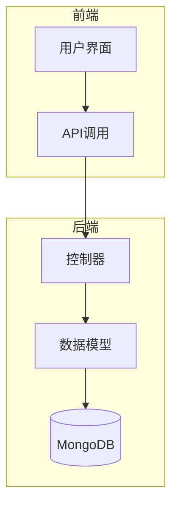
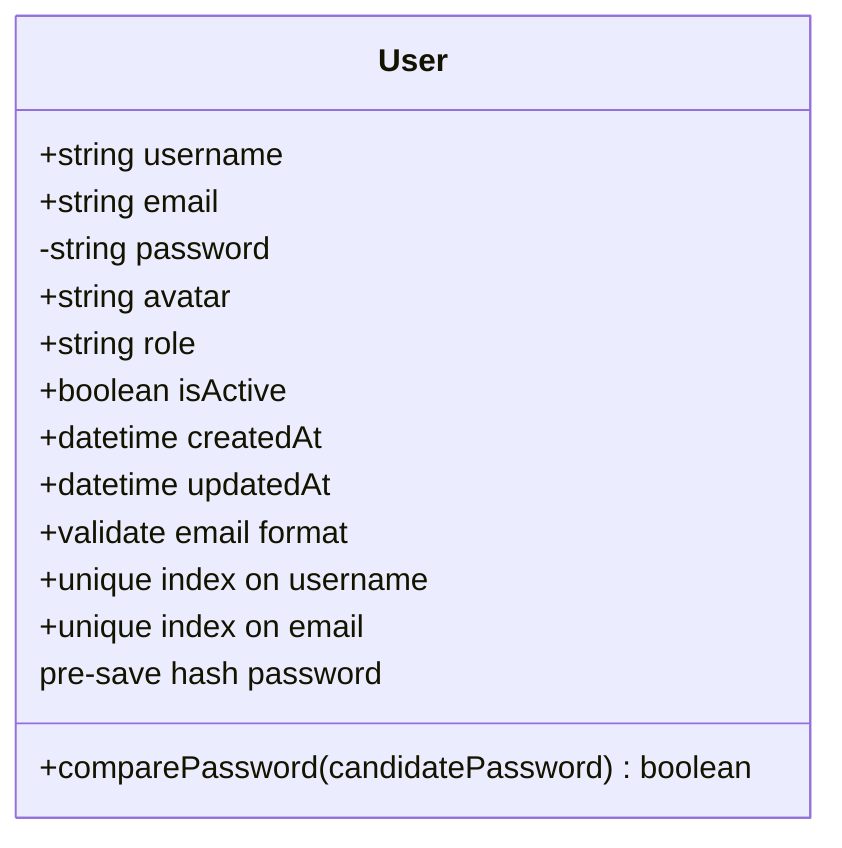
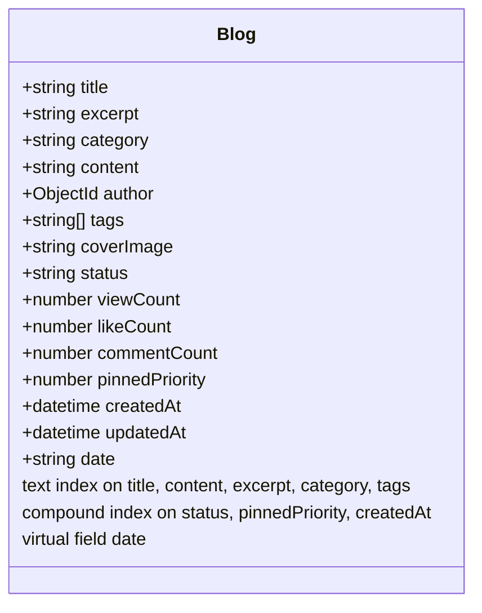
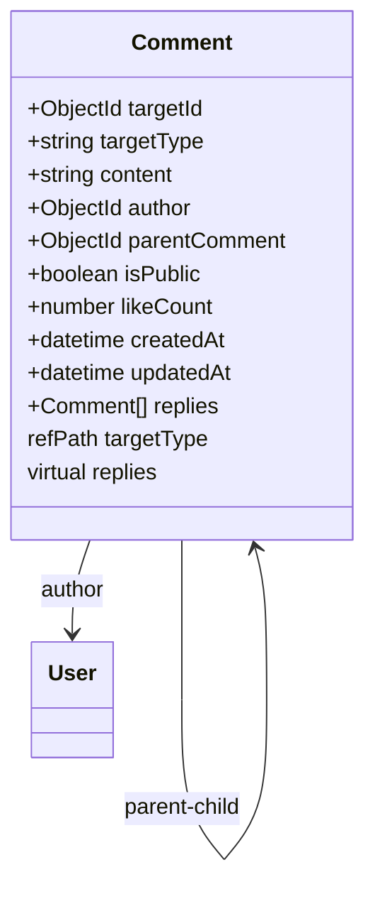
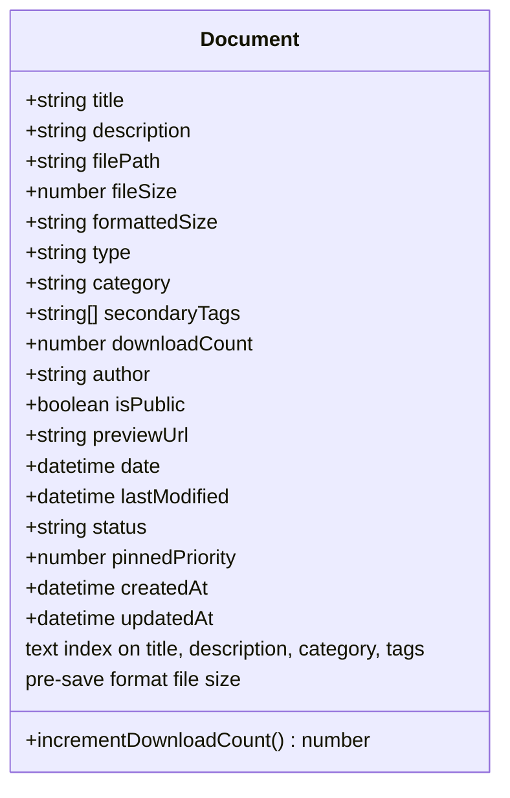
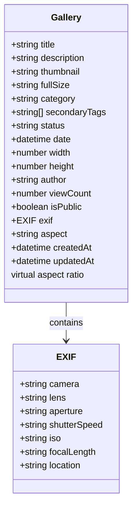
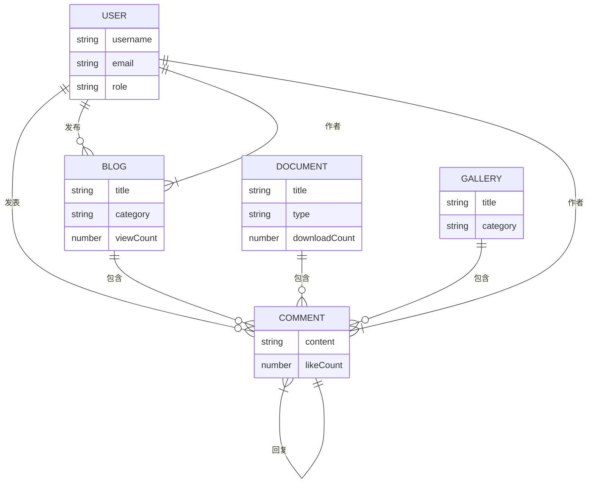

# 数据模型与数据库操作

<cite>
**本文档引用的文件**   
- [User.js](file://backend/models/User.js)
- [Blog.js](file://backend/models/Blog.js)
- [Comment.js](file://backend/models/Comment.js)
- [Document.js](file://backend/models/Document.js)
- [Gallery.js](file://backend/models/Gallery.js)
</cite>

## 目录
1. [项目结构概览](#项目结构概览)
2. [核心数据模型分析](#核心数据模型分析)
3. [模型间关联关系](#模型间关联关系)
4. [预钩子与数据处理逻辑](#预钩子与数据处理逻辑)
5. [查询示例与性能优化](#查询示例与性能优化)
6. [数据一致性与并发控制](#数据一致性与并发控制)

## 项目结构概览

本项目采用前后端分离架构，后端基于Node.js与Mongoose构建，前端使用Vue框架。数据模型集中定义于`backend/models`目录下，涵盖用户、博客、评论、文档、图库等核心功能模块。



**图示来源**
- [User.js](file://backend/models/User.js)
- [Blog.js](file://backend/models/Blog.js)

## 核心数据模型分析

### 用户模型 (User)

用户模型定义了系统中用户的基本信息与权限控制。

**字段定义：**
- **username**: 用户名，字符串类型，必填，长度3-20字符，唯一索引
- **email**: 邮箱地址，字符串类型，必填，符合邮箱格式，唯一索引
- **password**: 密码，字符串类型，必填，最小长度6字符，查询时不返回（select: false）
- **avatar**: 头像路径，字符串类型，默认值"default-avatar.png"
- **role**: 角色，枚举类型（user, admin），默认值"user"
- **isActive**: 是否激活，布尔类型，默认值true
- **createdAt**: 创建时间，自动添加
- **updatedAt**: 更新时间，自动添加



**图示来源**
- [User.js](file://backend/models/User.js#L1-L89)

**本节来源**
- [User.js](file://backend/models/User.js#L1-L89)

### 博客模型 (Blog)

博客模型支持文章发布、分类、标签、封面图等功能。

**字段定义：**
- **title**: 标题，字符串类型，必填
- **excerpt**: 摘要，字符串类型，必填，最大500字符
- **category**: 分类，字符串类型，必填
- **content**: 内容，字符串类型，必填
- **author**: 作者，ObjectId类型，引用User模型，必填
- **tags**: 标签数组，字符串元素
- **coverImage**: 封面图URL，字符串类型，默认空
- **status**: 状态，枚举（draft, published, pinned），默认draft
- **viewCount**: 浏览数，数字类型，默认0
- **likeCount**: 点赞数，数字类型，默认0
- **commentCount**: 评论数，数字类型，默认0
- **pinnedPriority**: 置顶优先级，数字类型，默认0
- **date**: 虚拟字段，基于createdAt生成的日期字符串

**索引策略：**
- 文本索引：title, content, excerpt, category, tags（支持全文搜索）
- 分类索引：category
- 状态索引：status
- 置顶优先级索引：pinnedPriority（降序）
- 时间索引：createdAt（降序）
- 复合索引：status, pinnedPriority, createdAt（用于首页展示）



**图示来源**
- [Blog.js](file://backend/models/Blog.js#L1-L130)

**本节来源**
- [Blog.js](file://backend/models/Blog.js#L1-L130)

### 评论模型 (Comment)

评论模型支持多级嵌套回复功能。

**字段定义：**
- **targetId**: 目标ID，ObjectId类型，必填，引用不同模型
- **targetType**: 目标类型，枚举（Blog, Gallery, Document, General），必填
- **content**: 内容，字符串类型，必填，最大2000字符
- **author**: 作者，ObjectId类型，引用User模型，必填
- **parentComment**: 父评论，ObjectId类型，引用Comment模型，可为空
- **isPublic**: 是否公开，布尔类型，默认true
- **likeCount**: 点赞数，数字类型，默认0
- **replies**: 虚拟字段，子评论列表

**索引策略：**
- 复合索引：targetId, targetType, isPublic（快速查询目标评论）
- 时间索引：createdAt（降序，按时间排序）



**图示来源**
- [Comment.js](file://backend/models/Comment.js#L1-L82)

**本节来源**
- [Comment.js](file://backend/models/Comment.js#L1-L82)

### 文档模型 (Document)

文档模型用于管理文件资源，包含元数据与预览功能。

**字段定义：**
- **title**: 标题，字符串类型，必填，最大200字符
- **description**: 描述，字符串类型，最大1000字符
- **filePath**: 文件路径，字符串类型，必填
- **fileSize**: 文件大小（字节），数字类型，必填
- **formattedSize**: 格式化大小，字符串类型（如"2.5 MB"）
- **type**: 文件类型，枚举（PDF, DOCX, PPT, PPTX, XLSX, TXT, MD, 其他），必填
- **category**: 分类，字符串类型，必填，最大50字符
- **secondaryTags**: 次要标签数组，字符串元素，最大20字符
- **downloadCount**: 下载次数，数字类型，默认0
- **author**: 作者，字符串类型，默认"Admin"
- **isPublic**: 是否公开，布尔类型，默认true
- **previewUrl**: 预览URL，字符串类型
- **date**: 文档日期，日期类型，默认当前时间
- **lastModified**: 最后修改时间，日期类型，默认当前时间
- **status**: 状态，枚举（draft, published, pinned），默认draft
- **pinnedPriority**: 置顶优先级，数字类型，默认0

**索引策略：**
- 文本索引：title, description, category, secondaryTags
- 分类索引：category, secondaryTags
- 类型索引：type
- 时间索引：date（降序）



**图示来源**
- [Document.js](file://backend/models/Document.js#L1-L152)

**本节来源**
- [Document.js](file://backend/models/Document.js#L1-L152)

### 图库模型 (Gallery)

图库模型管理图片资源，支持EXIF信息存储。

**字段定义：**
- **title**: 标题，字符串类型，必填，最大100字符
- **description**: 描述，字符串类型，最大500字符
- **thumbnail**: 缩略图路径，字符串类型，必填
- **fullSize**: 原图路径，字符串类型，必填
- **category**: 分类，枚举（摄影, 游戏, 编程, 设计），必填
- **secondaryTags**: 次要标签数组，字符串元素，最大20字符
- **status**: 状态，枚举（draft, published），默认draft
- **date**: 拍摄日期，日期类型，默认当前时间
- **width**: 宽度，数字类型
- **height**: 高度，数字类型
- **author**: 作者，字符串类型，默认"Admin"
- **viewCount**: 查看次数，数字类型，默认0
- **isPublic**: 是否公开，布尔类型，默认true
- **exif**: EXIF信息对象，包含相机、镜头、光圈、快门速度、ISO、焦距、位置
- **aspect**: 虚拟字段，宽高比（width/height）

**索引策略：**
- 文本索引：title, description
- 分类索引：category, secondaryTags
- 时间索引：date（降序）



**图示来源**
- [Gallery.js](file://backend/models/Gallery.js#L1-L119)

**本节来源**
- [Gallery.js](file://backend/models/Gallery.js#L1-L119)

## 模型间关联关系

系统通过外键引用和虚拟字段实现模型间的关联。



**图示来源**
- [User.js](file://backend/models/User.js)
- [Blog.js](file://backend/models/Blog.js)
- [Comment.js](file://backend/models/Comment.js)
- [Document.js](file://backend/models/Document.js)
- [Gallery.js](file://backend/models/Gallery.js)

**本节来源**
- [User.js](file://backend/models/User.js#L1-L89)
- [Blog.js](file://backend/models/Blog.js#L1-L130)
- [Comment.js](file://backend/models/Comment.js#L1-L82)

## 预钩子与数据处理逻辑

### 密码加密存储

用户模型在保存前使用bcrypt对密码进行哈希加密。

```javascript
userSchema.pre('save', async function(next) {
  if (!this.isModified('password')) return next()
  const salt = await bcrypt.genSalt(10)
  this.password = await bcrypt.hash(this.password, salt)
  next()
})
```

**本节来源**
- [User.js](file://backend/models/User.js#L70-L78)

### 文件大小格式化

文档模型在保存前自动将字节数转换为可读格式（如KB, MB）。

```javascript
documentSchema.pre('save', function(next) {
  if (this.fileSize) {
    this.formattedSize = formatFileSize(this.fileSize)
  }
  next()
})
```

**本节来源**
- [Document.js](file://backend/models/Document.js#L138-L143)

### 虚拟字段处理

多个模型使用虚拟字段增强数据表现力：
- 博客模型：`date` 字段从 `createdAt` 提取日期
- 评论模型：`replies` 字段自动关联子评论
- 图库模型：`aspect` 字段计算宽高比

**本节来源**
- [Blog.js](file://backend/models/Blog.js#L115-L118)
- [Comment.js](file://backend/models/Comment.js#L68-L72)
- [Gallery.js](file://backend/models/Gallery.js#L95-L100)

## 查询示例与性能优化

### 典型查询语句

**获取已发布博客（分页）：**
```javascript
Blog.find({ status: 'published' })
  .populate('author', 'username avatar')
  .sort({ pinnedPriority: -1, createdAt: -1 })
  .skip((page - 1) * limit)
  .limit(limit)
```

**搜索博客（全文检索）：**
```javascript
Blog.find({ $text: { $search: keyword } })
  .populate('author', 'username')
  .sort({ score: { $meta: 'textScore' } })
```

**获取博客的评论树：**
```javascript
Comment.find({ targetId: blogId, targetType: 'Blog', parentComment: null })
  .populate('author', 'username avatar')
  .populate({
    path: 'replies',
    populate: { path: 'author', select: 'username avatar' },
    options: { sort: { createdAt: 1 } }
  })
  .sort({ createdAt: -1 })
```

**本节来源**
- [Blog.js](file://backend/models/Blog.js)
- [Comment.js](file://backend/models/Comment.js)

### 性能优化建议

1. **投影字段选择**：仅查询必要字段，避免传输冗余数据
   ```javascript
   .select('title excerpt category createdAt author')
   ```

2. **分页策略**：使用 `skip` 和 `limit` 实现分页，避免一次性加载大量数据

3. **索引优化**：确保查询字段已建立适当索引，特别是复合查询

4. **缓存机制**：对高频访问数据（如热门博客）使用Redis缓存

5. **聚合管道**：复杂统计使用MongoDB聚合而非多次查询

## 数据一致性与并发控制

### 数据一致性维护

1. **唯一索引**：用户名、邮箱等字段设置唯一索引防止重复
2. **事务处理**：在需要原子性操作时使用MongoDB事务
3. **引用完整性**：通过 `ref` 和 `refPath` 确保外键有效性

### 并发更新冲突解决方案

1. **版本控制**：使用 `versionKey` 字段实现乐观锁
2. **原子操作**：使用 `findOneAndUpdate` 等原子操作避免竞态条件
3. **重试机制**：对版本冲突的更新操作实现自动重试

**本节来源**
- [User.js](file://backend/models/User.js)
- [Blog.js](file://backend/models/Blog.js)
- [Comment.js](file://backend/models/Comment.js)