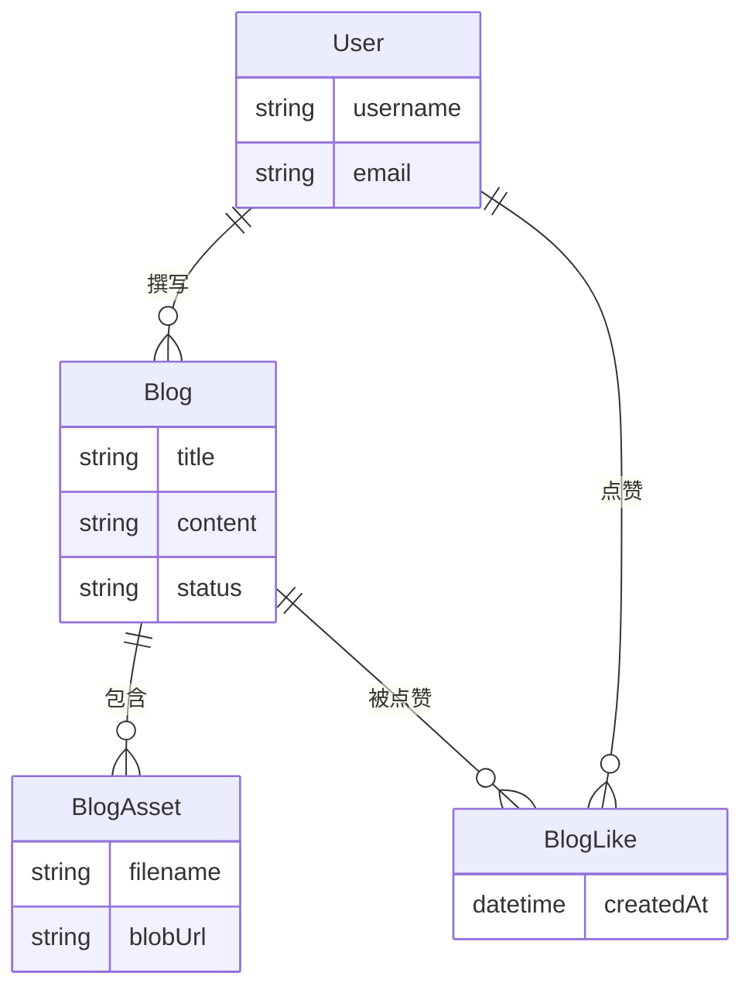

# 核心内容模型

<cite>
**本文档引用文件**   
- [Blog.js](file://backend/models/Blog.js)
- [BlogAsset.js](file://backend/models/BlogAsset.js)
- [BlogLike.js](file://backend/models/BlogLike.js)
- [Document.js](file://backend/models/Document.js)
- [Gallery.js](file://backend/models/Gallery.js)
- [FriendLink.js](file://backend/models/FriendLink.js)
</cite>

## 目录
1. [核心内容模型](#核心内容模型)
2. [博客模型设计](#博客模型设计)
3. [文档模型设计](#文档模型设计)
4. [相册模型设计](#相册模型设计)
5. [友情链接模型设计](#友情链接模型设计)
6. [数据关联机制](#数据关联机制)
7. [索引与性能优化](#索引与性能优化)
8. [数据库操作示例](#数据库操作示例)
9. [性能优化建议](#性能优化建议)

## 博客模型设计

`Blog` 模型是系统中最核心的内容实体，用于存储文章的完整信息。该模型定义了博客的标题、内容、分类、标签、封面图、状态等关键字段，并通过 Mongoose Schema 实现了完整的数据验证与默认值设置。

### 字段设计

**博客模型字段结构如下：**

- **title**: 博客标题
  - 类型：字符串
  - 必填项，自动去除首尾空格
  - 验证消息：`博客标题不能为空`
- **excerpt**: 摘要
  - 类型：字符串
  - 必填项，最大长度 500 字符
- **category**: 分类
  - 类型：字符串
  - 必填项，支持任意文本分类
- **content**: 正文内容
  - 类型：字符串
  - 必填项
- **author**: 作者
  - 类型：ObjectId
  - 引用 `User` 模型
  - 必填项
- **tags**: 标签数组
  - 类型：字符串数组
  - 每个标签自动去除空格
- **coverImage**: 封面图 URL
  - 类型：字符串
  - 默认为空字符串
- **status**: 状态
  - 类型：字符串
  - 枚举值：`draft`（草稿）、`published`（已发布）、`pinned`（置顶）
  - 默认值：`draft`
- **viewCount**: 浏览次数
  - 类型：数字
  - 默认值：0
- **likeCount**: 点赞数
  - 类型：数字
  - 默认值：0
- **commentCount**: 评论数
  - 类型：数字
  - 默认值：0
- **pinnedPriority**: 置顶优先级
  - 类型：数字
  - 数值越大优先级越高
  - 默认值：0

### 虚拟字段与时间戳

- **createdAt** 和 **updatedAt**：由 `timestamps: true` 自动添加
- **date**：虚拟字段，返回 `createdAt` 的日期部分（YYYY-MM-DD），便于前端展示

```js
blogSchema.virtual('date').get(function() {
  return this.createdAt.toISOString().split('T')[0]
})
```

### 数据验证与默认值

所有必填字段均设置了 `required` 验证规则，字符串字段启用 `trim` 去除空格。数值字段如浏览数、点赞数等均设置默认值为 0，避免 `null` 值处理问题。

**Section sources**
- [Blog.js](file://backend/models/Blog.js#L1-L130)

## 文档模型设计

`Document` 模型用于管理系统中的各类文档文件，支持多种格式并提供预览功能。

### 字段设计

- **title**: 文档标题
  - 必填，最大 200 字符
- **description**: 描述
  - 最大 1000 字符
- **filePath**: 文件存储路径
  - 必填项
- **fileSize**: 文件大小（字节）
  - 必填项
- **formattedSize**: 格式化后的文件大小（如 "2.34 MB"）
  - 自动生成
- **type**: 文件类型
  - 枚举值：PDF, DOCX, PPT, PPTX, XLSX, TXT, MD, 其他
- **category**: 分类
  - 必填项
- **secondaryTags**: 次要标签数组
- **downloadCount**: 下载次数
  - 默认值：0
- **author**: 作者
  - 默认值："Admin"
- **isPublic**: 是否公开
  - 布尔值，默认 `true`
- **previewUrl**: 预览 URL
  - 可选字段
- **date**: 文档日期
  - 默认为当前时间
- **status**: 状态
  - 枚举值：draft, published, pinned
  - 默认：draft
- **pinnedPriority**: 置顶优先级
  - 数值型，默认 0

### 文件大小格式化

在保存前通过 `pre('save')` 中间件自动格式化文件大小：

```js
documentSchema.pre('save', function(next) {
  if (this.fileSize) {
    this.formattedSize = formatFileSize(this.fileSize)
  }
  next()
})
```

### 方法扩展

- **incrementDownloadCount()**: 原子性增加下载次数并保存

```js
documentSchema.methods.incrementDownloadCount = async function() {
  this.downloadCount += 1
  await this.save()
  return this.downloadCount
}
```

**Section sources**
- [Document.js](file://backend/models/Document.js#L1-L152)

## 相册模型设计

`Gallery` 模型用于管理图片资源，支持 EXIF 信息存储与提取。

### 字段设计

- **title**: 图片标题
  - 必填，最大 100 字符
- **description**: 描述
  - 最大 500 字符
- **thumbnail**: 缩略图路径
  - 必填
- **fullSize**: 原图路径
  - 必填
- **category**: 分类
  - 枚举值：摄影, 游戏, 编程, 设计
- **secondaryTags**: 次要标签
- **status**: 状态
  - draft, published
- **date**: 拍摄日期
  - 默认当前时间
- **width / height**: 图片宽高
- **author**: 作者
  - 默认 "Admin"
- **viewCount**: 查看次数
  - 默认 0
- **isPublic**: 是否公开
  - 默认 `true`
- **exif**: EXIF 信息对象
  - 包含相机、镜头、光圈、快门速度、ISO、焦距、位置等字段

### 虚拟字段：宽高比

```js
gallerySchema.virtual('aspect').get(function() {
  if (this.width && this.height) {
    return (this.width / this.height).toFixed(3)
  }
  return null
})
```

此字段便于前端判断图片布局（横图/竖图/方图）。

**Section sources**
- [Gallery.js](file://backend/models/Gallery.js#L1-L119)

## 友情链接模型设计

`FriendLink` 模型用于管理外部链接，支持审核状态与排序权重。

### 字段设计

- **name**: 链接名称
  - 必填，最大 50 字符
- **url**: 链接地址
  - 必填，支持无协议前缀（自动补全为 https）
  - 使用正则验证格式
- **avatar**: 头像路径
  - 默认值：`/uploads/avatars/default.png`
- **description**: 描述
  - 最大 200 字符
- **category**: 分类
  - 枚举值：个人博客, 技术社区, 学习资源, 工具网站, 友情链接, 其他
- **tags**: 标签数组
- **visitCount**: 访问次数
  - 默认 0
- **lastChecked**: 最后检查时间
- **status**: 状态
  - 枚举值：正常, 待审核, 已失效
  - 默认：待审核
- **isActive**: 是否激活
  - 布尔值，默认 `false`
- **email**: 联系邮箱
  - 格式验证
- **contactInfo**: 联系信息
- **remark**: 备注

### 虚拟字段：格式化 URL

```js
friendLinkSchema.virtual('formattedUrl').get(function() {
  let url = this.url
  if (url && !url.startsWith('http://') && !url.startsWith('https://')) {
    url = 'https://' + url
  }
  return url
})
```

### 状态同步逻辑

在保存前根据 `isActive` 自动设置 `status`：

```js
friendLinkSchema.pre('save', function(next) {
  if (this.isActive === true) {
    this.status = '正常'
  } else if (this.isActive === false) {
    this.status = '待审核'
  }
  next()
})
```

### 方法与静态方法

- **incrementVisit()**: 增加访问次数
- **checkAccessibility()**: 检查链接是否可访问（模拟 HTTP 请求）
- **checkAllLinks()**: 静态方法，批量检查所有链接状态

**Section sources**
- [FriendLink.js](file://backend/models/FriendLink.js#L1-L202)

## 数据关联机制

### 博客与资源文件（Blog 与 BlogAsset）

`BlogAsset` 模型通过 `blogId` 字段关联到 `Blog`，实现一对多关系：

```js
blogId: {
  type: mongoose.Schema.Types.ObjectId,
  ref: 'Blog',
  required: true
}
```

并在 `blogId` 和 `filename` 上创建复合唯一索引，确保同一博客下文件名唯一。

### 博客与点赞（Blog 与 BlogLike）

`BlogLike` 模型建立用户与博客的多对多点赞关系：

```js
blog: { type: ObjectId, ref: 'Blog' },
user: { type: ObjectId, ref: 'User' }
```

通过复合唯一索引 `{ blog: 1, user: 1 }` 确保用户不能重复点赞。



**Diagram sources**
- [Blog.js](file://backend/models/Blog.js#L1-L130)
- [BlogAsset.js](file://backend/models/BlogAsset.js#L1-L38)
- [BlogLike.js](file://backend/models/BlogLike.js#L1-L31)

## 索引与性能优化

### 索引策略

| 模型 | 索引类型 | 字段 | 说明 |
|------|--------|------|------|
| Blog | 文本索引 | title, content, excerpt, category, tags | 支持全文搜索 |
| Blog | 复合索引 | status, pinnedPriority, createdAt | 首页内容排序 |
| Blog | 单字段索引 | category, status, pinnedPriority | 分类筛选 |
| Document | 文本索引 | title, description, category, secondaryTags | 文档搜索 |
| Document | 单字段索引 | type, date | 类型与时间筛选 |
| Gallery | 文本索引 | title, description | 图片搜索 |
| FriendLink | 文本索引 | name, description | 链接搜索 |
| FriendLink | 单字段索引 | status, isActive, visitCount | 审核与排序 |

### 索引创建示例（Blog 模型）

```js
blogSchema.index({ title: 'text', content: 'text', excerpt: 'text', category: 'text', tags: 'text' })
blogSchema.index({ status: 1, pinnedPriority: -1, createdAt: -1 })
```

**Section sources**
- [Blog.js](file://backend/models/Blog.js#L100-L120)
- [Document.js](file://backend/models/Document.js#L130-L140)
- [Gallery.js](file://backend/models/Gallery.js#L90-L100)
- [FriendLink.js](file://backend/models/FriendLink.js#L170-L180)

## 数据库操作示例

### 创建博客

```js
const newBlog = new Blog({
  title: "我的第一篇博客",
  excerpt: "这是摘要",
  category: "技术",
  content: "正文内容...",
  author: userId,
  tags: ["JavaScript", "Node.js"],
  coverImage: "/uploads/cover.jpg",
  status: "published"
})

await newBlog.save()
```

### 更新文档并增加下载次数

```js
const doc = await Document.findById(docId)
const newCount = await doc.incrementDownloadCount()
```

### 软删除实现（通过状态字段）

```js
// 不使用物理删除，而是更新状态
await Blog.findByIdAndUpdate(blogId, { status: 'draft' })
```

### 查询已发布博客（分页）

```js
const blogs = await Blog.find({ status: 'published' })
  .sort({ pinnedPriority: -1, createdAt: -1 })
  .skip((page - 1) * limit)
  .limit(limit)
  .populate('author', 'username email')
```

**Section sources**
- [Blog.js](file://backend/models/Blog.js#L1-L130)
- [Document.js](file://backend/models/Document.js#L1-L152)

## 性能优化建议

### 1. 查询优化

- **投影（Projection）**：仅查询所需字段
  ```js
  Blog.find({ status: 'published' }, 'title excerpt createdAt')
  ```
- **分页**：使用 `skip` 和 `limit` 避免大数据集加载
- **游标分页**：对于高频更新内容，使用 `createdAt` 作为游标替代 `skip`

### 2. 缓存策略

- **Redis 缓存热门内容**：如首页博客列表、友情链接
- **设置 TTL**：例如 5-10 分钟，平衡实时性与性能
- **缓存键设计**：`blogs:published:pinned`、`links:active`

### 3. 聚合优化

对于统计类查询，使用聚合管道：

```js
Blog.aggregate([
  { $match: { status: 'published' } },
  { $group: { _id: '$category', count: { $sum: 1 } } }
])
```

### 4. 连接池与超时设置

- 配置 Mongoose 连接池大小
- 设置查询超时防止慢查询拖垮服务

### 5. 监控与分析

- 启用 MongoDB 慢查询日志
- 使用 `explain()` 分析查询执行计划
- 定期审查索引使用情况

**Section sources**
- [Blog.js](file://backend/models/Blog.js#L100-L120)
- [Document.js](file://backend/models/Document.js#L130-L140)